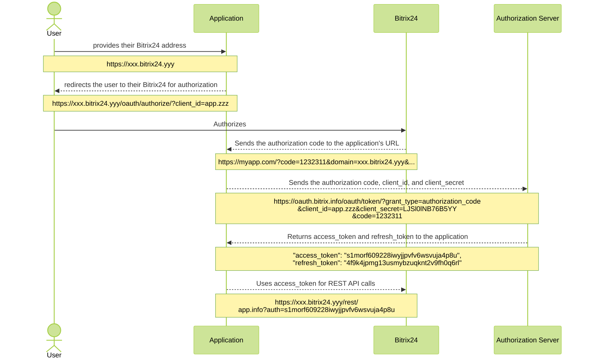

# Complete OAuth 2.0 Authorization Protocol

[OAuth](http://oauth.com/) is an open authorization protocol that allows a third party to gain limited access to a user's protected resources without needing to share their login and password.

In Bitrix24, the OAuth protocol is used for [local](../../local-integrations/local-apps.md) and [mass-market](../../market/index.md) applications and is not used in the case of [local webhooks](../../local-integrations/local-webhooks.md).

To determine whether you need to implement user authorization using the full protocol in your application, you can refer to the following statements:

1. I have my own web service (my external application, my separate software, etc.)
2. The user is already authorized in my service.
3. I want the user to now authorize in their Bitrix24, and my service to obtain authorization tokens for that Bitrix24 so that my service can work with the REST API of that Bitrix24.
4. I do not want the user to work with my service "inside" Bitrix24; REST will be used for data exchange, but all scenarios will remain on the side of my service.

If you answered "yes" to all the questions listed, you indeed need to implement the connection using the full OAuth protocol. If your answer is "no" at least once, you should consider the [simplified scenario](simple-way.md) for using OAuth.

## How the Protocol Works

The protocol is widely used by a vast number of services around the world, as it allows an application to access the API on behalf of a specific user of a specific account.

For the OAuth server, authorization indicates that the user has granted access to the application. The application provides its secret. The account brings everything together and issues the application the appropriate type of access.

The protocol consists of several steps:



1. The user provides your application with their Bitrix24 address.
2. The application sends the user to their Bitrix24 to authorize, adding its `client_id` to the request.
3. In the case of successful authorization in their Bitrix24, the user will be automatically redirected to the application's URL with an additional parameter - the authorization code `code`. Note that this is not yet the authorization token that will be used for working with REST. This is a code needed to obtain the authorization token.
4. The application, having received the `code` for the specific Bitrix24, directly contacts the authorization server, sending `code`, `client_id`, and `client_secret`.
5. In response, the authorization server returns the first pair of tokens:
    - `access_token` — the parameter required for working with the REST API
    - `refresh_token` — the token needed later to extend the `access_token`



The lifetime of the authorization code `code` is only 30 seconds, meaning it must be used immediately after receipt.



## General Workflow with OAuth

- A mass-market application or a local one is added and installed in its separate Bitrix24.
- Keys are requested from the remote server.
- The server redirects the browser to the URL registered by the application.
- The response is processed.
- All requests to the REST API are signed with the obtained key.

## Full OAuth Authorization in Bitrix24

The specific Bitrix24 acts as the data server and holder of user authorization. The authorization server, available at https://oauth.bitrix.info/, serves as the holder of application authorization.

The complete OAuth authorization scenario goes through several steps.

### User Authorization in Bitrix24

The application requests the user’s Bitrix24 address and redirects them to a specially formed URL, for example:

```bash
https://portal.bitrix24.com/oauth/authorize/?
     client_id=app.573ad8a0346747.09223434
     &state=JJHgsdgfkdaslg7lbadsfg
```

URL parameters:



- **client_id** — the application code obtained: 
  - in the partner area when registering the application and valid for any Bitrix24
  - in a specific Bitrix24 in the case of a local application (will only be valid for this Bitrix24)
- **state** — an additional parameter that allows the application to pass arbitrary additional data between authorization steps

At this link, the user will see an authorization form. After authorization (or if there is an authorized session), if the application with the provided `client_id` is installed on the portal, the portal will return the user to the application's `redirect_uri`. If the application is not installed on the portal, the user will see an appropriate error message.

The result of successful user authorization should be the return of the user to the registered application address with additional parameters:

```bash
https://www.applicationhost.com/application/?
     code=avmocpghblyi01m3h42bljvqtyd19sw1
     &state=JJHgsdgfkdaslg7lbadsfg
     &domain=portal.bitrix24.com
     &member_id=a223c6b3710f85df22e9377d6c4f7553
     &scope=crm%2Centity%2Cim%2Ctask
     &server_domain=oauth.bitrix.info
```

Parameters:

- **code** — the first authorization code, see [below](#application-authorization)
- **state** — the value passed in the first request
- **domain** — the portal domain where authorization is taking place
- **member_id** — the unique identifier of the portal where authorization is taking place
- **scope** — a comma-separated list of access permissions to the REST API that the portal grants to the application
- **server_domain** — the domain of the authorization server



In the partner area, you can register an application that will not have a "redirect_uri" (authorization data is obtained via redirect_uri). This scenario is possible for mass-market solutions that do not have a permanent address. In this case, it is assumed that the user manually provides the first authorization code to the application. The simplified first authorization code will be displayed to the user directly on the page, and the application should provide the user with a field to enter the code value.



### Application Authorization



The previous implementation of the protocol assumed that the `client_secret` of the application was given directly to Bitrix24. Due to the expansion of the REST API mechanism to on-premise installations of Bitrix24, such an action becomes unsafe. All operations involving the secret code of the application must be conducted exclusively with the authorization server **oauth.bitrix.info**. For the same reason, this authorization server should be the only trusted source of information about the application's payment status on the portal.



Having obtained the first authorization code `code` in one way or another, the application must proceed to the second step of OAuth authorization and make a hidden request of the following form:

```bash
https://oauth.bitrix.info/oauth/token/?
    grant_type=authorization_code
    &client_id=app.573ad8a0346747.09223434
    &client_secret=LJSl0lNB76B5YY6u0YVQ3AW0DrVADcRTwVr4y99PXU1BWQybWK
    &code=avmocpghblyi01m3h42bljvqtyd19sw1
```

Parameters:



- **grant_type** — a parameter indicating the type of authorization data to be validated. It should have the value *authorization_code*
- **client_id** — the application code obtained in the partner area when registering the application or on the portal in the case of a local application
- **client_secret** — the secret key of the application, obtained in the partner area when registering the application or on the portal in the case of a local application
- **code** — the value of the code parameter passed to the application at the end of the previous step



The lifetime of the first authorization code `code` is only 30 seconds, and it must be used immediately after receipt.



In response to such a request, the application will receive a `json` with the following content:

```json
GET /oauth/token/

HTTP/1.1 200 OK
Content-Type: application/json

{
    "access_token": "s1morf609228iwyjjpvfv6wsvuja4p8u",
    "client_endpoint": "https://portal.bitrix24.com/rest/",
    "domain": "oauth.bitrix.info",
    "expires_in": 3600,
    "member_id": "a223c6b3710f85df22e9377d6c4f7553",
    "refresh_token": "4f9k4jpmg13usmybzuqknt2v9fh0q6rl",
    "scope": "app",
    "server_endpoint": "https://oauth.bitrix.info/rest/",
    "status": "T"
}
```

Significant parameters:

- **access_token** — the main authorization token required for accessing the REST API
- **refresh_token** — an additional authorization token used to extend the saved authorization
- **client_endpoint** — the address of the portal's REST interface
- **server_endpoint** — the address of the server's REST interface
- **status** — the status of the application on the portal

At this stage, the application may also receive an authorization error. For example, if the trial or paid period has expired.

```json
{
    "error": "PAYMENT_REQUIRED",
    "error_description": "Payment required"
}
```