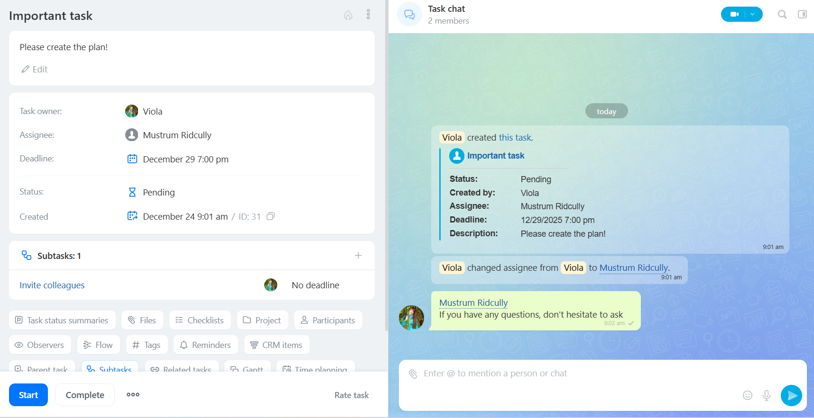

# Tasks in REST 3.0: Overview of Methods

Tasks in Bitrix24 are a tool for organizing work, ranging from simple assignments to complex projects. They enable teams to track execution, manage deadlines, and distribute responsibilities.

> Quick Navigation: [All Methods](#all-methods) 
> 
> User Documentation: [Bitrix24 Tasks](https://helpdesk.bitrix24.com/open/18034564/) 

In [REST 3.0](../index.md), task methods have received an updated architecture, a unified response format, and support for relationships between objects. Currently, REST 3.0 covers only basic operations: creating, deleting, updating, and retrieving tasks. All features related to checklists, time tracking, results, and history are available in REST v2.

## Task Detail Form

The task detail form includes data about the task and a chat for discussions. The task itself can be divided into logical blocks:
- Task description,
- System fields: responsible, Creator, deadline, status,
- Relationships: subtasks, dependencies on other tasks, links to CRM entities, files,
- Additional data: checklists, results, time tracking.

Starting from module version `tasks 25.700.0`, comments have been moved to the task chat. More about the changes can be found in the article [New Task Detail Form: Overview of Changes](../../tasks/tasks-new.md).



 - [How to Create a Task](https://helpdesk.bitrix24.com/open/25865519/)
 - [Checklists in Tasks](https://helpdesk.bitrix24.com/open/25865167/)
 - [Time Tracking in Tasks](https://helpdesk.bitrix24.com/open/25873619/)



## Relationships with Other Objects

**Parent Task.** A task can have subtasks. In this case, it is considered a parent task. You can add a link to the parent task using the `parentId` parameter. To get details about the parent task, use the parameter `"select": ["parent.title", "parent.description"]` in the method [tasks.task.get](./tasks-task-get.md).

**Users.** A task is linked to users by numerical identifiers in the fields:

- `creatorId` — the Creator of the task. Specify it when [creating](./tasks-task-add.md) the task. To get information about the Creator, request the object fields via `"select": ["creator.name", "creator.email"]`.

- `responsibleId` — the responsible person for the task. This is a required field when [creating](./tasks-task-add.md) the task. You can retrieve data about the responsible person through: `"select": ["responsible.name", "responsible.email"]`.

- `accomplices` — Participants. They are passed as an array of identifiers when [creating](./tasks-task-add.md) or [updating](./tasks-task-update.md) the task. To get information about them: `"select": ["accomplices.name", "accomplices.email"]`.

- `auditors` — observers. They are passed as an array of identifiers when [creating](./tasks-task-add.md) or [updating](./tasks-task-update.md) the task. Request data through: `"select": ["auditors.name", "auditors.email"]`.

- `changedById` — the identifier of the user who last modified the task. Retrieve data: `"select": ["changedBy.name", "changedBy.email"]`.

- `statusChangedById` — the user who changed the task status. Retrieve data: `"select": ["statusChangedBy.name", "statusChangedBy.email"]`.

- `closedById` — the user who closed the task. Retrieve data: `"select": ["closedBy.name", "closedBy.email"]`.

**Group or Project.** A task can belong to a group or project. Link the task to a group using the `groupId` parameter. To get information about the group to which the task is linked, request: `"select": ["group.name", "group.image"]`.

**E-mail.** A task can be created from an e-mail, in which case it will have a link to the e-mail. The e-mail identifier is stored in the `emailId` field. To get information about the e-mail, use: `"select": ["email.title", "email.from", "email.body"]`.

**Task Chat.** Discussions about the task take place in the chat. The task chat identifier is returned in the `chatId` field. To get data about the chat, request: `"select": ["chat.id", "chat.entityId", "chat.entityType"]`.

**Flow.** A task can be created within a Flow — a mechanism for automatic task distribution. Link the task to the flow via the `flowId` parameter. To get data about the flow, use: `"select": ["flow.name"]`.

**Time Tracking.** If time tracking is enabled for the task, data on the minutes and seconds spent can be accessed via `"select": ["elapsedTime.minutes", "elapsedTime.seconds", "elapsedTime.text"]`.



The listed fields are returned as objects in the method [tasks.task.get](./tasks-task-get.md) if specified in the `select` parameter.



**CRM Entities.** You can link CRM entities to a task: leads, contacts, companies, deals, invoices, and SPAs. The identifiers of such entities are passed in the `crmItemIds` field in a prefixed format, for example, `C_3` for a contact. Data about related CRM entities is not available directly — they should be requested separately through [CRM methods](../../crm/index.md).

**Drive Files.** You can upload files from Drive to the task.

- If the file has not yet been uploaded to Bitrix.Drive, use the method [disk.storage.uploadfile](../../disk/storage/disk-storage-upload-file.md) or [disk.folder.uploadfile](../../disk/folder/disk-folder-upload-file.md) to upload the file.

- If you want to attach an already existing file on the drive, use the methods [disk.storage.getchildren](../../disk/storage/disk-storage-get-children.md) or [disk.folder.getchildren](../../disk/folder/disk-folder-get-children.md) to find out the file identifier.

Pass the received file identifier to the method [tasks.task.file.attach](./tasks-task-file-attach.md).

 

A description of all task fields and fields of related objects is available in the article [Task Fields in REST 3.0](./fields.md).



## How to Work with Task Chat

Starting from module version `tasks 25.700.0`, comments in tasks have been replaced with chat. The task method [tasks.task.chat.message.send](./tasks-task-chat-message-send.md) creates and sends a message in the task chat.

To perform other actions with chat messages, use the messenger methods:

- [im.message.update](../../chats/messages/im-message-update.md) — updates a message,

- [im.message.delete](../../chats/messages/im-message-delete.md) — deletes a message. The message identifier can be obtained in the response to the message creation method [tasks.task.chat.message.send](./tasks-task-chat-message-send.md) or from the chat history.

- [im.dialog.messages.get](../../chats/messages/im-dialog-messages-get.md) — returns the chat history by identifier. To get the task chat identifier, request: `"select": ["chat.id"]` in the method [tasks.task.get](./tasks-task-get.md).

## Widgets in the Task Detail Form

The task detail form can be extended with widgets — external applications embedded in the interface. This allows users to work with integrations without leaving the task detail form.

 

[Widget Embedding Mechanism](../../widgets/index.md)



### Where to Place Widgets

Starting from module version `tasks 25.700.0`, all embedding locations in the task detail form have been consolidated into a single "Applications" block at the bottom of the task detail form:

- `TASK_VIEW_TAB`

- `TASK_VIEW_SIDEBAR`

- `TASK_VIEW_TOP_PANEL`

Embedding locations on the general task page remain unchanged:

- `TASK_LIST_CONTEXT_MENU` — [item in the context menu of the task list](../../widgets/task/index.md),

- `TASK_USER_LIST_TOOLBAR` — [item in the dropdown menu of the "My Plan" mode](../../widgets/task/list-toolbar.md),

- `TASK_GROUP_LIST_TOOLBAR` — [item in the dropdown menu of the group kanban mode](../../widgets/task/list-toolbar.md),

- `TASK_ROBOT_DESIGNER_TOOLBAR` — [item next to the Automation rule settings](../../widgets/task/robot-designer-toolbar.md).

## Additional Operations on Tasks

The following capabilities work only through REST v2:

- Working with checklists [task.checklistitem.*](../../tasks/checklist-item/index.md)

- Retrieving task results [tasks.task.result.list](../../tasks/result/tasks-task-result-list.md)

- Tracking elapsed time [task.elapseditem.*](../../tasks//elapsed-item/index.md)

- Managing custom fields [task.item.userfield.*](../../tasks/user-field/index.md)

- Retrieving change history [tasks.task.history.list](../../tasks/tasks-task-history-list.md)

- Working with kanban stages of groups and "My Plan" [task.stages.*](../../tasks/stages/index.md)

- Managing Flows [tasks.flow.Flow.*](../../tasks/flow/index.md)

- Managing Scrum objects [tasks.api.scrum.*](../../sonet-group/scrum/index.md)

## Overview of Methods {#all-methods}

> Scope: [`task`](../../scopes/permissions.md)
>
> Who can execute the method: depending on the method

#|
|| **Method** | **Description** ||
|| [tasks.task.add](./tasks-task-add.md) | Creates a new task ||
|| [tasks.task.file.attach](./tasks-task-file-attach.md) | Attaches Drive files to the task ||
|| [tasks.task.get](./tasks-task-get.md) | Retrieves task data with support for relationships via `select` ||
|| [tasks.task.chat.message.send](./tasks-task-chat-message-send.md) | Sends a message in the task chat ||
|| [tasks.task.update](./tasks-task-update.md) | Updates the task ||
|| [tasks.task.delete](./tasks-task-delete.md) | Deletes the task ||
|| [tasks.task.access.get](./tasks-task-get.md) | Checks access permissions for the task ||
|#

## Continue Learning

- [{#T}](./fields.md)
- [{#T}](../index.md)