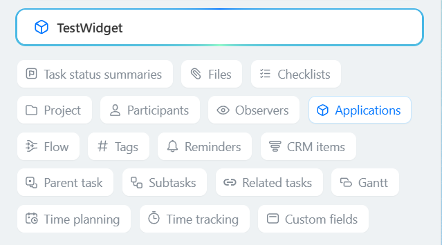

# New Task Card: Overview of Changes



If you are developing integrations for Bitrix24 using AI tools (Codex, Claude Code, Cursor), connect to the [MCP server](../../ai-tools/mcp.md) so that the assistant can utilize the official REST documentation.



The new task card moved comments to the task chat. This page helps you choose the current REST methods for working with comments, files, events, results, and widgets after switching to the new card.

The changes are available starting from module version `tasks 25.700.0`. The old task methods continue to work, except for comment operations, which are now performed through chat methods.

## When to Use This Page

Use this page if your integration:

- retrieves, updates, or deletes task comments
- sends a message or file to the task discussion
- handles comment events
- works with task results created from comments
- places widgets in the task card

If the integration only creates, updates, retrieves, or deletes tasks without working with comments, use the methods in the [Tasks](index.md) section.

## Operating Conditions

#|
|| **Condition** | **Description** ||
|| Module version | New task card changes are available starting from `tasks 25.700.0` ||
|| Call format | Old API methods are called through `/rest/`, REST 3.0 task methods through `/rest/api/` ||
|| User permissions | The user must have access to the task and the chat linked to it ||
|| Scope for tasks | For old task methods, use the [`task`](../scopes/permissions.md) scope, and for REST 3.0 task methods, the [`tasks`](../scopes/permissions.md) scope ||
|| Scope for chats and files | For chat methods and sending files to the task chat, use the [`im`](../scopes/permissions.md) scope ||
|#

## New Task Card Workflow

In the new card, a task has a linked chat. A task comment is stored as a message in that chat:

1. Get the task chat identifier using the [tasks.task.get](./tasks-task-get.md) method
2. Use the chat identifier in chat methods. If the method accepts `DIALOG_ID`, pass the value in the `chat{CHAT_ID}` format, for example `chat58`
3. Use [tasks.task.chat.message.send](./tasks-task-chat-message-send.md) to send a new message
4. Use the methods from the [Chats](../chats/index.md) section to update, delete, and retrieve messages

## Identifier Mapping

#|
|| **Identifier** | **Returned Where** | **What It Is Used For** ||
|| `CHAT_ID` | Old response format of [tasks.task.get](./tasks-task-get.md) | Task chat identifier for chat methods ||
|| `chat.id` | New response format of [tasks.task.get](./tasks-task-get.md) through `/rest/api/` | Task chat identifier for chat methods ||
|| `DIALOG_ID` | Formed from the chat identifier | Value for chat methods that work with a dialog. For a task chat, pass `chat{CHAT_ID}` ||
|| `chat.entityId` | New response format of [tasks.task.get](./tasks-task-get.md) through `/rest/api/` | Identifier of the task linked to the chat ||
|| `chat.entityType` | New response format of [tasks.task.get](./tasks-task-get.md) through `/rest/api/` | Type of the chat binding. For a task, the value is `TASKS_TASK` ||
|| `MESSAGE_ID` | [OnTaskCommentAdd](./comment-item/events-comment/on-task-comment-add.md) event | Identifier of the message in the task chat ||
|| `TASK_ID` | [OnTaskCommentAdd](./comment-item/events-comment/on-task-comment-add.md) event | Task identifier ||
|| `commentId: 0` | [tasks.task.result.list](./result/tasks-task-result-list.md) response | Marker of a task result linked to the new card ||
|#

## Migration Quick Reference

#|
|| **Operation** | **Old Approach** | **Status in the New Card** | **New Approach** ||
|| Add a comment | [task.commentitem.add](./comment-item/task-comment-item-add.md) | Works | Existing integrations can continue using the old method. For new integrations, use [tasks.task.chat.message.send](./tasks-task-chat-message-send.md) ||
|| Update a comment | `task.commentitem.update` | Does not work | Use [im.message.update](../chats/messages/im-message-update.md) ||
|| Delete a comment | `task.commentitem.delete` | Does not work | Use [im.message.delete](../chats/messages/im-message-delete.md) ||
|| Retrieve the comment list | `task.commentitem.getlist` | Does not work | Get task chat messages using [im.dialog.messages.get](../chats/messages/im-dialog-messages-get.md) ||
|| Send a file to the task chat | Task comment methods | Not suitable for the new card | Use [im.disk.file.commit](../chats/files/im-disk-file-commit.md) ||
|| Retrieve a task result | [tasks.task.result.list](./result/tasks-task-result-list.md) | Works | Keep in mind that results for the new card are returned with `commentId: 0` ||
|| Add a result from a comment | [tasks.task.result.addFromComment](./result/tasks-task-result-add-from-comment.md) | Does not work | Creating a result from a new-card comment is not available through the old method ||
|| Delete a result from a comment | [tasks.task.result.deleteFromComment](./result/tasks-task-result-delete-from-comment.md) | Does not work | Removing the link between a result and a new-card comment is not available through the old method ||
|#

## How to Get the Task Chat Identifier

#### Old API Version

```http
POST https://{installation_address}/rest/{user_id}/{rest_app_password}/tasks.task.get
{
    "taskId": 51,
    "select": ["CHAT_ID"]
}
```

Example response:

```json
{
    "result": {
        "task": {
            "id": "51",
            "chatId": 2537,
            "favorite": "N",
            "group": [],
            "action": {}
        }
    }
}
```

#### New API Version

Request the fields `chat.id`, `chat.entityId`, `chat.entityType` for the task:

```http
POST https://{installation_address}/rest/api/{user_id}/{rest_app_password}/tasks.task.get
{
    "id": 51,
    "select": ["id", "chat.id", "chat.entityId", "chat.entityType"]
}
```

Example response:

```json
{
    "result": {
        "item": {
            "id": 51,
            "chat": {
                "id": 58,
                "entityId": 51,
                "entityType": "TASKS_TASK"
            }
        }
    }
}
```



Starting from module version `tasks 25.700.0`, some methods can be called in the new format.

The new API call differs by the addition of the `/api/` segment in the request.

Old version:

`https://{installation_address}/rest/{user_id}/{rest_app_password}/tasks.task.get`

New version:

`https://{installation_address}/rest/api/{user_id}/{rest_app_password}/tasks.task.get`

Documentation for the new version of the method call is available in OpenAPI format. To get the OpenAPI description, call the `documentation` method:

`https://{installation_address}/rest/api/{user_id}/{rest_app_password}/documentation`



## Events

- The event [OnTaskCommentAdd](./comment-item/events-comment/on-task-comment-add.md) works. When working with the new task card, the handler will receive parameters:
    - `MESSAGE_ID` with the identifier of the message in the task chat
    - `TASK_ID` with the identifier of the task
    - `'ID' => 0`, the comment identifier will be equal to zero

- The events [OnTaskCommentUpdate](./comment-item/events-comment/on-task-comment-update.md) and [OnTaskCommentDelete](./comment-item/events-comment/on-task-comment-delete.md) do not work in the new task card.

## Task Result

- The method [tasks.task.result.list](./result/tasks-task-result-list.md) works. When working with the new task card, all task results will be returned with the parameter `commentId: 0`.

- The methods [tasks.task.result.addFromComment](./result/tasks-task-result-add-from-comment.md) and [tasks.task.result.deleteFromComment](./result/tasks-task-result-delete-from-comment.md) do not work in the new task card.

## Widgets

The locations of the widgets [TASK_VIEW_SIDEBAR](../widgets/task/view-sidebar.md), [TASK_VIEW_TOP_PANEL](../widgets/task/view-top-panel.md), [TASK_VIEW_TAB](../widgets/task/view-tab.md) are no longer relevant in the new task card. In the new card, all widgets are displayed in a single "Applications" block.

All previously registered widgets continue to work. New widgets can also be registered, and they will be displayed in the "Applications" block.


