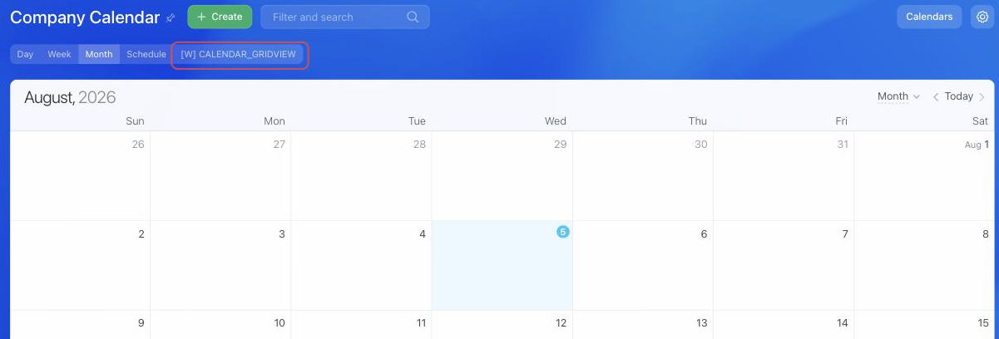

# Calendar View CALENDAR_GRIDVIEW



If you are developing integrations for Bitrix24 using AI tools (Codex, Claude Code, Cursor), connect to the [MCP server](../../ai-tools/mcp.md) so that the assistant can utilize the official REST documentation.



> Scope: [`placement, calendar`](../scopes/permissions.md)

The widget adds its own view to the calendar. The user switches to it in the row of views, and the application interface opens instead of the calendar grid. The call context carries the date range the calendar was showing at the moment of switching.

The placement code is specified in the `PLACEMENT` parameter of the [placement.bind](./placement-bind.md) method.



The widget is not displayed in the interface until the application installation is complete. [Check the application installation](../../settings/app-installation/installation-finish.md)



## Where the Widget is Embedded

#|
|| **Placement Code** | **Location** ||
|| `CALENDAR_GRIDVIEW` | View in the row of calendar views ||
|#

### Where to Find It in the Interface

Open the company calendar at `/calendar/` or an employee's personal calendar at `/company/personal/user/<user ID>/calendar/`. The application item is displayed in the row of views, after the built-in views *Day*, *Week*, *Month*, and *Schedule*.



The item name is set by the `TITLE` parameter during registration. If the parameter is not passed, the application name is displayed.

## What the Handler Receives

Data is sent in a POST request: some parameters come in the handler URL query string, the rest in the request body {.b24-info}

```php
Array
(
    [DOMAIN] => xxx.bitrix24.com
    [PROTOCOL] => 1
    [LANG] => en
    [APP_SID] => b4f4b92b5178b5a5276e181ca09d25a7
    [AUTH_ID] => be56ba6600705a0700005a4b00000001f0f107e5806d5fe9a98e02021a72e57645f86a
    [AUTH_EXPIRES] => 3600
    [REFRESH_ID] => aed5e16600705a0700005a4b00000001f0f107a80816604b24a8719792ac2a21d629b5
    [SERVER_ENDPOINT] => https://oauth.bitrix.info/rest/
    [APPLICATION_TOKEN] => 5b2f8c1d7e3a9046b8c5d2f1a7e3b904
    [APPLICATION_SCOPE] => calendar,placement
    [member_id] => da45a03b265edd8787f8a258d793cc5d
    [status] => L
    [PLACEMENT] => CALENDAR_GRIDVIEW
    [PLACEMENT_OPTIONS] => {"viewRangeFrom":"2026-07-26","viewRangeTo":"2026-09-06","URI":"\/calendar\/"}
)
```





### PLACEMENT_OPTIONS

#|
|| **Key** | **Description** ||
|| **viewRangeFrom**
[`date`](../data-types.md) | The start of the date range the calendar was showing at the moment of switching to the widget. Format `YYYY-MM-DD`.

These are the boundaries of the grid, not of the period: in the *Month* view, the range also includes the days of adjacent months shown in the first and last rows of the grid ||
|| **viewRangeTo**
[`date`](../data-types.md) | The end of the date range, by the same rule ||
|| **URI**
[`string`](../data-types.md) | The address of the calendar page the widget is opened from ||
|#

Using the range from `viewRangeFrom` and `viewRangeTo`, the application retrieves events with the [calendar.event.get](../calendar/calendar-event/calendar-event-get.md) method and draws its own grid.

This placement does not support the `OPTIONS` parameter of the [placement.bind](./placement-bind.md) method: the values passed are not retained, and [placement.get](./placement-get.md) returns an empty array.

## Relationship with Other Objects

**Calendar events.** The date range from the call context is passed to the filter of the [calendar.event.get](../calendar/calendar-event/calendar-event-get.md) method — this way the widget shows the same events as the built-in calendar views.

**Bitrix24 calendar.** Calendar commands are available from the open widget — [BX24.placement.call](./ui-interaction/bx24-placement-call.md) opens an event card, a creation form, and an edit form. In the other direction, the calendar notifies the widget about period changes and view refreshes — subscribe to these events with the [BX24.placement.bindEvent](./ui-interaction/bx24-placement-bind-event.md) method. The full list of commands and events with examples is in the article [{#T}](../calendar/calendar-grid-view.md).

## Code Examples





- cURL (OAuth)

    ```bash
    curl -X POST \
      -H "Content-Type: application/json" \
      -H "Accept: application/json" \
      -d '{
        "PLACEMENT": "CALENDAR_GRIDVIEW",
        "HANDLER": "https://your-domain.com/widgets/calendar-gridview-handler.php",
        "TITLE": "Team workload",
        "LANG_ALL": {
          "en": {
            "TITLE": "Team workload"
          },
          "de": {
            "TITLE": "Auslastung des Teams"
          }
        },
        "auth": "**put_access_token_here**"
      }' \
      https://**put_your_bitrix24_address**/rest/placement.bind
    ```

- JS (TS)

    ```ts
    // This snippet is an ES module: top-level await requires type="module" or a bundler.
    // $b24 is an already-initialized SDK instance (see the SDK "Get started" guide).
    import { Text } from '@bitrix24/b24jssdk'
    import type { B24Frame } from '@bitrix24/b24jssdk'

    declare const $b24: B24Frame

    try {
      const response = await $b24.actions.v2.call.make<boolean>({
        method: 'placement.bind',
        params: {
          PLACEMENT: 'CALENDAR_GRIDVIEW',
          HANDLER: 'https://your-domain.com/widgets/calendar-gridview-handler.php',
          TITLE: 'Team workload',
          LANG_ALL: {
            en: {
              TITLE: 'Team workload',
            },
            de: {
              TITLE: 'Auslastung des Teams',
            },
          },
        },
        requestId: Text.getUuidRfc4122()
      })

      // The payload is available only on a successful response
      if (!response.isSuccess) {
        console.error(response.getErrorMessages().join('; '))
      } else {
        const result = response.getData()!.result
        console.info('Placement bound successfully:', result)
      }
    } catch (error) {
      // Thrown on transport or SDK failures (AjaxError, SdkError, etc.)
      console.error(error)
    }
    ```

- JS (UMD)

    ```html
    <!-- Load the SDK (UMD build); it is exposed as the global B24Js -->
    <script src="https://unpkg.com/@bitrix24/b24jssdk@1/dist/umd/index.min.js"></script>
    <script>
      async function bindCalendarGridView() {
        try {
          // Initialize the SDK inside a Bitrix24 frame
          const $b24 = await B24Js.initializeB24Frame()

          const response = await $b24.actions.v2.call.make({
            method: 'placement.bind',
            params: {
              PLACEMENT: 'CALENDAR_GRIDVIEW',
              HANDLER: 'https://your-domain.com/widgets/calendar-gridview-handler.php',
              TITLE: 'Team workload',
              LANG_ALL: {
                en: {
                  TITLE: 'Team workload',
                },
                de: {
                  TITLE: 'Auslastung des Teams',
                },
              },
            },
            requestId: B24Js.Text.getUuidRfc4122()
          })

          // The payload is available only on a successful response
          if (!response.isSuccess) {
            console.error(response.getErrorMessages().join('; '))
            return
          }

          const result = response.getData().result
          console.info('Placement bound successfully:', result)
        } catch (error) {
          // Thrown on transport or SDK failures (AjaxError, SdkError, etc.)
          console.error(error)
        }
      }

      document.addEventListener('DOMContentLoaded', bindCalendarGridView)
    </script>
    ```

- PHP

    ```php
    try {
        $response = $b24Service
            ->core
            ->call(
                'placement.bind',
                [
                    'PLACEMENT' => 'CALENDAR_GRIDVIEW',
                    'HANDLER' => 'https://your-domain.com/widgets/calendar-gridview-handler.php',
                    'TITLE' => 'Team workload',
                    'LANG_ALL' => [
                        'en' => [
                            'TITLE' => 'Team workload',
                        ],
                        'de' => [
                            'TITLE' => 'Auslastung des Teams',
                        ],
                    ],
                ]
            );

        $result = $response->getResponseData()->getResult();
        if ($result->error()) {
            error_log($result->error());
        } else {
            echo 'Success: ' . print_r($result->data(), true);
        }
    } catch (Throwable $e) {
        error_log($e->getMessage());
        echo 'Error binding placement: ' . $e->getMessage();
    }
    ```

- BX24.js

    ```js
    BX24.callMethod(
        'placement.bind',
        {
            PLACEMENT: 'CALENDAR_GRIDVIEW',
            HANDLER: 'https://your-domain.com/widgets/calendar-gridview-handler.php',
            TITLE: 'Team workload',
            LANG_ALL: {
                en: {
                    TITLE: 'Team workload'
                },
                de: {
                    TITLE: 'Auslastung des Teams'
                }
            }
        },
        function(result) {
            if (result.error()) {
                console.error(result.error());
            } else {
                console.log(result.data());
            }
        }
    );
    ```

- PHP CRest

    ```php
    require_once('crest.php');

    $result = CRest::call(
        'placement.bind',
        [
            'PLACEMENT' => 'CALENDAR_GRIDVIEW',
            'HANDLER' => 'https://your-domain.com/widgets/calendar-gridview-handler.php',
            'TITLE' => 'Team workload',
            'LANG_ALL' => [
                'en' => [
                    'TITLE' => 'Team workload',
                ],
                'de' => [
                    'TITLE' => 'Auslastung des Teams',
                ],
            ],
        ]
    );

    echo '<PRE>';
    print_r($result);
    echo '</PRE>';
    ```



## Continue Learning

- [{#T}](../calendar/calendar-grid-view.md)
- [{#T}](./placement-bind.md)
- [{#T}](./placement-list.md)
- [{#T}](./placement-unbind.md)
- [{#T}](./ui-interaction/index.md)
- [{#T}](./bx24-widget-methods.md)
- [{#T}](../calendar/index.md)
- [{#T}](../../settings/interactivity/index.md)
