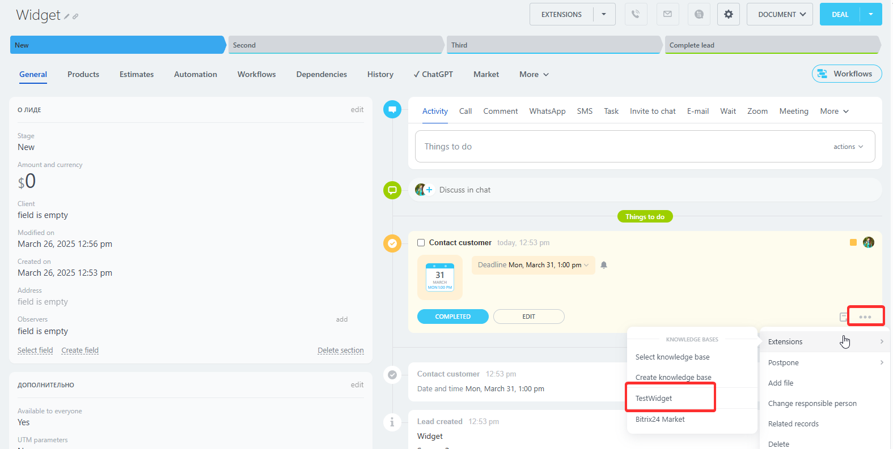

# Context Menu Item for Activity in CRM Element Card CRM_XXX_ACTIVITY_TIMELINE_MENU, CRM_DYNAMIC_XXX_ACTIVITY_TIMELINE_MENU

> Scope: [`crm`](../../scopes/permissions.md)

You can add your context menu item for activities in the CRM object cards: [leads](../../crm/leads/index.md), [deals](../../crm/deals/index.md), [estimates](../../crm/quote/index.md), [new invoices](../../crm/universal/invoice.md), [custom object types](../../crm/universal/index.md).



The specific placement code for the widget is specified in the `PLACEMENT` parameter of the [placement.bind](../placement-bind.md) method.

## Where the Widget is Embedded

#|
|| **Widget Code** | **Location** ||
|| `CRM_LEAD_ACTIVITY_TIMELINE_MENU` | Context menu item for activity in [lead](../../crm/leads/index.md) ||
|| `CRM_DEAL_ACTIVITY_TIMELINE_MENU` | Context menu item for activity in [deal](../../crm/deals/index.md) ||
|| `CRM_QUOTE_ACTIVITY_TIMELINE_MENU` | Context menu item for activity in [estimate](../../crm/quote/index.md) ||
|| `CRM_SMART_INVOICE_ACTIVITY_TIMELINE_MENU` | Context menu item for activity in [new invoices](../../crm/universal/invoice.md) ||
|| `CRM_DYNAMIC_XXX_ACTIVITY_TIMELINE_MENU` | Context menu item for activity in custom CRM object types. Instead of XXX, specify the numeric identifier of the specific [custom object type](../../crm/universal/index.md). For example, `CRM_DYNAMIC_183_LIST_MENU` ||
|#

## What the Handler Receives

Data is transmitted as a POST request {.b24-info}



- CRM_LEAD_ACTIVITY_TIMELINE_MENU

    ```php

    Array
    (
        [DOMAIN] => xxx.bitrix24.com
        [PROTOCOL] => 1
        [LANG] => en
        [APP_SID] => e6a18a6abe41ba3bd944897d8dc5186d
        [AUTH_ID] => 45d4a06600631fcd00005a4b00000001f0f10767246d86a580fae119d2a2601665eb33
        [AUTH_EXPIRES] => 3600
        [REFRESH_ID] => 3553c86600631fcd00005a4b00000001f0f1074bdbcddd7232d3413e2b9ff1ee91dc96
        [member_id] => da45a03b265edd8787f8a258d793cc5d
        [status] => L
        [PLACEMENT] => CRM_LEAD_ACTIVITY_TIMELINE_MENU
        [PLACEMENT_OPTIONS] => {"ENTITY_ID":"6591","TYPE_ID":"1","TYPE_CATEGORY_ID":"6","ASSOCIATED_ENTITY_ID":"1523","ASSOCIATED_ENTITY_TYPE_ID":"6","TIMELINE_ITEM_ID":"29937"}
    )

    ```

- CRM_DEAL_ACTIVITY_TIMELINE_MENU

    ```php

    Array
    (
        [DOMAIN] => xxx.bitrix24.com
        [PROTOCOL] => 1
        [LANG] => en
        [APP_SID] => 71cc8c707a630542d5e2cf7435bf88c4
        [AUTH_ID] => 87d4a06600631fcd00005a4b00000001f0f10758d4aabbf27967a9af747de646c5447c
        [AUTH_EXPIRES] => 3600
        [REFRESH_ID] => 7753c86600631fcd00005a4b00000001f0f1078ec2dd6e94d5dc8f1aebf6524a86ee78
        [member_id] => da45a03b265edd8787f8a258d793cc5d
        [status] => L
        [PLACEMENT] => CRM_DEAL_ACTIVITY_TIMELINE_MENU
        [PLACEMENT_OPTIONS] => {"ENTITY_ID":"3463","ASSOCIATED_ENTITY_ID":"1517","ASSOCIATED_ENTITY_TYPE_ID":"6"}
    )

    ```

- CRM_QUOTE_ACTIVITY_TIMELINE_MENU

    ```php

    Array
    (
        [DOMAIN] => xxx.bitrix24.com
        [PROTOCOL] => 1
        [LANG] => en
        [APP_SID] => a63d2f88ffd62d6a300aaea7bf5ebf32
        [AUTH_ID] => 757ba26600631fcd00005a4b00000001f0f107b07473a33f9378bf912d602ecb056119
        [AUTH_EXPIRES] => 3600
        [REFRESH_ID] => 65fac96600631fcd00005a4b00000001f0f10726b77ceb5a0aaa50e143b1086fa03324
        [member_id] => da45a03b265edd8787f8a258d793cc5d
        [status] => L
        [PLACEMENT] => CRM_QUOTE_ACTIVITY_TIMELINE_MENU
        [PLACEMENT_OPTIONS] => {"ENTITY_ID":"5","ASSOCIATED_ENTITY_ID":"1529","ASSOCIATED_ENTITY_TYPE_ID":"6"}
    )
    
    ```

- CRM_SMART_INVOICE_ACTIVITY_TIMELINE_MENU

    ```php

    Array
    (
        [DOMAIN] => xxx.bitrix24.com
        [PROTOCOL] => 1
        [LANG] => en
        [APP_SID] => a2032d292bcc91a22022db330433a933
        [AUTH_ID] => ee2ad0670076a4b8006f518000000001201c07383646b2116914be86aecd467ade5a3e
        [AUTH_EXPIRES] => 3600
        [REFRESH_ID] => dea9f7670076a4b8006f518000000001201c07e183b89e2613ce88ba7c56f8f80f19d9
        [member_id] => e8857f161a1a8288f312b6cc6ad67995
        [status] => L
        [PLACEMENT] => CRM_SMART_INVOICE_ACTIVITY_TIMELINE_MENU
        [PLACEMENT_OPTIONS] => {"ENTITY_ID":"32","ASSOCIATED_ENTITY_ID":"238","ASSOCIATED_ENTITY_TYPE_ID":"6"}
    )
    
    ```

- CRM_DYNAMIC_XXX_ACTIVITY_TIMELINE_MENU

    ```php

    Array
    (
        [DOMAIN] => xxx.bitrix24.com
        [PROTOCOL] => 1
        [LANG] => en
        [APP_SID] => d659900f7e966c5d135d349b7b7f3c0d
        [AUTH_ID] => 4a7ba26600631fcd00005a4b00000001f0f1071e1f009645e93bf550bc02ac4f8fdcf6
        [AUTH_EXPIRES] => 3600
        [REFRESH_ID] => 3afac96600631fcd00005a4b00000001f0f107adfab4bb11ae71eaf061319f2b4b2f87
        [member_id] => da45a03b265edd8787f8a258d793cc5d
        [status] => L
        [PLACEMENT] => CRM_DYNAMIC_183_ACTIVITY_TIMELINE_MENU
        [PLACEMENT_OPTIONS] => {"ENTITY_ID":"3","ASSOCIATED_ENTITY_ID":"1527","ASSOCIATED_ENTITY_TYPE_ID":"6"}
    )
    
    ```







#### PLACEMENT_OPTIONS

The value of `PLACEMENT_OPTIONS` is a JSON string containing an array of one or more keys.



#|
|| **Parameter** | **Description** ||
|| **ENTITY_ID*** 
[`string`](../../data-types.md) | Identifier of the CRM object for which the widget was opened.

Can be used to retrieve additional information using the corresponding methods:

- any object type [crm.item.get](../../crm/universal/crm-item-get.md) specifying entityTypeId = '1' for leads, '2' for deals, and [etc.](../../crm/data-types.md#object_type)
- lead [crm.lead.get](../../crm/leads/crm-lead-get.md)
- deal [crm.deal.get](../../crm/deals/crm-deal-get.md)
- estimate [crm.quote.get](../../crm/quote/crm-quote-get.md)

In the case of embedding the widget in a custom type object, the type identifier can be obtained from the value of the `PLACEMENT` parameter. In the example above, it is `183`

||
|| **ASSOCIATED_ENTITY_ID*** 
[`string`](../../data-types.md) | Identifier of the CRM activity for which the widget was opened.

Can be used to retrieve additional information using the method [crm.activity.get](../../crm/timeline/activities/activity-base/crm-activity-get.md)

||
|| **ASSOCIATED_ENTITY_TYPE_ID*** 
[`string`](../../data-types.md) | Identifier of the activity entity type

||
|| **TYPE_ID*** 
[`string`](../../data-types.md) | Identifier of the event type

||
|| **TYPE_CATEGORY_ID*** 
[`string`](../../data-types.md) | Identifier of the timeline record type

||
|| **TIMELINE_ITEM_ID*** 
[`string`](../../data-types.md) | Identifier of the timeline record

||
|#

## Continue Exploring

- [{#T}](../placement-bind.md)
- [{#T}](../ui-interaction/index.md)
- [{#T}](../ui-interaction/crm-card.md)
- [{#T}](../../interactivity/index.md)
- [{#T}](../open-application.md)
- [{#T}](../open-path.md)