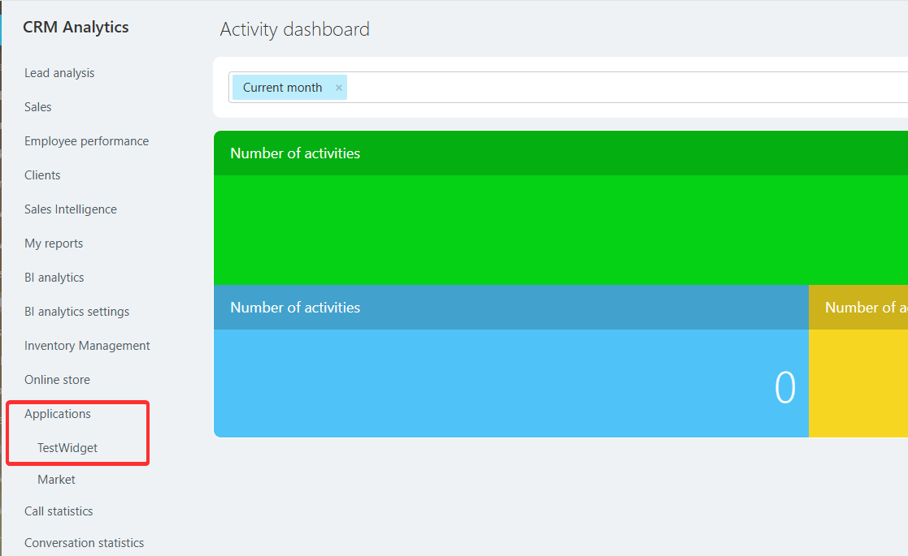

# CRM Analytics Menu Item CRM_ANALYTICS_MENU

> Scope: [`crm`](../../scopes/permissions.md)

You can add your item to the list of applications in CRM Analytics.



The specific widget placement code is specified in the `PLACEMENT` parameter of the [placement.bind](../placement-bind.md) method.



The widget will not be displayed in the interface until the application installation is complete. [Check the application installation](../../../settings/app-installation/installation-finish.md)



## Where the widget is embedded

#|
|| **Widget Code** | **Location** ||
|| `CRM_ANALYTICS_MENU` | Item in the CRM Analytics application list ||
|#

## What the handler receives

Data is sent as a POST request {.b24-info}

```php

Array
(
    [DOMAIN] => xxx.bitrix24.com
    [PROTOCOL] => 1
    [LANG] => en
    [APP_SID] => 1d421409a6c74c6f917ecd29e5ec3a86
    [AUTH_ID] => 7b4eba6600631fcd00005a4b00000001f0f10785092f421ae959432ff27233c97c2226
    [AUTH_EXPIRES] => 3600
    [REFRESH_ID] => 6bcde16600631fcd00005a4b00000001f0f107338065a0ff687e880e437a8ec7ec6919
    [member_id] => da45a03b265edd8787f8a258d793cc5d
    [status] => L
    [PLACEMENT] => CRM_ANALYTICS_MENU
)

```





### PLACEMENT_OPTIONS

In the current widget, the `PLACEMENT_OPTIONS` parameter is not passed.

## Continue your exploration

- [{#T}](../placement-bind.md)
- [{#T}](../ui-interaction/index.md)
- [{#T}](../ui-interaction/crm-card.md)
- [{#T}](../../../settings/interactivity/index.md)
- [{#T}](../open-application.md)
- [{#T}](../open-path.md)