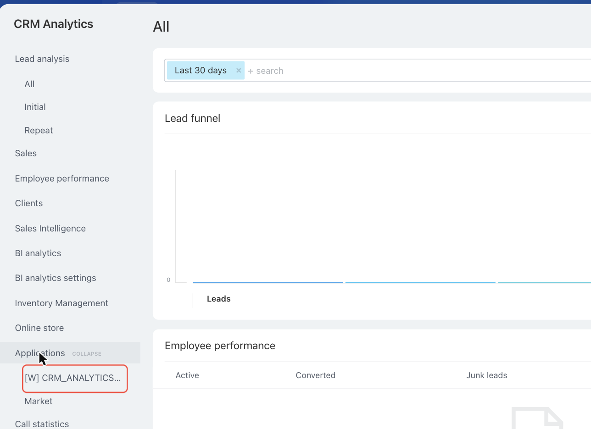

# CRM Analytics Menu Item CRM_ANALYTICS_MENU



If you are developing integrations for Bitrix24 using AI tools (Codex, Claude Code, Cursor), connect to the [MCP server](../../../ai-tools/mcp.md) so that the assistant can utilize the official REST documentation.



> Scope: [`crm`](../../scopes/permissions.md)

The widget adds its own item to the left menu of the CRM Analytics section. Clicking the item opens the application report.

The specific widget placement code is specified in the `PLACEMENT` parameter of the [placement.bind](../placement-bind.md) method.



The widget will not be displayed in the interface until the application installation is complete. [Check the application installation](../../../settings/app-installation/installation-finish.md)



## Where the Widget is Embedded

#| 
|| **Widget Code** | **Location** ||
|| `CRM_ANALYTICS_MENU` | Item in the left menu of CRM Analytics ||
|#

### Where to Find It in the Interface

Open the *CRM Analytics* section and expand the *Applications* item in the section left menu. The application item appears there, next to the *Market* item.



## What the Handler Receives

Data is sent in a POST request: some parameters come in the handler URL query string, the rest in the request body {.b24-info}

```php

Array
(
    [DOMAIN] => xxx.bitrix24.com
    [PROTOCOL] => 1
    [LANG] => en
    [APP_SID] => 2a5e9d2644326ced11f4fc7fd4fa0c4b
    [AUTH_ID] => e5a27166007e9c94001e30ba00000001f0f107a03d2e51f6b84c97de6132a05
    [AUTH_EXPIRES] => 3600
    [REFRESH_ID] => d4919966007e9c94001e30ba00000001f0f1079ce6f37a418bd2c50fa374e16
    [SERVER_ENDPOINT] => https://oauth.bitrix.info/rest/
    [APPLICATION_TOKEN] => ec1b2074a9d3f5c81b6e40d27a95cf38
    [APPLICATION_SCOPE] => crm,placement
    [member_id] => d897063e1ce7c5eb9f04b9751eef5915
    [status] => L
    [PLACEMENT] => CRM_ANALYTICS_MENU
    [PLACEMENT_OPTIONS] => {"URI":"\/report\/analytics\/?IFRAME=Y&IFRAME_TYPE=SIDE_SLIDER"}
)

```





### PLACEMENT_OPTIONS

The `PLACEMENT_OPTIONS` value is passed as a JSON string with the call context.

The placement has no keys of its own — the context carries only the universal `URI` key.

## Code Examples





- cURL (OAuth)

    ```bash
    curl -X POST \
      -H "Content-Type: application/json" \
      -H "Accept: application/json" \
      -d '{
        "PLACEMENT": "CRM_ANALYTICS_MENU",
        "HANDLER": "https://your-domain.com/widgets/crm-analytics-menu-handler.php",
        "TITLE": "My CRM analytics report",
        "LANG_ALL": {
          "en": {
            "TITLE": "My CRM analytics report"
          },
          "de": {
            "TITLE": "Mein CRM-Analysebericht"
          }
        },
        "auth": "**put_access_token_here**"
      }' \
      https://**put_your_bitrix24_address**/rest/placement.bind
    ```

- JS (TS)

    ```ts
    // This snippet is an ES module: top-level await requires type="module" or a bundler.
    // $b24 is an already-initialized SDK instance (see the SDK "Get started" guide).
    import { Text } from '@bitrix24/b24jssdk'
    import type { B24Frame } from '@bitrix24/b24jssdk'

    declare const $b24: B24Frame

    try {
      const response = await $b24.actions.v2.call.make<boolean>({
        method: 'placement.bind',
        params: {
          PLACEMENT: 'CRM_ANALYTICS_MENU',
          HANDLER: 'https://your-domain.com/widgets/crm-analytics-menu-handler.php',
          TITLE: 'My CRM analytics report',
          LANG_ALL: {
            en: {
              TITLE: 'My CRM analytics report',
            },
            de: {
              TITLE: 'Mein CRM-Analysebericht',
            },
          },
        },
        requestId: Text.getUuidRfc4122()
      })

      // The payload is available only on a successful response
      if (!response.isSuccess) {
        console.error(response.getErrorMessages().join('; '))
      } else {
        const result = response.getData()!.result
        console.info('Placement bound successfully:', result)
      }
    } catch (error) {
      // Thrown on transport or SDK failures (AjaxError, SdkError, etc.)
      console.error(error)
    }
    ```

- JS (UMD)

    ```html
    <!-- Load the SDK (UMD build); it is exposed as the global B24Js -->
    <script src="https://unpkg.com/@bitrix24/b24jssdk@1/dist/umd/index.min.js"></script>
    <script>
      async function bindCrmAnalyticsMenu() {
        try {
          // Initialize the SDK inside a Bitrix24 frame
          const $b24 = await B24Js.initializeB24Frame()

          const response = await $b24.actions.v2.call.make({
            method: 'placement.bind',
            params: {
              PLACEMENT: 'CRM_ANALYTICS_MENU',
              HANDLER: 'https://your-domain.com/widgets/crm-analytics-menu-handler.php',
              TITLE: 'My CRM analytics report',
              LANG_ALL: {
                en: {
                  TITLE: 'My CRM analytics report',
                },
                de: {
                  TITLE: 'Mein CRM-Analysebericht',
                },
              },
            },
            requestId: B24Js.Text.getUuidRfc4122()
          })

          // The payload is available only on a successful response
          if (!response.isSuccess) {
            console.error(response.getErrorMessages().join('; '))
            return
          }

          const result = response.getData().result
          console.info('Placement bound successfully:', result)
        } catch (error) {
          // Thrown on transport or SDK failures (AjaxError, SdkError, etc.)
          console.error(error)
        }
      }

      document.addEventListener('DOMContentLoaded', bindCrmAnalyticsMenu)
    </script>
    ```

- PHP

    ```php
    try {
        $response = $b24Service
            ->core
            ->call(
                'placement.bind',
                [
                    'PLACEMENT' => 'CRM_ANALYTICS_MENU',
                    'HANDLER' => 'https://your-domain.com/widgets/crm-analytics-menu-handler.php',
                    'TITLE' => 'My CRM analytics report',
                    'LANG_ALL' => [
                        'en' => [
                            'TITLE' => 'My CRM analytics report',
                        ],
                        'de' => [
                            'TITLE' => 'Mein CRM-Analysebericht',
                        ],
                    ],
                ]
            );

        $result = $response->getResponseData()->getResult();
        if ($result->error()) {
            error_log($result->error());
        } else {
            echo 'Success: ' . print_r($result->data(), true);
        }
    } catch (Throwable $e) {
        error_log($e->getMessage());
        echo 'Error binding placement: ' . $e->getMessage();
    }
    ```

- BX24.js

    ```js
    BX24.callMethod(
        'placement.bind',
        {
            PLACEMENT: 'CRM_ANALYTICS_MENU',
            HANDLER: 'https://your-domain.com/widgets/crm-analytics-menu-handler.php',
            TITLE: 'My CRM analytics report',
            LANG_ALL: {
                en: { TITLE: 'My CRM analytics report' },
                de: { TITLE: 'Mein CRM-Analysebericht' }
            }
        },
        function(result) {
            if (result.error()) {
                console.error(result.error());
            } else {
                console.log(result.data());
            }
        }
    );
    ```

- PHP CRest

    ```php
    require_once('crest.php');

    $result = CRest::call(
        'placement.bind',
        [
            'PLACEMENT' => 'CRM_ANALYTICS_MENU',
            'HANDLER' => 'https://your-domain.com/widgets/crm-analytics-menu-handler.php',
            'TITLE' => 'My CRM analytics report',
            'LANG_ALL' => [
                'en' => [
                    'TITLE' => 'My CRM analytics report',
                ],
                'de' => [
                    'TITLE' => 'Mein CRM-Analysebericht',
                ],
            ],
        ]
    );

    echo '<PRE>';
    print_r($result);
    echo '</PRE>';
    ```



## Continue Your Exploration

- [{#T}](./index.md)
- [{#T}](./analytics-toolbar.md)
- [{#T}](../placement-bind.md)
- [{#T}](../ui-interaction/index.md)
- [{#T}](../../../settings/interactivity/index.md)
- [{#T}](../bx24-widget-methods.md)