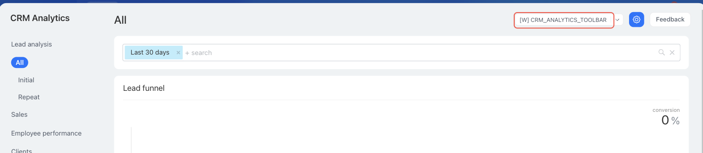

# Button in the CRM Analytics Header CRM_ANALYTICS_TOOLBAR



If you are developing integrations for Bitrix24 using AI tools (Codex, Claude Code, Cursor), connect to the [MCP server](../../../ai-tools/mcp.md) so that the assistant can utilize the official REST documentation.



> Scope: [`placement, crm`](../../scopes/permissions.md)

The widget adds its own button to the header of the CRM Analytics section.

The placement code is specified in the `PLACEMENT` parameter of the [placement.bind](../placement-bind.md) method.



The widget is not displayed in the interface until the application installation is complete. [Check the application installation](../../../settings/app-installation/installation-finish.md)



## Where the Widget is Embedded

#| 
|| **Placement Code** | **Location** ||
|| `CRM_ANALYTICS_TOOLBAR` | Button in the CRM Analytics header ||
|#

### Where to Find It in the Interface

Open the *CRM Analytics* section and select a report in the left menu. The application button appears on the right in the section header, next to the report settings.

The button is not available on every report. For example, the *Individual performance* report has no settings of its own, and only the feedback button remains in the header.



## What the Handler Receives

Data is sent in a POST request: some parameters come in the handler URL query string, the rest in the request body {.b24-info}

```php

Array
(
    [DOMAIN] => xxx.bitrix24.com
    [PROTOCOL] => 1
    [LANG] => en
    [APP_SID] => 409c73573874c65b526f515837ae4775
    [AUTH_ID] => f6b37166007e9c94001e30ba00000001f0f107b14e3f62a7c95d08ef7243b16
    [AUTH_EXPIRES] => 3600
    [REFRESH_ID] => e5a29966007e9c94001e30ba00000001f0f107adf7048b529ce3d61b485f027
    [SERVER_ENDPOINT] => https://oauth.bitrix.info/rest/
    [APPLICATION_TOKEN] => ec1b2074a9d3f5c81b6e40d27a95cf38
    [APPLICATION_SCOPE] => crm,placement
    [member_id] => d897063e1ce7c5eb9f04b9751eef5915
    [status] => L
    [PLACEMENT] => CRM_ANALYTICS_TOOLBAR
    [PLACEMENT_OPTIONS] => {"URI":"\/report\/analytics\/"}
)

```





### PLACEMENT_OPTIONS

The `PLACEMENT_OPTIONS` value is passed as a JSON string with the call context.

The placement has no keys of its own — the context carries only the universal `URI` key.

## OPTIONS When Registering via placement.bind

This placement does not support the `OPTIONS` parameters. The values passed are not retained: the [placement.get](../placement-get.md) method returns an empty array for such a registration.

## Code Examples





- cURL (OAuth)

    ```bash
    curl -X POST \
      -H "Content-Type: application/json" \
      -H "Accept: application/json" \
      -d '{
        "PLACEMENT": "CRM_ANALYTICS_TOOLBAR",
        "HANDLER": "https://your-domain.com/widgets/crm-analytics-toolbar-handler.php",
        "TITLE": "My CRM analytics button",
        "LANG_ALL": {
          "en": {
            "TITLE": "My CRM analytics button"
          },
          "de": {
            "TITLE": "Meine CRM-Analyse-Schaltfläche"
          }
        },
        "auth": "**put_access_token_here**"
      }' \
      https://**put_your_bitrix24_address**/rest/placement.bind
    ```

- JS (TS)

    ```ts
    // This snippet is an ES module: top-level await requires type="module" or a bundler.
    // $b24 is an already-initialized SDK instance (see the SDK "Get started" guide).
    import { Text } from '@bitrix24/b24jssdk'
    import type { B24Frame } from '@bitrix24/b24jssdk'

    declare const $b24: B24Frame

    try {
      const response = await $b24.actions.v2.call.make<boolean>({
        method: 'placement.bind',
        params: {
          PLACEMENT: 'CRM_ANALYTICS_TOOLBAR',
          HANDLER: 'https://your-domain.com/widgets/crm-analytics-toolbar-handler.php',
          TITLE: 'My CRM analytics button',
          LANG_ALL: {
            en: {
              TITLE: 'My CRM analytics button',
            },
            de: {
              TITLE: 'Meine CRM-Analyse-Schaltfläche',
            },
          },
        },
        requestId: Text.getUuidRfc4122()
      })

      // The payload is available only on a successful response
      if (!response.isSuccess) {
        console.error(response.getErrorMessages().join('; '))
      } else {
        const result = response.getData()!.result
        console.info('Placement bound successfully:', result)
      }
    } catch (error) {
      // Thrown on transport or SDK failures (AjaxError, SdkError, etc.)
      console.error(error)
    }
    ```

- JS (UMD)

    ```html
    <!-- Load the SDK (UMD build); it is exposed as the global B24Js -->
    <script src="https://unpkg.com/@bitrix24/b24jssdk@1/dist/umd/index.min.js"></script>
    <script>
      async function bindCrmAnalyticsToolbar() {
        try {
          // Initialize the SDK inside a Bitrix24 frame
          const $b24 = await B24Js.initializeB24Frame()

          const response = await $b24.actions.v2.call.make({
            method: 'placement.bind',
            params: {
              PLACEMENT: 'CRM_ANALYTICS_TOOLBAR',
              HANDLER: 'https://your-domain.com/widgets/crm-analytics-toolbar-handler.php',
              TITLE: 'My CRM analytics button',
              LANG_ALL: {
                en: {
                  TITLE: 'My CRM analytics button',
                },
                de: {
                  TITLE: 'Meine CRM-Analyse-Schaltfläche',
                },
              },
            },
            requestId: B24Js.Text.getUuidRfc4122()
          })

          // The payload is available only on a successful response
          if (!response.isSuccess) {
            console.error(response.getErrorMessages().join('; '))
            return
          }

          const result = response.getData().result
          console.info('Placement bound successfully:', result)
        } catch (error) {
          // Thrown on transport or SDK failures (AjaxError, SdkError, etc.)
          console.error(error)
        }
      }

      document.addEventListener('DOMContentLoaded', bindCrmAnalyticsToolbar)
    </script>
    ```

- PHP

    ```php
    try {
        $response = $b24Service
            ->core
            ->call(
                'placement.bind',
                [
                    'PLACEMENT' => 'CRM_ANALYTICS_TOOLBAR',
                    'HANDLER' => 'https://your-domain.com/widgets/crm-analytics-toolbar-handler.php',
                    'TITLE' => 'My CRM analytics button',
                    'LANG_ALL' => [
                        'en' => [
                            'TITLE' => 'My CRM analytics button',
                        ],
                        'de' => [
                            'TITLE' => 'Meine CRM-Analyse-Schaltfläche',
                        ],
                    ],
                ]
            );

        $result = $response->getResponseData()->getResult();
        if ($result->error()) {
            error_log($result->error());
        } else {
            echo 'Success: ' . print_r($result->data(), true);
        }
    } catch (Throwable $e) {
        error_log($e->getMessage());
        echo 'Error binding placement: ' . $e->getMessage();
    }
    ```

- BX24.js

    ```js
    BX24.callMethod(
        'placement.bind',
        {
            PLACEMENT: 'CRM_ANALYTICS_TOOLBAR',
            HANDLER: 'https://your-domain.com/widgets/crm-analytics-toolbar-handler.php',
            TITLE: 'My CRM analytics button',
            LANG_ALL: {
                en: { TITLE: 'My CRM analytics button' },
                de: { TITLE: 'Meine CRM-Analyse-Schaltfläche' }
            }
        },
        function(result) {
            if (result.error()) {
                console.error(result.error());
            } else {
                console.log(result.data());
            }
        }
    );
    ```

- PHP CRest

    ```php
    require_once('crest.php');

    $result = CRest::call(
        'placement.bind',
        [
            'PLACEMENT' => 'CRM_ANALYTICS_TOOLBAR',
            'HANDLER' => 'https://your-domain.com/widgets/crm-analytics-toolbar-handler.php',
            'TITLE' => 'My CRM analytics button',
            'LANG_ALL' => [
                'en' => [
                    'TITLE' => 'My CRM analytics button',
                ],
                'de' => [
                    'TITLE' => 'Meine CRM-Analyse-Schaltfläche',
                ],
            ],
        ]
    );

    echo '<PRE>';
    print_r($result);
    echo '</PRE>';
    ```

- Go

    ```go
    // client and ctx are already created — see the Go SDK section
    res, err := client.Core().Call(ctx, "placement.bind", b24.Params{
    	"PLACEMENT": "CRM_ANALYTICS_TOOLBAR",
    	"HANDLER":   "https://your-domain.com/widgets/crm-analytics-toolbar-handler.php",
    	"TITLE":     "My CRM analytics button",
    	"LANG_ALL": b24.Params{
    		"ru": b24.Params{
    			"TITLE": "My CRM analytics button",
    		},
    		"en": b24.Params{
    			"TITLE": "My CRM analytics button",
    		},
    	},
    })
    if err != nil {
    	return fmt.Errorf("placement.bind: %w", err)
    }

    // The response arrives as json.RawMessage — unmarshal it into the response
    // shape of the placement.bind method, see "Response Handling" on its page.
    fmt.Printf("%s\n", res.Result)
    ```



## Common Mistakes

#|
|| **Mistake** | **Solution** ||
|| `placement.bind` returns `WRONG_AUTH_TYPE` with the description `Application context required` | Register the placement on behalf of an application. A placement cannot be bound with a webhook ||
|| `placement.bind` returns `ERROR_PLACEMENT_NOT_FOUND` | The code is specified incorrectly or the application has not been granted the `crm` scope. The placement is registered only with the `CRM_ANALYTICS_TOOLBAR` code ||
|| The widget is registered but does not appear in the interface | Complete the [application installation](../../../settings/app-installation/installation-finish.md) and reload the page ||
|| The button does not appear on the selected report | The button is displayed only for reports that have their own settings. Check the widget on another CRM Analytics report ||
|#

Other registration error codes are listed in the "Possible Error Codes" section of the [placement.bind](../placement-bind.md) page.

## Continue Your Exploration

- [{#T}](./index.md)
- [{#T}](./analytics-menu.md)
- [{#T}](../placement-bind.md)
- [{#T}](../ui-interaction/index.md)
- [{#T}](../../../settings/interactivity/index.md)
- [{#T}](../bx24-widget-methods.md)