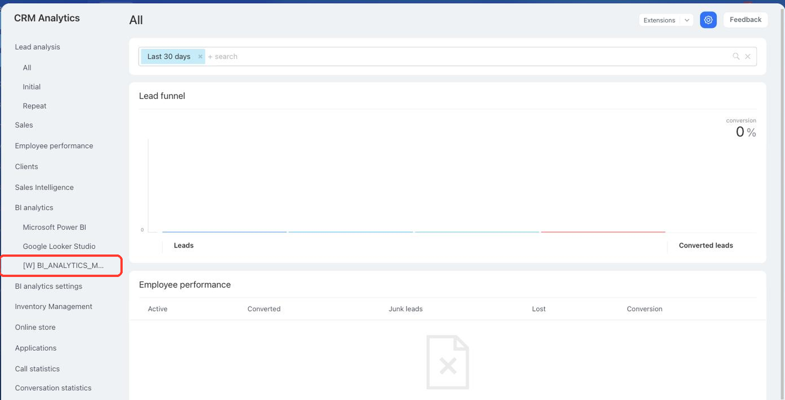

# Item in the BI Analytics Menu BI_ANALYTICS_MENU



If you are developing integrations for Bitrix24 using AI tools (Codex, Claude Code, Cursor), connect to the [MCP server](../../../ai-tools/mcp.md) so that the assistant can utilize the official REST documentation.



> Scope: [`placement`](../../scopes/permissions.md)

The widget adds its own item to the BI analytics menu — next to the ready-made Bitrix24 reports and the connected Microsoft Power BI and Google Looker Studio dashboards. Clicking the item opens a separate page where Bitrix24 shows the content of the handler.

Use the placement for applications that build their own reports on Bitrix24 data: for the user they end up in the same place as the built-in analytics.

The placement code is specified in the `PLACEMENT` parameter of the [placement.bind](../placement-bind.md) method.



The widget is not displayed in the interface until the application installation is complete. [Check the application installation](../../../settings/app-installation/installation-finish.md)



## Where the Widget is Embedded

#|
|| **Placement Code** | **Location** ||
|| `BI_ANALYTICS_MENU` | Item in the BI analytics menu ||
|#

### Where to Find It in the Interface

Open the *CRM Analytics* section and expand the *BI analytics* group in the left menu of the section. The application item is added to this group last — after the built-in services and the reports that are already set up in Bitrix24.



The item name is set by the `TITLE` parameter during registration. If the parameter is not passed, the application name is displayed.

Only the employees who are allowed to work with BI analytics see the item. Other users do not have it in the menu.

## What the Handler Receives

The handler receives no data. This is what makes the placement different from most widgets: Bitrix24 opens the address from the `HANDLER` parameter in a frame with a regular GET request and passes neither authorization nor call context {.b24-info}

Neither `AUTH_ID`, nor `member_id`, nor `PLACEMENT_OPTIONS` reaches the handler. The application has to determine on its own whom to show the report to: for example, by its own session or by the parameters you have put into the handler address in advance.

If the application needs authorization and the call context, use the placements of the section that call the handler with a POST request — for example [CRM_ANALYTICS_MENU](./analytics-menu.md).

### Address of the Widget Page

The item leads to a separate page of the form `/biconnector/placement.php?id=<registration identifier>`. The registration identifier is returned by the [placement.get](../placement-get.md) method in the `id` field.

If Bitrix24 recognizes the handler address as a public report of an external BI system, the page does not open — the report opens in a new browser tab.

## OPTIONS when registering via placement.bind

The `BI_ANALYTICS_MENU` placement does not support the `OPTIONS` parameters. Bitrix24 accepts the passed values without an error but does not store them: the [placement.get](../placement-get.md) method returns an empty array for such a binding.

## Code Examples





- cURL (OAuth)

    ```bash
    curl -X POST \
      -H "Content-Type: application/json" \
      -H "Accept: application/json" \
      -d '{
        "PLACEMENT": "BI_ANALYTICS_MENU",
        "HANDLER": "https://your-domain.com/widgets/bi-report.php",
        "TITLE": "Shipment report",
        "LANG_ALL": {
          "en": {
            "TITLE": "Shipment report"
          },
          "de": {
            "TITLE": "Versandbericht"
          }
        },
        "auth": "**put_access_token_here**"
      }' \
      https://**put_your_bitrix24_address**/rest/placement.bind
    ```

- JS (TS)

    ```ts
    // This snippet is an ES module: top-level await requires type="module" or a bundler.
    // $b24 is an already-initialized SDK instance (see the SDK "Get started" guide).
    import { Text } from '@bitrix24/b24jssdk'
    import type { B24Frame } from '@bitrix24/b24jssdk'

    declare const $b24: B24Frame

    try {
      const response = await $b24.actions.v2.call.make<boolean>({
        method: 'placement.bind',
        params: {
          PLACEMENT: 'BI_ANALYTICS_MENU',
          HANDLER: 'https://your-domain.com/widgets/bi-report.php',
          TITLE: 'Shipment report',
          LANG_ALL: {
            en: {
              TITLE: 'Shipment report',
            },
            de: {
              TITLE: 'Versandbericht',
            },
          },
        },
        requestId: Text.getUuidRfc4122()
      })

      // The payload is available only on a successful response
      if (!response.isSuccess) {
        console.error(response.getErrorMessages().join('; '))
      } else {
        const result = response.getData()!.result
        console.info('Placement bound successfully:', result)
      }
    } catch (error) {
      // Thrown on transport or SDK failures (AjaxError, SdkError, etc.)
      console.error(error)
    }
    ```

- JS (UMD)

    ```html
    <!-- Load the SDK (UMD build); it is exposed as the global B24Js -->
    <script src="https://unpkg.com/@bitrix24/b24jssdk@1/dist/umd/index.min.js"></script>
    <script>
      async function bindBiAnalyticsMenu() {
        try {
          // Initialize the SDK inside a Bitrix24 frame
          const $b24 = await B24Js.initializeB24Frame()

          const response = await $b24.actions.v2.call.make({
            method: 'placement.bind',
            params: {
              PLACEMENT: 'BI_ANALYTICS_MENU',
              HANDLER: 'https://your-domain.com/widgets/bi-report.php',
              TITLE: 'Shipment report',
              LANG_ALL: {
                en: {
                  TITLE: 'Shipment report',
                },
                de: {
                  TITLE: 'Versandbericht',
                },
              },
            },
            requestId: B24Js.Text.getUuidRfc4122()
          })

          // The payload is available only on a successful response
          if (!response.isSuccess) {
            console.error(response.getErrorMessages().join('; '))
            return
          }

          const result = response.getData().result
          console.info('Placement bound successfully:', result)
        } catch (error) {
          // Thrown on transport or SDK failures (AjaxError, SdkError, etc.)
          console.error(error)
        }
      }

      document.addEventListener('DOMContentLoaded', bindBiAnalyticsMenu)
    </script>
    ```

- PHP

    ```php
    try {
        $response = $b24Service
            ->core
            ->call(
                'placement.bind',
                [
                    'PLACEMENT' => 'BI_ANALYTICS_MENU',
                    'HANDLER' => 'https://your-domain.com/widgets/bi-report.php',
                    'TITLE' => 'Shipment report',
                    'LANG_ALL' => [
                        'en' => [
                            'TITLE' => 'Shipment report',
                        ],
                        'de' => [
                            'TITLE' => 'Versandbericht',
                        ],
                    ],
                ]
            );

        $result = $response->getResponseData()->getResult();
        if ($result->error()) {
            error_log($result->error());
        } else {
            echo 'Success: ' . print_r($result->data(), true);
        }
    } catch (Throwable $e) {
        error_log($e->getMessage());
        echo 'Error binding placement: ' . $e->getMessage();
    }
    ```

- BX24.js

    ```js
    BX24.callMethod(
        'placement.bind',
        {
            PLACEMENT: 'BI_ANALYTICS_MENU',
            HANDLER: 'https://your-domain.com/widgets/bi-report.php',
            TITLE: 'Shipment report',
            LANG_ALL: {
                en: { TITLE: 'Shipment report' },
                de: { TITLE: 'Versandbericht' }
            }
        },
        function(result) {
            if (result.error()) {
                console.error(result.error());
            } else {
                console.log(result.data());
            }
        }
    );
    ```

- PHP CRest

    ```php
    require_once('crest.php');

    $result = CRest::call(
        'placement.bind',
        [
            'PLACEMENT' => 'BI_ANALYTICS_MENU',
            'HANDLER' => 'https://your-domain.com/widgets/bi-report.php',
            'TITLE' => 'Shipment report',
            'LANG_ALL' => [
                'en' => [
                    'TITLE' => 'Shipment report',
                ],
                'de' => [
                    'TITLE' => 'Versandbericht',
                ],
            ],
        ]
    );

    echo '<PRE>';
    print_r($result);
    echo '</PRE>';
    ```



## Continue Learning

- [{#T}](./index.md)
- [{#T}](./analytics-menu.md)
- [{#T}](./analytics-toolbar.md)
- [{#T}](../placement-bind.md)
- [{#T}](../placement-get.md)
- [{#T}](../../biconnector/index.md)
- [{#T}](../bx24-widget-methods.md)
