# Additional Integration Features CRM_XXX_DETAIL_ACTIVITY, CRM_DYNAMIC_XXX_DETAIL_ACTIVITY

> Scope: [`crm`](../../scopes/permissions.md)
>
> Who can work with the integration: a user with access permission to modify the entity

With additional parameters, you can set the Bitrix24 interface for your menu item in the timeline.

To add the integration, use the method [placement.bind](../placement-bind.md). The basic integration capabilities are described in the article [Button above the entity detail timeline](./detail-activity.md).

[Download an example application using the integration.](https://helpdesk.bitrix24.com/examples/timeline_activity_placement_einvoice.zip)

## OPTIONS Parameter

#|
|| **Name**
`type` | **Description** ||
|| **useBuiltInInterface**
[`boolean`](../../data-types.md) | Use the standard Bitrix24 interface. Default is `N`. If `Y`, the interface is built according to the described structure [LayoutDto](#LayoutDto). The process of working with the interface is described [below](#Interface) ||
|| **newUserNotificationTitle**
[`string`](../../data-types.md) | Notification title for new users ||
|| **newUserNotificationText**
[`string`](../../data-types.md) | Notification text for new users. Clicking "More" will open a slider with the context `newUserNotification=Y` and a width of `800px` ||
|#

## Registration Example 

```js
BX24.callMethod(
  'placement.bind',
  {
    'PLACEMENT': 'CRM_DEAL_DETAIL_ACTIVITY',
    'HANDLER': 'https://your-handler-uri.com',
    'TITLE': 'My Integration',
    'OPTIONS': {
      'useBuiltInInterface': 'Y',
      'newUserNotificationTitle': 'Meet the new application',
      'newUserNotificationText': 'E-invoice will help manage invoices'
    }
  }
);
```

## Working with the Integration Interface {#Interface}

Interaction occurs through the method [BX24.placement.call](../ui-interaction/bx24-placement-call.md). The application workflow when using the standard Bitrix24 interface `useBuiltInInterface = Y`:

1. Loading the iframe.

   The application is loaded in a hidden iframe. The `placementOptions` include:
   - `entityTypeId`
   - `entityId`
   - `useBuiltInInterface: Y`

2. Rendering the interface. 
   
   Once the application is loaded, it should call `setLayout` to render the initial state of the integration location.

   ```js
   BX24.placement.call('setLayout', LayoutDto, callback);
   ```

3. Responding to actions.

	If the application displays interactive elements in the interface, such as links, it can register a handler `bindLayoutEventCallback` to handle interactions with the elements.

	```js
	BX24.placement.call('bindLayoutEventCallback', null, callback);
	```

4. Managing element states.

	The appearance and visibility of specific interface elements can be changed using `setLayoutItemState`.

	```js
	BX24.placement.call('setLayoutItemState', { id: '...', visible: true/false, properties: {...} }, callback);
	```

5. Managing buttons.

	The appearance of the buttons at the bottom of the interface can be changed using `setPrimaryButtonState` and `setSecondaryButtonState`.

	```js
	BX24.placement.call('setPrimaryButtonState', {...}, callback);
	BX24.placement.call('setSecondaryButtonState', {...}, callback);
	```

6. Completing the process.

	When the user's interaction with the integration is finished or if the user clicks "cancel," `finish` should be called. The timeline will switch to the default tab.

	```js
	BX24.placement.call('finish');
	```

7. Locking the interface.

	For long operations, such as saving, the interface can be locked by calling `lock`. To unlock, call `unlock`.

	```js
	BX24.placement.call('lock');   // lock
	BX24.placement.call('unlock'); // unlock
	```

8. Tracking changes to the entity.

	To track changes to entity fields, for example, to redraw the interface based on the field value, you can register a handler `bindEntityUpdateCallback`. The callback will be called immediately after the fields are saved in the editor.

	```js
	BX24.placement.call('bindEntityUpdateCallback', null, callback);
	```

## Interface Appearance LayoutDto {#LayoutDto}

#|
|| **Name**
`type` | **Description** ||
|| **blocks**
[`ContentBlockDto[]`](#contentblockdto) | Associative array of objects describing content blocks. The keys of the array are the block identifiers. Minimum 1 element ||
|| **primaryButton**
[`ButtonDto`](#buttondto) | Primary button. Usually completes data processing, saves it ||
|| **secondaryButton**
[`ButtonDto`](#buttondto) | Secondary button. Usually cancels the data processing ||
|#

Pressing active buttons triggers callbacks: 

- `primaryButton` — callback `BX24.placement.call('bindPrimaryButtonClickCallback', null, callback)`,
- `secondaryButton` — callback `BX24.placement.call('bindSecondaryButtonClickCallback', null, callback)`.

### ContentBlockDto {#contentblockdto}

Content blocks of the main area can be combined and flexibly assembled into various interfaces.

General structure of a block:

```json
{
  "type": "string",
  "visible": true,
  "properties": {}
}
```

- `type` — block type, string,
- `visible` — controls the visibility of the block, boolean field. Changing visibility allows for dynamic interfaces. Default = `true`.
- `properties` — set of properties for a specific block.

#### Types of Content Blocks

| Type | Name |
|-----|-------------------|
| `text` | [Text](#text) |
| `link` | [Link](#link) |
| `withTitle` | [Block with Title](#withTitle) |
| `lineOfBlocks` | [Multiple content blocks in one line](#lineOfBlocks) |
| `dropdownMenu` | [Dropdown Menu](#dropdownMenu) |
| `input` | [Text Input Field](#input) |
| `textarea` | [Multiline Text Input Field](#textarea) |
| `select` | [Dropdown Input Field](#select) |
| `list` | [Unordered List](#list) |
| `section` | [Section](#section) |

##### Text {#text}

Block for displaying formatted text.



#|
|| **Name**
`type` | **Description** ||
|| **value***
[`string`](../../data-types.md) | Text ||
|| **multiline**
[`boolean`](../../data-types.md) | Handle line breaks. If `true`, `\n` characters will be replaced with `<br>`. 
Default is `false` ||
|| **bold**
[`boolean`](../../data-types.md) | Bold text. Default is `false` ||
|| **size**
[`string`](../../data-types.md) | Text size. Available values: 
- `xs`, 
- `sm`, 
- `md` — default, 
- `lg`, 
- `xl` ||
|| **color**
[`string`](../../data-types.md) | Text color. Available values: 
- `base_50`, 
- `base_60`, 
- `base_70`, 
- `base_90`, 
- `primary`, 
- `warning`, 
- `danger`, 
- `success` ||
|#


```json
{
  "type": "text",
  "properties": {
    "value": "Hello!\nWe are starting.",
    "multiline": true,
    "bold": true,
    "size": "lg",
    "color": "base_90"
  }
}
```

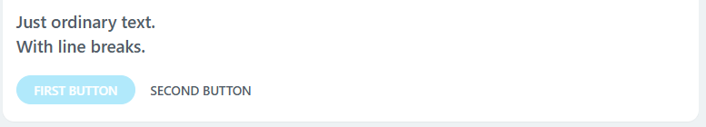

##### Link {#link}



#|
|| **Name**
`type` | **Description** ||
|| **text***
[`string`](../../data-types.md) | Link text, HTML tags are not supported ||
|| **action***
[`ActionDto`](#actiondto) | Action upon clicking the link ||
|| **size**
[`string`](../../data-types.md) | Text size. Available values: 
- `xs`, 
- `sm`, 
- `md` — default, 
- `lg`, 
- `xl` ||
|| **bold**
[`boolean`](../../data-types.md) | Bold text. Default is `false` ||
|#


```json
{
  "type": "link",
  "properties": {
    "text": "Open Deal",
    "action": { "type": "redirect", "uri": "/crm/deal/details/123/" },
    "bold": true
  }
}
```

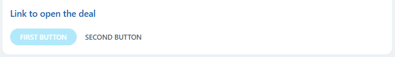

##### Block with Title {#withTitle}

The block displays a title and value. Another content block can be used as the value.



#|
|| **Name**
`type` | **Description** ||
|| **title***
[`string`](../../data-types.md) | Title text ||
|| **inline**
[`boolean`](../../data-types.md) | Show title and value in one line. Default is `false` ||
|| **titleWidth**
[`string`](../../data-types.md) | Title width, applied if `inline=true`. Available values:
- `sm`,
- `md` — default,
- `lg` ||
|| **block***
[`ContentBlockDto`](#contentblockdto) | Content block that serves as the value. Blocks of types `text`, `link`, `lineOfBlocks` are supported ||
|#

Example with a content block of type text:

```json
{
  "type": "withTitle",
  "properties": {
    "title": "Title",
    "block": {
      "type": "text",
      "properties": {
        "value": "Some value"
      }
    }
  }
}
```

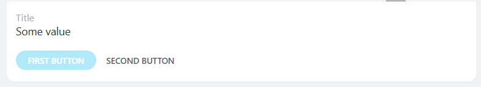

Example with a content block of type link:

```json
{
  "type": "withTitle",
  "properties": {
    "title": "Title 2",
    "block": {
      "type": "link",
      "properties": {
        "text": "Open Deal",
        "action": {
          "type": "redirect",
          "uri": "/crm/deal/details/123/"
        }
      }
    },
    "inline": true
  }
}
```

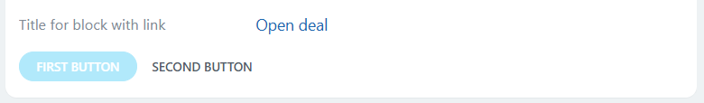

##### Multiple Content Blocks in One Line {#lineOfBlocks}

The block displays multiple content blocks of type text or link in one line. This allows displaying text with different formatting and links in a single line.



#|
|| **Name**
`type` | **Description** ||
|| **blocks***
[`ContentBlockDto[]`](#contentblockdto) | Associative array of content blocks. Blocks of types `text`, `link` are supported ||
|#

```json
{
  "type": "lineOfBlocks",
  "properties": {
    "blocks": {
      "text": {
        "type": "text",
        "properties": {
          "value": "Some text"
        }
      },
      "link": {
        "type": "link",
        "properties": {
          "text": "link",
          "action": {
            "type": "redirect",
            "uri": "/crm/deal/details/123/"
          }
        }
      },
      "boldText": {
        "type": "text",
        "properties": {
          "value": "bold text",
          "bold": true
        }
      }
    }
  }
}
```

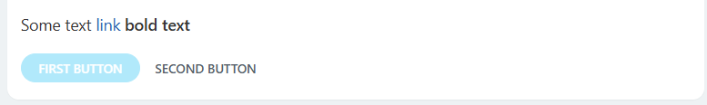

##### Dropdown Menu {#dropdownMenu}



#|
|| **Name**
`type` | **Description** ||
|| **selectedValue**
[`string`](../../data-types.md) | Current selected value. If not filled, the first value from the list will be used ||
|| **values***
[`object`](../../data-types.md) | Object where property names are the code of the value option `vendor`, and property values are the values that the user will see `vendor` ||
|#

```json
{
  "type": "dropdownMenu",
  "properties": {
    "selectedValue": "client",
    "values": {
      "": "- not selected -",
      "vendor": "vendor",
      "client": "client"
    }
  }
}
```

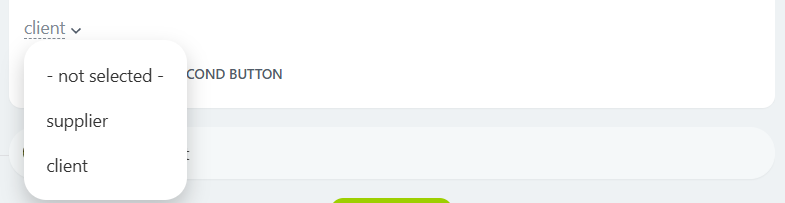

To track value changes, register the callback:

- `BX24.placement.call('bindValueChangeCallback', null, Callback)` to receive changes in any of the blocks
- `BX24.placement.call('bindValueChangeCallback', 'block id', Callback)` to receive value changes only for that block.

When the value changes, the callback will receive the `id` of the dropdown block and its current value: `{id: "clientMenu", value: "client"}`.

##### Text Input Field {#input}



#|
|| **Name**
`type` | **Description** ||
|| **title**
[`string`](../../data-types.md) | Field title ||
|| **value**
[`string`](../../data-types.md) | Field text ||
|| **placeholder**
[`string`](../../data-types.md) | Placeholder. Will be shown if the field is not filled ||
|| **disabled**
[`boolean`](../../data-types.md) | If `true` is passed, the field will be locked for editing. Default is `false` ||
|| **errorText**
[`string`](../../data-types.md) | Error message. If a non-empty `errorText` is passed, the current value of the field did not pass validation. The user will see the error ||
|#

```json
{
  "type": "input",
  "properties": {
    "value": "aaa@mail.domain",
    "placeholder": "Enter email",
    "title": "Email",
    "errorText": "Invalid value"
  }
}
```

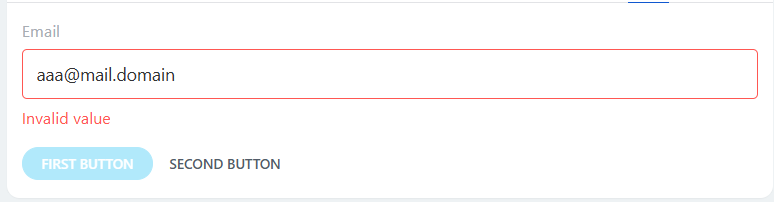

To track value changes, register the callback:

- `BX24.placement.call('bindValueChangeCallback', null, Callback)` to receive changes in any of the blocks
- `BX24.placement.call('bindValueChangeCallback', 'block id', Callback)` to receive value changes only for that block.

When the value changes, the callback will receive the `id` of the text input field and its current value: `{id: "email", value: "aaa@mail.domain"}`.

##### Multiline Text Input Field {#textarea}



#|
|| **Name**
`type` | **Description** ||
|| **title**
[`string`](../../data-types.md) | Field title ||
|| **value**
[`string`](../../data-types.md) | Field text ||
|| **placeholder**
[`string`](../../data-types.md) | Placeholder. Will be shown if the field is not filled ||
|| **disabled**
[`boolean`](../../data-types.md) | If `true` is passed, the field will be locked for editing. Default is `false` ||
|| **errorText**
[`string`](../../data-types.md) | Error message. If a non-empty `errorText` is passed, the current value of the field did not pass validation. The user will see the error  ||
|#

```json
{
  "type": "textarea",
  "properties": {
    "value": "Go through the gate\nTurn left",
    "title": "Additional Information"
  }
}
```

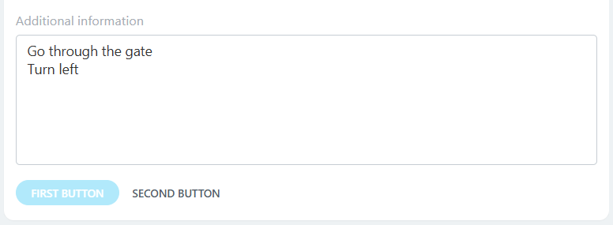

To track value changes, register the callback:

- `BX24.placement.call('bindValueChangeCallback', null, Callback)` to receive changes in any of the blocks
- `BX24.placement.call('bindValueChangeCallback', 'block id', Callback)` to receive value changes only for that block.

When the value changes, the callback will receive the `id` of the text input field and its current value:  `{id: "description", value: "Go through the gate\nTurn left"}`.

##### Dropdown Input Field {#select}



#|
|| **Name**
`type` | **Description** ||
|| **title**
[`string`](../../data-types.md) | Field title ||
|| **selectedValue**
[`string`](../../data-types.md) | Current selected value. If not filled, the first value from the list will be used ||
|| **values***
[`object`](../../data-types.md) | Object where property names are the code of the value option `nyc`, and property values are the values that the user will see `New York` ||
|| **disabled**
[`boolean`](../../data-types.md) | If `true` is passed, the field will be locked for editing. Default is `false` ||
|| **errorText**
[`string`](../../data-types.md) | Error message. If a non-empty `errorText` is passed, the current value of the field did not pass validation. The user will see the error  ||
|#

```json
{
  "type": "select",
  "properties": {
    "selectedValue": "la",
    "values": {
      "nyc": "New York",
      "la": "Los Angeles",
      "chi": "Chicago"
    },
    "title": "City"
  }
}
```

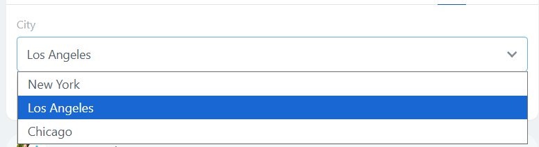

To track value changes, register the callback:

- `BX24.placement.call('bindValueChangeCallback', null, Callback)` to receive changes in any of the blocks
- `BX24.placement.call('bindValueChangeCallback', 'block id', Callback)` to receive value changes only for that block.

When the value changes, the callback will receive the `id` of the field and its current value: `{id: "city", value: "nyc"}`.

##### Unordered List {#list}



#|
|| **Name**
`type` | **Description** ||
|| **blocks***
[`ContentBlockDto[]`](#contentblockdto) | Associative array of content blocks. Blocks of types `text`, `link`, `lineOfBlocks` are supported. Minimum 1 element ||
|#

```json
{
  "type": "list",
  "properties": {
    "blocks": {
      "li1": {
        "type": "text",
        "properties": {
          "value": "Importing CRM elements without details",
          "color": "base_70"
        }
      },
      "li2": {
        "type": "link",
        "properties": {
          "text": "Getting Started with CRM",
          "action": {
            "type": "layoutEvent",
            "value": "link2ItemClicked!"
          }
        }
      },
      "li3": {
        "type": "text",
        "properties": {
          "value": "How to convert a lead",
          "bold": true,
          "color": "base_90"
        }
      }
    }
  }
}
```

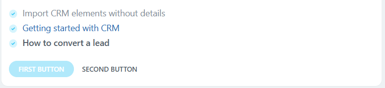

##### Section {#section}

The block displays a grouped set of blocks. An option with an image is possible.



#|
|| **Name**
`type` | **Description** ||
|| **blocks***
[`ContentBlockDto[]`](#contentblockdto) | Associative array of content blocks. Any types of blocks are supported. Minimum 1 element, maximum 20 ||
|| **imageSrc**
[`string`](../../data-types.md) | Full path to the image ||
|| **imageSize**
[`string`](../../data-types.md) | Image size. Available values:
- `lg` — default,
- `md`,
- `sm` ||
|| **type**
[`string`](../../data-types.md) | Appearance. Available values:
- `default` — default,
- `primary`,
- `warning`,
- `danger`,
- `success`,
- `withBorder` ||
|#

Example with multiple blocks and an image:

```json
{
  "type": "section",
  "properties": {
    "type": "withBorder",
    "imageSrc": "https://helpdesk.bitrix24.com/examples/section.png",
    "blocks": {
      "header": {
        "type": "text",
        "properties": {
          "value": " Send the client a link to the meeting",
          "size": "xl",
          "color": "base_90"
        }
      },
      "notes": {
        "type": "list",
        "properties": {
          "blocks": {
            "li1": {
              "type": "text",
              "properties": {
                "value": "The client will choose a convenient slot",
                "color": "base_70"
              }
            },
            "li2": {
              "type": "text",
              "properties": {
                "value": "The meeting will appear in your activities",
                "color": "base_70"
              }
            }
          }
        }
      },
      "howto": {
        "type": "link",
        "properties": {
          "text": "How does it work?",
          "action": {
            "type": "openRestApp",
            "value": "howto"
          }
        }
      }
    }
  }
}
```

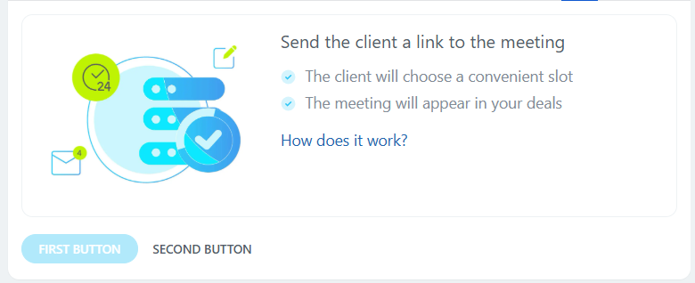

Example with a single block without an image:

```json
{
	"type": "section",
	"properties": {
		"type": "danger",
		"blocks": {
			"errorMessage": {
				"type": "text",
				"properties": {
					"value": "An error occurred. Please try again.",
					"color": "danger"
				}
			}
		}
	}
}
```

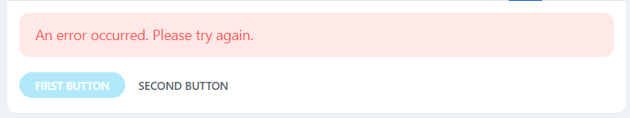

### ButtonDto {#buttondto}

Button at the bottom of the interface.

#|
|| **Name**
`type` | **Description** ||
|| **title***
[`string`](../../data-types.md) | Button text ||
|| **state**
[`string`](../../data-types.md) | State. Available values: 
- `normal` — default,
- `disabled` ||
|#

#### Actions with Button ActionDto {#actiondto}

An action defines the response to a click on a specific element. Available types of actions:

- [redirect](#click),
- [JS event](#js),
- [open application slider](#slider).

##### Redirect {#click}

Redirect can occur in two ways:

- slider, if it is a relative link to standard Bitrix24 objects that support working in a slider,
- regular redirect in other cases.



#|
|| **Name**
`type` | **Description** ||
|| **type***
`const` | Action type. Must have the value `redirect` ||
|| **value***
[`string`](../../data-types.md) | URI link. For example: `https://example.com` or `/crm/deal/details/1/` for Bitrix24 objects ||
|#

```json
{
  "type": "redirect",
  "value": "/crm/deal/details/1/"
}
```

##### JS Event {#js}



#|
|| **Name**
`type` | **Description** ||
|| **type***
`const` | Action type. Must have the value `layoutEvent` ||
|| **value***
[`string`](../../data-types.md) | Event identifier. For example: `doSomething` or `start_processing` ||
|#

```json
{
  "type": "layoutEvent",
  "value": "clicked"
}
```

Calling the action triggers the handler registered via `BX24.placement.call('bindLayoutEventCallback', null, Callback)` or  `BX24.placement.call('bindLayoutEventCallback', 'block id', Callback)`.

The handler will receive the `value` of the action and the `id` of the block that triggered the action: `{id: "myLink", value: "clicked"}`.

##### Opening Application Slider {#slider}

Calling the action will open the slider of the application that registered the integration. The context will be passed to the slider:

* `entityTypeId` is the identifier of the object type to which the deal is linked,
* `entityId` is the identifier of the element.



#|
|| **Name**
`type` | **Description** ||
|| **type***
`const` | Action type. Must have the value `openRestApp` ||
|| **value**
[`array`](../../data-types.md) | Array of arbitrary format, the data from which will be passed to the application slider ||
|| **sliderParams**
[`ActionSliderParamsDto`](#actionsliderparamsdto) | Parameters for opening the slider ||
|#

###### ActionSliderParamsDto {#actionsliderparamsdto}

#|
|| **Name**
`type` | **Description** ||
|| **width**
[`int`](../../data-types.md) | Slider width, px. Cannot be used simultaneously with `leftBoundary` ||
|| **leftBoundary**
[`int`](../../data-types.md) | Slider full width of the browser window with a left margin, px. Cannot be used simultaneously with `width` ||
|| **title**
[`string`](../../data-types.md) | Text for the browser window title when opening the slider ||
|#

```json
{
  "type": "openRestApp",
  "value": {
    "myId": 123,
    "someImportant": "qwerty"
  },
  "sliderParams": {
    "title": "This is the slider application title",
    "width": 700
  }
}
```

## Examples of LayoutDto

```json
{
	"blocks": {
		"section1": {
			"type": "section",
			"properties": {
				"type": "withBorder",
				"imageSrc": "https://helpdesk.bitrix24.com/examples/section.png",
				"blocks": {
					"header": {
						"type": "text",
						"properties": {
							"value": " Send the client a link to the meeting",
							"size": "xl",
							"color": "base_90"
						}
					},
					"notes": {
						"type": "list",
						"properties": {
							"blocks": {
								"li1": {"type": "text", "properties": {"value": "The client will choose a convenient slot", "color": "base_70"}},
								"li2": {"type": "text", "properties": {"value": "The meeting will appear in your activities", "color": "base_70"}}
							}
						}
					},
					"howto": {
						"type": "link",
						"properties": {"text": "How does it work?", "action": {"type": "openRestApp", "value": "howto"}}
					}
				}
			}
		},
		"section2": {
			"type": "section",
			"properties": {
				"type": "primary",
				"blocks": {
					"sectionText": {
						"type": "lineOfBlocks",
						"properties": {"blocks": {"block1": {"type": "text", "properties": {"value": "If you haven't tried the sales generator yet, now is the time to test this tool in action", "color": "base_70"}}, "block2": {"type": "link", "properties": {"text": "Learn more", "action": {"type": "redirect", "value": "/crm/"}}}}}
					}
				}
			}
		}
	},
	"primaryButton": {"title": "Enable"},
	"secondaryButton": {"title": "Cancel"}
}
```

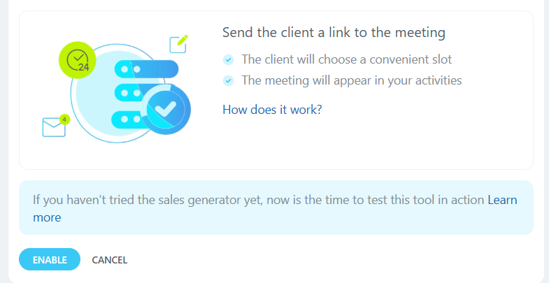

```json
{
	"blocks": {
		"errorMessage": {
			"type": "text",
			"properties": {"value": "Use all the capabilities of mobile SMS marketing\nSending SMS is easy to set up and use in Bitrix24 CRM\nSend messages directly from the deal, lead, client, invoice, or estimate card.", "size": "sm", "color": "base_70", "multiline": true}
		},
		"section1": {
			"type": "section",
			"properties": {"type": "danger", "blocks": {"errorMessage": {"type": "text", "properties": {"value": "An error occurred. Please try again", "color": "danger"}}}}
		}
	},
	"primaryButton": {"title": "Enable", "state": "disabled"},
	"secondaryButton": {"title": "Cancel", "state": "disabled"}
}
```

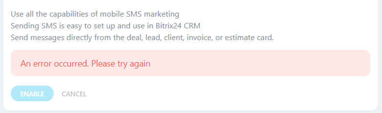

```json
{
	"blocks": {
		"name": {"type": "input", "properties": {"value": "John", "placeholder": "Enter name", "title": "Name"}},
		"lastname": {"type": "input", "properties": {"value": "Doe", "placeholder": "", "title": "Last Name"}},
		"secondname": {"type": "input", "properties": {"value": "", "placeholder": "Enter middle name", "title": "Middle Name"}}
	},
	"primaryButton": {"title": "Save"},
	"secondaryButton": {"title": "Cancel"}
}
```

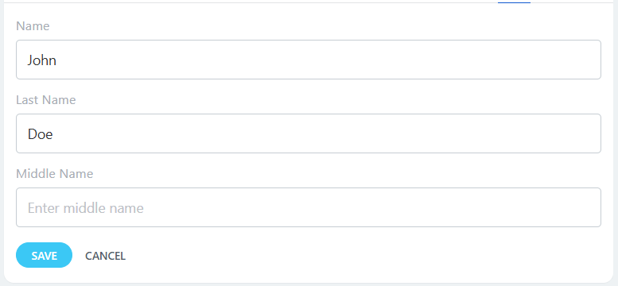

## Continue Learning

- [{#T}](../placement-bind.md)
- [{#T}](../ui-interaction/index.md)
- [{#T}](../ui-interaction/crm-card.md)
- [{#T}](../../interactivity/index.md)
- [{#T}](./detail-activity.md)