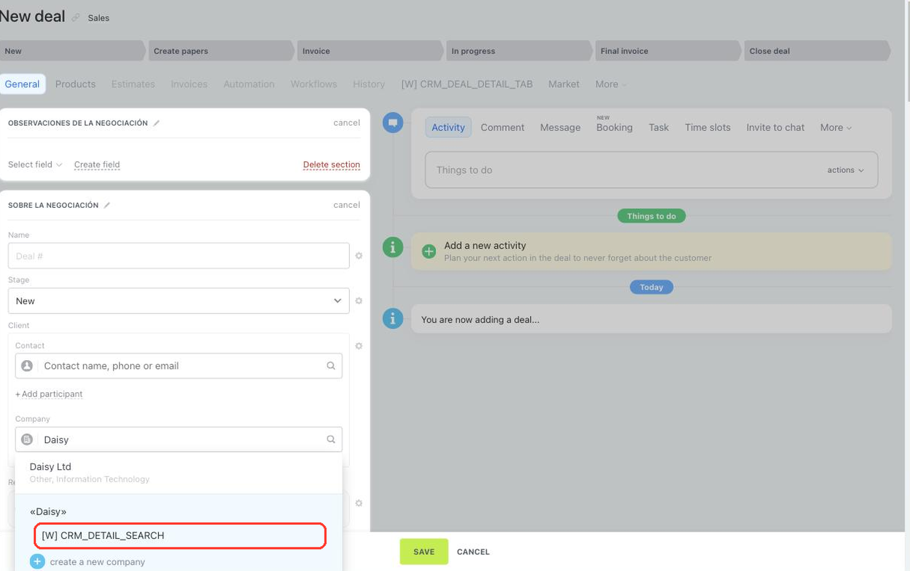

# Client Search in the Entity Form CRM_DETAIL_SEARCH



If you are developing integrations for Bitrix24 using AI tools (Codex, Claude Code, Cursor), connect to the [MCP server](../../../ai-tools/mcp.md) so that the assistant can utilize the official REST documentation.



> Scope: [`placement, crm`](../../scopes/permissions.md)

The `CRM_DETAIL_SEARCH` placement connects an application handler to the client search in the CRM form — to the *Contact* and *Company* fields of the *Client* block. Use it when the application searches for a client in an external source and fills the found option into the form.

The application does not render an interface of its own: it receives the search query and returns a list of options, while Bitrix24 displays them.

The placement code is specified in the `PLACEMENT` parameter of the [placement.bind](../placement-bind.md) method.



The widget is not displayed in the interface until the application installation is complete. [Check the application installation](../../../settings/app-installation/installation-finish.md)



## Where the Widget is Embedded

#|
|| **Placement Code** | **Location** ||
|| `CRM_DETAIL_SEARCH` | Application item in the client search of the CRM form ||
|#

### Where to Find It in the Interface

Open a CRM entity form and start typing a query into the *Contact* or *Company* field of the *Client* block. The application item appears below the list of found clients once the query is at least three characters long. The item is displayed with the name from the `TITLE` parameter.

Click the item to make the application run the search. While the handler responds, a loading indicator is shown on the item. The options found by the application appear in the same list as the clients of Bitrix24.



## What the Handler Receives

Data is sent in a POST request: some parameters come in the handler URL query string, the rest in the request body {.b24-info}

```php

Array
(
    [DOMAIN] => xxx.bitrix24.com
    [PROTOCOL] => 1
    [LANG] => en
    [APP_SID] => 1a7f0c3e59d84b2c7e6f5a83d1c40b92
    [AUTH_ID] => 83fd7166007e9c94001e30ba00000001f0f107a52e6ad7ef9a1b8c3d5e2f4061
    [AUTH_EXPIRES] => 3600
    [REFRESH_ID] => 737c9966007e9c94001e30ba00000001f0f1072b8d4e6f01a3c57d9e8b2f4160
    [SERVER_ENDPOINT] => https://oauth.bitrix.info/rest/
    [APPLICATION_TOKEN] => ec1b2074a9d3f5c81b6e40d27a95cf38
    [APPLICATION_SCOPE] => crm,placement
    [member_id] => d897063e1ce7c5eb9f04b9751eef5915
    [status] => L
    [PLACEMENT] => CRM_DETAIL_SEARCH
    [PLACEMENT_OPTIONS] => {"entityTypeName":"COMPANY","searchQuery":"Daisy","URI":"\/crm\/deal\/details\/5\/?any=details%2F5%2F&IFRAME=Y&IFRAME_TYPE=SIDE_SLIDER"}
)

```

After parsing, the `PLACEMENT_OPTIONS` string from this example looks like this:

```json
{
    "entityTypeName": "COMPANY",
    "searchQuery": "Daisy",
    "URI": "/crm/deal/details/5/?any=details%2F5%2F&IFRAME=Y&IFRAME_TYPE=SIDE_SLIDER"
}
```





### PLACEMENT_OPTIONS

The `PLACEMENT_OPTIONS` value is passed as a JSON string with the call context. Besides the universal `URI` key, the context contains the keys of the placement itself.



#|
|| **Parameter** | **Description** ||
|| **entityTypeName***
[`string`](../../data-types.md) | Type of the client the user is looking for.

Possible values:
- `CONTACT` — the search runs in the *Contact* field
- `COMPANY` — the search runs in the *Company* field
||
|| **searchQuery***
[`string`](../../data-types.md) | The string the user typed into the search field ||
|#

The identifier of the entity whose form the search was started from does not arrive as a separate key. It can be taken from the path in the universal `URI` key.

## OPTIONS when registering via placement.bind

The placement does not support the `OPTIONS` parameters. Passed values are not saved: the [placement.get](../placement-get.md) method returns an empty array for such a registration.

## How to Return the Found Options

Pass the found options with the [BX24.placement.call](../ui-interaction/bx24-placement-call.md) method using the `crmShowFoundEntities` name.

#|
|| **Field**
[`type`](../../data-types.md) | **Description** ||
|| **data**
[`array`](../../data-types.md) | List of the found options ||
|| **data[].id**
[`string`](../../data-types.md) | Identifier of the option on the application side ||
|| **data[].name**
[`string`](../../data-types.md) | Name of the option to be shown to the user ||
|| **data[].phone**
[`string`](../../data-types.md) | Phone of the option. Pass the field if the number is found ||
|| **data[].email**
[`string`](../../data-types.md) | Email of the option. Pass the field if the address is found ||
|| **data[].web**
[`string`](../../data-types.md) | Website of the option. Pass the field if the site is found ||
|#

```javascript
BX24.placement.call(
    'crmShowFoundEntities',
    {
        data: [
            {
                id: 'company-123',
                name: 'Daisy Ltd',
                phone: '+1 555 000-00-00',
                email: 'info@example.com',
                web: 'https://example.com'
            }
        ]
    }
);
```

If the application found nothing, pass an empty list. Bitrix24 will make the application item inactive.

## How to Fill the Selected Option into the Form

If the user selects an option from the application response, Bitrix24 triggers the `onCrmEntityIsNeedToCreate` interface event. Subscribe to it with the [BX24.placement.bindEvent](../ui-interaction/bx24-placement-bind-event.md) method.

The event handler receives the data of the selected option.

#|
|| **Field**
[`type`](../../data-types.md) | **Description** ||
|| **appSid**
[`string`](../../data-types.md) | Identifier of the application session in which the selected option was found ||
|| **data**
[`object`](../../data-types.md) | Data of the selected option from the list the application passed via `crmShowFoundEntities` ||
|#

Create the entity in CRM with the [crm.company.add](../../crm/companies/crm-company-add.md) or [crm.contact.add](../../crm/contacts/crm-contact-add.md) method, and then pass its identifier with the `crmShowCreatedEntity` command. Bitrix24 fills this entity into the *Client* field of the form.

```javascript
BX24.placement.bindEvent('onCrmEntityIsNeedToCreate', function (eventData) {
    const selected = eventData.data;

    BX24.placement.call(
        'crmShowCreatedEntity',
        {
            entityType: 'company',
            id: selected.id,
            title: selected.title || selected.name
        }
    );
});
```

Fields of the `crmShowCreatedEntity` command:

#|
|| **Field**
[`type`](../../data-types.md) | **Description** ||
|| **entityType**
[`string`](../../data-types.md) | Type of the created entity. Pass `company` for a company and `contact` for a contact ||
|| **id**
[`string`](../../data-types.md) | Identifier of the created entity in CRM ||
|| **title**
[`string`](../../data-types.md) | Name of the created entity ||
|#

## Code Examples





- cURL (OAuth)

    ```bash
    curl -X POST \
      -H "Content-Type: application/json" \
      -H "Accept: application/json" \
      -d '{
        "PLACEMENT": "CRM_DETAIL_SEARCH",
        "HANDLER": "https://your-domain.com/widgets/crm-detail-search-handler.php",
        "TITLE": "Registry search",
        "LANG_ALL": {
          "en": {
            "TITLE": "Registry search"
          },
          "de": {
            "TITLE": "Registersuche"
          }
        },
        "auth": "**put_access_token_here**"
      }' \
      https://**put_your_bitrix24_address**/rest/placement.bind
    ```

- JS (TS)

    ```ts
    // This snippet is an ES module: top-level await requires type="module" or a bundler.
    // $b24 is an already-initialized SDK instance (see the SDK "Get started" guide).
    import { Text } from '@bitrix24/b24jssdk'
    import type { B24Frame } from '@bitrix24/b24jssdk'

    declare const $b24: B24Frame

    try {
      const response = await $b24.actions.v2.call.make<boolean>({
        method: 'placement.bind',
        params: {
          PLACEMENT: 'CRM_DETAIL_SEARCH',
          HANDLER: 'https://your-domain.com/widgets/crm-detail-search-handler.php',
          TITLE: 'Registry search',
          LANG_ALL: {
            en: {
              TITLE: 'Registry search',
            },
            de: {
              TITLE: 'Registersuche',
            },
          },
        },
        requestId: Text.getUuidRfc4122()
      })

      // The payload is available only on a successful response
      if (!response.isSuccess) {
        console.error(response.getErrorMessages().join('; '))
      } else {
        const result = response.getData()!.result
        console.info('Placement bound successfully:', result)
      }
    } catch (error) {
      // Thrown on transport or SDK failures (AjaxError, SdkError, etc.)
      console.error(error)
    }
    ```

- JS (UMD)

    ```html
    <!-- Load the SDK (UMD build); it is exposed as the global B24Js -->
    <script src="https://unpkg.com/@bitrix24/b24jssdk@1/dist/umd/index.min.js"></script>
    <script>
      async function bindCrmDetailSearch() {
        try {
          // Initialize the SDK inside a Bitrix24 frame
          const $b24 = await B24Js.initializeB24Frame()

          const response = await $b24.actions.v2.call.make({
            method: 'placement.bind',
            params: {
              PLACEMENT: 'CRM_DETAIL_SEARCH',
              HANDLER: 'https://your-domain.com/widgets/crm-detail-search-handler.php',
              TITLE: 'Registry search',
              LANG_ALL: {
                en: {
                  TITLE: 'Registry search',
                },
                de: {
                  TITLE: 'Registersuche',
                },
              },
            },
            requestId: B24Js.Text.getUuidRfc4122()
          })

          // The payload is available only on a successful response
          if (!response.isSuccess) {
            console.error(response.getErrorMessages().join('; '))
            return
          }

          const result = response.getData().result
          console.info('Placement bound successfully:', result)
        } catch (error) {
          // Thrown on transport or SDK failures (AjaxError, SdkError, etc.)
          console.error(error)
        }
      }

      document.addEventListener('DOMContentLoaded', bindCrmDetailSearch)
    </script>
    ```

- PHP

    ```php
    try {
        $response = $b24Service
            ->core
            ->call(
                'placement.bind',
                [
                    'PLACEMENT' => 'CRM_DETAIL_SEARCH',
                    'HANDLER' => 'https://your-domain.com/widgets/crm-detail-search-handler.php',
                    'TITLE' => 'Registry search',
                    'LANG_ALL' => [
                        'en' => [
                            'TITLE' => 'Registry search',
                        ],
                        'de' => [
                            'TITLE' => 'Registersuche',
                        ],
                    ],
                ]
            );

        $result = $response->getResponseData()->getResult();
        if ($result->error()) {
            error_log($result->error());
        } else {
            echo 'Success: ' . print_r($result->data(), true);
        }
    } catch (Throwable $e) {
        error_log($e->getMessage());
        echo 'Error binding placement: ' . $e->getMessage();
    }
    ```

- BX24.js

    ```js
    BX24.callMethod(
        'placement.bind',
        {
            PLACEMENT: 'CRM_DETAIL_SEARCH',
            HANDLER: 'https://your-domain.com/widgets/crm-detail-search-handler.php',
            TITLE: 'Registry search',
            LANG_ALL: {
                en: { TITLE: 'Registry search' },
                de: { TITLE: 'Registersuche' }
            }
        },
        function(result) {
            if (result.error()) {
                console.error(result.error());
            } else {
                console.log(result.data());
            }
        }
    );
    ```

- PHP CRest

    ```php
    require_once('crest.php');

    $result = CRest::call(
        'placement.bind',
        [
            'PLACEMENT' => 'CRM_DETAIL_SEARCH',
            'HANDLER' => 'https://your-domain.com/widgets/crm-detail-search-handler.php',
            'TITLE' => 'Registry search',
            'LANG_ALL' => [
                'en' => [
                    'TITLE' => 'Registry search',
                ],
                'de' => [
                    'TITLE' => 'Registersuche',
                ],
            ],
        ]
    );

    echo '<PRE>';
    print_r($result);
    echo '</PRE>';
    ```

- Go

    ```go
    // client and ctx are already created — see the Go SDK section
    res, err := client.Core().Call(ctx, "placement.bind", b24.Params{
    	"PLACEMENT": "CRM_DETAIL_SEARCH",
    	"HANDLER":   "https://your-domain.com/widgets/crm-detail-search-handler.php",
    	"TITLE":     "Registry search",
    	"LANG_ALL": b24.Params{
    		"ru": b24.Params{
    			"TITLE": "Registry search",
    		},
    		"en": b24.Params{
    			"TITLE": "Registry search",
    		},
    	},
    })
    if err != nil {
    	return fmt.Errorf("placement.bind: %w", err)
    }

    // The response arrives as json.RawMessage — unmarshal it into the response
    // shape of the placement.bind method, see "Response Handling" on its page.
    fmt.Printf("%s\n", res.Result)
    ```



## Common Mistakes

#|
|| **Mistake** | **Solution** ||
|| `placement.bind` returns `WRONG_AUTH_TYPE` with the description `Application context required` | Register the placement on behalf of an application. A placement cannot be bound with a webhook ||
|| `placement.bind` returns `ERROR_PLACEMENT_NOT_FOUND` | The code is specified incorrectly or the application has not been granted the `crm` scope. The placement is registered only with the `CRM_DETAIL_SEARCH` code ||
|| The widget is registered but does not appear in the interface | Complete the [application installation](../../../settings/app-installation/installation-finish.md) and reload the page ||
|| The item does not appear in the client search | Enter at least three characters in the *Contact* or *Company* field — the application item is not displayed until then ||
|#

Other registration error codes are listed in the "Possible Error Codes" section of the [placement.bind](../placement-bind.md) page.

## Continue Learning

- [{#T}](./index.md)
- [{#T}](./requisites-autocomplete/index.md)
- [{#T}](../placement-bind.md)
- [{#T}](../ui-interaction/index.md)
- [{#T}](../bx24-widget-methods.md)
- [{#T}](../../../settings/interactivity/index.md)
