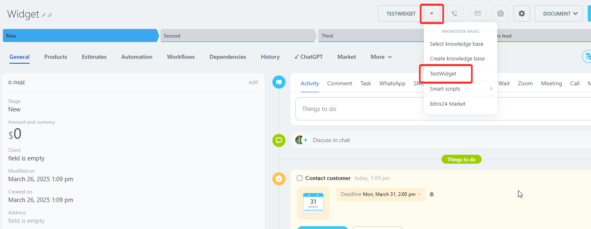

# Dropdown Menu Item of the Top Button in the CRM_XXX_DETAIL_TOOLBAR, CRM_DYNAMIC_XXX_DETAIL_TOOLBAR

> Scope: [`crm`](../../scopes/permissions.md)

You can add your dropdown menu item to the top button of CRM object cards: [leads](../../crm/leads/index.md), [contacts](../../crm/contacts/index.md), [companies](../../crm/companies/index.md), [deals](../../crm/deals/index.md), [estimates](../../crm/quote/index.md), [new invoices](../../crm/universal/invoice.md), [custom object types](../../crm/universal/index.md).



The specific widget placement code is specified in the `PLACEMENT` parameter of the [placement.bind](../placement-bind.md) method.



The widget will not be displayed in the interface until the application installation is complete. [Check the application installation](../../../settings/app-installation/installation-finish.md)



## Where the Widget is Embedded

#|
|| **Widget Code** | **Location** ||
|| `CRM_LEAD_DETAIL_TOOLBAR` | Dropdown menu item of the top button in the [lead](../../crm/leads/index.md) card ||
|| `CRM_DEAL_DETAIL_TOOLBAR` | Dropdown menu item of the top button in the [deal](../../crm/deals/index.md) card ||
|| `CRM_CONTACT_DETAIL_TOOLBAR` | Dropdown menu item of the top button in the [contact](../../crm/contacts/index.md) card ||
|| `CRM_COMPANY_DETAIL_TOOLBAR` | Dropdown menu item of the top button in the [company](../../crm/companies/index.md) card ||
|| `CRM_QUOTE_DETAIL_TOOLBAR` | Dropdown menu item of the top button in the [estimate](../../crm/quote/index.md) card ||
|| `CRM_SMART_INVOICE_DETAIL_TOOLBAR` | Dropdown menu item of the top button in the [invoices](../../crm/universal/invoice.md) card ||
|| `CRM_DYNAMIC_XXX_DETAIL_TOOLBAR` | Dropdown menu item of the top button in the custom CRM object type card. Instead of XXX, specify the numeric identifier of the specific [custom object type](../../crm/universal/index.md). For example, `CRM_DYNAMIC_183_DETAIL_ACTIVITY` ||
|#

## What the Handler Receives

Data is transmitted as a POST request {.b24-info}



- CRM_LEAD_DETAIL_TOOLBAR

    ```php

    Array
    (
        [DOMAIN] => xxx.bitrix24.com
        [PROTOCOL] => 1
        [LANG] => en
        [APP_SID] => 0d43bf11edd7e3c050ea8b0577eb6a87
        [AUTH_ID] => 18d3a06600631fcd00005a4b00000001f0f1077b7ce52f79713d82c4bc9960bcf4b598
        [AUTH_EXPIRES] => 3600
        [REFRESH_ID] => 0852c86600631fcd00005a4b00000001f0f107ce505dcd9306e0eb55ad77df1d2b2f16
        [member_id] => da45a03b265edd8787f8a258d793cc5d
        [status] => L
        [PLACEMENT] => CRM_LEAD_DETAIL_TOOLBAR
        [PLACEMENT_OPTIONS] => {"ID":"6591"}
    )

    ```

- CRM_DEAL_DETAIL_TOOLBAR

    ```php

    Array
    (
        [DOMAIN] => xxx.bitrix24.com
        [PROTOCOL] => 1
        [LANG] => en
        [APP_SID] => 88fe421c3ce39985adb9d220cc965e61
        [AUTH_ID] => 31d3a06600631fcd00005a4b00000001f0f10791c1fc87943e62dc8a28210b56b2af87
        [AUTH_EXPIRES] => 3600
        [REFRESH_ID] => 2152c86600631fcd00005a4b00000001f0f10780aada857e86212d3a73281c74525ccd
        [member_id] => da45a03b265edd8787f8a258d793cc5d
        [status] => L
        [PLACEMENT] => CRM_DEAL_DETAIL_TOOLBAR
        [PLACEMENT_OPTIONS] => {"ID":"3473"}
    )

    ```

- CRM_CONTACT_DETAIL_TOOLBAR

    ```php

    Array
    (
        [DOMAIN] => xxx.bitrix24.com
        [PROTOCOL] => 1
        [LANG] => en
        [APP_SID] => 8bc3acce3a150e11f48469e4a37384af
        [AUTH_ID] => 44d3a06600631fcd00005a4b00000001f0f10784af91cb9aeebddf2b1822776d4e7a9e
        [AUTH_EXPIRES] => 3600
        [REFRESH_ID] => 3452c86600631fcd00005a4b00000001f0f1078f707dfdc8c4b9830929c565294f37b0
        [member_id] => da45a03b265edd8787f8a258d793cc5d
        [status] => L
        [PLACEMENT] => CRM_CONTACT_DETAIL_TOOLBAR
        [PLACEMENT_OPTIONS] => {"ID":"13037"}
    )

    ```

- CRM_COMPANY_DETAIL_TOOLBAR

    ```php

    Array
    (
        [DOMAIN] => xxx.bitrix24.com
        [PROTOCOL] => 1
        [LANG] => en
        [APP_SID] => 75ca32f216adb32ca5a16c928d9a6fd2
        [AUTH_ID] => 5bd3a06600631fcd00005a4b00000001f0f107b39291622bfbbc6a0c75eeadb4ef65ea
        [AUTH_EXPIRES] => 3600
        [REFRESH_ID] => 4b52c86600631fcd00005a4b00000001f0f107ac1cfa783b59df28b087eead8d49b869
        [member_id] => da45a03b265edd8787f8a258d793cc5d
        [status] => L
        [PLACEMENT] => CRM_COMPANY_DETAIL_TOOLBAR
        [PLACEMENT_OPTIONS] => {"ID":"2946"}
    )
        
    ```

- CRM_QUOTE_DETAIL_TOOLBAR

    ```php

    Array
    (
        [DOMAIN] => xxx.bitrix24.com
        [PROTOCOL] => 1
        [LANG] => en
        [APP_SID] => 7c10e9dd04fc0ee9a2ca4981b708f322
        [AUTH_ID] => 85d3a06600631fcd00005a4b00000001f0f107f1285d38d8f287a126f7fd9d42ab87fb
        [AUTH_EXPIRES] => 3600
        [REFRESH_ID] => 7552c86600631fcd00005a4b00000001f0f1072f206ef3499d9fb87f5d9a575a78186a
        [member_id] => da45a03b265edd8787f8a258d793cc5d
        [status] => L
        [PLACEMENT] => CRM_QUOTE_DETAIL_TOOLBAR
        [PLACEMENT_OPTIONS] => {"ENTITY_ID":"5"}
    )
    
    ```

- CRM_SMART_INVOICE_DETAIL_TOOLBAR

    ```php

    Array
    (
        [DOMAIN] => xxx.bitrix24.com
        [PROTOCOL] => 1
        [LANG] => en
        [APP_SID] => 0913971fc9a85afea6263cc6dcff04bd
        [AUTH_ID] => 9fc7ca670076a4b8006f518000000001201c07e51994c33447f80190049359e6d29a0c
        [AUTH_EXPIRES] => 3600
        [REFRESH_ID] => 8f46f2670076a4b8006f518000000001201c078f877b9e542e35eeeca4c284d2fd976a
        [member_id] => e8857f161a1a8288f312b6cc6ad67995
        [status] => L
        [PLACEMENT] => CRM_SMART_INVOICE_DETAIL_TOOLBAR
        [PLACEMENT_OPTIONS] => {"ENTITY_ID":"32"}
    )
    
    ```

- CRM_DYNAMIC_XXX_DETAIL_TOOLBAR

    ```php

    Array
    (
        [DOMAIN] => xxx.bitrix24.com
        [PROTOCOL] => 1
        [LANG] => en
        [APP_SID] => 220448997c6d7f606bd25c1c1896456e
        [AUTH_ID] => 9ed3a06600631fcd00005a4b00000001f0f10797d8322191958e46f791643a1f7cb06f
        [AUTH_EXPIRES] => 3600
        [REFRESH_ID] => 8e52c86600631fcd00005a4b00000001f0f10734c4bc5b1f7ad2eca54b546ef12a2bf9
        [member_id] => da45a03b265edd8787f8a258d793cc5d
        [status] => L
        [PLACEMENT] => CRM_DYNAMIC_183_DETAIL_TOOLBAR
        [PLACEMENT_OPTIONS] => {"ENTITY_ID":"3"}
    )
    
    ```







### PLACEMENT_OPTIONS

The value of `PLACEMENT_OPTIONS` is a JSON string containing an array of one or more keys.



#|
|| **Parameter** | **Description** ||
|| **ID*** or **ENTITY_ID***
[`string`](../../data-types.md) | Identifier of the CRM object for which the widget was opened.

It can be used to retrieve additional information using the corresponding methods:

- any object type [crm.item.get](../../crm/universal/crm-item-get.md) specifying entityTypeId = '1' for leads, '2' for deals, and [etc.](../../crm/data-types.md#object_type)
- lead [crm.lead.get](../../crm/leads/crm-lead-get.md)
- deal [crm.deal.get](../../crm/deals/crm-deal-get.md)
- contact [crm.contact.get](../../crm/contacts/crm-contact-get.md)
- company [crm.company.get](../../crm/companies/crm-company-get.md)
- estimate [crm.quote.get](../../crm/quote/crm-quote-get.md)

In the case of embedding the widget in a custom object, the type identifier can be obtained from the value of the `PLACEMENT` parameter. In the example above — `183`

||
|#

## Continue Learning

- [{#T}](../placement-bind.md)
- [{#T}](../ui-interaction/index.md)
- [{#T}](../ui-interaction/crm-card.md)
- [{#T}](../../../settings/interactivity/index.md)
- [{#T}](../open-application.md)
- [{#T}](../open-path.md)