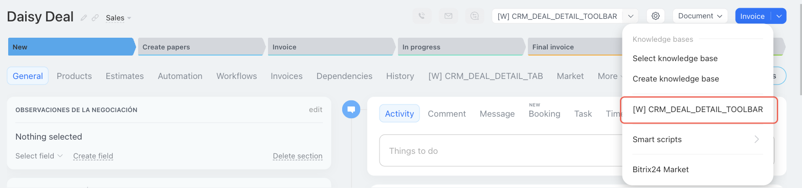

# Dropdown Menu Item for the Top Button of the CRM_XXX_DETAIL_TOOLBAR, CRM_DYNAMIC_XXX_DETAIL_TOOLBAR



If you are developing integrations for Bitrix24 using AI tools (Codex, Claude Code, Cursor), connect to the [MCP server](../../../ai-tools/mcp.md) so that the assistant can utilize the official REST documentation.



> Scope: [`placement, crm`](../../scopes/permissions.md)

The widget adds its own item to the top button menu of a CRM object card: a [lead](../../crm/leads/index.md), [contact](../../crm/contacts/index.md), [company](../../crm/companies/index.md), [deal](../../crm/deals/index.md), [estimate](../../crm/quote/index.md), [new invoice](../../crm/universal/invoice.md), or [custom object type](../../crm/universal/index.md).

The placement code is specified in the `PLACEMENT` parameter of the [placement.bind](../placement-bind.md) method.



The widget is not displayed in the interface until the application installation is complete. [Check the application installation](../../../settings/app-installation/installation-finish.md)



## Where the Widget is Embedded

#| 
|| **Placement Code** | **Location** ||
|| `CRM_LEAD_DETAIL_TOOLBAR` | Dropdown menu item for the top button of the [lead](../../crm/leads/index.md) card ||
|| `CRM_DEAL_DETAIL_TOOLBAR` | Dropdown menu item for the top button of the [deal](../../crm/deals/index.md) card ||
|| `CRM_CONTACT_DETAIL_TOOLBAR` | Dropdown menu item for the top button of the [contact](../../crm/contacts/index.md) card ||
|| `CRM_COMPANY_DETAIL_TOOLBAR` | Dropdown menu item for the top button of the [company](../../crm/companies/index.md) card ||
|| `CRM_QUOTE_DETAIL_TOOLBAR` | Dropdown menu item for the top button of the [estimate](../../crm/quote/index.md) card ||
|| `CRM_SMART_INVOICE_DETAIL_TOOLBAR` | Dropdown menu item for the top button of the [invoices](../../crm/universal/invoice.md) card ||
|| `CRM_DYNAMIC_XXX_DETAIL_TOOLBAR` | Dropdown menu item for the top button of the custom CRM object type card. Replace XXX with the numeric identifier of the specific [custom object type](../../crm/universal/index.md). For example, `CRM_DYNAMIC_183_DETAIL_TOOLBAR` ||
|#

### Where to Find It in the Interface

Open a CRM object card and expand the menu of the button in the top right corner of the card — the one to the left of the *Document* button. The application item appears in this menu, next to the knowledge base and Bitrix24 Market items.



## What the Handler Receives

Data is sent in a POST request: some parameters come in the handler URL query string, the rest in the request body {.b24-info}

The example is shown for the `CRM_DEAL_DETAIL_TOOLBAR` placement. Other codes send the same set of data: the `PLACEMENT` value and the object identifier in `PLACEMENT_OPTIONS` change.

```php

Array
(
    [DOMAIN] => xxx.bitrix24.com
    [PROTOCOL] => 1
    [LANG] => en
    [APP_SID] => cf9799131da897ead1b2579024a13be2
    [AUTH_ID] => 7c3a7166007e9c94001e30ba00000001f0f10716b4e9d02c8f735ae61d09b4f2
    [AUTH_EXPIRES] => 3600
    [REFRESH_ID] => 6b299966007e9c94001e30ba00000001f0f107a5c81f6b3d290e74fca83b5e10
    [SERVER_ENDPOINT] => https://oauth.bitrix.info/rest/
    [APPLICATION_TOKEN] => ec1b2074a9d3f5c81b6e40d27a95cf38
    [APPLICATION_SCOPE] => crm,placement
    [member_id] => d897063e1ce7c5eb9f04b9751eef5915
    [status] => L
    [PLACEMENT] => CRM_DEAL_DETAIL_TOOLBAR
    [PLACEMENT_OPTIONS] => {"ID":"8061","URI":"\/crm\/deal\/details\/8061\/?any=details%2F8061%2F"}
)

```





### PLACEMENT_OPTIONS

The `PLACEMENT_OPTIONS` value is passed as a JSON string with the call context. Along with the universal `URI` key, the context carries the object identifier.



#| 
|| **Parameter** | **Description** ||
|| **ID*** or **ENTITY_ID*** 
[`string`](../../data-types.md) | Identifier of the CRM object for which the widget was opened.

It can be used to retrieve additional information using the corresponding methods:

- any object type [crm.item.get](../../crm/universal/crm-item-get.md) with entityTypeId = '1' for leads, '2' for deals, and [etc.](../../crm/data-types.md#object_type)
- lead [crm.lead.get](../../crm/leads/crm-lead-get.md)
- deal [crm.deal.get](../../crm/deals/crm-deal-get.md)
- contact [crm.contact.get](../../crm/contacts/crm-contact-get.md)
- company [crm.company.get](../../crm/companies/crm-company-get.md)
- estimate [crm.quote.get](../../crm/quote/crm-quote-get.md)

The key name depends on the object type: for a lead, deal, contact, and company the identifier arrives in the `ID` key, and for an estimate, new invoice, and custom object type in the `ENTITY_ID` key.

The object type identifier does not arrive as a separate key. For a custom object type, take it from the `PLACEMENT` parameter value: for the `CRM_DYNAMIC_183_DETAIL_TOOLBAR` code, the type identifier is `183`

||
|#

## Code Examples





- cURL (OAuth)

    ```bash
    curl -X POST \
      -H "Content-Type: application/json" \
      -H "Accept: application/json" \
      -d '{
        "PLACEMENT": "CRM_DEAL_DETAIL_TOOLBAR",
        "HANDLER": "https://your-domain.com/widgets/crm-detail-toolbar-handler.php",
        "TITLE": "My deal card item",
        "LANG_ALL": {
          "en": {
            "TITLE": "My deal card item"
          },
          "de": {
            "TITLE": "Mein Deal-Kartenelement"
          }
        },
        "auth": "**put_access_token_here**"
      }' \
      https://**put_your_bitrix24_address**/rest/placement.bind
    ```

- JS (TS)

    ```ts
    // This snippet is an ES module: top-level await requires type="module" or a bundler.
    // $b24 is an already-initialized SDK instance (see the SDK "Get started" guide).
    import { Text } from '@bitrix24/b24jssdk'
    import type { B24Frame } from '@bitrix24/b24jssdk'

    declare const $b24: B24Frame

    try {
      const response = await $b24.actions.v2.call.make<boolean>({
        method: 'placement.bind',
        params: {
          PLACEMENT: 'CRM_DEAL_DETAIL_TOOLBAR',
          HANDLER: 'https://your-domain.com/widgets/crm-detail-toolbar-handler.php',
          TITLE: 'My deal card item',
          LANG_ALL: {
            en: {
              TITLE: 'My deal card item',
            },
            de: {
              TITLE: 'Mein Deal-Kartenelement',
            },
          },
        },
        requestId: Text.getUuidRfc4122()
      })

      // The payload is available only on a successful response
      if (!response.isSuccess) {
        console.error(response.getErrorMessages().join('; '))
      } else {
        const result = response.getData()!.result
        console.info('Placement bound successfully:', result)
      }
    } catch (error) {
      // Thrown on transport or SDK failures (AjaxError, SdkError, etc.)
      console.error(error)
    }
    ```

- JS (UMD)

    ```html
    <!-- Load the SDK (UMD build); it is exposed as the global B24Js -->
    <script src="https://unpkg.com/@bitrix24/b24jssdk@1/dist/umd/index.min.js"></script>
    <script>
      async function bindCrmDealDetailToolbar() {
        try {
          // Initialize the SDK inside a Bitrix24 frame
          const $b24 = await B24Js.initializeB24Frame()

          const response = await $b24.actions.v2.call.make({
            method: 'placement.bind',
            params: {
              PLACEMENT: 'CRM_DEAL_DETAIL_TOOLBAR',
              HANDLER: 'https://your-domain.com/widgets/crm-detail-toolbar-handler.php',
              TITLE: 'My deal card item',
              LANG_ALL: {
                en: {
                  TITLE: 'My deal card item',
                },
                de: {
                  TITLE: 'Mein Deal-Kartenelement',
                },
              },
            },
            requestId: B24Js.Text.getUuidRfc4122()
          })

          // The payload is available only on a successful response
          if (!response.isSuccess) {
            console.error(response.getErrorMessages().join('; '))
            return
          }

          const result = response.getData().result
          console.info('Placement bound successfully:', result)
        } catch (error) {
          // Thrown on transport or SDK failures (AjaxError, SdkError, etc.)
          console.error(error)
        }
      }

      document.addEventListener('DOMContentLoaded', bindCrmDealDetailToolbar)
    </script>
    ```

- PHP

    ```php
    try {
        $response = $b24Service
            ->core
            ->call(
                'placement.bind',
                [
                    'PLACEMENT' => 'CRM_DEAL_DETAIL_TOOLBAR',
                    'HANDLER' => 'https://your-domain.com/widgets/crm-detail-toolbar-handler.php',
                    'TITLE' => 'My deal card item',
                    'LANG_ALL' => [
                        'en' => [
                            'TITLE' => 'My deal card item',
                        ],
                        'de' => [
                            'TITLE' => 'Mein Deal-Kartenelement',
                        ],
                    ],
                ]
            );

        $result = $response->getResponseData()->getResult();
        if ($result->error()) {
            error_log($result->error());
        } else {
            echo 'Success: ' . print_r($result->data(), true);
        }
    } catch (Throwable $e) {
        error_log($e->getMessage());
        echo 'Error binding placement: ' . $e->getMessage();
    }
    ```

- BX24.js

    ```js
    BX24.callMethod(
        'placement.bind',
        {
            PLACEMENT: 'CRM_DEAL_DETAIL_TOOLBAR',
            HANDLER: 'https://your-domain.com/widgets/crm-detail-toolbar-handler.php',
            TITLE: 'My deal card item',
            LANG_ALL: {
                en: { TITLE: 'My deal card item' },
                de: { TITLE: 'Mein Deal-Kartenelement' }
            }
        },
        function(result) {
            if (result.error()) {
                console.error(result.error());
            } else {
                console.log(result.data());
            }
        }
    );
    ```

- PHP CRest

    ```php
    require_once('crest.php');

    $result = CRest::call(
        'placement.bind',
        [
            'PLACEMENT' => 'CRM_DEAL_DETAIL_TOOLBAR',
            'HANDLER' => 'https://your-domain.com/widgets/crm-detail-toolbar-handler.php',
            'TITLE' => 'My deal card item',
            'LANG_ALL' => [
                'en' => [
                    'TITLE' => 'My deal card item',
                ],
                'de' => [
                    'TITLE' => 'Mein Deal-Kartenelement',
                ],
            ],
        ]
    );

    echo '<PRE>';
    print_r($result);
    echo '</PRE>';
    ```

- Go

    ```go
    // client and ctx are already created — see the Go SDK section
    res, err := client.Core().Call(ctx, "placement.bind", b24.Params{
    	"PLACEMENT": "CRM_DEAL_DETAIL_TOOLBAR",
    	"HANDLER":   "https://your-domain.com/widgets/crm-detail-toolbar-handler.php",
    	"TITLE":     "My deal card item",
    	"LANG_ALL": b24.Params{
    		"ru": b24.Params{
    			"TITLE": "My deal card item",
    		},
    		"en": b24.Params{
    			"TITLE": "My deal card item",
    		},
    	},
    })
    if err != nil {
    	return fmt.Errorf("placement.bind: %w", err)
    }

    // The response arrives as json.RawMessage — unmarshal it
    // into a struct matching the response shape shown below on this page.
    fmt.Printf("%s\n", res.Result)
    ```



## Continue Your Learning

- [{#T}](./index.md)
- [{#T}](./detail-tab.md)
- [{#T}](./list-toolbar.md)
- [{#T}](../placement-bind.md)
- [{#T}](../ui-interaction/index.md)
- [{#T}](../../../settings/interactivity/index.md)
- [{#T}](../bx24-widget-methods.md)