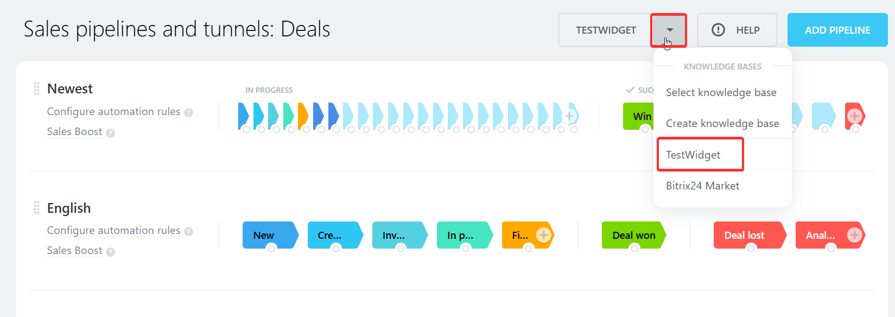

# Menu Item in Sales Funnels CRM_FUNNELS_TOOLBAR

> Scope: [`intranet`](../../scopes/permissions.md)

You can add your item to the sales funnels toolbar.



The specific widget embedding code is specified in the `PLACEMENT` parameter of the [placement.bind](../placement-bind.md) method.

## Where the widget is embedded

#| 
|| **Widget code** | **Location** ||
|| `CRM_FUNNELS_TOOLBAR` | Item in the sales funnels toolbar ||
|#

## What the handler receives

Data is sent as a POST request {.b24-info}

```php
Array
(
    [DOMAIN] => xxx.bitrix24.com
    [PROTOCOL] => 1
    [LANG] => en
    [APP_SID] => 4c8dff86744e675bbb861d69003fbbe9
    [AUTH_ID] => 574fba6600631fcd00005a4b00000001f0f107066649fd06e706777e462385fca29ac6
    [AUTH_EXPIRES] => 3600
    [REFRESH_ID] => 47cee16600631fcd00005a4b00000001f0f107f2599a4c4602cfa840b6f9765e5f30c7
    [member_id] => da45a03b265edd8787f8a258d793cc5d
    [status] => L
    [PLACEMENT] => CRM_FUNNELS_TOOLBAR
)
```





### PLACEMENT_OPTIONS

In the current widget, the `PLACEMENT_OPTIONS` parameter is not passed.

## Continue your exploration

- [{#T}](../placement-bind.md)
- [{#T}](../ui-interaction/index.md)
- [{#T}](../ui-interaction/crm-card.md)
- [{#T}](../../interactivity/index.md)
- [{#T}](../open-application.md)
- [{#T}](../open-path.md)