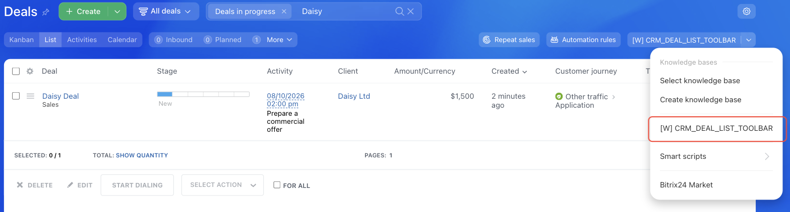

# Dropdown Menu Item Above the CRM_XXX_LIST_TOOLBAR Elements List



If you are developing integrations for Bitrix24 using AI tools (Codex, Claude Code, Cursor), connect to the [MCP server](../../../ai-tools/mcp.md) so that the assistant can utilize the official REST documentation.



> Scope: [`crm`](../../scopes/permissions.md)

The widget adds its own item to the menu above the list of CRM objects: [leads](../../crm/leads/index.md), [contacts](../../crm/contacts/index.md), [companies](../../crm/companies/index.md), [deals](../../crm/deals/index.md), [estimates](../../crm/quote/index.md), [new invoices](../../crm/universal/invoice.md), [orders](../../sale/order/index.md), and [custom object types](../../crm/universal/index.md).

The specific widget placement code is specified in the `PLACEMENT` parameter of the [placement.bind](../placement-bind.md) method.



The widget will not be displayed in the interface until the application installation is complete. [Check the application installation](../../../settings/app-installation/installation-finish.md)



## Where the Widget is Embedded

#| 
|| **Widget Code** | **Location** ||
|| `CRM_LEAD_LIST_TOOLBAR` | Dropdown menu item above the list of [leads](../../crm/leads/index.md) ||
|| `CRM_CONTACT_LIST_TOOLBAR` | Dropdown menu item above the list of [contacts](../../crm/contacts/index.md) ||
|| `CRM_COMPANY_LIST_TOOLBAR` | Dropdown menu item above the list of [companies](../../crm/companies/index.md) ||
|| `CRM_DEAL_LIST_TOOLBAR` | Dropdown menu item above the list of [deals](../../crm/deals/index.md) ||
|| `CRM_SMART_INVOICE_LIST_TOOLBAR` | Dropdown menu item above the list of [new invoices](../../crm/universal/invoice.md) ||
|| `CRM_ORDER_LIST_TOOLBAR` | Dropdown menu item above the list of [online store orders](../../sale/order/index.md) ||
|| `CRM_QUOTE_LIST_TOOLBAR` | Dropdown menu item above the list of [estimates](../../crm/quote/index.md) ||
|| `CRM_DYNAMIC_XXX_LIST_TOOLBAR` | Dropdown menu item above the list of custom CRM object type elements. Instead of XXX, specify the numeric identifier of the specific [custom object type](../../crm/universal/index.md). For example, `CRM_DYNAMIC_183_LIST_TOOLBAR` ||
|#

### Where to Find It in the Interface

Open a CRM list and click the arrow next to the button on the right side of the panel above the list. The application item appears in this menu, next to the knowledge base and Bitrix24 Market items.



## What the Handler Receives

Data is sent in a POST request: some parameters come in the handler URL query string, the rest in the request body {.b24-info}

The example is shown for the `CRM_DEAL_LIST_TOOLBAR` placement. Other codes send the same set of data: only the `PLACEMENT` value changes.

```php

Array
(
    [DOMAIN] => xxx.bitrix24.com
    [PROTOCOL] => 1
    [LANG] => en
    [APP_SID] => c75986789a2a58e22f445686334804e6
    [AUTH_ID] => 4b2e7166007e9c94001e30ba00000001f0f107c93a5f28e7b04d61ca8f3e52d7
    [AUTH_EXPIRES] => 3600
    [REFRESH_ID] => 3a1d9966007e9c94001e30ba00000001f0f107d81b3e07f6a95c40db7e2f41c6
    [SERVER_ENDPOINT] => https://oauth.bitrix.info/rest/
    [APPLICATION_TOKEN] => ec1b2074a9d3f5c81b6e40d27a95cf38
    [APPLICATION_SCOPE] => crm,placement
    [member_id] => d897063e1ce7c5eb9f04b9751eef5915
    [status] => L
    [PLACEMENT] => CRM_DEAL_LIST_TOOLBAR
    [PLACEMENT_OPTIONS] => {"URI":"\/crm\/deal\/list\/"}
)

```





### PLACEMENT_OPTIONS

The `PLACEMENT_OPTIONS` value is passed as a JSON string with the call context.

The placement has no keys of its own — the context carries only the universal `URI` key. The object identifier does not arrive as a separate parameter: the widget opens above the list, not above a specific element.

## Code Examples





- cURL (OAuth)

    ```bash
    curl -X POST \
      -H "Content-Type: application/json" \
      -H "Accept: application/json" \
      -d '{
        "PLACEMENT": "CRM_DEAL_LIST_TOOLBAR",
        "HANDLER": "https://your-domain.com/widgets/crm-list-toolbar-handler.php",
        "TITLE": "My deal list item",
        "LANG_ALL": {
          "en": {
            "TITLE": "My deal list item"
          },
          "de": {
            "TITLE": "Mein Deal-Listenelement"
          }
        },
        "auth": "**put_access_token_here**"
      }' \
      https://**put_your_bitrix24_address**/rest/placement.bind
    ```

- JS (TS)

    ```ts
    // This snippet is an ES module: top-level await requires type="module" or a bundler.
    // $b24 is an already-initialized SDK instance (see the SDK "Get started" guide).
    import { Text } from '@bitrix24/b24jssdk'
    import type { B24Frame } from '@bitrix24/b24jssdk'

    declare const $b24: B24Frame

    try {
      const response = await $b24.actions.v2.call.make<boolean>({
        method: 'placement.bind',
        params: {
          PLACEMENT: 'CRM_DEAL_LIST_TOOLBAR',
          HANDLER: 'https://your-domain.com/widgets/crm-list-toolbar-handler.php',
          TITLE: 'My deal list item',
          LANG_ALL: {
            en: {
              TITLE: 'My deal list item',
            },
            de: {
              TITLE: 'Mein Deal-Listenelement',
            },
          },
        },
        requestId: Text.getUuidRfc4122()
      })

      // The payload is available only on a successful response
      if (!response.isSuccess) {
        console.error(response.getErrorMessages().join('; '))
      } else {
        const result = response.getData()!.result
        console.info('Placement bound successfully:', result)
      }
    } catch (error) {
      // Thrown on transport or SDK failures (AjaxError, SdkError, etc.)
      console.error(error)
    }
    ```

- JS (UMD)

    ```html
    <!-- Load the SDK (UMD build); it is exposed as the global B24Js -->
    <script src="https://unpkg.com/@bitrix24/b24jssdk@1/dist/umd/index.min.js"></script>
    <script>
      async function bindCrmDealListToolbar() {
        try {
          // Initialize the SDK inside a Bitrix24 frame
          const $b24 = await B24Js.initializeB24Frame()

          const response = await $b24.actions.v2.call.make({
            method: 'placement.bind',
            params: {
              PLACEMENT: 'CRM_DEAL_LIST_TOOLBAR',
              HANDLER: 'https://your-domain.com/widgets/crm-list-toolbar-handler.php',
              TITLE: 'My deal list item',
              LANG_ALL: {
                en: {
                  TITLE: 'My deal list item',
                },
                de: {
                  TITLE: 'Mein Deal-Listenelement',
                },
              },
            },
            requestId: B24Js.Text.getUuidRfc4122()
          })

          // The payload is available only on a successful response
          if (!response.isSuccess) {
            console.error(response.getErrorMessages().join('; '))
            return
          }

          const result = response.getData().result
          console.info('Placement bound successfully:', result)
        } catch (error) {
          // Thrown on transport or SDK failures (AjaxError, SdkError, etc.)
          console.error(error)
        }
      }

      document.addEventListener('DOMContentLoaded', bindCrmDealListToolbar)
    </script>
    ```

- PHP

    ```php
    try {
        $response = $b24Service
            ->core
            ->call(
                'placement.bind',
                [
                    'PLACEMENT' => 'CRM_DEAL_LIST_TOOLBAR',
                    'HANDLER' => 'https://your-domain.com/widgets/crm-list-toolbar-handler.php',
                    'TITLE' => 'My deal list item',
                    'LANG_ALL' => [
                        'en' => [
                            'TITLE' => 'My deal list item',
                        ],
                        'de' => [
                            'TITLE' => 'Mein Deal-Listenelement',
                        ],
                    ],
                ]
            );

        $result = $response->getResponseData()->getResult();
        if ($result->error()) {
            error_log($result->error());
        } else {
            echo 'Success: ' . print_r($result->data(), true);
        }
    } catch (Throwable $e) {
        error_log($e->getMessage());
        echo 'Error binding placement: ' . $e->getMessage();
    }
    ```

- BX24.js

    ```js
    BX24.callMethod(
        'placement.bind',
        {
            PLACEMENT: 'CRM_DEAL_LIST_TOOLBAR',
            HANDLER: 'https://your-domain.com/widgets/crm-list-toolbar-handler.php',
            TITLE: 'My deal list item',
            LANG_ALL: {
                en: { TITLE: 'My deal list item' },
                de: { TITLE: 'Mein Deal-Listenelement' }
            }
        },
        function(result) {
            if (result.error()) {
                console.error(result.error());
            } else {
                console.log(result.data());
            }
        }
    );
    ```

- PHP CRest

    ```php
    require_once('crest.php');

    $result = CRest::call(
        'placement.bind',
        [
            'PLACEMENT' => 'CRM_DEAL_LIST_TOOLBAR',
            'HANDLER' => 'https://your-domain.com/widgets/crm-list-toolbar-handler.php',
            'TITLE' => 'My deal list item',
            'LANG_ALL' => [
                'en' => [
                    'TITLE' => 'My deal list item',
                ],
                'de' => [
                    'TITLE' => 'Mein Deal-Listenelement',
                ],
            ],
        ]
    );

    echo '<PRE>';
    print_r($result);
    echo '</PRE>';
    ```



## Continue Learning

- [{#T}](./index.md)
- [{#T}](./list-menu.md)
- [{#T}](./detail-toolbar.md)
- [{#T}](../placement-bind.md)
- [{#T}](../ui-interaction/index.md)
- [{#T}](../../../settings/interactivity/index.md)
- [{#T}](../bx24-widget-methods.md)