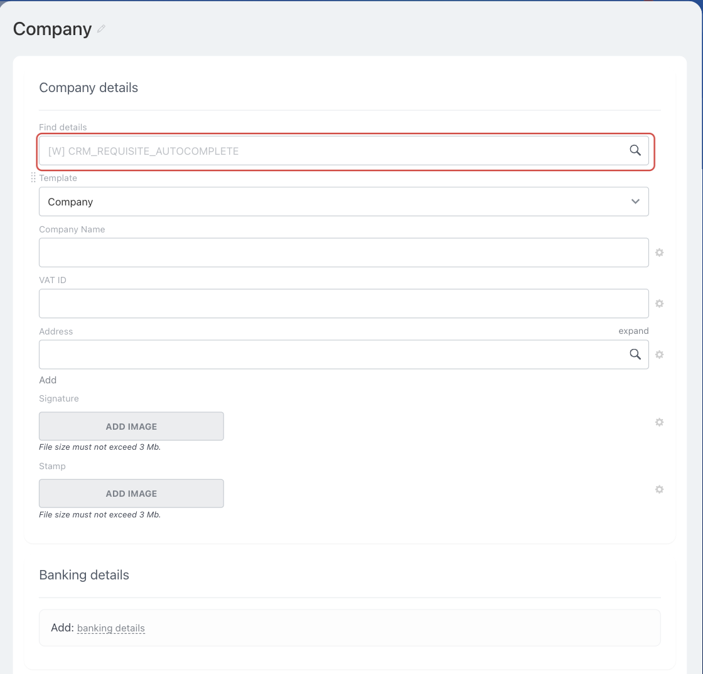

# Client Details Autofill in the CRM Card CRM_REQUISITE_AUTOCOMPLETE



If you are developing integrations for Bitrix24 using AI tools (Codex, Claude Code, Cursor), connect to the [MCP server](../../../../ai-tools/mcp.md) so that the assistant can utilize the official REST documentation.



> Scope: [`placement, crm`](../../../scopes/permissions.md)

The `CRM_REQUISITE_AUTOCOMPLETE` point connects an application handler to the search for client details in a CRM card. It is required when an application searches for and populates Company details for a company or contact from an external source.

The embedding point code is passed in the `PLACEMENT` parameter of the [placement.bind](../../placement-bind.md) method.

The general workflow is described in the [Autofilling details in the CRM card](./index.md) overview.



The handler will not be available in the search source selection interface until the application installation is complete. [Check the application installation](../../../../settings/app-installation/installation-finish.md)



## Where the Widget Is Embedded

#|
|| **Embedding Point Code** | **Location** ||
|| `CRM_REQUISITE_AUTOCOMPLETE` | Search source in the *Details* field of a company or contact card ||
|#

### Where to Find It in the Interface

Open a company or contact card and go to the *Details* field. The handler is connected to the search in this field.

If only one search source is available, its name is shown as a hint inside the field. If there are several sources, they are offered in a list below the field as you type a query. The application handler appears in this list under the name from the `TITLE` parameter.



## What the Handler Receives

Data is sent in a POST request: some parameters come in the handler URL query string, the rest in the request body {.b24-info}

```php
Array
(
    [DOMAIN] => xxx.bitrix24.com
    [PROTOCOL] => 1
    [LANG] => en
    [APP_SID] => 8b3f2c5d9c1a4f6e9d7a2b4c6f8e1a3d
    [AUTH_ID] => 1f0f107e5806d5fe9a98e02021a72e57645f86a
    [AUTH_EXPIRES] => 3600
    [REFRESH_ID] => 1f0f107a80816604b24a8719792ac2a21d629b5
    [SERVER_ENDPOINT] => https://oauth.bitrix.info/rest/
    [APPLICATION_TOKEN] => ec1b2074a9d3f5c81b6e40d27a95cf38
    [APPLICATION_SCOPE] => crm,placement
    [member_id] => da45a03b265edd8787f8a258d793cc5d
    [status] => L
    [PLACEMENT] => CRM_REQUISITE_AUTOCOMPLETE
    [PLACEMENT_OPTIONS] => {"searchQuery":"Daisy","URI":"\/crm\/company\/details\/7\/?any=details%2F7%2F&IFRAME=Y&IFRAME_TYPE=SIDE_SLIDER"}
)
```

After parsing, the `PLACEMENT_OPTIONS` string from this example looks like this:

```json
{
    "searchQuery": "Daisy",
    "URI": "/crm/company/details/7/?any=details%2F7%2F&IFRAME=Y&IFRAME_TYPE=SIDE_SLIDER"
}
```



### PLACEMENT_OPTIONS

The value of `PLACEMENT_OPTIONS` is passed as a JSON string with the context of the call. Along with the universal `URI` key, the context carries the key of the placement itself.



#|
|| **Parameter** | **Description** ||
|| **searchQuery***
[`string`](../../../data-types.md) | The string that the user entered in the details search field ||
|#

## OPTIONS When Registering via placement.bind

The placement supports the `OPTIONS` parameter of the [placement.bind](../../placement-bind.md) method. It restricts the list of countries the handler works for and is not included in the data that Bitrix24 passes to the handler during a search.

#|
|| **Parameter**
`type` | **Description** ||
|| **countries**
[`string`](../../../data-types.md) | Country identifiers separated by commas without spaces. If the parameter is not passed, the handler is available to all countries for which the search field is open.

Country identifiers can be obtained via the [crm.requisite.preset.countries](../../../crm/requisites/presets/crm-requisite-preset-countries.md) ||
|#

## How to Return Found Options

Pass the found options using the [BX24.placement.call](../../ui-interaction/bx24-placement-call.md) command with the name `crmShowFoundEntities`.

#|
|| **Field**
[`type`](../../../data-types.md) | **Description** ||
|| **data**
[`array`](../../../data-types.md) | List of found options ||
|| **data[].id**
[`string`](../../../data-types.md) | Option identifier on the application side ||
|| **data[].name**
[`string`](../../../data-types.md) | Option name that will be shown to the user ||
|| **data[].phone**
[`string`](../../../data-types.md) | Option phone. Pass the field if the number is found ||
|| **data[].email**
[`string`](../../../data-types.md) | Option E-mail. Pass the field if the address is found ||
|| **data[].web**
[`string`](../../../data-types.md) | Option website. Pass the field if the website is found ||
|#

```javascript
BX24.placement.call(
    'crmShowFoundEntities',
    {
        data: [
            {
                id: 'company-123',
                name: 'Acme LLC',
                phone: '+49 30 000-00-00',
                email: 'info@example.com',
                web: 'https://example.com'
            }
        ]
    }
);
```

## How to Fill the Selected Option Into the Card

If a user selects an option from the application response, Bitrix24 triggers the `onCrmEntityIsNeedToCreate` interface event. Subscribe to it using the [BX24.placement.bindEvent](../../ui-interaction/bx24-placement-bind-event.md) method.

The data of the selected option is passed to the `onCrmEntityIsNeedToCreate` event handler.

#|
|| **Field**
[`type`](../../../data-types.md) | **Description** ||
|| **appSid**
[`string`](../../../data-types.md) | Application session identifier in which the selected option was found ||
|| **data**
[`object`](../../../data-types.md) | Data of the selected option from the list that the application passed via `crmShowFoundEntities` ||
|#

In the `fields` object, pass the detail fields that should be populated in the CRM card. The composition of the object depends on the data that the application retrieved from its source.

```javascript
BX24.placement.bindEvent('onCrmEntityIsNeedToCreate', function (eventData) {
    const selected = eventData.data;
    const selectedTitle = selected.title || selected.name;

    BX24.placement.call(
        'crmShowCreatedEntity',
        {
            entityType: 'company',
            id: selected.id,
            title: selectedTitle,
            fields: {
                RQ_COMPANY_NAME: selectedTitle
            }
        }
    );
});
```

Fields of the `crmShowCreatedEntity` command:

#|
|| **Field**
[`type`](../../../data-types.md) | **Description** ||
|| **entityType**
[`string`](../../../data-types.md) | Created object type. For a company, pass `company`, for a contact — `contact` ||
|| **id**
[`string`](../../../data-types.md) | Created object identifier on the application side ||
|| **title**
[`string`](../../../data-types.md) | Created object name ||
|| **fields**
[`object`](../../../data-types.md) | Requisite fields to be inserted into the CRM card ||
|#

## Code Examples





- cURL (OAuth)

    ```bash
    curl -X POST \
      -H "Content-Type: application/json" \
      -H "Accept: application/json" \
      -d '{
        "PLACEMENT": "CRM_REQUISITE_AUTOCOMPLETE",
        "HANDLER": "https://your-domain.com/widgets/crm-requisite-autocomplete-handler.php",
        "TITLE": "Requisite search",
        "LANG_ALL": {
          "de": {
            "TITLE": "Requisite search"
          },
          "en": {
            "TITLE": "Requisite search"
          }
        },
        "OPTIONS": {
          "countries": "1,14"
        },
        "auth": "**put_access_token_here**"
      }' \
      https://**put_your_bitrix24_address**/rest/placement.bind
    ```

- JS (TS)

    ```ts
    // This snippet is an ES module: top-level await requires type="module" or a bundler.
    // $b24 is an already-initialized SDK instance (see the SDK "Get started" guide).
    import { Text } from '@bitrix24/b24jssdk'
    import type { B24Frame } from '@bitrix24/b24jssdk'

    declare const $b24: B24Frame

    try {
      const response = await $b24.actions.v2.call.make<boolean>({
        method: 'placement.bind',
        params: {
          PLACEMENT: 'CRM_REQUISITE_AUTOCOMPLETE',
          HANDLER: 'https://your-domain.com/widgets/crm-requisite-autocomplete-handler.php',
          TITLE: 'Requisite search',
          LANG_ALL: {
            de: {
              TITLE: 'Requisite search',
            },
            en: {
              TITLE: 'Requisite search',
            },
          },
          OPTIONS: {
            countries: '1,14',
          },
        },
        requestId: Text.getUuidRfc4122()
      })

      // The payload is available only on a successful response
      if (!response.isSuccess) {
        console.error(response.getErrorMessages().join('; '))
      } else {
        const result = response.getData()!.result
        console.info('Placement bound successfully:', result)
      }
    } catch (error) {
      // Thrown on transport or SDK failures (AjaxError, SdkError, etc.)
      console.error(error)
    }
    ```

- JS (UMD)

    ```html
    <!-- Load the SDK (UMD build); it is exposed as the global B24Js -->
    <script src="https://unpkg.com/@bitrix24/b24jssdk@1/dist/umd/index.min.js"></script>
    <script>
      async function bindCrmRequisiteAutocomplete() {
        try {
          // Initialize the SDK inside a Bitrix24 frame
          const $b24 = await B24Js.initializeB24Frame()

          const response = await $b24.actions.v2.call.make({
            method: 'placement.bind',
            params: {
              PLACEMENT: 'CRM_REQUISITE_AUTOCOMPLETE',
              HANDLER: 'https://your-domain.com/widgets/crm-requisite-autocomplete-handler.php',
              TITLE: 'Requisite search',
              LANG_ALL: {
                de: {
                  TITLE: 'Requisite search',
                },
                en: {
                  TITLE: 'Requisite search',
                },
              },
              OPTIONS: {
                countries: '1,14',
              },
            },
            requestId: B24Js.Text.getUuidRfc4122()
          })

          // The payload is available only on a successful response
          if (!response.isSuccess) {
            console.error(response.getErrorMessages().join('; '))
            return
          }

          const result = response.getData().result
          console.info('Placement bound successfully:', result)
        } catch (error) {
          // Thrown on transport or SDK failures (AjaxError, SdkError, etc.)
          console.error(error)
        }
      }

      document.addEventListener('DOMContentLoaded', bindCrmRequisiteAutocomplete)
    </script>
    ```

- PHP

    ```php
    try {
        $response = $b24Service
            ->core
            ->call(
                'placement.bind',
                [
                    'PLACEMENT' => 'CRM_REQUISITE_AUTOCOMPLETE',
                    'HANDLER' => 'https://your-domain.com/widgets/crm-requisite-autocomplete-handler.php',
                    'TITLE' => 'Requisite search',
                    'LANG_ALL' => [
                        'de' => [
                            'TITLE' => 'Requisite search',
                        ],
                        'en' => [
                            'TITLE' => 'Requisite search',
                        ],
                    ],
                    'OPTIONS' => [
                        'countries' => '1,14',
                    ],
                ]
            );

        $result = $response->getResponseData()->getResult();
        if ($result->error()) {
            error_log($result->error());
        } else {
            echo 'Success: ' . print_r($result->data(), true);
        }
    } catch (Throwable $e) {
        error_log($e->getMessage());
        echo 'Error binding placement: ' . $e->getMessage();
    }
    ```

- BX24.js

    ```js
    BX24.callMethod(
        'placement.bind',
        {
            PLACEMENT: 'CRM_REQUISITE_AUTOCOMPLETE',
            HANDLER: 'https://your-domain.com/widgets/crm-requisite-autocomplete-handler.php',
            TITLE: 'Requisite search',
            LANG_ALL: {
                de: { TITLE: 'Requisite search' },
                en: { TITLE: 'Requisite search' }
            },
            OPTIONS: {
                countries: '1,14'
            }
        },
        function(result) {
            if (result.error()) {
                console.error(result.error());
            } else {
                console.log(result.data());
            }
        }
    );
    ```

- PHP CRest

    ```php
    require_once('crest.php');

    $result = CRest::call(
        'placement.bind',
        [
            'PLACEMENT' => 'CRM_REQUISITE_AUTOCOMPLETE',
            'HANDLER' => 'https://your-domain.com/widgets/crm-requisite-autocomplete-handler.php',
            'TITLE' => 'Requisite search',
            'LANG_ALL' => [
                'de' => [
                    'TITLE' => 'Requisite search',
                ],
                'en' => [
                    'TITLE' => 'Requisite search',
                ],
            ],
            'OPTIONS' => [
                'countries' => '1,14',
            ],
        ]
    );

    echo '<PRE>';
    print_r($result);
    echo '</PRE>';
    ```

- Go

    ```go
    // client and ctx are already created — see the Go SDK section
    res, err := client.Core().Call(ctx, "placement.bind", b24.Params{
    	"PLACEMENT": "CRM_REQUISITE_AUTOCOMPLETE",
    	"HANDLER":   "https://your-domain.com/widgets/crm-requisite-autocomplete-handler.php",
    	"TITLE":     "Requisite search",
    	"LANG_ALL": b24.Params{
    		"de": b24.Params{
    			"TITLE": "Requisite search",
    		},
    		"en": b24.Params{
    			"TITLE": "Requisite search",
    		},
    	},
    	"OPTIONS": b24.Params{
    		"countries": "1,14",
    	},
    })
    if err != nil {
    	return fmt.Errorf("placement.bind: %w", err)
    }

    // The response arrives as json.RawMessage — unmarshal it into the response
    // shape of the placement.bind method, see "Response Handling" on its page.
    fmt.Printf("%s\n", res.Result)
    ```



## Common Mistakes

#|
|| **Mistake** | **Solution** ||
|| `placement.bind` returns `WRONG_AUTH_TYPE` with the description `Application context required` | Register the placement on behalf of an application. A placement cannot be bound with a webhook ||
|| The handler is registered but does not appear in the list of search sources | Complete the [application installation](../../../../settings/app-installation/installation-finish.md) and check that the `CRM_REQUISITE_AUTOCOMPLETE` code is passed in `PLACEMENT` ||
|| The handler is unavailable for the required country | Check the value of `OPTIONS[countries]`. The string must contain country identifiers separated by commas without spaces ||
|| The handler is not called while the user is typing the query | Bitrix24 calls the external search when the search string contains at least three characters ||
|| The handler does not find the search string in the request body | `searchQuery` arrives inside `PLACEMENT_OPTIONS` as a separate JSON string, not as a separate parameter ||
|| Found options are not displayed | Pass the array of options to the `data` field of the `crmShowFoundEntities` command ||
|| The option is not filled into the card after selection | Subscribe to `onCrmEntityIsNeedToCreate` and call `crmShowCreatedEntity` after creating the object ||
|#

Other registration error codes are listed in the "Possible Error Codes" section of the [placement.bind](../../placement-bind.md) page.

## Continue Learning

- [{#T}](./index.md)
- [{#T}](./bank-detail-autocomplete.md)
- [{#T}](../../placement-bind.md)
- [{#T}](../../ui-interaction/index.md)
- [{#T}](../../bx24-widget-methods.md)
- [{#T}](../../../crm/requisites/index.md)
