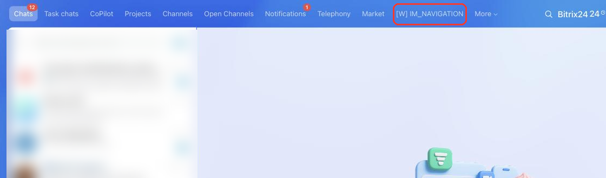

# Messenger Navigation Item IM_NAVIGATION



If you are developing integrations for Bitrix24 using AI tools (Codex, Claude Code, Cursor), connect to the [MCP server](../../../ai-tools/mcp.md) so that the assistant can utilize the official REST documentation.



> Scope: [`placement, im`](../../scopes/permissions.md)

The widget adds its own item to the messenger navigation menu — to the same row that holds *Chats*, *Channels*, and *Market*. When the item is clicked, the application opens in the entire working area of the messenger, instead of the chat list and the conversation.

The placement suits applications that work with the messenger as a whole rather than with a particular chat or message: conversation summaries, reports, custom dialog lists.

The placement code is specified in the `PLACEMENT` parameter of the [placement.bind](../placement-bind.md) method.



The widget is not displayed in the interface until the application installation is complete. [Check the application installation](../../../settings/app-installation/installation-finish.md)



## Where the widget is embedded

#|
|| **Placement Code** | **Location** ||
|| `IM_NAVIGATION` | Item in the messenger navigation menu ||
|#

### Where it is located in the interface

Open the messenger and look at the row of navigation items at the top of the screen. The application item appears in this row with the name from the `TITLE` parameter.

If there are more items than fit into the row, some of them move under the *More* button. The application item is added last, so most often it ends up there.



## What the handler receives

Data is sent in a POST request: some parameters come in the handler URL query string, the rest in the request body {.b24-info}

```php

Array
(
    [DOMAIN] => xxx.bitrix24.com
    [PROTOCOL] => 1
    [LANG] => en
    [APP_SID] => c14d1f3266fe7ba3cd098e2d04dccda3
    [AUTH_ID] => 83fd7166007e9c94001e30ba00000001f0f107a52e6ad7ef9a1b8c3d5e2f4061
    [AUTH_EXPIRES] => 3600
    [REFRESH_ID] => 737c9966007e9c94001e30ba00000001f0f1072b8d4e6f01a3c57d9e8b2f4160
    [SERVER_ENDPOINT] => https://oauth.bitrix.info/rest/
    [APPLICATION_TOKEN] => ec1b2074a9d3f5c81b6e40d27a95cf38
    [APPLICATION_SCOPE] => im,placement
    [member_id] => d897063e1ce7c5eb9f04b9751eef5915
    [status] => L
    [PLACEMENT] => IM_NAVIGATION
    [PLACEMENT_OPTIONS] => {"URI":"\/online\/"}
)

```





### PLACEMENT_OPTIONS

The `PLACEMENT_OPTIONS` value is passed as a JSON string with the call context. The placement has no keys of its own: the widget is opened for the messenger as a whole, not for a particular chat. Only the universal `URI` key with the address of the messenger page arrives in the context.

If the application needs a chat identifier, use the placements that are called from the chat itself: [IM_SIDEBAR](./sidebar.md), [IM_TEXTAREA](./textarea.md), or [IM_CONTEXT_MENU](./context-menu.md).

## OPTIONS when registering via placement.bind

For `IM_NAVIGATION`, the `placement.bind` method supports the `OPTIONS` parameters.



#|
|| **Parameter** `type` | **Description** ||
|| **iconName*** [`string`](../../data-types.md) | Name of a Font Awesome 4 icon, for example `fa-rocket`. Bitrix24 adds the `fa` set class itself. Up to 50 characters, the value must contain Latin letters, a space, or `-`.

The parameter is required: without it, `placement.bind` returns the `ERROR_ARGUMENT` error. In the current messenger interface the navigation item is rendered as text, while the icon is used in the other placements of the section
||
|| **extranet** [`string`](../../data-types.md) | Access in the extranet, default is `N`.

Possible values:
- `N` — application is not available for extranet users
- `Y` — application is available for extranet users
||
|| **role** [`string`](../../data-types.md) | User role, default is `USER`.

Possible values:
- `USER` — application is available to all users
- `ADMIN` — application is available only to portal administrators
||
|#

The `context` parameter, which limits the display by chat type, does not apply to this placement: the navigation item is not bound to a chat.

### Code Examples





- cURL (OAuth)

    ```bash
    curl -X POST \
      -H "Content-Type: application/json" \
      -H "Accept: application/json" \
      -d '{
        "PLACEMENT": "IM_NAVIGATION",
        "HANDLER": "https://your-domain.com/widgets/im-navigation-handler.php",
        "TITLE": "My section",
        "LANG_ALL": {
          "en": {
            "TITLE": "My section"
          },
          "de": {
            "TITLE": "Mein Bereich"
          }
        },
        "OPTIONS": {
          "iconName": "fa-rocket",
          "role": "USER",
          "extranet": "N"
        },
        "auth": "**put_access_token_here**"
      }' \
      https://**put_your_bitrix24_address**/rest/placement.bind
    ```

- JS (TS)

    ```ts
    // This snippet is an ES module: top-level await requires type="module" or a bundler.
    // $b24 is an already-initialized SDK instance (see the SDK "Get started" guide).
    import { Text } from '@bitrix24/b24jssdk'
    import type { B24Frame } from '@bitrix24/b24jssdk'

    declare const $b24: B24Frame

    try {
      const response = await $b24.actions.v2.call.make<boolean>({
        method: 'placement.bind',
        params: {
          PLACEMENT: 'IM_NAVIGATION',
          HANDLER: 'https://your-domain.com/widgets/im-navigation-handler.php',
          TITLE: 'My section',
          LANG_ALL: {
            en: {
              TITLE: 'My section',
            },
            de: {
              TITLE: 'Mein Bereich',
            },
          },
          OPTIONS: {
            iconName: 'fa-rocket',
            role: 'USER',
            extranet: 'N',
          },
        },
        requestId: Text.getUuidRfc4122()
      })

      // The payload is available only on a successful response
      if (!response.isSuccess) {
        console.error(response.getErrorMessages().join('; '))
      } else {
        const result = response.getData()!.result
        console.info('Placement bound successfully:', result)
      }
    } catch (error) {
      // Thrown on transport or SDK failures (AjaxError, SdkError, etc.)
      console.error(error)
    }
    ```

- JS (UMD)

    ```html
    <!-- Load the SDK (UMD build); it is exposed as the global B24Js -->
    <script src="https://unpkg.com/@bitrix24/b24jssdk@1/dist/umd/index.min.js"></script>
    <script>
      async function bindImNavigation() {
        try {
          // Initialize the SDK inside a Bitrix24 frame
          const $b24 = await B24Js.initializeB24Frame()

          const response = await $b24.actions.v2.call.make({
            method: 'placement.bind',
            params: {
              PLACEMENT: 'IM_NAVIGATION',
              HANDLER: 'https://your-domain.com/widgets/im-navigation-handler.php',
              TITLE: 'My section',
              LANG_ALL: {
                en: {
                  TITLE: 'My section',
                },
                de: {
                  TITLE: 'Mein Bereich',
                },
              },
              OPTIONS: {
                iconName: 'fa-rocket',
                role: 'USER',
                extranet: 'N',
              },
            },
            requestId: B24Js.Text.getUuidRfc4122()
          })

          // The payload is available only on a successful response
          if (!response.isSuccess) {
            console.error(response.getErrorMessages().join('; '))
            return
          }

          const result = response.getData().result
          console.info('Placement bound successfully:', result)
        } catch (error) {
          // Thrown on transport or SDK failures (AjaxError, SdkError, etc.)
          console.error(error)
        }
      }

      document.addEventListener('DOMContentLoaded', bindImNavigation)
    </script>
    ```

- PHP

    ```php
    try {
        $response = $b24Service
            ->core
            ->call(
                'placement.bind',
                [
                    'PLACEMENT' => 'IM_NAVIGATION',
                    'HANDLER' => 'https://your-domain.com/widgets/im-navigation-handler.php',
                    'TITLE' => 'My section',
                    'LANG_ALL' => [
                        'en' => [
                            'TITLE' => 'My section',
                        ],
                        'de' => [
                            'TITLE' => 'Mein Bereich',
                        ],
                    ],
                    'OPTIONS' => [
                        'iconName' => 'fa-rocket',
                        'role' => 'USER',
                        'extranet' => 'N',
                    ],
                ]
            );

        $result = $response->getResponseData()->getResult();
        if ($result->error()) {
            error_log($result->error());
        } else {
            echo 'Success: ' . print_r($result->data(), true);
        }
    } catch (Throwable $e) {
        error_log($e->getMessage());
        echo 'Error binding placement: ' . $e->getMessage();
    }
    ```

- BX24.js

    ```js
    BX24.callMethod(
        'placement.bind',
        {
            PLACEMENT: 'IM_NAVIGATION',
            HANDLER: 'https://your-domain.com/widgets/im-navigation-handler.php',
            TITLE: 'My section',
            LANG_ALL: {
                en: { TITLE: 'My section' },
                de: { TITLE: 'Mein Bereich' }
            },
            OPTIONS: {
                iconName: 'fa-rocket',
                role: 'USER',
                extranet: 'N'
            }
        },
        function(result) {
            if (result.error()) {
                console.error(result.error());
            } else {
                console.log(result.data());
            }
        }
    );
    ```

- PHP CRest

    ```php
    require_once('crest.php');

    $result = CRest::call(
        'placement.bind',
        [
            'PLACEMENT' => 'IM_NAVIGATION',
            'HANDLER' => 'https://your-domain.com/widgets/im-navigation-handler.php',
            'TITLE' => 'My section',
            'LANG_ALL' => [
                'en' => [
                    'TITLE' => 'My section',
                ],
                'de' => [
                    'TITLE' => 'Mein Bereich',
                ],
            ],
            'OPTIONS' => [
                'iconName' => 'fa-rocket',
                'role' => 'USER',
                'extranet' => 'N',
            ],
        ]
    );

    echo '<PRE>';
    print_r($result);
    echo '</PRE>';
    ```

- Go

    ```go
    // client and ctx are already created — see the Go SDK section
    res, err := client.Core().Call(ctx, "placement.bind", b24.Params{
    	"PLACEMENT": "IM_NAVIGATION",
    	"HANDLER":   "https://your-domain.com/widgets/im-navigation-handler.php",
    	"TITLE":     "My section",
    	"LANG_ALL": b24.Params{
    		"ru": b24.Params{
    			"TITLE": "My section",
    		},
    		"en": b24.Params{
    			"TITLE": "My section",
    		},
    	},
    	"OPTIONS": b24.Params{
    		"iconName": "fa-rocket",
    		"role":     "USER",
    		"extranet": "N",
    	},
    })
    if err != nil {
    	return fmt.Errorf("placement.bind: %w", err)
    }

    // The response arrives as json.RawMessage — unmarshal it
    // into a struct matching the response shape shown below on this page.
    fmt.Printf("%s\n", res.Result)
    ```



## Continue Learning

- [{#T}](./index.md)
- [{#T}](./sidebar.md)
- [{#T}](./textarea.md)
- [{#T}](../placement-bind.md)
- [{#T}](../ui-interaction/index.md)
- [{#T}](../bx24-widget-methods.md)
- [{#T}](../../../settings/interactivity/index.md)
