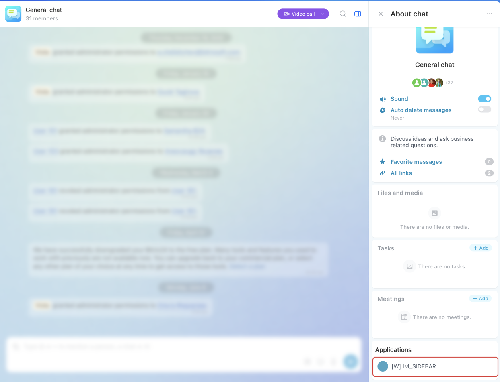

# Widget for the IM_SIDEBAR



If you are developing integrations for Bitrix24 using AI tools (Codex, Claude Code, Cursor), connect to the [MCP server](../../../ai-tools/mcp.md) so that the assistant can utilize the official REST documentation.



> Scope: [`placement, im`](../../scopes/permissions.md)

The widget adds its item to the chat sidebar.

The placement code is specified in the `PLACEMENT` parameter of the [placement.bind](../placement-bind.md) method.



The widget is not displayed in the interface until the application installation is complete. [Check the application installation](../../../settings/app-installation/installation-finish.md)



## Where the widget is embedded

#| 
|| **Placement Code** | **Location** ||
|| `IM_SIDEBAR` | Item in the chat sidebar ||
|#

### Where it is located in the interface

Open the chat and click the sidebar button on the right side of the top chat panel. In the opened sidebar, there is an *Applications* block at the bottom, which displays the application item with `PLACEMENT=IM_SIDEBAR`.



## What the handler receives

Data is sent in a POST request: some parameters come in the handler URL query string, the rest in the request body {.b24-info}

```php
Array
(
    [DOMAIN] => xxx.bitrix24.com
    [PROTOCOL] => 1
    [LANG] => de
    [APP_SID] => 99c80eff6378726287350416ee5fef0
    [AUTH_ID] => 6061e72600631fcd00005a4b00000001f0f1076700000000f69dd5fc643d9ce2fdbc1
    [AUTH_EXPIRES] => 3600
    [REFRESH_ID] => 50e00aa340631fcd00005a4b00000001f0f1071111116580a5b83c2de639ef28c12
    [SERVER_ENDPOINT] => https://oauth.bitrix.info/rest/
    [APPLICATION_TOKEN] => ec1b2074a9d3f5c81b6e40d27a95cf38
    [APPLICATION_SCOPE] => im,placement
    [member_id] => da45a03b265ed12127f8a258d793cc5d
    [status] => L
    [PLACEMENT] => IM_SIDEBAR
    [PLACEMENT_OPTIONS] => {"dialogId":"chat2","URI":"\/online\/"}
)
```

After parsing, the `PLACEMENT_OPTIONS` string from this example looks like this:

```json
{
    "dialogId": "chat2",
    "URI": "/online/"
}
```





### PLACEMENT_OPTIONS

The value of `PLACEMENT_OPTIONS` is passed as a JSON string with the context of the call.

#|
|| **Parameter**
`type` | **Description** ||
|| **dialogId***
[`string`](../../data-types.md) | Identifier of the chat in whose sidebar the widget is opened: `chatNNN` for a group chat, the user identifier for a private conversation. The chat can be retrieved by this identifier with the [im.dialog.get](../../chats/im-dialog-get.md) method. For a private conversation, the data of the interlocutor is returned by the [user.get](../../user/user-get.md) method ||
|| **URI***
[`string`](../../data-types.md) | Address of the page the widget is opened from. For the messenger this is `/online/` ||
|#

## OPTIONS when registering via placement.bind

For `IM_SIDEBAR`, the `placement.bind` method supports `OPTIONS` parameters.



#| 
|| **Parameter** `type` | **Description** ||
|| **iconName*** [`string`](../../data-types.md) | Name of a Font Awesome 4 icon, for example `fa-file-text-o`. Bitrix24 adds the `fa` set class itself. Up to 50 characters, the value must contain Latin letters, a space, or `-` ||
|| **extranet** [`string`](../../data-types.md) | Access in the extranet, default is `N`.

Possible values:
- `N` — application is not available for extranet users
- `Y` — application is available for extranet users
||
|| **context** [`string`](../../data-types.md) | Display context, default is `ALL`. Multiple values can be passed using `;`.

Possible values:
- `ALL` — all chats
- `USER` — personal chats of users, excluding chats with bots
- `CHAT` — group chats, excluding `LINES` and `CRM`
- `LINES` — chats of open channels
- `CRM` — chats created within CRM

If `ALL` is passed along with other values, only `ALL` is used. An invalid value will cause a registration error
||
|| **role** [`string`](../../data-types.md) | User role, default is `USER`.

Possible values:
- `USER` — application is available to all users
- `ADMIN` — application is available only to portal administrators
||
|| **color** [`string`](../../data-types.md) | Icon color from the IM palette.

Possible values:
- `RED` — red
- `GREEN` — green
- `MINT` — mint
- `LIGHT_BLUE` — light blue
- `DARK_BLUE` — dark blue
- `PURPLE` — purple
- `AQUA` — aqua
- `PINK` — pink
- `LIME` — lime
- `BROWN` — brown
- `AZURE` — azure
- `KHAKI` — khaki
- `SAND` — sand
- `ORANGE` — orange
- `MARENGO` — marengo
- `GRAY` — gray
- `GRAPHITE` — graphite
||
|#

## Code Examples





- cURL (OAuth)

    ```bash
    curl -X POST \
      -H "Content-Type: application/json" \
      -H "Accept: application/json" \
      -d '{
        "PLACEMENT": "IM_SIDEBAR",
        "HANDLER": "https://your-domain.com/widgets/im-sidebar-handler.php",
        "TITLE": "My sidebar item",
        "LANG_ALL": {
          "de": {
            "TITLE": "Mein Sidebar-Element"
          },
          "en": {
            "TITLE": "My sidebar item"
          }
        },
        "OPTIONS": {
          "iconName": "fa-file-text-o",
          "context": "ALL",
          "role": "USER",
          "extranet": "N",
          "color": "LIGHT_BLUE"
        },
        "auth": "**put_access_token_here**"
      }' \
      https://**put_your_bitrix24_address**/rest/placement.bind
    ```

- JS (TS)

    ```ts
    // This snippet is an ES module: top-level await requires type="module" or a bundler.
    // $b24 is an already-initialized SDK instance (see the SDK "Get started" guide).
    import { Text } from '@bitrix24/b24jssdk'
    import type { B24Frame } from '@bitrix24/b24jssdk'

    declare const $b24: B24Frame

    try {
      const response = await $b24.actions.v2.call.make<boolean>({
        method: 'placement.bind',
        params: {
          PLACEMENT: 'IM_SIDEBAR',
          HANDLER: 'https://your-domain.com/widgets/im-sidebar-handler.php',
          TITLE: 'My sidebar item',
          LANG_ALL: {
            ru: {
              TITLE: 'My sidebar item',
            },
            en: {
              TITLE: 'My sidebar item',
            },
          },
          OPTIONS: {
            iconName: 'fa-file-text-o',
            context: 'ALL',
            role: 'USER',
            extranet: 'N',
            color: 'LIGHT_BLUE',
          },
        },
        requestId: Text.getUuidRfc4122()
      })

      // The payload is available only on a successful response
      if (!response.isSuccess) {
        console.error(response.getErrorMessages().join('; '))
      } else {
        const result = response.getData()!.result
        console.info('Placement bound successfully:', result)
      }
    } catch (error) {
      // Thrown on transport or SDK failures (AjaxError, SdkError, etc.)
      console.error(error)
    }
    ```

- JS (UMD)

    ```html
    <!-- Load the SDK (UMD build); it is exposed as the global B24Js -->
    <script src="https://unpkg.com/@bitrix24/b24jssdk@1/dist/umd/index.min.js"></script>
    <script>
      async function bindImSidebar() {
        try {
          // Initialize the SDK inside a Bitrix24 frame
          const $b24 = await B24Js.initializeB24Frame()

          const response = await $b24.actions.v2.call.make({
            method: 'placement.bind',
            params: {
              PLACEMENT: 'IM_SIDEBAR',
              HANDLER: 'https://your-domain.com/widgets/im-sidebar-handler.php',
              TITLE: 'My sidebar item',
              LANG_ALL: {
                ru: {
                  TITLE: 'My sidebar item',
                },
                en: {
                  TITLE: 'My sidebar item',
                },
              },
              OPTIONS: {
                iconName: 'fa-file-text-o',
                context: 'ALL',
                role: 'USER',
                extranet: 'N',
                color: 'LIGHT_BLUE',
              },
            },
            requestId: B24Js.Text.getUuidRfc4122()
          })

          // The payload is available only on a successful response
          if (!response.isSuccess) {
            console.error(response.getErrorMessages().join('; '))
            return
          }

          const result = response.getData().result
          console.info('Placement bound successfully:', result)
        } catch (error) {
          // Thrown on transport or SDK failures (AjaxError, SdkError, etc.)
          console.error(error)
        }
      }

      document.addEventListener('DOMContentLoaded', bindImSidebar)
    </script>
    ```

- Python

    ```python
    from b24pysdk.errors import BitrixAPIError, BitrixSDKException

    try:
        bitrix_response = client.placement.bind(
            placement='IM_SIDEBAR',
            handler='https://your-domain.com/widgets/im-sidebar-handler.php',
            title='My sidebar item',
            lang_all={
                "ru": {
                    "TITLE": "My sidebar item",
                },
                "en": {
                    "TITLE": "My sidebar item",
                },
            },
            options={
                "iconName": "chat-tools",
                "context": "ALL",
                "role": "USER",
                "extranet": "N",
                "color": "LIGHT_BLUE",
            },
        ).response
        result = bitrix_response.result
        print(result)
    except BitrixAPIError as error:
        print(
            "Bitrix API error",
            f"error: {error.error}",
            f"error_description: {error.error_description}",
            sep="\n",
        )
    except BitrixSDKException as error:
        print(f"Bitrix SDK error: {error.message}")
    except Exception as error:
        print(f"Unexpected error: {error}")
    ```
- PHP

    ```php
    try {
        $response = $b24Service
            ->core
            ->call(
                'placement.bind',
                [
                    'PLACEMENT' => 'IM_SIDEBAR',
                    'HANDLER' => 'https://your-domain.com/widgets/im-sidebar-handler.php',
                    'TITLE' => 'My sidebar item',
                    'LANG_ALL' => [
                        'de' => [
                            'TITLE' => 'Mein Sidebar-Element',
                        ],
                        'en' => [
                            'TITLE' => 'My sidebar item',
                        ],
                    ],
                    'OPTIONS' => [
                        'iconName' => 'fa-file-text-o',
                        'context' => 'ALL',
                        'role' => 'USER',
                        'extranet' => 'N',
                        'color' => 'LIGHT_BLUE',
                    ],
                ]
            );

        $result = $response->getResponseData()->getResult();
        if ($result->error()) {
            error_log($result->error());
        } else {
            echo 'Success: ' . print_r($result->data(), true);
        }
    } catch (Throwable $e) {
        error_log($e->getMessage());
        echo 'Error binding placement: ' . $e->getMessage();
    }
    ```

- BX24.js

    ```js
    BX24.callMethod(
        'placement.bind',
        {
            PLACEMENT: 'IM_SIDEBAR',
            HANDLER: 'https://your-domain.com/widgets/im-sidebar-handler.php',
            TITLE: 'My sidebar item',
            LANG_ALL: {
                de: { TITLE: 'Mein Sidebar-Element' },
                en: { TITLE: 'My sidebar item' }
            },
            OPTIONS: {
                iconName: 'fa-file-text-o',
                context: 'ALL',
                role: 'USER',
                extranet: 'N',
                color: 'LIGHT_BLUE'
            }
        },
        function(result) {
            if (result.error()) {
                console.error(result.error());
            } else {
                console.log(result.data());
            }
        }
    );
    ```

- PHP CRest

    ```php
    require_once('crest.php');

    $result = CRest::call(
        'placement.bind',
        [
            'PLACEMENT' => 'IM_SIDEBAR',
            'HANDLER' => 'https://your-domain.com/widgets/im-sidebar-handler.php',
            'TITLE' => 'My sidebar item',
            'LANG_ALL' => [
                'de' => [
                    'TITLE' => 'Mein Sidebar-Element',
                ],
                'en' => [
                    'TITLE' => 'My sidebar item',
                ],
            ],
            'OPTIONS' => [
                'iconName' => 'fa-file-text-o',
                'context' => 'ALL',
                'role' => 'USER',
                'extranet' => 'N',
                'color' => 'LIGHT_BLUE',
            ],
        ]
    );

    echo '<PRE>';
    print_r($result);
    echo '</PRE>';
    ```

- Go

    ```go
    // client and ctx are already created — see the Go SDK section
    res, err := client.Core().Call(ctx, "placement.bind", b24.Params{
    	"PLACEMENT": "IM_SIDEBAR",
    	"HANDLER":   "https://your-domain.com/widgets/im-sidebar-handler.php",
    	"TITLE":     "My sidebar item",
    	"LANG_ALL": b24.Params{
    		"ru": b24.Params{
    			"TITLE": "My sidebar item",
    		},
    		"en": b24.Params{
    			"TITLE": "My sidebar item",
    		},
    	},
    	"OPTIONS": b24.Params{
    		"iconName": "fa-file-text-o",
    		"context":  "ALL",
    		"role":     "USER",
    		"extranet": "N",
    		"color":    "LIGHT_BLUE",
    	},
    })
    if err != nil {
    	return fmt.Errorf("placement.bind: %w", err)
    }

    // The response arrives as json.RawMessage — unmarshal it into a struct
    // matching the response shape from the "Response Handling" section of the placement.bind page.
    fmt.Printf("%s\n", res.Result)
    ```



## Typical Errors

#|
|| **Error** | **How to Resolve** ||
|| `placement.bind` returns `WRONG_AUTH_TYPE` with the description `Application context required` | Register the embedding point on behalf of an application. An embedding point cannot be bound with a webhook ||
|| `placement.bind` returns `ERROR_ARGUMENT` | The required `OPTIONS[iconName]` parameter is missing. The code of the empty field arrives in `argument` ||
|| The item did not appear in the *Applications* block of the chat sidebar | Complete the application installation and reopen the chat ||
|| Registration fails because of the `context` value | Use only the valid values: `ALL`, `USER`, `CHAT`, `LINES`, `CRM` ||
|| The item is visible in chats other than those set by `context` | `ALL` was passed along with the other values, and the other values are ignored. Pass either `ALL` or a list of specific contexts separated by `;` ||
|#

Other registration error codes are listed in the "Possible Error Codes" section of the [placement.bind](../placement-bind.md) page.

## Continue Learning

- [{#T}](./index.md)
- [{#T}](./textarea.md)
- [{#T}](./context-menu.md)
- [{#T}](./navigation.md)
- [{#T}](../placement-bind.md)
- [{#T}](../ui-interaction/index.md)
- [{#T}](../bx24-widget-methods.md)
- [{#T}](../../../settings/interactivity/index.md)
