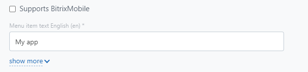

# Widget Embedding Mechanism

The REST API allows you to add your functionality to Bitrix24 in the form of widgets in various places within the user interface - in the main menu of the account, in the item list menus, in CRM and task cards, etc.

## Basic Widget in the Left Menu

This is the simplest embedding, which can be done not even through the REST API, but through the settings of a local or mass-market application.

In the case of a [local application](../../local-integrations/local-apps.md), specify the name of the menu item:

Clicking on this item will open a slider with the application in the form of a frame, into which the URL you specified as the main one in the local application settings will be inserted.

In the case of [mass-market solutions](../../market/preparing-to-publish/how-to-add-app.md) hosted in the Developer's area, you need to do two things:

In the version card, specify the option "Add your page and item to the main menu"

In the description in the required language, specify the value in the "Menu Application Name" field

## How Other Embeddings Work

Unlike the embedding of the slider with the main URL of the application in the left menu, [all other widgets](./placements.md) are embedded differently - using the [`placement.bind`](./placement-bind.md) method.

## Special Widgets - Custom Field Types in CRM Cards

You can create your own interfaces for displaying and editing fields in CRM cards (in leads, deals, etc.). This can be an interface with geo-maps, sets of informers, or industry data. In fact, Bitrix24 will be responsible for saving the field values, while the interface for displaying these values is fully implemented by the applications.

To use this scenario, you need to register [custom field types](../crm/universal/user-defined-field-types/index.md). These are not the fields themselves, but the types. Later, either the user through standard CRM interfaces or your application using REST methods can add fields of these types and use your editing interface for such fields.

## Opening Standard and Custom Sliders from Widget Interfaces

Often, it is necessary to [open standard pages](./open-path.md) of Bitrix24 from the widget interfaces. This could be, for example, a slider with a contact card or a slider with a specific task.

In addition to standard sliders, solution developers have the opportunity to show [their custom interfaces in a slider](./open-application.md). For example, this could be a custom view card for a document, a slider with application settings, a slider with a report, etc. You will be able to customize the appearance of such a slider.

## Interacting with Bitrix24 UI from Widgets

For some scenarios, it is necessary for developers to access certain features of Bitrix24 directly from the frontend of their widgets.

First and foremost, this includes the ability to make direct calls to REST methods. Secondly, there are special methods implemented only for specific types of widgets. In particular,

- in the [call card](./ui-interaction/crm-card.md)
- in the [WebRTC scenario](./ui-interaction/page-background-worker/index.md)
- in the [CRM card](./ui-interaction/crm-card.md)

## Benefits of Using Widgets

We highly recommend using widget embeddings in the user interface to implement convenient user scenarios. This provides developers with a number of advantages:

- Users will receive your functionality exactly where it needs to be used. For example, if your application provides users with additional information about deals, it is most convenient for users to receive this information when they are already in the relevant deal.
- User scenarios with widgets are easier to program. Returning to the previous example: if your application provides additional information about a specific deal, embedding it in the deal card will save you from having to create your own interface with a list of deals in your application. After all, the user already has a great opportunity to find the necessary deal in the CRM interface. You only need to focus on your unique functionality.
- If you have developed a mass-market application with widgets, the Market showcase will offer your solution to clients in the widget embedding places you used. You will receive more targeted and quality traffic, leading to better conversion rates for your applications.

It is also recommended to use the [openPath](./open-path.md) method to show users standard Bitrix24 objects, and the [openApplication](./open-application.md) method to simplify user scenarios within your application. Users are accustomed to the pattern where additional information or details about something are displayed in a slider over the previous interface.

You should use openApplication for:

- Displaying your application's settings form instead of popup windows within the application frame
- Displaying various detail forms of your application's objects (viewing an external document, detailed information about an order, etc.)
- Forms for adding and editing (for example, for forms to fill out a request, adding real estate, etc.)

This approach will save you from a number of problems:

- Due to security-related limitations in browsers, implementing single-page applications in an iframe is quite labor-intensive. Opening separate sliders using the openApplication call mitigates this complexity, as Bitrix24 itself passes the necessary authorization tokens and "context" in the form of your custom parameters to the slider.
- Any iframe has a limited size visible to the user. It is impossible to show any popup window inside an iframe that is larger than the iframe itself. Moreover, such an attempt causes scrollbars to appear at the edges of the iframe. This is inconvenient and unattractive. Calling a slider over the interface completely resolves these issues.

In summary, we strongly recommend exploring the use of openPath and openApplication to create simple, convenient, and functional solutions for Bitrix24.