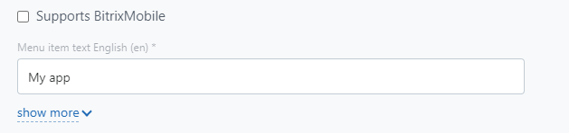

# Widget Embedding Mechanism



If you are developing integrations for Bitrix24 using AI tools (Codex, Claude Code, Cursor), connect to the [MCP server](../../ai-tools/mcp.md) so that the assistant can utilize the official REST documentation.



> Scope: [`placement`, `depends on the placement`](../scopes/permissions.md)

A widget is an application interface embedded into a Bitrix24 page. The user opens a tab in a deal card, selects a menu item, or clicks a button in a chat and sees the application in a frame without leaving the working interface. Along with the frame, Bitrix24 passes the user authorization and the call context to the application — for example, the identifier of the deal whose card the widget was opened from.

The location where the interface is embedded is called a placement and is identified by a code: `CRM_DEAL_DETAIL_TAB`, `LEFT_MENU`, `IM_TEXTAREA`. The handler for a placement is registered by the application with the [placement.bind](./placement-bind.md) method. There is a single exception — the [SETTING_CONNECTOR](./setting-connector.md) placement, whose handler is connected by the [imconnector.register](../imopenlines/imconnector/imconnector-register.md) method.

This page describes the mechanism: the registration procedure, permissions, handler data, and common mistakes.

> Quick navigation: [all placements](./placements.md)

## How an Application Appears in the Bitrix24 Interface

An application can show its interface to the user in different ways. Widgets are one of them.

#|
|| **Method** | **What the User Sees** | **How It Is Connected** ||
|| Application page of its own | An item in the main menu that opens the main application URL in the entire working area | Application settings, without REST API calls ||
|| Widget in a placement | An element in the required location of the product: a tab, a menu item, a button, a sidebar | The [placement.bind](./placement-bind.md) method with the placement code ||
|| Custom field type | An interface of your own for viewing and editing a field in a CRM card | The [userfieldtype.add](./user-field/userfieldtype-add.md) method ||
|| [Connector settings page](./setting-connector.md) | The interface for connecting a communication channel in the open channel connector settings | The `PLACEMENT_HANDLER` parameter of the [imconnector.register](../imopenlines/imconnector/imconnector-register.md) method ||
|#

### Application Page of Its Own

An application item in the main menu is not a widget. No handler is registered for it: the item opens the main application URL.

In a [local application](../../local-integrations/local-apps.md), specify the menu item name.



In a [mass-market solution](../../market/preparing-to-publish/how-to-add-app.md), enable the *Add your page and item to the main menu* option. The item name is specified in the application description for the required language, in the *Application Name in Menu* field.

A main menu item can also open a registered handler with a call context. To do this, use the [LEFT_MENU](./left-menu.md) placement.

## How a Widget Works

1. The application registers a handler with the [placement.bind](./placement-bind.md) method: it passes the placement code in the `PLACEMENT` parameter and the URL of its handler in the `HANDLER` parameter.
2. The user calls the widget: opens a tab, selects a menu item, or clicks a button.
3. Bitrix24 sends a POST request to the handler URL and passes the user authorization and the call context in it.
4. The handler responds with a page that is allowed to open in a frame, and Bitrix24 displays it in place of the widget.
5. From the frame, the application calls the REST API on behalf of the user and controls the Bitrix24 interface with JavaScript methods.



The handler URL must be reachable from an external network. Links to `localhost` and local domains will not work: Bitrix24 addresses the handler from its own side.





Widgets are not displayed in the interface until the application installation is complete, even if `placement.bind` returned success. [Check the application installation](../../settings/app-installation/installation-finish.md)



## What Permissions Are Required

Permissions consist of two layers.

**The `placement` scope** is always required — without it, the application cannot call `placement.bind`.

**The tool scope** is required to work with the data of that tool from the widget: to retrieve a deal by the identifier from the call context, a chat by `dialogId`, or a task by its identifier. For some placements, the same scope is also required for the registration itself: CRM placements are declared in the `crm` scope, task placements in `task`. For messenger placements, on the contrary, the `placement` scope alone is enough for registration, while `im` is needed to work with the chat.

The required set is specified in the header of each placement page — rely on it rather than on the product section.

Application permissions are not the only condition. Only the employees who have access to the application see the widget: Bitrix24 checks the access every time the widget is displayed.

The `placement.bind`, `placement.unbind`, and `placement.get` methods are available only to the Bitrix24 administrator, and `placement.list` to any user. All of them work in the application context: a call made with a webhook returns the `WRONG_AUTH_TYPE` error.

## How to Get Started

1. Choose a placement for your scenario in the [list of placements](./placements.md). Its code is required in the `PLACEMENT` parameter.
2. Specify the `placement` scope in the application settings, and the tool scope as well if the placement requires it. The set is specified in the header of the placement page.
3. Register the handler with the [placement.bind](./placement-bind.md) method. This is usually done during the [application installation](../../settings/app-installation/index.md).
4. Complete the application installation and open the placement in the interface.
5. Parse the POST request data in the handler: the user authorization and the call context from `PLACEMENT_OPTIONS`.



```bash
curl -X POST \
  -H "Content-Type: application/json" \
  -H "Accept: application/json" \
  -d '{
    "PLACEMENT": "CRM_DEAL_DETAIL_TAB",
    "HANDLER": "https://your-domain.com/widgets/deal-tab-handler.php",
    "TITLE": "Deal supplies",
    "auth": "**put_access_token_here**"
  }' \
  https://**put_your_bitrix24_address**/rest/placement.bind
```

## What the Handler Receives

Data is sent in a POST request: some parameters come in the handler URL query string, the rest in the request body {.b24-info}

The example is shown for a tab in a deal card. Other placements receive the same set of data: only the `PLACEMENT` value and the call context in `PLACEMENT_OPTIONS` change. The exception is [BI_ANALYTICS_MENU](./crm/bi-analytics-menu.md): this placement opens the handler URL with a regular GET request and passes nothing to it.

```php
Array
(
    [DOMAIN] => xxx.bitrix24.com
    [PROTOCOL] => 1
    [LANG] => en
    [APP_SID] => 5552d735db7b7b4d5c16dd9c272bfe7d
    [AUTH_ID] => 9d4c7166007e9c94001e30ba00000001f0f107e28b5a4310c7f6d9b3025ea814
    [AUTH_EXPIRES] => 3600
    [REFRESH_ID] => 8c3b9966007e9c94001e30ba00000001f0f107f19c6b3e04d182ac5b73f9052d
    [SERVER_ENDPOINT] => https://oauth.bitrix.info/rest/
    [APPLICATION_TOKEN] => ec1b2074a9d3f5c81b6e40d27a95cf38
    [APPLICATION_SCOPE] => crm,placement
    [member_id] => d897063e1ce7c5eb9f04b9751eef5915
    [status] => L
    [PLACEMENT] => CRM_DEAL_DETAIL_TAB
    [PLACEMENT_OPTIONS] => {"ID":"8061","URI":"\/crm\/deal\/details\/8061\/?any=details%2F8061%2F&IFRAME=Y&IFRAME_TYPE=SIDE_SLIDER"}
)
```





The handler URL is reachable from an external network, so verify that the request came from Bitrix24: compare `APPLICATION_TOKEN` with the value the application received and retained during the installation. How an application retains the token is described in the [{#T}](../events/safe-event-handlers.md) article. Do not write the `AUTH_ID` and `REFRESH_ID` tokens to logs and do not pass them to third parties.

### PLACEMENT_OPTIONS

The call context comes as a JSON string in the `PLACEMENT_OPTIONS` parameter. The set of keys depends on the placement:

- in a CRM card — the object identifier
- in a chat — the dialog identifier, and for the message menu placement also the message identifier
- for universal placements — the placement code or the arbitrary parameters the application passed in the link itself
- for placements without a context of their own — only the universal `URI` key

The full set of keys is described on the page of each placement.

A complete handler — receiving the POST request, parsing `PLACEMENT_OPTIONS`, and responding with a page for the frame — is shown step by step in the [{#T}](../../tutorials/crm/crm-widgets/widget-as-detail-tab.md) tutorial. The code in it suits any placement: only the code in `PLACEMENT` and the call context keys change.

## What You Can Do from a Widget

A widget runs in a frame but is not isolated from Bitrix24:

- call the REST API on behalf of the user with the `AUTH_ID` token from the handler data
- open standard Bitrix24 pages and interfaces of your own in a slider — [BX24 SDK methods for widgets](./bx24-widget-methods.md)
- control the CRM card and the call card from your interface — [UI interaction from widgets](./ui-interaction/index.md)
- style the interface to match Bitrix24 — [Bitrix24 UI Kit](./ui-kit/index.md)

JavaScript methods work only after the library is connected to the handler page. How to connect it is described in the [{#T}](../../sdk/bx24-js-sdk/index.md) overview.

The widget interface is limited by the frame size: a popup wider than this area is cut off, and scrollbars appear at the edges. Open settings forms, object detail cards, and creation forms in a separate slider with `BX24.openApplication` — arbitrary application parameters can be passed to it.

## Handler Lifecycle

#|
|| **Task** | **Method** ||
|| Find out which placements are available to the application | [placement.list](./placement-list.md) ||
|| Retrieve the handlers the application has already registered | [placement.get](./placement-get.md) ||
|| Remove the handler registration | [placement.unbind](./placement-unbind.md) ||
|#

Handlers are removed together with the application, there is no need to remove the registration separately. What else Bitrix24 clears when an application is removed is described in the [Application Removal](../../settings/app-uninstallation.md) article.

## Common Mistakes

#|
|| **Mistake** | **Solution** ||
|| The widget did not appear in the interface, although `placement.bind` returned success | Complete the application installation — until then the widget is displayed to no one ||
|| Not all employees see the widget | Check who has access to the application: without access, the widget is not displayed ||
|| The `placement.bind` call returns `ERROR_PLACEMENT_NOT_FOUND` | Check the placement code and the application scopes: a placement is unknown if the code is specified incorrectly or the application has not been granted the tool scope ||
|| An empty frame in place of the widget | Check that the URL from `HANDLER` opens from an external network and returns a page. If the URL opens in a browser but not in a frame, the application server prohibits embedding with the `X-Frame-Options` or `Content-Security-Policy` headers, see the [{#T}](../../local-integrations/site-does-not-allow-connection.md) article ||
|| The `placement.bind` call returns `ERROR_WRONG_HANDLER_URL` or `ERROR_UNSUPPORTED_PROTOCOL` | Specify a URL with a domain name and the `http` or `https` scheme in `HANDLER`. URLs without a domain, including `localhost`, do not pass the check ||
|| The `placement.bind` call returns `ERROR_ARGUMENT` | Pass the required `PLACEMENT` and `HANDLER` parameters ||
|| A repeated registration returns `ERROR_PLACEMENT_MAX_COUNT` | The `REST_APP_URI` and `PAGE_BACKGROUND_WORKER` placements are registered in a single instance ||
|| The call returns `WRONG_AUTH_TYPE` | Call the method from an application, it is not available with a webhook ||
|#

## Continue Learning

- [{#T}](./placements.md)
- [{#T}](./left-menu.md)
- [{#T}](./placement-bind.md)
- [{#T}](./placement-list.md)
- [{#T}](./placement-get.md)
- [{#T}](./placement-unbind.md)
- [{#T}](./bx24-widget-methods.md)
- [{#T}](./ui-interaction/index.md)
- [{#T}](./ui-kit/index.md)
- [{#T}](../../tutorials/crm/crm-widgets/index.md)
