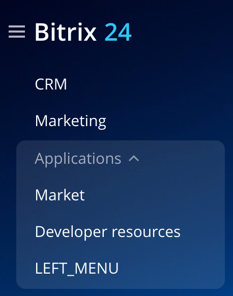

# Widgets in the Main Menu

> Widget codes: **LEFT_MENU**
>
> Scope: [`basic`](../scopes/permissions.md)
>

You can add your item to the main menu of the account.



The specific placement code for the widget is specified in the `PLACEMENT` parameter of the [placement.bind](./placement-bind.md) method.

## Where the Widget is Embedded

#|
|| **Widget Code** | **Location** ||
|| `LEFT_MENU` | Item in the main menu of the account ||
|#

## What the Handler Receives

Data is sent as a POST request {.b24-info}

```php

Array
(
    [handler] => 1
    [DOMAIN] => xxx.bitrix24.com
    [PROTOCOL] => 1
    [LANG] => en
    [APP_SID] => fea0d7bc24669fcb8807e88ee394c7ca
    [AUTH_ID] => 63d39f6600631fcd00005a4b00000001f0f1071905299b72b307a6c223d43877697546
    [AUTH_EXPIRES] => 3600
    [REFRESH_ID] => 5352c76600631fcd00005a4b00000001f0f107d262f083bb53a16948269371e327d1d9
    [member_id] => da45a03b265edd8787f8a258d793cc5d
    [status] => L
    [PLACEMENT] => LEFT_MENU
)

```





### PLACEMENT_OPTIONS

In the current widget, the `PLACEMENT_OPTIONS` parameter is not passed.



- [Application with its own page in the left menu](https://helpdesk.bitrix24.com/courses/index.php?COURSE_ID=268&LESSON_ID=26022&LESSON_PATH=25400.25996.26000.26022)



## Continue Your Learning

- [{#T}](./placement-bind.md)
- [{#T}](./ui-interaction/index.md)
- [{#T}](./ui-interaction/crm-card.md)
- [{#T}](../interactivity/index.md)
- [{#T}](./open-application.md)
- [{#T}](./open-path.md)