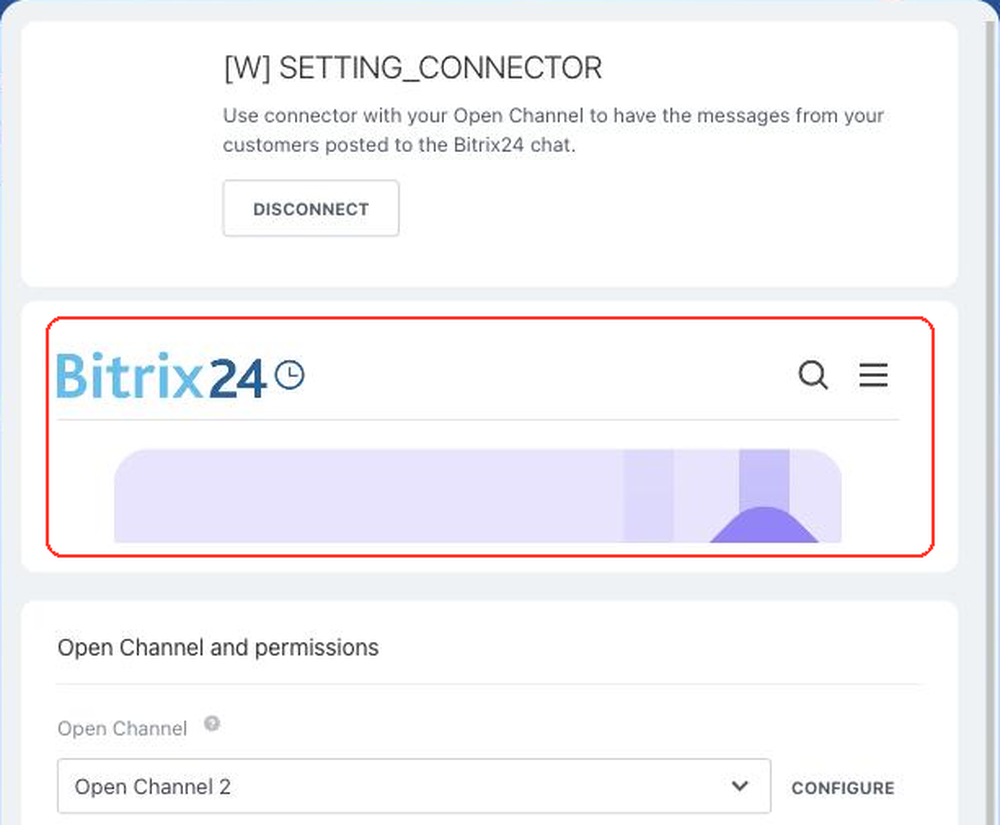

# Connector Settings Page SETTING_CONNECTOR



If you are developing integrations for Bitrix24 using AI tools (Codex, Claude Code, Cursor), connect to the [MCP server](../../ai-tools/mcp.md) so that the assistant can utilize the official REST documentation.



> Scope: [`imopenlines`](../scopes/permissions.md)

The widget renders the application interface on the settings page of a custom open channel connector. This is where the user connects their communication channel: enters the login of an external service, selects an account, or confirms access.

The handler is connected not with the `placement.bind` method but with the `PLACEMENT_HANDLER` parameter of the [imconnector.register](../imopenlines/imconnector/imconnector-register.md) method. Bitrix24 creates the binding to the placement itself when it registers the connector.



The widget is not displayed in the interface until the application installation is complete. [Check the application installation](../../settings/app-installation/installation-finish.md)



## Where the Widget is Embedded

#|
|| **Placement Code** | **Location** ||
|| `SETTING_CONNECTOR` | Settings page of a custom open channel connector ||
|#

### Where to Find It in the Interface

Open the contact center at `/contact_center/` and click the tile of your connector. In the slider that opens, click *Connect* and select an open channel. The application interface is displayed between the connector header and the *Open Channel and permissions* block.



The connector tile appears in the contact center right after the [imconnector.register](../imopenlines/imconnector/imconnector-register.md) call — the name and the icon are taken from the `NAME` and `ICON` parameters.

## What the Handler Receives

Data is sent in a POST request: some parameters come in the handler URL query string, the rest in the request body {.b24-info}

```php
Array
(
    [DOMAIN] => xxx.bitrix24.com
    [PROTOCOL] => 1
    [LANG] => en
    [APP_SID] => 0123456789abcdef0123456789abcdef
    [AUTH_ID] => 6061e72600631fcd00005a4b00000001f0f1076700000000f69dd5fc643d9ce2fdbc1
    [AUTH_EXPIRES] => 3600
    [REFRESH_ID] => 50e00aa340631fcd00005a4b00000001f0f1071111116580a5b83c2de639ef28c12
    [SERVER_ENDPOINT] => https://oauth.bitrix.info/rest/
    [APPLICATION_TOKEN] => 5b2f8c1d7e3a9046b8c5d2f1a7e3b904
    [APPLICATION_SCOPE] => imopenlines,placement
    [member_id] => da45a03b265edd8787f8a258d793cc5d
    [status] => L
    [PLACEMENT] => SETTING_CONNECTOR
    [PLACEMENT_OPTIONS] => {"CONNECTOR":"my_connector","LINE":"3","STATUS":false,"ACTIVE_STATUS":true,"CONNECTION_STATUS":false,"REGISTER_STATUS":false,"ERROR_STATUS":false,"URI":"\/contact_center\/connector\/?ID=my_connector&IFRAME=Y&IFRAME_TYPE=SIDE_SLIDER"}
)
```





### PLACEMENT_OPTIONS

The `PLACEMENT_OPTIONS` value is sent as a JSON string. It carries both the addressing of the call — which connector is being set up for which channel — and the current state of that connector.

#|
|| **Key**
`type` | **Description** ||
|| **CONNECTOR**
[`string`](../data-types.md) | Connector identifier — the `ID` value with which the application registered the connector using the [imconnector.register](../imopenlines/imconnector/imconnector-register.md) method ||
|| **LINE**
[`string`](../data-types.md) | Identifier of the open channel the settings page is opened for. The channel settings are returned by the [imopenlines.config.get](../imopenlines/openlines/imopenlines-config-get.md) method ||
|| **ACTIVE_STATUS**
[`boolean`](../data-types.md) | The connector is enabled for this channel. The value is changed by the [imconnector.activate](../imopenlines/imconnector/imconnector-activate.md) method ||
|| **CONNECTION_STATUS**
[`boolean`](../data-types.md) | The connection to the external service is confirmed ||
|| **REGISTER_STATUS**
[`boolean`](../data-types.md) | The channel is registered in the external service. Both flags are raised by the application with the [imconnector.connector.data.set](../imopenlines/imconnector/imconnector-connector-data-set.md) method when it saves the channel settings ||
|| **ERROR_STATUS**
[`boolean`](../data-types.md) | The connector has an error. The flag is set by the `imconnector.set.error` method ||
|| **STATUS**
[`boolean`](../data-types.md) | Final status: `true` when the connector is enabled, the connection and the registration are confirmed, and there are no errors. The same value is returned by the [imconnector.status](../imopenlines/imconnector/imconnector-status.md) method ||
|#

The state comes with every call, so the handler can show the right screen right away: the initial connection form if `CONNECTION_STATUS` is still `false`, or the settings of an already connected channel.

## How to Connect the Handler

A separate [placement.bind](./placement-bind.md) call is not needed for this placement. The handler address is passed once — when the connector is registered:

- specify the address of the settings page in `PLACEMENT_HANDLER` of the [imconnector.register](../imopenlines/imconnector/imconnector-register.md) method
- Bitrix24 will create the binding to the `SETTING_CONNECTOR` placement and link it to the connector
- to change the address, call `imconnector.register` again with the same `ID`

The placement does not support the `OPTIONS` parameters: there is no way to pass them when registering a connector.

## Common Mistakes

#|
|| **Mistake** | **How to Solve** ||
|| The handler was bound with the `placement.bind` method | The method accepts the `SETTING_CONNECTOR` code and creates a binding, but it does not appear on the settings page. Bitrix24 shows the binding that it created itself when registering the connector ||
|| The settings page is looked for before the channel is connected | Until *Connect* is clicked in the connector slider and an open channel is selected, there is no application interface on the page ||
|| The connector identifier does not match the stored one | The `imconnector.register` method converts `ID` to lowercase, and `PLACEMENT_OPTIONS` already contains the converted value. Compare the values in the same case ||
|#

## Continue Learning

- [{#T}](./index.md)
- [{#T}](./contact-center.md)
- [{#T}](../imopenlines/imconnector/imconnector-register.md)
- [{#T}](../imopenlines/imconnector/imconnector-activate.md)
- [{#T}](../imopenlines/imconnector/imconnector-status.md)
- [{#T}](../imopenlines/index.md)
- [{#T}](./bx24-widget-methods.md)
