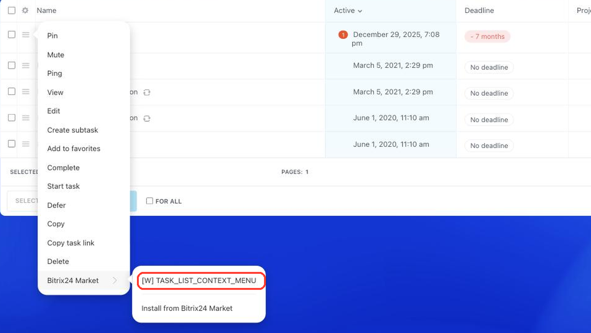

# Context Menu Item of a Task in the List TASK_LIST_CONTEXT_MENU



If you are developing integrations for Bitrix24 using AI tools (Codex, Claude Code, Cursor), connect to the [MCP server](../../../ai-tools/mcp.md) so that the assistant can utilize the official REST documentation.



> Scope: [`task`](../../scopes/permissions.md)

The widget adds its own item to the context menu of an individual task in the list. The handler receives the identifier of the task whose menu the widget is opened from.

The specific widget placement code is specified in the `PLACEMENT` parameter of the [placement.bind](../placement-bind.md) method.



The widget will not be displayed in the interface until the application installation is complete. [Check the application installation](../../../settings/app-installation/installation-finish.md)



## Where the Widget is Embedded

#|
|| **Widget Code** | **Location** ||
|| `TASK_LIST_CONTEXT_MENU` | Context menu item of a task in the list ||
|#

### Where to Find It in the Interface

Open the task list, click the menu button to the left of a task, and hover over *Bitrix24 Market*. The application item appears in this submenu.



## What the Handler Receives

Data is sent in a POST request: some parameters come in the handler URL query string, the rest in the request body {.b24-info}

```php

Array
(
    [DOMAIN] => xxx.bitrix24.com
    [PROTOCOL] => 1
    [LANG] => en
    [APP_SID] => d7092a1d8c53d8be01cbb43a856e21ac
    [AUTH_ID] => cb50ba6600631fcd00005a4b00000001f0f107523405e8ed8e45f3a87951e631
    [AUTH_EXPIRES] => 3600
    [REFRESH_ID] => bbcfe16600631fcd00005a4b00000001f0f1078b3cbb2ae3909b492b397f73c3
    [SERVER_ENDPOINT] => https://oauth.bitrix.info/rest/
    [APPLICATION_TOKEN] => 3f0a7c19e5b84d2196c8ad470e5f2b31
    [APPLICATION_SCOPE] => task,placement
    [member_id] => da45a03b265edd8787f8a258d793cc5d
    [status] => L
    [PLACEMENT] => TASK_LIST_CONTEXT_MENU
    [PLACEMENT_OPTIONS] => {"ID":"31","URI":"\/company\/personal\/user\/1\/tasks\/"}
)

```





### PLACEMENT_OPTIONS

The `PLACEMENT_OPTIONS` value is passed as a JSON string with the call context. In addition to the universal `URI` key, the context carries the key of the placement itself.



#|
|| **Parameter** | **Description** ||
|| **ID***
[`string`](../../data-types.md) | Identifier of the task whose context menu the widget is opened from.

Task data is returned by the [tasks.task.get](../../tasks/tasks-task-get.md) method

||
|#

## Code Examples





- cURL (OAuth)

    ```bash
    curl -X POST \
      -H "Content-Type: application/json" \
      -H "Accept: application/json" \
      -d '{
        "PLACEMENT": "TASK_LIST_CONTEXT_MENU",
        "HANDLER": "https://your-domain.com/widgets/task-list-context-menu-handler.php",
        "TITLE": "My task menu item",
        "LANG_ALL": {
          "en": {
            "TITLE": "My task menu item"
          },
          "de": {
            "TITLE": "Mein Aufgabenmenüpunkt"
          }
        },
        "auth": "**put_access_token_here**"
      }' \
      https://**put_your_bitrix24_address**/rest/placement.bind
    ```

- JS (TS)

    ```ts
    // This snippet is an ES module: top-level await requires type="module" or a bundler.
    // $b24 is an already-initialized SDK instance (see the SDK "Get started" guide).
    import { Text } from '@bitrix24/b24jssdk'
    import type { B24Frame } from '@bitrix24/b24jssdk'

    declare const $b24: B24Frame

    try {
      const response = await $b24.actions.v2.call.make<boolean>({
        method: 'placement.bind',
        params: {
          PLACEMENT: 'TASK_LIST_CONTEXT_MENU',
          HANDLER: 'https://your-domain.com/widgets/task-list-context-menu-handler.php',
          TITLE: 'My task menu item',
          LANG_ALL: {
            en: {
              TITLE: 'My task menu item',
            },
            de: {
              TITLE: 'Mein Aufgabenmenüpunkt',
            },
          },
        },
        requestId: Text.getUuidRfc4122()
      })

      // The payload is available only on a successful response
      if (!response.isSuccess) {
        console.error(response.getErrorMessages().join('; '))
      } else {
        const result = response.getData()!.result
        console.info('Placement bound successfully:', result)
      }
    } catch (error) {
      // Thrown on transport or SDK failures (AjaxError, SdkError, etc.)
      console.error(error)
    }
    ```

- JS (UMD)

    ```html
    <!-- Load the SDK (UMD build); it is exposed as the global B24Js -->
    <script src="https://unpkg.com/@bitrix24/b24jssdk@1/dist/umd/index.min.js"></script>
    <script>
      async function bindTaskListContextMenu() {
        try {
          // Initialize the SDK inside a Bitrix24 frame
          const $b24 = await B24Js.initializeB24Frame()

          const response = await $b24.actions.v2.call.make({
            method: 'placement.bind',
            params: {
              PLACEMENT: 'TASK_LIST_CONTEXT_MENU',
              HANDLER: 'https://your-domain.com/widgets/task-list-context-menu-handler.php',
              TITLE: 'My task menu item',
              LANG_ALL: {
                en: {
                  TITLE: 'My task menu item',
                },
                de: {
                  TITLE: 'Mein Aufgabenmenüpunkt',
                },
              },
            },
            requestId: B24Js.Text.getUuidRfc4122()
          })

          // The payload is available only on a successful response
          if (!response.isSuccess) {
            console.error(response.getErrorMessages().join('; '))
            return
          }

          const result = response.getData().result
          console.info('Placement bound successfully:', result)
        } catch (error) {
          // Thrown on transport or SDK failures (AjaxError, SdkError, etc.)
          console.error(error)
        }
      }

      document.addEventListener('DOMContentLoaded', bindTaskListContextMenu)
    </script>
    ```

- PHP

    ```php
    try {
        $response = $b24Service
            ->core
            ->call(
                'placement.bind',
                [
                    'PLACEMENT' => 'TASK_LIST_CONTEXT_MENU',
                    'HANDLER' => 'https://your-domain.com/widgets/task-list-context-menu-handler.php',
                    'TITLE' => 'My task menu item',
                    'LANG_ALL' => [
                        'en' => [
                            'TITLE' => 'My task menu item',
                        ],
                        'de' => [
                            'TITLE' => 'Mein Aufgabenmenüpunkt',
                        ],
                    ],
                ]
            );

        $result = $response->getResponseData()->getResult();
        if ($result->error()) {
            error_log($result->error());
        } else {
            echo 'Success: ' . print_r($result->data(), true);
        }
    } catch (Throwable $e) {
        error_log($e->getMessage());
        echo 'Error binding placement: ' . $e->getMessage();
    }
    ```

- BX24.js

    ```js
    BX24.callMethod(
        'placement.bind',
        {
            PLACEMENT: 'TASK_LIST_CONTEXT_MENU',
            HANDLER: 'https://your-domain.com/widgets/task-list-context-menu-handler.php',
            TITLE: 'My task menu item',
            LANG_ALL: {
                en: { TITLE: 'My task menu item' },
                de: { TITLE: 'Mein Aufgabenmenüpunkt' }
            }
        },
        function(result) {
            if (result.error()) {
                console.error(result.error());
            } else {
                console.log(result.data());
            }
        }
    );
    ```

- PHP CRest

    ```php
    require_once('crest.php');

    $result = CRest::call(
        'placement.bind',
        [
            'PLACEMENT' => 'TASK_LIST_CONTEXT_MENU',
            'HANDLER' => 'https://your-domain.com/widgets/task-list-context-menu-handler.php',
            'TITLE' => 'My task menu item',
            'LANG_ALL' => [
                'en' => [
                    'TITLE' => 'My task menu item',
                ],
                'de' => [
                    'TITLE' => 'Mein Aufgabenmenüpunkt',
                ],
            ],
        ]
    );

    echo '<PRE>';
    print_r($result);
    echo '</PRE>';
    ```



## Continue Learning

- [{#T}](./index.md)
- [{#T}](./list-toolbar.md)
- [{#T}](./view-tab.md)
- [{#T}](../placement-bind.md)
- [{#T}](../ui-interaction/index.md)
- [{#T}](../../../settings/interactivity/index.md)
- [{#T}](../bx24-widget-methods.md)
