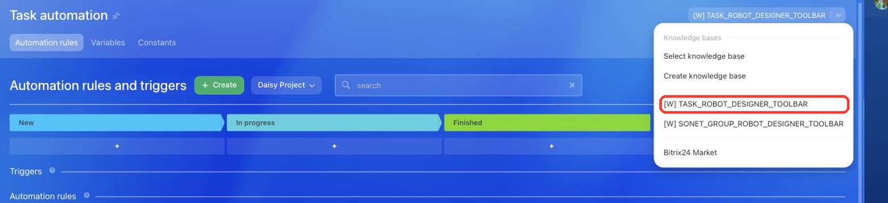

# Button in the Task Automation Rules Designer TASK_ROBOT_DESIGNER_TOOLBAR



If you are developing integrations for Bitrix24 using AI tools (Codex, Claude Code, Cursor), connect to the [MCP server](../../../ai-tools/mcp.md) so that the assistant can utilize the official REST documentation.



> Scope: [`placement, task`](../../scopes/permissions.md)

The widget adds its own button to the task automation rules designer. The handler receives the context of the automation the widget is opened from: the personal planner of a user or a project.

The specific widget placement code is specified in the `PLACEMENT` parameter of the [placement.bind](../placement-bind.md) method.



The widget will not be displayed in the interface until the application installation is complete. [Check the application installation](../../../settings/app-installation/installation-finish.md)



## Where the Widget is Embedded

#|
|| **Widget Code** | **Location** ||
|| `TASK_ROBOT_DESIGNER_TOOLBAR` | Button in the task automation rules designer ||
|#

### Where to Find It in the Interface

Open the task list of a user or a project and click *Automation rules*. The application button appears on the right in the header of the *Task automation* window. If another item occupies the button, click the arrow next to it — the application appears in the dropdown menu.





The [SONET_GROUP_ROBOT_DESIGNER_TOOLBAR](../workgroups/robot-designer-toolbar.md) placement is rendered in the same menu. It is a separate placement with its own `sonet_group` scope and its own call context.



## What the Handler Receives

Data is sent in a POST request: some parameters come in the handler URL query string, the rest in the request body {.b24-info}

The example is shown for the automation of a project. In the automation of a personal planner the set of data is the same, only the call context changes.

```php

Array
(
    [DOMAIN] => xxx.bitrix24.com
    [PROTOCOL] => 1
    [LANG] => en
    [APP_SID] => 4617fa96af5d1f523fc2e2b72bd54f11
    [AUTH_ID] => 5253ba6600705a0700005a4b00000001f0f1076fef51e6d3d3c1616a9fd92a71
    [AUTH_EXPIRES] => 3600
    [REFRESH_ID] => 42d2e16600705a0700005a4b00000001f0f107cf69d8060249da353587f8ec86
    [SERVER_ENDPOINT] => https://oauth.bitrix.info/rest/
    [APPLICATION_TOKEN] => 3f0a7c19e5b84d2196c8ad470e5f2b31
    [APPLICATION_SCOPE] => task,placement
    [member_id] => da45a03b265edd8787f8a258d793cc5d
    [status] => L
    [PLACEMENT] => TASK_ROBOT_DESIGNER_TOOLBAR
    [PLACEMENT_OPTIONS] => {"GROUP_ID":"11","URI":"\/workgroups\/group\/11\/tasks\/"}
)

```





### PLACEMENT_OPTIONS

The `PLACEMENT_OPTIONS` value is passed as a JSON string with the call context. In addition to the universal `URI` key, the context carries one own key. Which one depends on where the automation rules designer is opened from.



#|
|| **Parameter** | **Description** ||
|| **USER_ID***
[`string`](../../data-types.md) | Identifier of the user in whose personal planner automation the widget is opened.

User data is returned by the [user.get](../../user/user-get.md) method

||
|| **GROUP_ID***
[`string`](../../data-types.md) | Identifier of the project in whose task automation the widget is opened.

Group data is returned by the [sonet_group.get](../../sonet-group/sonet-group-get.md) method

||
|#

The keys are mutually exclusive: `USER_ID` arrives in the automation of a personal planner, `GROUP_ID` in the automation of a project.

## Code Examples





- cURL (OAuth)

    ```bash
    curl -X POST \
      -H "Content-Type: application/json" \
      -H "Accept: application/json" \
      -d '{
        "PLACEMENT": "TASK_ROBOT_DESIGNER_TOOLBAR",
        "HANDLER": "https://your-domain.com/widgets/task-robot-designer-handler.php",
        "TITLE": "My task automation",
        "LANG_ALL": {
          "en": {
            "TITLE": "My task automation"
          },
          "de": {
            "TITLE": "Meine Aufgabenautomatisierung"
          }
        },
        "auth": "**put_access_token_here**"
      }' \
      https://**put_your_bitrix24_address**/rest/placement.bind
    ```

- JS (TS)

    ```ts
    // This snippet is an ES module: top-level await requires type="module" or a bundler.
    // $b24 is an already-initialized SDK instance (see the SDK "Get started" guide).
    import { Text } from '@bitrix24/b24jssdk'
    import type { B24Frame } from '@bitrix24/b24jssdk'

    declare const $b24: B24Frame

    try {
      const response = await $b24.actions.v2.call.make<boolean>({
        method: 'placement.bind',
        params: {
          PLACEMENT: 'TASK_ROBOT_DESIGNER_TOOLBAR',
          HANDLER: 'https://your-domain.com/widgets/task-robot-designer-handler.php',
          TITLE: 'My task automation',
          LANG_ALL: {
            en: {
              TITLE: 'My task automation',
            },
            de: {
              TITLE: 'Meine Aufgabenautomatisierung',
            },
          },
        },
        requestId: Text.getUuidRfc4122()
      })

      // The payload is available only on a successful response
      if (!response.isSuccess) {
        console.error(response.getErrorMessages().join('; '))
      } else {
        const result = response.getData()!.result
        console.info('Placement bound successfully:', result)
      }
    } catch (error) {
      // Thrown on transport or SDK failures (AjaxError, SdkError, etc.)
      console.error(error)
    }
    ```

- JS (UMD)

    ```html
    <!-- Load the SDK (UMD build); it is exposed as the global B24Js -->
    <script src="https://unpkg.com/@bitrix24/b24jssdk@1/dist/umd/index.min.js"></script>
    <script>
      async function bindTaskRobotDesignerToolbar() {
        try {
          // Initialize the SDK inside a Bitrix24 frame
          const $b24 = await B24Js.initializeB24Frame()

          const response = await $b24.actions.v2.call.make({
            method: 'placement.bind',
            params: {
              PLACEMENT: 'TASK_ROBOT_DESIGNER_TOOLBAR',
              HANDLER: 'https://your-domain.com/widgets/task-robot-designer-handler.php',
              TITLE: 'My task automation',
              LANG_ALL: {
                en: {
                  TITLE: 'My task automation',
                },
                de: {
                  TITLE: 'Meine Aufgabenautomatisierung',
                },
              },
            },
            requestId: B24Js.Text.getUuidRfc4122()
          })

          // The payload is available only on a successful response
          if (!response.isSuccess) {
            console.error(response.getErrorMessages().join('; '))
            return
          }

          const result = response.getData().result
          console.info('Placement bound successfully:', result)
        } catch (error) {
          // Thrown on transport or SDK failures (AjaxError, SdkError, etc.)
          console.error(error)
        }
      }

      document.addEventListener('DOMContentLoaded', bindTaskRobotDesignerToolbar)
    </script>
    ```

- PHP

    ```php
    try {
        $response = $b24Service
            ->core
            ->call(
                'placement.bind',
                [
                    'PLACEMENT' => 'TASK_ROBOT_DESIGNER_TOOLBAR',
                    'HANDLER' => 'https://your-domain.com/widgets/task-robot-designer-handler.php',
                    'TITLE' => 'My task automation',
                    'LANG_ALL' => [
                        'en' => [
                            'TITLE' => 'My task automation',
                        ],
                        'de' => [
                            'TITLE' => 'Meine Aufgabenautomatisierung',
                        ],
                    ],
                ]
            );

        $result = $response->getResponseData()->getResult();
        if ($result->error()) {
            error_log($result->error());
        } else {
            echo 'Success: ' . print_r($result->data(), true);
        }
    } catch (Throwable $e) {
        error_log($e->getMessage());
        echo 'Error binding placement: ' . $e->getMessage();
    }
    ```

- BX24.js

    ```js
    BX24.callMethod(
        'placement.bind',
        {
            PLACEMENT: 'TASK_ROBOT_DESIGNER_TOOLBAR',
            HANDLER: 'https://your-domain.com/widgets/task-robot-designer-handler.php',
            TITLE: 'My task automation',
            LANG_ALL: {
                en: { TITLE: 'My task automation' },
                de: { TITLE: 'Meine Aufgabenautomatisierung' }
            }
        },
        function(result) {
            if (result.error()) {
                console.error(result.error());
            } else {
                console.log(result.data());
            }
        }
    );
    ```

- PHP CRest

    ```php
    require_once('crest.php');

    $result = CRest::call(
        'placement.bind',
        [
            'PLACEMENT' => 'TASK_ROBOT_DESIGNER_TOOLBAR',
            'HANDLER' => 'https://your-domain.com/widgets/task-robot-designer-handler.php',
            'TITLE' => 'My task automation',
            'LANG_ALL' => [
                'en' => [
                    'TITLE' => 'My task automation',
                ],
                'de' => [
                    'TITLE' => 'Meine Aufgabenautomatisierung',
                ],
            ],
        ]
    );

    echo '<PRE>';
    print_r($result);
    echo '</PRE>';
    ```



## Continue Learning

- [{#T}](./index.md)
- [{#T}](./list-toolbar.md)
- [{#T}](../workgroups/robot-designer-toolbar.md)
- [{#T}](../placement-bind.md)
- [{#T}](../ui-interaction/index.md)
- [{#T}](../../../settings/interactivity/index.md)
- [{#T}](../bx24-widget-methods.md)
