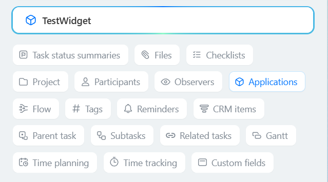

# Right Sidebar of the TASK_VIEW_SIDEBAR Card

> Scope: [`task`](../../scopes/permissions.md)

You can add your item in the right panel of the old task detail form.

Starting from version `tasks 25.700.0`, a [new task card](../../tasks/tasks-new.md) has been released. The location of the `TASK_VIEW_SIDEBAR` item is no longer present in the new card. All widgets within the card are displayed in a single Applications block.

Previously registered `TASK_VIEW_SIDEBAR` items continue to function and are displayed in the Applications block.



The specific widget placement code is specified in the `PLACEMENT` parameter of the [placement.bind](../placement-bind.md) method.



The widget will not be displayed in the interface until the application installation is complete. [Check the application installation](../../../settings/app-installation/installation-finish.md)



## Where the Widget is Embedded

#|
|| **Widget Code** | **Location** ||
|| `TASK_VIEW_SIDEBAR` | Item in the right sidebar of the task card ||
|#

## What the Handler Receives

Data is sent as a POST request {.b24-info}

```php

Array
(
    [DOMAIN] => xxx.bitrix24.com
    [PROTOCOL] => 1
    [LANG] => en
    [APP_SID] => 84986ed8551be43c882fc720b8e406e3
    [AUTH_ID] => 9e52ba6600705a0700005a4b00000001f0f1076fce1ae9b9c15bf669f414769c1eb700
    [AUTH_EXPIRES] => 3600
    [REFRESH_ID] => 8ed1e16600705a0700005a4b00000001f0f10706b7d2b53d9a0e08c50eb4b620b50d9a
    [member_id] => da45a03b265edd8787f8a258d793cc5d
    [status] => L
    [PLACEMENT] => TASK_VIEW_SIDEBAR
    [PLACEMENT_OPTIONS] => {"taskId":"286"}
)

```





### PLACEMENT_OPTIONS

The value of `PLACEMENT_OPTIONS` is a JSON string containing an array of one or more keys.



#|
|| **Parameter** | **Description** ||
|| **taskId*** 
[`string`](../../data-types.md) | The identifier of the task for which the widget was opened.

It can be used to retrieve additional information using the [tasks.task.get](../../tasks/tasks-task-get.md) method.

||
|#

## Continue Exploring

- [{#T}](../placement-bind.md)
- [{#T}](../ui-interaction/index.md)
- [{#T}](../ui-interaction/crm-card.md)
- [{#T}](../../../settings/interactivity/index.md)
- [{#T}](../open-application.md)
- [{#T}](../open-path.md)