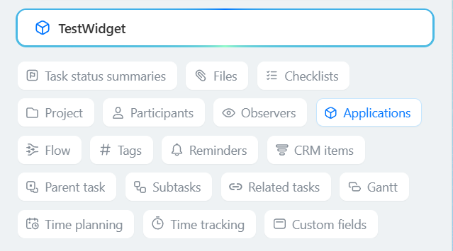

# Link in the Top Panel of the TASK_VIEW Card

> Scope: [`task`](../../scopes/permissions.md)

You can add your item to the top of the task card.

Starting from version `tasks 25.700.0`, a [new task card](../../tasks/tasks-new.md) has been released. The location for the `TASK_VIEW_TOP_PANEL` item is absent in the new card. All integrations within the card are displayed in a single "Applications" block.

Previously registered `TASK_VIEW_TOP_PANEL` items continue to function and are displayed in the "Applications" block.



The specific placement code for the widget is specified in the `PLACEMENT` parameter of the [placement.bind](../placement-bind.md) method.



The integration will not be displayed in the interface until the application installation is complete. [Check the application installation](../../../settings/app-installation/installation-finish.md)



## Where the Widget is Embedded

#| 
|| **Widget Code** | **Location** ||
|| `TASK_VIEW_TOP_PANEL` | Item at the top of the task card ||
|#

## What the Handler Receives

Data is transmitted as a POST request {.b24-info}

```php
Array
(
    [DOMAIN] => xxx.bitrix24.com
    [PROTOCOL] => 1
    [LANG] => en
    [APP_SID] => dac3aa71afd1a1fd8bef05a282dd0b20
    [AUTH_ID] => 3153ba6600705a0700005a4b00000001f0f107fd2c2625abb62bad95fe9b37a0d1fbb6
    [AUTH_EXPIRES] => 3600
    [REFRESH_ID] => 21d2e16600705a0700005a4b00000001f0f10707ca46d62b79fcd8d19a8c614e621226
    [member_id] => da45a03b265edd8787f8a258d793cc5d
    [status] => L
    [PLACEMENT] => TASK_VIEW_TOP_PANEL
    [PLACEMENT_OPTIONS] => {"TASK_ID":"286"}
)
```





### PLACEMENT_OPTIONS

The value of `PLACEMENT_OPTIONS` is a JSON string containing an array of one or more keys.



#| 
|| **Parameter** | **Description** ||
|| **TASK_ID*** 
[`string`](../../data-types.md) | The identifier of the task for which the widget was opened.

It can be used to retrieve additional information using the [tasks.task.get](../../tasks/tasks-task-get.md) method.

|| 
|#

## Continue Your Exploration

- [{#T}](../placement-bind.md)
- [{#T}](../ui-interaction/index.md)
- [{#T}](../../../settings/interactivity/index.md)
- [{#T}](../bx24-widget-methods.md)