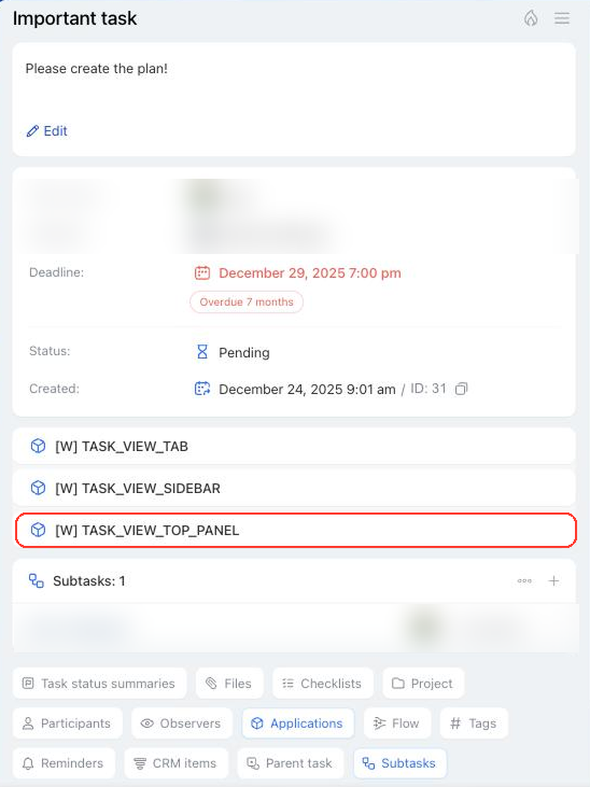

# Widget in the Task Card TASK_VIEW_TOP_PANEL



Choose a tool for developing with an AI agent:

- use [Alaio Vibecode](../../../ai-tools/vibecode.md) to build an app for Bitrix24 from a task description without knowing any programming language. The agent writes the code and deploys the app to a server, with no manual hosting setup
- use the [MCP server](../../../ai-tools/mcp.md) to develop a REST API integration in your own project. The agent refers to the official REST documentation



> Scope: [`placement, task`](../../scopes/permissions.md)

The widget adds the application interface to the task card. Until module version `tasks` 25.700.0 it was rendered as a button in the top panel; in the [new card](../../tasks/tasks-new.md) it is a row in the *Applications* block.

This placement is chosen when the application needs a screen of its own inside a task: data from an external service, a report, or a form next to the task fields.

If the application registers several card placements, the block shows one row per placement. One placement is enough for a new integration.

This placement does not allow limiting the widget to tasks of specific projects — see [OPTIONS at registration](#options).

The placement code is specified in the `PLACEMENT` parameter of the [placement.bind](../placement-bind.md) method.



The widget is not displayed in the interface until the application installation is complete. [Check the application installation](../../../settings/app-installation/installation-finish.md)



## Where the Widget is Embedded

#|
|| **Placement Code** | **Location** ||
|| `TASK_VIEW_TOP_PANEL` | Row in the *Applications* block of the task card ||
|#

### Where to Find It in the Interface

Open a task. The application row is rendered below the task fields in the *Applications* block. The row name is the `TITLE` value passed at registration.



## What the Handler Receives

Data is sent in a POST request: some parameters come in the handler URL query string, the rest in the request body {.b24-info}

```php

Array
(
    [DOMAIN] => xxx.bitrix24.com
    [PROTOCOL] => 1
    [LANG] => en
    [APP_SID] => dac3aa71afd1a1fd8bef05a282dd0b20
    [AUTH_ID] => 3153ba6600705a0700005a4b00000001f0f107fd2c2625abb62bad95fe9b37a0
    [AUTH_EXPIRES] => 3600
    [REFRESH_ID] => 21d2e16600705a0700005a4b00000001f0f10707ca46d62b79fcd8d19a8c614e
    [SERVER_ENDPOINT] => https://oauth.bitrix.info/rest/
    [APPLICATION_TOKEN] => 3f0a7c19e5b84d2196c8ad470e5f2b31
    [APPLICATION_SCOPE] => task,placement
    [member_id] => da45a03b265edd8787f8a258d793cc5d
    [status] => L
    [PLACEMENT] => TASK_VIEW_TOP_PANEL
    [PLACEMENT_OPTIONS] => {"taskId":"31","URI":"\/company\/personal\/user\/1\/tasks\/task\/view\/31\/"}
)

```

After parsing, the `PLACEMENT_OPTIONS` string from this example looks like this:

```json
{
    "taskId": "31",
    "URI": "/company/personal/user/1/tasks/task/view/31/"
}
```





### PLACEMENT_OPTIONS

The `PLACEMENT_OPTIONS` value is passed as a JSON string with the call context. In addition to the universal `URI` key, the context carries the key of the placement itself.



#|
|| **Parameter** | **Description** ||
|| **taskId***
[`string`](../../data-types.md) | Identifier of the task whose card the widget is opened from.

Task data is returned by the [tasks.task.get](../../tasks/tasks-task-get.md) method

||
|| **URI**
[`string`](../../data-types.md) | Address of the Bitrix24 page the widget is opened from ||
|#

## OPTIONS at Registration via placement.bind {#options}

This placement does not support the `groupId` connection parameter: it is supported only by [TASK_VIEW_TAB](./view-tab.md#options) and [TASK_VIEW_SIDEBAR](./view-sidebar.md#options). The values passed are not retained: the [placement.get](../placement-get.md) method returns an empty array for such a registration.

## Code Examples





- cURL (OAuth)

    ```bash
    curl -X POST \
      -H "Content-Type: application/json" \
      -H "Accept: application/json" \
      -d '{
        "PLACEMENT": "TASK_VIEW_TOP_PANEL",
        "HANDLER": "https://your-domain.com/widgets/task-view-top-panel-handler.php",
        "TITLE": "My task widget",
        "LANG_ALL": {
          "en": {
            "TITLE": "My task widget"
          },
          "de": {
            "TITLE": "Mein Aufgaben-Widget"
          }
        },
        "auth": "**put_access_token_here**"
      }' \
      https://**put_your_bitrix24_address**/rest/placement.bind
    ```

- JS (TS)

    ```ts
    // This snippet is an ES module: top-level await requires type="module" or a bundler.
    // $b24 is an already-initialized SDK instance (see the SDK "Get started" guide).
    import { Text } from '@bitrix24/b24jssdk'
    import type { B24Frame } from '@bitrix24/b24jssdk'

    declare const $b24: B24Frame

    try {
      const response = await $b24.actions.v2.call.make<boolean>({
        method: 'placement.bind',
        params: {
          PLACEMENT: 'TASK_VIEW_TOP_PANEL',
          HANDLER: 'https://your-domain.com/widgets/task-view-top-panel-handler.php',
          TITLE: 'My task widget',
          LANG_ALL: {
            en: {
              TITLE: 'My task widget',
            },
            de: {
              TITLE: 'Mein Aufgaben-Widget',
            },
          },
        },
        requestId: Text.getUuidRfc4122()
      })

      // The payload is available only on a successful response
      if (!response.isSuccess) {
        console.error(response.getErrorMessages().join('; '))
      } else {
        const result = response.getData()!.result
        console.info('Placement bound successfully:', result)
      }
    } catch (error) {
      // Thrown on transport or SDK failures (AjaxError, SdkError, etc.)
      console.error(error)
    }
    ```

- JS (UMD)

    ```html
    <!-- Load the SDK (UMD build); it is exposed as the global B24Js -->
    <script src="https://unpkg.com/@bitrix24/b24jssdk@1/dist/umd/index.min.js"></script>
    <script>
      async function bindTaskViewTopPanel() {
        try {
          // Initialize the SDK inside a Bitrix24 frame
          const $b24 = await B24Js.initializeB24Frame()

          const response = await $b24.actions.v2.call.make({
            method: 'placement.bind',
            params: {
              PLACEMENT: 'TASK_VIEW_TOP_PANEL',
              HANDLER: 'https://your-domain.com/widgets/task-view-top-panel-handler.php',
              TITLE: 'My task widget',
              LANG_ALL: {
                en: {
                  TITLE: 'My task widget',
                },
                de: {
                  TITLE: 'Mein Aufgaben-Widget',
                },
              },
            },
            requestId: B24Js.Text.getUuidRfc4122()
          })

          // The payload is available only on a successful response
          if (!response.isSuccess) {
            console.error(response.getErrorMessages().join('; '))
            return
          }

          const result = response.getData().result
          console.info('Placement bound successfully:', result)
        } catch (error) {
          // Thrown on transport or SDK failures (AjaxError, SdkError, etc.)
          console.error(error)
        }
      }

      document.addEventListener('DOMContentLoaded', bindTaskViewTopPanel)
    </script>
    ```

- PHP

    ```php
    try {
        $response = $b24Service
            ->core
            ->call(
                'placement.bind',
                [
                    'PLACEMENT' => 'TASK_VIEW_TOP_PANEL',
                    'HANDLER' => 'https://your-domain.com/widgets/task-view-top-panel-handler.php',
                    'TITLE' => 'My task widget',
                    'LANG_ALL' => [
                        'en' => [
                            'TITLE' => 'My task widget',
                        ],
                        'de' => [
                            'TITLE' => 'Mein Aufgaben-Widget',
                        ],
                    ],
                ]
            );

        $result = $response->getResponseData()->getResult();
        if ($result->error()) {
            error_log($result->error());
        } else {
            echo 'Success: ' . print_r($result->data(), true);
        }
    } catch (Throwable $e) {
        error_log($e->getMessage());
        echo 'Error binding placement: ' . $e->getMessage();
    }
    ```

- BX24.js

    ```js
    BX24.callMethod(
        'placement.bind',
        {
            PLACEMENT: 'TASK_VIEW_TOP_PANEL',
            HANDLER: 'https://your-domain.com/widgets/task-view-top-panel-handler.php',
            TITLE: 'My task widget',
            LANG_ALL: {
                en: { TITLE: 'My task widget' },
                de: { TITLE: 'Mein Aufgaben-Widget' }
            }
        },
        function(result) {
            if (result.error()) {
                console.error(result.error());
            } else {
                console.log(result.data());
            }
        }
    );
    ```

- PHP CRest

    ```php
    require_once('crest.php');

    $result = CRest::call(
        'placement.bind',
        [
            'PLACEMENT' => 'TASK_VIEW_TOP_PANEL',
            'HANDLER' => 'https://your-domain.com/widgets/task-view-top-panel-handler.php',
            'TITLE' => 'My task widget',
            'LANG_ALL' => [
                'en' => [
                    'TITLE' => 'My task widget',
                ],
                'de' => [
                    'TITLE' => 'Mein Aufgaben-Widget',
                ],
            ],
        ]
    );

    echo '<PRE>';
    print_r($result);
    echo '</PRE>';
    ```

- Go

    ```go
    // client and ctx are already created — see the Go SDK section
    res, err := client.Core().Call(ctx, "placement.bind", b24.Params{
    	"PLACEMENT": "TASK_VIEW_TOP_PANEL",
    	"HANDLER":   "https://your-domain.com/widgets/task-view-top-panel-handler.php",
    	"TITLE":     "My task widget",
    	"LANG_ALL": b24.Params{
    		"ru": b24.Params{
    			"TITLE": "My task widget",
    		},
    		"en": b24.Params{
    			"TITLE": "My task widget",
    		},
    	},
    })
    if err != nil {
    	return fmt.Errorf("placement.bind: %w", err)
    }

    // The response arrives as json.RawMessage — unmarshal it into the response
    // shape of the placement.bind method, see "Response Handling" on its page.
    fmt.Printf("%s\n", res.Result)
    ```



## Common Mistakes

#|
|| **Mistake** | **Solution** ||
|| `placement.bind` returns `WRONG_AUTH_TYPE` with the description `Application context required` | Register the placement on behalf of an application. A placement cannot be bound with a webhook ||
|| The handler does not find the task identifier | Read the identifier from the `taskId` key. The `ID` key arrives with the [TASK_LIST_CONTEXT_MENU](./list-context-menu.md) placement in the context menu of the list ||
|| The widget is displayed in all tasks even though `groupId` was passed at registration | This placement does not support `groupId` — see [OPTIONS at registration](#options) ||
|#

Other registration error codes are listed in the "Possible Error Codes" section of the [placement.bind](../placement-bind.md) page.

## Continue Learning

- [{#T}](./index.md)
- [{#T}](./view-tab.md)
- [{#T}](./view-sidebar.md)
- [{#T}](../placement-bind.md)
- [{#T}](../placement-get.md)
- [{#T}](../placement-unbind.md)
- [{#T}](../ui-interaction/index.md)
- [{#T}](../../../settings/interactivity/index.md)
- [{#T}](../bx24-widget-methods.md)
- [{#T}](../../tasks/tasks-new.md)
