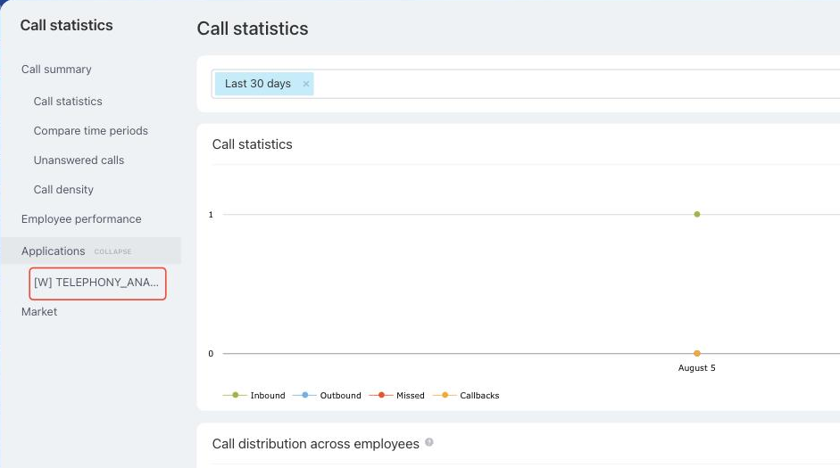

# Menu Item in Call Analytics TELEPHONY_ANALYTICS_MENU



If you are developing integrations for Bitrix24 using AI tools (Codex, Claude Code, Cursor), connect to the [MCP server](../../../ai-tools/mcp.md) so that the assistant can utilize the official REST documentation.



> Scope: [`placement, telephony`](../../scopes/permissions.md)

The widget adds its own report to the call analytics menu. The user selects the item in the menu, and the application interface opens instead of a built-in report.

The placement code is specified in the `PLACEMENT` parameter of the [placement.bind](../placement-bind.md) method.



The widget is not displayed in the interface until the application installation is complete. [Check the application installation](../../../settings/app-installation/installation-finish.md)



## Where the Widget is Embedded

#|
|| **Widget Code** | **Location** ||
|| `TELEPHONY_ANALYTICS_MENU` | Menu item in call analytics ||
|#

### Where to Find It in the Interface

Open the *Telephony* section and go to the *Call statistics* tab — the page address is `/report/telephony/`. The statistics open in a slider. The application item is displayed in the menu on the left, as a separate group below the built-in reports.



The item name and the group name are set during registration:

- `TITLE` — the item name in the menu. If the parameter is not passed, the application name is displayed instead
- `GROUP_NAME` — the name of the group the item belongs to. If the parameter is not passed, the item goes to the *Applications* group. Items of several applications with the same `GROUP_NAME` are collected into a single group

## What the Handler Receives

Data is sent in a POST request: some parameters come in the handler URL query string, the rest in the request body {.b24-info}

```php
Array
(
    [DOMAIN] => xxx.bitrix24.com
    [PROTOCOL] => 1
    [LANG] => en
    [APP_SID] => b308bae53869a142613f8852c1bd3992
    [AUTH_ID] => 4f77bb6600705a0700005a4b00000001f0f107cbd329fa1d8ea5455dc22653d12e7d54
    [AUTH_EXPIRES] => 3600
    [REFRESH_ID] => 3ff6e26600705a0700005a4b00000001f0f10746f1299672a11fa3729c3ba98ebd86d2
    [SERVER_ENDPOINT] => https://oauth.bitrix.info/rest/
    [APPLICATION_TOKEN] => 5b2f8c1d7e3a9046b8c5d2f1a7e3b904
    [APPLICATION_SCOPE] => telephony,placement
    [member_id] => da45a03b265edd8787f8a258d793cc5d
    [status] => L
    [PLACEMENT] => TELEPHONY_ANALYTICS_MENU
    [PLACEMENT_OPTIONS] => {"URI":"\/report\/telephony\/?IFRAME=Y&IFRAME_TYPE=SIDE_SLIDER"}
)
```





### PLACEMENT_OPTIONS

This placement has no own keys. The call context carries only the universal `URI` key — the address of the analytics page the widget is opened from. The analytics open in a slider, so the address contains the `IFRAME` and `IFRAME_TYPE` parameters.

This placement does not support the `OPTIONS` parameter of the [placement.bind](../placement-bind.md) method: the values passed are not retained, and [placement.get](../placement-get.md) returns an empty array.

## Code Examples





- cURL (OAuth)

    ```bash
    curl -X POST \
      -H "Content-Type: application/json" \
      -H "Accept: application/json" \
      -d '{
        "PLACEMENT": "TELEPHONY_ANALYTICS_MENU",
        "HANDLER": "https://your-domain.com/widgets/telephony-analytics-handler.php",
        "TITLE": "External telephony report",
        "GROUP_NAME": "My telephony",
        "LANG_ALL": {
          "en": {
            "TITLE": "External telephony report",
            "GROUP_NAME": "My telephony"
          },
          "de": {
            "TITLE": "Bericht zur externen Telefonie",
            "GROUP_NAME": "Meine Telefonie"
          }
        },
        "auth": "**put_access_token_here**"
      }' \
      https://**put_your_bitrix24_address**/rest/placement.bind
    ```

- JS (TS)

    ```ts
    // This snippet is an ES module: top-level await requires type="module" or a bundler.
    // $b24 is an already-initialized SDK instance (see the SDK "Get started" guide).
    import { Text } from '@bitrix24/b24jssdk'
    import type { B24Frame } from '@bitrix24/b24jssdk'

    declare const $b24: B24Frame

    try {
      const response = await $b24.actions.v2.call.make<boolean>({
        method: 'placement.bind',
        params: {
          PLACEMENT: 'TELEPHONY_ANALYTICS_MENU',
          HANDLER: 'https://your-domain.com/widgets/telephony-analytics-handler.php',
          TITLE: 'External telephony report',
          GROUP_NAME: 'My telephony',
          LANG_ALL: {
            en: {
              TITLE: 'External telephony report',
              GROUP_NAME: 'My telephony',
            },
            de: {
              TITLE: 'Bericht zur externen Telefonie',
              GROUP_NAME: 'Meine Telefonie',
            },
          },
        },
        requestId: Text.getUuidRfc4122()
      })

      // The payload is available only on a successful response
      if (!response.isSuccess) {
        console.error(response.getErrorMessages().join('; '))
      } else {
        const result = response.getData()!.result
        console.info('Placement bound successfully:', result)
      }
    } catch (error) {
      // Thrown on transport or SDK failures (AjaxError, SdkError, etc.)
      console.error(error)
    }
    ```

- JS (UMD)

    ```html
    <!-- Load the SDK (UMD build); it is exposed as the global B24Js -->
    <script src="https://unpkg.com/@bitrix24/b24jssdk@1/dist/umd/index.min.js"></script>
    <script>
      async function bindTelephonyAnalyticsMenu() {
        try {
          // Initialize the SDK inside a Bitrix24 frame
          const $b24 = await B24Js.initializeB24Frame()

          const response = await $b24.actions.v2.call.make({
            method: 'placement.bind',
            params: {
              PLACEMENT: 'TELEPHONY_ANALYTICS_MENU',
              HANDLER: 'https://your-domain.com/widgets/telephony-analytics-handler.php',
              TITLE: 'External telephony report',
              GROUP_NAME: 'My telephony',
              LANG_ALL: {
                en: {
                  TITLE: 'External telephony report',
                  GROUP_NAME: 'My telephony',
                },
                de: {
                  TITLE: 'Bericht zur externen Telefonie',
                  GROUP_NAME: 'Meine Telefonie',
                },
              },
            },
            requestId: B24Js.Text.getUuidRfc4122()
          })

          // The payload is available only on a successful response
          if (!response.isSuccess) {
            console.error(response.getErrorMessages().join('; '))
            return
          }

          const result = response.getData().result
          console.info('Placement bound successfully:', result)
        } catch (error) {
          // Thrown on transport or SDK failures (AjaxError, SdkError, etc.)
          console.error(error)
        }
      }

      document.addEventListener('DOMContentLoaded', bindTelephonyAnalyticsMenu)
    </script>
    ```

- PHP

    ```php
    try {
        $response = $b24Service
            ->core
            ->call(
                'placement.bind',
                [
                    'PLACEMENT' => 'TELEPHONY_ANALYTICS_MENU',
                    'HANDLER' => 'https://your-domain.com/widgets/telephony-analytics-handler.php',
                    'TITLE' => 'External telephony report',
                    'GROUP_NAME' => 'My telephony',
                    'LANG_ALL' => [
                        'en' => [
                            'TITLE' => 'External telephony report',
                            'GROUP_NAME' => 'My telephony',
                        ],
                        'de' => [
                            'TITLE' => 'Bericht zur externen Telefonie',
                            'GROUP_NAME' => 'Meine Telefonie',
                        ],
                    ],
                ]
            );

        $result = $response->getResponseData()->getResult();
        if ($result->error()) {
            error_log($result->error());
        } else {
            echo 'Success: ' . print_r($result->data(), true);
        }
    } catch (Throwable $e) {
        error_log($e->getMessage());
        echo 'Error binding placement: ' . $e->getMessage();
    }
    ```

- BX24.js

    ```js
    BX24.callMethod(
        'placement.bind',
        {
            PLACEMENT: 'TELEPHONY_ANALYTICS_MENU',
            HANDLER: 'https://your-domain.com/widgets/telephony-analytics-handler.php',
            TITLE: 'External telephony report',
            GROUP_NAME: 'My telephony',
            LANG_ALL: {
                en: {
                    TITLE: 'External telephony report',
                    GROUP_NAME: 'My telephony'
                },
                de: {
                    TITLE: 'Bericht zur externen Telefonie',
                    GROUP_NAME: 'Meine Telefonie'
                }
            }
        },
        function(result) {
            if (result.error()) {
                console.error(result.error());
            } else {
                console.log(result.data());
            }
        }
    );
    ```

- PHP CRest

    ```php
    require_once('crest.php');

    $result = CRest::call(
        'placement.bind',
        [
            'PLACEMENT' => 'TELEPHONY_ANALYTICS_MENU',
            'HANDLER' => 'https://your-domain.com/widgets/telephony-analytics-handler.php',
            'TITLE' => 'External telephony report',
            'GROUP_NAME' => 'My telephony',
            'LANG_ALL' => [
                'en' => [
                    'TITLE' => 'External telephony report',
                    'GROUP_NAME' => 'My telephony',
                ],
                'de' => [
                    'TITLE' => 'Bericht zur externen Telefonie',
                    'GROUP_NAME' => 'Meine Telefonie',
                ],
            ],
        ]
    );

    echo '<PRE>';
    print_r($result);
    echo '</PRE>';
    ```



## Continue Your Exploration

- [{#T}](./index.md)
- [{#T}](./call-card.md)
- [{#T}](./webrtc.md)
- [{#T}](../placement-bind.md)
- [{#T}](../ui-interaction/index.md)
- [{#T}](../bx24-widget-methods.md)
- [{#T}](../../../settings/interactivity/index.md)
