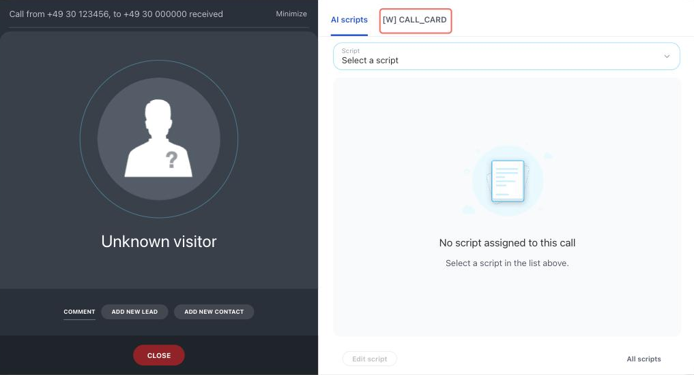

# Call Card Tab CALL_CARD



If you are developing integrations for Bitrix24 using AI tools (Codex, Claude Code, Cursor), connect to the [MCP server](../../../ai-tools/mcp.md) so that the assistant can utilize the official REST documentation.



> Scope: [`placement, telephony`](../../scopes/permissions.md)

The widget adds its own tab to the call card. The handler is invoked during a conversation and receives the call context: call identifier, phone number, call direction and state, and the linked CRM items.

The placement code is specified in the `PLACEMENT` parameter of the [placement.bind](../placement-bind.md) method.



The widget is not displayed in the interface until the application installation is complete. [Check the application installation](../../../settings/app-installation/installation-finish.md)



## Where the Widget is Embedded

#|
|| **Placement Code** | **Location** ||
|| `CALL_CARD` | Tab in the call card ||
|#

### Where to Find It in the Interface

The call card appears for the employee when a conversation starts. The application tab is displayed on the right side of the card, in the same row as the built-in tabs. The tab name is taken from the `TITLE` parameter passed during registration.



To check the widget, you need a call. External telephony raises one with the [telephony.externalCall.register](../../telephony/telephony-external-call-register.md) method and the `SHOW` = 1 parameter, or with the [telephony.externalCall.show](../../telephony/telephony-external-call-show.md) method for a call that is already registered.

The list of card tabs is built when the Bitrix24 page loads. If you registered the widget while the page was already open, reload it — otherwise the new tab will not appear in the card.

## What the Handler Receives

Data is sent in a POST request: some parameters come in the handler URL query string, the rest in the request body {.b24-info}

```php
Array
(
    [DOMAIN] => xxx.bitrix24.com
    [PROTOCOL] => 1
    [LANG] => en
    [APP_SID] => 588b8a98e848778a4ffb38fbcf70f2b9
    [AUTH_ID] => 4172bb6600705a0700005a4b00000001f0f107c42ca5bd5f61030c5d9c3e4d60d11b5a
    [AUTH_EXPIRES] => 3600
    [REFRESH_ID] => 31f1e26600705a0700005a4b00000001f0f107b1918506d8a2ed9ecf76e8fdac962471
    [SERVER_ENDPOINT] => https://oauth.bitrix.info/rest/
    [APPLICATION_TOKEN] => 5b2f8c1d7e3a9046b8c5d2f1a7e3b904
    [APPLICATION_SCOPE] => telephony,crm,placement
    [member_id] => da45a03b265edd8787f8a258d793cc5d
    [status] => L
    [PLACEMENT] => CALL_CARD
    [PLACEMENT_OPTIONS] => {"CALL_ID":"externalCall.c3ee67f1a63f6e6117c230ab59cc49ea.1723556778","PHONE_NUMBER":"+4930123456","LINE_NUMBER":"+49 30 000-00-00","LINE_NAME":"+49 30 000-00-00","CRM_ENTITY_TYPE":"COMPANY","CRM_ENTITY_ID":"17","CRM_ACTIVITY_ID":"undefined","CRM_BINDINGS":[{"ENTITY_TYPE":"DEAL","ENTITY_ID":"25"},{"ENTITY_TYPE":"COMPANY","ENTITY_ID":"17"}],"CALL_DIRECTION":"incoming","CALL_STATE":"connected","CALL_LIST_MODE":"false","URI":"\/crm\/company\/details\/17\/"}
)
```





### PLACEMENT_OPTIONS

The value of `PLACEMENT_OPTIONS` is passed as a JSON string with the call context.



#|
|| **Parameter** | **Description** ||
|| **CALL_ID***
[`string`](../../data-types.md) | The identifier of the call during which the widget was opened.

The [telephony.externalCall.register](../../telephony/telephony-external-call-register.md) method returns the same identifier. It is accepted by the methods that finish a call and attach a call recording

||
|| **PHONE_NUMBER***
[`string`](../../data-types.md) | The phone number of the client the conversation is held with.

The number arrives in normalized form, without spaces or separators. If the client's number is unknown, the key is not passed

||
|| **LINE_NUMBER**
[`string`](../../data-types.md) | The company's phone number that received the call or that the call is made from

||
|| **LINE_NAME**
[`string`](../../data-types.md) | The name of the company's phone line.

Lines are added by telephony integration applications with the [telephony.externalLine.add](../../telephony/telephony-external-line-add.md) method and are used in Sales Intelligence. If the line has no name, the key carries its number

||
|| **CRM_ENTITY_TYPE**
[`string`](../../data-types.md) | The symbolic code of the [CRM item type](../../crm/data-types.md#object_type) the call is linked to: `LEAD`, `DEAL`, `CONTACT`, `COMPANY`.

This is `entityTypeName`, not the numeric type identifier. If the call is not linked to CRM, the key arrives empty

||
|| **CRM_ENTITY_ID**
[`string`](../../data-types.md) | The identifier of the CRM item the call is linked to.

Knowing the type and the identifier, you can retrieve the item data:

- any object type — [crm.item.get](../../crm/universal/crm-item-get.md) with `entityTypeId` = '1' for leads, '2' for deals, and [etc.](../../crm/data-types.md#object_type)
- lead — [crm.lead.get](../../crm/leads/crm-lead-get.md)
- deal — [crm.deal.get](../../crm/deals/crm-deal-get.md)
- contact — [crm.contact.get](../../crm/contacts/crm-contact-get.md)
- company — [crm.company.get](../../crm/companies/crm-company-get.md)

If the call is not linked to CRM, the key carries `0`

||
|| **CRM_BINDINGS**
[`array`](../../data-types.md) | All CRM items linked to the call. Each element of the array contains the `ENTITY_TYPE` and `ENTITY_ID` keys — with the same values as the single keys above.

The `CRM_ENTITY_TYPE` and `CRM_ENTITY_ID` keys name the primary item only. If the call is linked to several items at once — for example, to a company and its deal — the full list arrives in `CRM_BINDINGS`.

If there are no linked items, the key is not passed at all

||
|| **CRM_ACTIVITY_ID**
[`string`](../../data-types.md) | The identifier of the [CRM activity](../../crm/timeline/activities/index.md) created for this call.

The [crm.activity.get](../../crm/timeline/activities/activity-base/crm-activity-get.md) method returns the activity data.

If no activity was created for the call, the key carries the string `undefined`. Check the value before using it

||
|| **CALL_DIRECTION***
[`string`](../../data-types.md) | The direction of the call. Possible values:

- `incoming` — incoming call
- `outgoing` — outgoing call
- `callback` — callback

||
|| **CALL_STATE**
[`string`](../../data-types.md) | The state of the call at the moment the widget is opened. Possible values:

- `idle` — the conversation has not started yet
- `connecting` — the connection is being established
- `connected` — active conversation

||
|| **CALL_LIST_MODE**
[`string`](../../data-types.md) | Indicates whether the call is made as part of a [call campaign](https://helpdesk.bitrix24.com/open/21815426/). The value arrives as a string: `true` or `false`

||
|#

Along with these keys, the universal `URI` key arrives — it is described above, in the standard data.

This placement does not support the `OPTIONS` parameter of the [placement.bind](../placement-bind.md) method: the values passed are not retained, and [placement.get](../placement-get.md) returns an empty array.

## Managing the Call Card From the Handler

The handler can do more than read the context: it can change the link to a CRM item, track call state changes, and disable the automatic closing of the card. These methods are described in the [{#T}](../ui-interaction/index.md) section.

## Code Examples





- cURL (OAuth)

    ```bash
    curl -X POST \
      -H "Content-Type: application/json" \
      -H "Accept: application/json" \
      -d '{
        "PLACEMENT": "CALL_CARD",
        "HANDLER": "https://your-domain.com/widgets/call-card-handler.php",
        "TITLE": "Customer profile",
        "LANG_ALL": {
          "en": {
            "TITLE": "Customer profile"
          },
          "de": {
            "TITLE": "Kundenprofil"
          }
        },
        "auth": "**put_access_token_here**"
      }' \
      https://**put_your_bitrix24_address**/rest/placement.bind
    ```

- JS (TS)

    ```ts
    // This snippet is an ES module: top-level await requires type="module" or a bundler.
    // $b24 is an already-initialized SDK instance (see the SDK "Get started" guide).
    import { Text } from '@bitrix24/b24jssdk'
    import type { B24Frame } from '@bitrix24/b24jssdk'

    declare const $b24: B24Frame

    try {
      const response = await $b24.actions.v2.call.make<boolean>({
        method: 'placement.bind',
        params: {
          PLACEMENT: 'CALL_CARD',
          HANDLER: 'https://your-domain.com/widgets/call-card-handler.php',
          TITLE: 'Customer profile',
          LANG_ALL: {
            en: {
              TITLE: 'Customer profile',
            },
            de: {
              TITLE: 'Kundenprofil',
            },
          },
        },
        requestId: Text.getUuidRfc4122()
      })

      // The payload is available only on a successful response
      if (!response.isSuccess) {
        console.error(response.getErrorMessages().join('; '))
      } else {
        const result = response.getData()!.result
        console.info('Placement bound successfully:', result)
      }
    } catch (error) {
      // Thrown on transport or SDK failures (AjaxError, SdkError, etc.)
      console.error(error)
    }
    ```

- JS (UMD)

    ```html
    <!-- Load the SDK (UMD build); it is exposed as the global B24Js -->
    <script src="https://unpkg.com/@bitrix24/b24jssdk@1/dist/umd/index.min.js"></script>
    <script>
      async function bindCallCard() {
        try {
          // Initialize the SDK inside a Bitrix24 frame
          const $b24 = await B24Js.initializeB24Frame()

          const response = await $b24.actions.v2.call.make({
            method: 'placement.bind',
            params: {
              PLACEMENT: 'CALL_CARD',
              HANDLER: 'https://your-domain.com/widgets/call-card-handler.php',
              TITLE: 'Customer profile',
              LANG_ALL: {
                en: {
                  TITLE: 'Customer profile',
                },
                de: {
                  TITLE: 'Kundenprofil',
                },
              },
            },
            requestId: B24Js.Text.getUuidRfc4122()
          })

          // The payload is available only on a successful response
          if (!response.isSuccess) {
            console.error(response.getErrorMessages().join('; '))
            return
          }

          const result = response.getData().result
          console.info('Placement bound successfully:', result)
        } catch (error) {
          // Thrown on transport or SDK failures (AjaxError, SdkError, etc.)
          console.error(error)
        }
      }

      document.addEventListener('DOMContentLoaded', bindCallCard)
    </script>
    ```

- PHP

    ```php
    try {
        $response = $b24Service
            ->core
            ->call(
                'placement.bind',
                [
                    'PLACEMENT' => 'CALL_CARD',
                    'HANDLER' => 'https://your-domain.com/widgets/call-card-handler.php',
                    'TITLE' => 'Customer profile',
                    'LANG_ALL' => [
                        'en' => [
                            'TITLE' => 'Customer profile',
                        ],
                        'de' => [
                            'TITLE' => 'Kundenprofil',
                        ],
                    ],
                ]
            );

        $result = $response->getResponseData()->getResult();
        if ($result->error()) {
            error_log($result->error());
        } else {
            echo 'Success: ' . print_r($result->data(), true);
        }
    } catch (Throwable $e) {
        error_log($e->getMessage());
        echo 'Error binding placement: ' . $e->getMessage();
    }
    ```

- BX24.js

    ```js
    BX24.callMethod(
        'placement.bind',
        {
            PLACEMENT: 'CALL_CARD',
            HANDLER: 'https://your-domain.com/widgets/call-card-handler.php',
            TITLE: 'Customer profile',
            LANG_ALL: {
                en: { TITLE: 'Customer profile' },
                de: { TITLE: 'Kundenprofil' }
            }
        },
        function(result) {
            if (result.error()) {
                console.error(result.error());
            } else {
                console.log(result.data());
            }
        }
    );
    ```

- PHP CRest

    ```php
    require_once('crest.php');

    $result = CRest::call(
        'placement.bind',
        [
            'PLACEMENT' => 'CALL_CARD',
            'HANDLER' => 'https://your-domain.com/widgets/call-card-handler.php',
            'TITLE' => 'Customer profile',
            'LANG_ALL' => [
                'en' => [
                    'TITLE' => 'Customer profile',
                ],
                'de' => [
                    'TITLE' => 'Kundenprofil',
                ],
            ],
        ]
    );

    echo '<PRE>';
    print_r($result);
    echo '</PRE>';
    ```

- Go

    ```go
    // client and ctx are already created — see the Go SDK section
    res, err := client.Core().Call(ctx, "placement.bind", b24.Params{
    	"PLACEMENT": "CALL_CARD",
    	"HANDLER":   "https://your-domain.com/widgets/call-card-handler.php",
    	"TITLE":     "Customer profile",
    	"LANG_ALL": b24.Params{
    		"ru": b24.Params{
    			"TITLE": "Customer profile",
    		},
    		"en": b24.Params{
    			"TITLE": "Customer profile",
    		},
    	},
    })
    if err != nil {
    	return fmt.Errorf("placement.bind: %w", err)
    }

    // The response arrives as json.RawMessage — unmarshal it
    // into a struct matching the response shape shown below on this page.
    fmt.Printf("%s\n", res.Result)
    ```



## Continue Your Exploration

- [{#T}](./index.md)
- [{#T}](./analytics-menu.md)
- [{#T}](./webrtc.md)
- [{#T}](../placement-bind.md)
- [{#T}](../../telephony/telephony-external-call-register.md)
- [{#T}](../ui-interaction/index.md)
- [{#T}](../bx24-widget-methods.md)
- [{#T}](../../../settings/interactivity/index.md)
