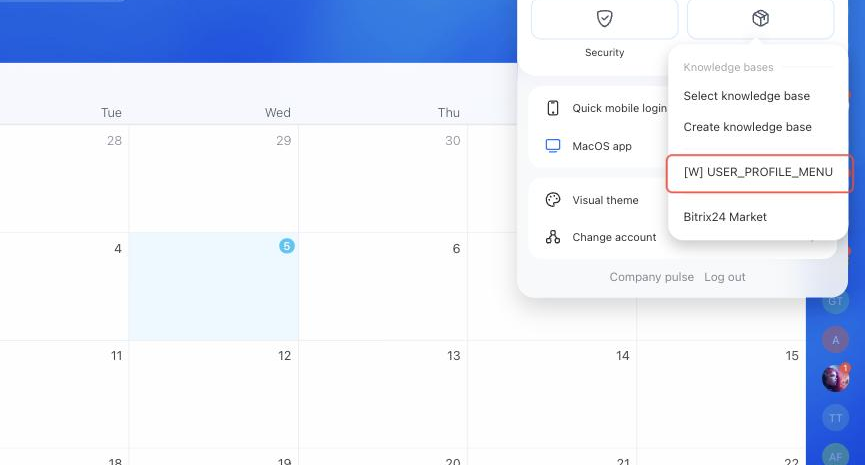

# Item in the User Menu USER_PROFILE_MENU



If you are developing integrations for Bitrix24 using AI tools (Codex, Claude Code, Cursor), connect to the [MCP server](../../../ai-tools/mcp.md) so that the assistant can utilize the official REST documentation.



> Scope: [`placement, user`](../../scopes/permissions.md)

The widget adds its own item to the user menu — the one that opens from the avatar in the upper right corner. The menu is available from any page of Bitrix24, so the placement suits actions that are not tied to a section: personal application settings, a jump to your own section, sending data about yourself to an external service.

The placement code is specified in the `PLACEMENT` parameter of the [placement.bind](../placement-bind.md) method.



The widget is not displayed in the interface until the application installation is complete. [Check the application installation](../../../settings/app-installation/installation-finish.md)



## Where the Widget is Embedded

#|
|| **Placement Code** | **Location** ||
|| `USER_PROFILE_MENU` | Item in the user menu ||
|#

### Where to Find It in the Interface

Click the avatar in the upper right corner and select the *Extensions* button. The application item is displayed in the menu that opens, together with the built-in items.



The item name is set by the `TITLE` parameter during registration. If the parameter is not passed, the application name is displayed.

## What the Handler Receives

Data is sent in a POST request: some parameters come in the handler URL query string, the rest in the request body {.b24-info}

```php
Array
(
    [DOMAIN] => xxx.bitrix24.com
    [PROTOCOL] => 1
    [LANG] => en
    [APP_SID] => bbdb976c9f5d067b1d48d102ab17b995
    [AUTH_ID] => ae70bb6600705a0700005a4b00000001f0f107ab19f75f907d2320df1129aa61f63efc
    [AUTH_EXPIRES] => 3600
    [REFRESH_ID] => 9eefe26600705a0700005a4b00000001f0f1078586205803785eca5262f6ff48e025ee
    [SERVER_ENDPOINT] => https://oauth.bitrix.info/rest/
    [APPLICATION_TOKEN] => 5b2f8c1d7e3a9046b8c5d2f1a7e3b904
    [APPLICATION_SCOPE] => user,placement
    [member_id] => da45a03b265edd8787f8a258d793cc5d
    [status] => L
    [PLACEMENT] => USER_PROFILE_MENU
    [PLACEMENT_OPTIONS] => {"USER_ID":"1","URI":"\/company\/"}
)
```





### PLACEMENT_OPTIONS

#|
|| **Key** | **Description** ||
|| **USER_ID**
[`string`](../../data-types.md) | The identifier of the current user — the one who opened the menu.

The value does not depend on whose employee card is open on the page: the menu belongs to the current user. To get the identifier of the owner of the open card, use the [USER_PROFILE_TOOLBAR](./profile-toolbar.md) placement ||
|| **URI**
[`string`](../../data-types.md) | The address of the page the widget is opened from. The menu is shown on every page of Bitrix24, so the value differs every time ||
|#

This placement does not support the `OPTIONS` parameter of the [placement.bind](../placement-bind.md) method: the values passed are not retained, and [placement.get](../placement-get.md) returns an empty array.

## Relationship with Other Objects

**User.** Using `USER_ID` from the call context, the application retrieves employee data with the [user.get](../../user/user-get.md) method — name, position, department, time zone.

## Code Examples





- cURL (OAuth)

    ```bash
    curl -X POST \
      -H "Content-Type: application/json" \
      -H "Accept: application/json" \
      -d '{
        "PLACEMENT": "USER_PROFILE_MENU",
        "HANDLER": "https://your-domain.com/widgets/profile-menu-handler.php",
        "TITLE": "My integration settings",
        "LANG_ALL": {
          "en": {
            "TITLE": "My integration settings"
          },
          "de": {
            "TITLE": "Meine Integrationseinstellungen"
          }
        },
        "auth": "**put_access_token_here**"
      }' \
      https://**put_your_bitrix24_address**/rest/placement.bind
    ```

- JS (TS)

    ```ts
    // This snippet is an ES module: top-level await requires type="module" or a bundler.
    // $b24 is an already-initialized SDK instance (see the SDK "Get started" guide).
    import { Text } from '@bitrix24/b24jssdk'
    import type { B24Frame } from '@bitrix24/b24jssdk'

    declare const $b24: B24Frame

    try {
      const response = await $b24.actions.v2.call.make<boolean>({
        method: 'placement.bind',
        params: {
          PLACEMENT: 'USER_PROFILE_MENU',
          HANDLER: 'https://your-domain.com/widgets/profile-menu-handler.php',
          TITLE: 'My integration settings',
          LANG_ALL: {
            en: {
              TITLE: 'My integration settings',
            },
            de: {
              TITLE: 'Meine Integrationseinstellungen',
            },
          },
        },
        requestId: Text.getUuidRfc4122()
      })

      // The payload is available only on a successful response
      if (!response.isSuccess) {
        console.error(response.getErrorMessages().join('; '))
      } else {
        const result = response.getData()!.result
        console.info('Placement bound successfully:', result)
      }
    } catch (error) {
      // Thrown on transport or SDK failures (AjaxError, SdkError, etc.)
      console.error(error)
    }
    ```

- JS (UMD)

    ```html
    <!-- Load the SDK (UMD build); it is exposed as the global B24Js -->
    <script src="https://unpkg.com/@bitrix24/b24jssdk@1/dist/umd/index.min.js"></script>
    <script>
      async function bindUserProfileMenu() {
        try {
          // Initialize the SDK inside a Bitrix24 frame
          const $b24 = await B24Js.initializeB24Frame()

          const response = await $b24.actions.v2.call.make({
            method: 'placement.bind',
            params: {
              PLACEMENT: 'USER_PROFILE_MENU',
              HANDLER: 'https://your-domain.com/widgets/profile-menu-handler.php',
              TITLE: 'My integration settings',
              LANG_ALL: {
                en: {
                  TITLE: 'My integration settings',
                },
                de: {
                  TITLE: 'Meine Integrationseinstellungen',
                },
              },
            },
            requestId: B24Js.Text.getUuidRfc4122()
          })

          // The payload is available only on a successful response
          if (!response.isSuccess) {
            console.error(response.getErrorMessages().join('; '))
            return
          }

          const result = response.getData().result
          console.info('Placement bound successfully:', result)
        } catch (error) {
          // Thrown on transport or SDK failures (AjaxError, SdkError, etc.)
          console.error(error)
        }
      }

      document.addEventListener('DOMContentLoaded', bindUserProfileMenu)
    </script>
    ```

- PHP

    ```php
    try {
        $response = $b24Service
            ->core
            ->call(
                'placement.bind',
                [
                    'PLACEMENT' => 'USER_PROFILE_MENU',
                    'HANDLER' => 'https://your-domain.com/widgets/profile-menu-handler.php',
                    'TITLE' => 'My integration settings',
                    'LANG_ALL' => [
                        'en' => [
                            'TITLE' => 'My integration settings',
                        ],
                        'de' => [
                            'TITLE' => 'Meine Integrationseinstellungen',
                        ],
                    ],
                ]
            );

        $result = $response->getResponseData()->getResult();
        if ($result->error()) {
            error_log($result->error());
        } else {
            echo 'Success: ' . print_r($result->data(), true);
        }
    } catch (Throwable $e) {
        error_log($e->getMessage());
        echo 'Error binding placement: ' . $e->getMessage();
    }
    ```

- BX24.js

    ```js
    BX24.callMethod(
        'placement.bind',
        {
            PLACEMENT: 'USER_PROFILE_MENU',
            HANDLER: 'https://your-domain.com/widgets/profile-menu-handler.php',
            TITLE: 'My integration settings',
            LANG_ALL: {
                en: {
                    TITLE: 'My integration settings'
                },
                de: {
                    TITLE: 'Meine Integrationseinstellungen'
                }
            }
        },
        function(result) {
            if (result.error()) {
                console.error(result.error());
            } else {
                console.log(result.data());
            }
        }
    );
    ```

- PHP CRest

    ```php
    require_once('crest.php');

    $result = CRest::call(
        'placement.bind',
        [
            'PLACEMENT' => 'USER_PROFILE_MENU',
            'HANDLER' => 'https://your-domain.com/widgets/profile-menu-handler.php',
            'TITLE' => 'My integration settings',
            'LANG_ALL' => [
                'en' => [
                    'TITLE' => 'My integration settings',
                ],
                'de' => [
                    'TITLE' => 'Meine Integrationseinstellungen',
                ],
            ],
        ]
    );

    echo '<PRE>';
    print_r($result);
    echo '</PRE>';
    ```



## Continue Learning

- [{#T}](./index.md)
- [{#T}](./profile-toolbar.md)
- [{#T}](../placement-bind.md)
- [{#T}](../placement-list.md)
- [{#T}](../placement-unbind.md)
- [{#T}](../ui-interaction/index.md)
- [{#T}](../bx24-widget-methods.md)
- [{#T}](../../user/index.md)
- [{#T}](../../../settings/interactivity/index.md)
