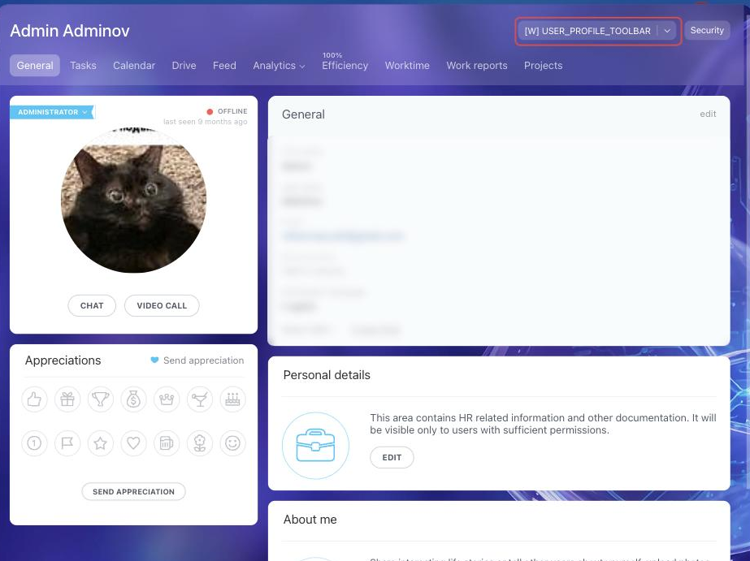

# Item in the Employee Card Menu USER_PROFILE_TOOLBAR



If you are developing integrations for Bitrix24 using AI tools (Codex, Claude Code, Cursor), connect to the [MCP server](../../../ai-tools/mcp.md) so that the assistant can utilize the official REST documentation.



> Scope: [`placement, user`](../../scopes/permissions.md)

The widget adds its own item to the employee card menu. The call context carries the identifier of the employee whose card was opened — so the placement suits actions with a specific employee: show their data from an external system, submit a request about them, open their card in your own service.

The placement code is specified in the `PLACEMENT` parameter of the [placement.bind](../placement-bind.md) method.



The widget is not displayed in the interface until the application installation is complete. [Check the application installation](../../../settings/app-installation/installation-finish.md)



## Where the Widget is Embedded

#|
|| **Placement Code** | **Location** ||
|| `USER_PROFILE_TOOLBAR` | Item in the employee card menu ||
|#

### Where to Find It in the Interface

Open an employee card — for example, from the *Employees* section; the card address is `/company/personal/user/<user ID>/`. The card opens in a slider. The application item goes to the menu of the button in the upper right corner of the card, next to the *Security* button.



This menu also holds the built-in items — working with knowledge bases and going to the Market. Bitrix24 puts one of the items on the button itself and shows the rest under the arrow next to it. The button carries the item this user opened more often, so the button caption differs from employee to employee.

The item name is set by the `TITLE` parameter during registration. If the parameter is not passed, the application name is displayed.

## What the Handler Receives

Data is sent in a POST request: some parameters come in the handler URL query string, the rest in the request body {.b24-info}

```php
Array
(
    [DOMAIN] => xxx.bitrix24.com
    [PROTOCOL] => 1
    [LANG] => en
    [APP_SID] => 8cd7740e289bf14997dd7e5e20cf6d13
    [AUTH_ID] => dc70bb6600705a0700005a4b00000001f0f1079c18b7c3d0497a2cf769e3c4d1150a9b
    [AUTH_EXPIRES] => 3600
    [REFRESH_ID] => ccefe26600705a0700005a4b00000001f0f107961459d1f9ac07ba82616c72079ede7b
    [SERVER_ENDPOINT] => https://oauth.bitrix.info/rest/
    [APPLICATION_TOKEN] => 5b2f8c1d7e3a9046b8c5d2f1a7e3b904
    [APPLICATION_SCOPE] => user,placement
    [member_id] => da45a03b265edd8787f8a258d793cc5d
    [status] => L
    [PLACEMENT] => USER_PROFILE_TOOLBAR
    [PLACEMENT_OPTIONS] => {"USER_ID":"1401","URI":"\/company\/personal\/user\/1401\/"}
)
```





### PLACEMENT_OPTIONS

#|
|| **Key** | **Description** ||
|| **USER_ID**
[`string`](../../data-types.md) | The identifier of the employee whose card was opened.

When someone else's card is open, the value does not match the current user. To get the identifier of the person who opened the widget, use the [USER_PROFILE_MENU](./profile-menu.md) placement ||
|| **URI**
[`string`](../../data-types.md) | The address of the employee card the widget is opened from ||
|#

This placement does not support the `OPTIONS` parameter of the [placement.bind](../placement-bind.md) method: the values passed are not retained, and [placement.get](../placement-get.md) returns an empty array.

## Relationship with Other Objects

**User.** Using `USER_ID` from the call context, the application retrieves employee data with the [user.get](../../user/user-get.md) method — name, position, department, time zone.

## Code Examples





- cURL (OAuth)

    ```bash
    curl -X POST \
      -H "Content-Type: application/json" \
      -H "Accept: application/json" \
      -d '{
        "PLACEMENT": "USER_PROFILE_TOOLBAR",
        "HANDLER": "https://your-domain.com/widgets/profile-toolbar-handler.php",
        "TITLE": "HR system data",
        "LANG_ALL": {
          "en": {
            "TITLE": "HR system data"
          },
          "de": {
            "TITLE": "Daten aus dem HR-System"
          }
        },
        "auth": "**put_access_token_here**"
      }' \
      https://**put_your_bitrix24_address**/rest/placement.bind
    ```

- JS (TS)

    ```ts
    // This snippet is an ES module: top-level await requires type="module" or a bundler.
    // $b24 is an already-initialized SDK instance (see the SDK "Get started" guide).
    import { Text } from '@bitrix24/b24jssdk'
    import type { B24Frame } from '@bitrix24/b24jssdk'

    declare const $b24: B24Frame

    try {
      const response = await $b24.actions.v2.call.make<boolean>({
        method: 'placement.bind',
        params: {
          PLACEMENT: 'USER_PROFILE_TOOLBAR',
          HANDLER: 'https://your-domain.com/widgets/profile-toolbar-handler.php',
          TITLE: 'HR system data',
          LANG_ALL: {
            en: {
              TITLE: 'HR system data',
            },
            de: {
              TITLE: 'Daten aus dem HR-System',
            },
          },
        },
        requestId: Text.getUuidRfc4122()
      })

      // The payload is available only on a successful response
      if (!response.isSuccess) {
        console.error(response.getErrorMessages().join('; '))
      } else {
        const result = response.getData()!.result
        console.info('Placement bound successfully:', result)
      }
    } catch (error) {
      // Thrown on transport or SDK failures (AjaxError, SdkError, etc.)
      console.error(error)
    }
    ```

- JS (UMD)

    ```html
    <!-- Load the SDK (UMD build); it is exposed as the global B24Js -->
    <script src="https://unpkg.com/@bitrix24/b24jssdk@1/dist/umd/index.min.js"></script>
    <script>
      async function bindUserProfileToolbar() {
        try {
          // Initialize the SDK inside a Bitrix24 frame
          const $b24 = await B24Js.initializeB24Frame()

          const response = await $b24.actions.v2.call.make({
            method: 'placement.bind',
            params: {
              PLACEMENT: 'USER_PROFILE_TOOLBAR',
              HANDLER: 'https://your-domain.com/widgets/profile-toolbar-handler.php',
              TITLE: 'HR system data',
              LANG_ALL: {
                en: {
                  TITLE: 'HR system data',
                },
                de: {
                  TITLE: 'Daten aus dem HR-System',
                },
              },
            },
            requestId: B24Js.Text.getUuidRfc4122()
          })

          // The payload is available only on a successful response
          if (!response.isSuccess) {
            console.error(response.getErrorMessages().join('; '))
            return
          }

          const result = response.getData().result
          console.info('Placement bound successfully:', result)
        } catch (error) {
          // Thrown on transport or SDK failures (AjaxError, SdkError, etc.)
          console.error(error)
        }
      }

      document.addEventListener('DOMContentLoaded', bindUserProfileToolbar)
    </script>
    ```

- PHP

    ```php
    try {
        $response = $b24Service
            ->core
            ->call(
                'placement.bind',
                [
                    'PLACEMENT' => 'USER_PROFILE_TOOLBAR',
                    'HANDLER' => 'https://your-domain.com/widgets/profile-toolbar-handler.php',
                    'TITLE' => 'HR system data',
                    'LANG_ALL' => [
                        'en' => [
                            'TITLE' => 'HR system data',
                        ],
                        'de' => [
                            'TITLE' => 'Daten aus dem HR-System',
                        ],
                    ],
                ]
            );

        $result = $response->getResponseData()->getResult();
        if ($result->error()) {
            error_log($result->error());
        } else {
            echo 'Success: ' . print_r($result->data(), true);
        }
    } catch (Throwable $e) {
        error_log($e->getMessage());
        echo 'Error binding placement: ' . $e->getMessage();
    }
    ```

- BX24.js

    ```js
    BX24.callMethod(
        'placement.bind',
        {
            PLACEMENT: 'USER_PROFILE_TOOLBAR',
            HANDLER: 'https://your-domain.com/widgets/profile-toolbar-handler.php',
            TITLE: 'HR system data',
            LANG_ALL: {
                en: {
                    TITLE: 'HR system data'
                },
                de: {
                    TITLE: 'Daten aus dem HR-System'
                }
            }
        },
        function(result) {
            if (result.error()) {
                console.error(result.error());
            } else {
                console.log(result.data());
            }
        }
    );
    ```

- PHP CRest

    ```php
    require_once('crest.php');

    $result = CRest::call(
        'placement.bind',
        [
            'PLACEMENT' => 'USER_PROFILE_TOOLBAR',
            'HANDLER' => 'https://your-domain.com/widgets/profile-toolbar-handler.php',
            'TITLE' => 'HR system data',
            'LANG_ALL' => [
                'en' => [
                    'TITLE' => 'HR system data',
                ],
                'de' => [
                    'TITLE' => 'Daten aus dem HR-System',
                ],
            ],
        ]
    );

    echo '<PRE>';
    print_r($result);
    echo '</PRE>';
    ```

- Go

    ```go
    // client and ctx are already created — see the Go SDK section
    res, err := client.Core().Call(ctx, "placement.bind", b24.Params{
    	"PLACEMENT": "USER_PROFILE_TOOLBAR",
    	"HANDLER":   "https://your-domain.com/widgets/profile-toolbar-handler.php",
    	"TITLE":     "HR system data",
    	"LANG_ALL": b24.Params{
    		"ru": b24.Params{
    			"TITLE": "HR system data",
    		},
    		"en": b24.Params{
    			"TITLE": "HR system data",
    		},
    	},
    })
    if err != nil {
    	return fmt.Errorf("placement.bind: %w", err)
    }

    // The response arrives as json.RawMessage — unmarshal it into the response
    // shape of the placement.bind method, see "Response Handling" on its page.
    fmt.Printf("%s\n", res.Result)
    ```



## Continue Learning

- [{#T}](./index.md)
- [{#T}](./profile-menu.md)
- [{#T}](../placement-bind.md)
- [{#T}](../placement-list.md)
- [{#T}](../placement-unbind.md)
- [{#T}](../ui-interaction/index.md)
- [{#T}](../bx24-widget-methods.md)
- [{#T}](../../user/index.md)
- [{#T}](../../../settings/interactivity/index.md)
