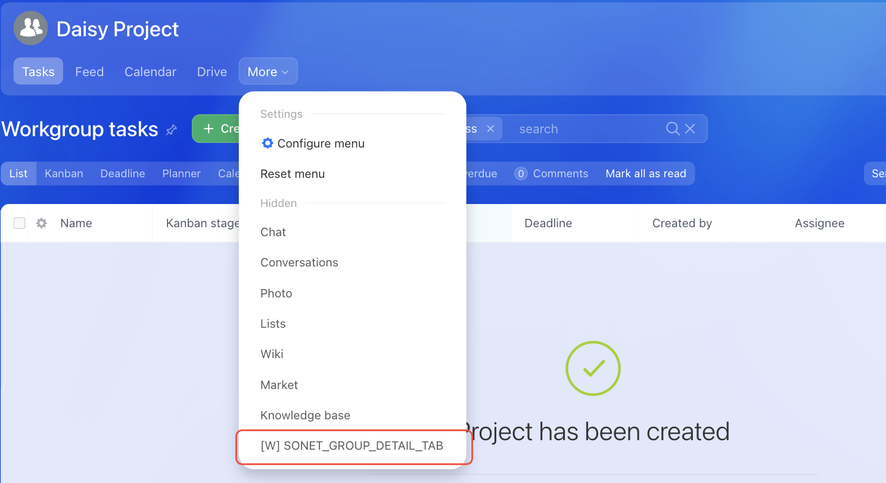

# Workgroup Menu Item SONET_GROUP_DETAIL_TAB



If you are developing integrations for Bitrix24 using AI tools (Codex, Claude Code, Cursor), connect to the [MCP server](../../../ai-tools/mcp.md) so that the assistant can utilize the official REST documentation.



> Scope: [`sonet_group`](../../scopes/permissions.md)

The widget adds its own item to the menu of a workgroup or project.

The placement code is specified in the `PLACEMENT` parameter of the [placement.bind](../placement-bind.md) method.



The widget will not be displayed in the interface until the application installation is complete. [Check the application installation](../../../settings/app-installation/installation-finish.md)



## Where the Widget is Embedded

#|
|| **Widget Code** | **Location** ||
|| `SONET_GROUP_DETAIL_TAB` | Menu item of a workgroup or project ||
|#

### Where to Find It in the Interface

The location of the item depends on the interface version. The classic view currently runs in most Bitrix24 accounts, while the new Projects AI view is being rolled out gradually.

In the classic interface, open the workgroup and click *More* in the row of group tabs. The application item is displayed at the end of the list. The screenshot shows this view.

In the Projects AI interface, the item moves to the *•••* menu on the project card.



## What the Handler Receives

Data is sent in a POST request: some parameters come in the handler URL query string, the rest in the request body {.b24-info}

```php
Array
(
    [DOMAIN] => xxx.bitrix24.com
    [PROTOCOL] => 1
    [LANG] => en
    [APP_SID] => 3c900e588b941b81eef07608e4253159
    [AUTH_ID] => 1a55ba6600705a0700005a4b00000001f0f107db29f044c6ff24e984d378967134de83
    [AUTH_EXPIRES] => 3600
    [REFRESH_ID] => 0ad4e16600705a0700005a4b00000001f0f10731fce9fa3219163d545a088b217cc2d4
    [SERVER_ENDPOINT] => https://oauth.bitrix.info/rest/
    [APPLICATION_TOKEN] => 5b2f8c1d7e3a9046b8c5d2f1a7e3b904
    [APPLICATION_SCOPE] => sonet_group,task,placement
    [member_id] => da45a03b265edd8787f8a258d793cc5d
    [status] => L
    [PLACEMENT] => SONET_GROUP_DETAIL_TAB
    [PLACEMENT_OPTIONS] => {"GROUP_ID":"10","URI":"\/workgroups\/group\/10\/"}
)
```





### PLACEMENT_OPTIONS

The value of `PLACEMENT_OPTIONS` is passed as a JSON string with the context of the call.

For `SONET_GROUP_DETAIL_TAB`, the context includes the key:

- `GROUP_ID` — identifier of the workgroup or project from which the widget was opened. Use it to retrieve the workgroup data with the [sonet_group.get](../../sonet-group/sonet-group-get.md) method

## Continue Learning

- [{#T}](./toolbar.md)
- [{#T}](./robot-designer-toolbar.md)
- [{#T}](../placement-bind.md)
- [{#T}](../ui-interaction/index.md)
- [{#T}](../bx24-widget-methods.md)
- [{#T}](../../../settings/interactivity/index.md)
