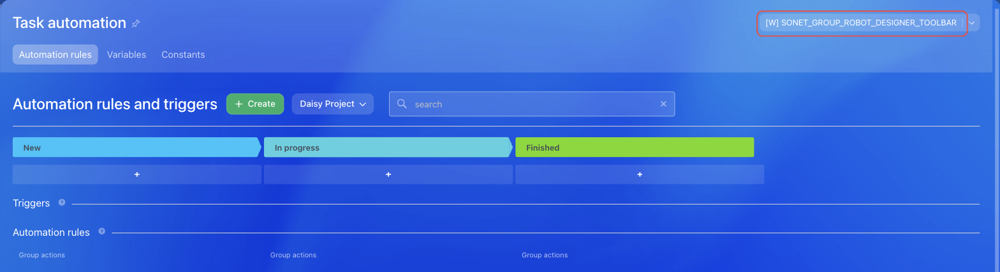

# Button in the Workgroup Automation Rules Designer SONET_GROUP_ROBOT_DESIGNER_TOOLBAR



If you are developing integrations for Bitrix24 using AI tools (Codex, Claude Code, Cursor), connect to the [MCP server](../../../ai-tools/mcp.md) so that the assistant can utilize the official REST documentation.



> Scope: [`sonet_group`](../../scopes/permissions.md)

The widget adds its own button to the automation rules designer, where the task automation of a workgroup or project is configured.

The placement code is specified in the `PLACEMENT` parameter of the [placement.bind](../placement-bind.md) method.



The widget will not be displayed in the interface until the application installation is complete. [Check the application installation](../../../settings/app-installation/installation-finish.md)



## Where the Widget is Embedded

#|
|| **Widget Code** | **Location** ||
|| `SONET_GROUP_ROBOT_DESIGNER_TOOLBAR` | Button in the workgroup automation rules designer ||
|#

### Where to Find It in the Interface

Open the tasks of a workgroup or project and click *Automation rules*. The application button is displayed on the right in the header of the *Task automation* window.

Do not confuse this placement with [`TASK_ROBOT_DESIGNER_TOOLBAR`](../task/robot-designer-toolbar.md): that one belongs to the tasks section and requires the `task` scope.



## What the Handler Receives

Data is sent in a POST request: some parameters come in the handler URL query string, the rest in the request body {.b24-info}

```php
Array
(
    [DOMAIN] => xxx.bitrix24.com
    [PROTOCOL] => 1
    [LANG] => en
    [APP_SID] => 25e596577c2a1ddf98c7863421330527
    [AUTH_ID] => 5d56ba6600705a0700005a4b00000001f0f107d21c0babb82529a32836e165141a2010
    [AUTH_EXPIRES] => 3600
    [REFRESH_ID] => 4dd5e16600705a0700005a4b00000001f0f107a934a327935855b75f8c3686204e3bd5
    [SERVER_ENDPOINT] => https://oauth.bitrix.info/rest/
    [APPLICATION_TOKEN] => 5b2f8c1d7e3a9046b8c5d2f1a7e3b904
    [APPLICATION_SCOPE] => sonet_group,task,placement
    [member_id] => da45a03b265edd8787f8a258d793cc5d
    [status] => L
    [PLACEMENT] => SONET_GROUP_ROBOT_DESIGNER_TOOLBAR
    [PLACEMENT_OPTIONS] => {"GROUP_ID":"10","URI":"\/workgroups\/group\/10\/tasks\/"}
)
```





### PLACEMENT_OPTIONS

The value of `PLACEMENT_OPTIONS` is passed as a JSON string with the context of the call.

For `SONET_GROUP_ROBOT_DESIGNER_TOOLBAR`, the context includes the key:

- `GROUP_ID` — identifier of the workgroup or project whose automation the user is configuring. Use it to retrieve the workgroup data with the [sonet_group.get](../../sonet-group/sonet-group-get.md) method

## Continue Learning

- [{#T}](./index.md)
- [{#T}](./toolbar.md)
- [{#T}](../task/robot-designer-toolbar.md)
- [{#T}](../placement-bind.md)
- [{#T}](../ui-interaction/index.md)
- [{#T}](../bx24-widget-methods.md)
