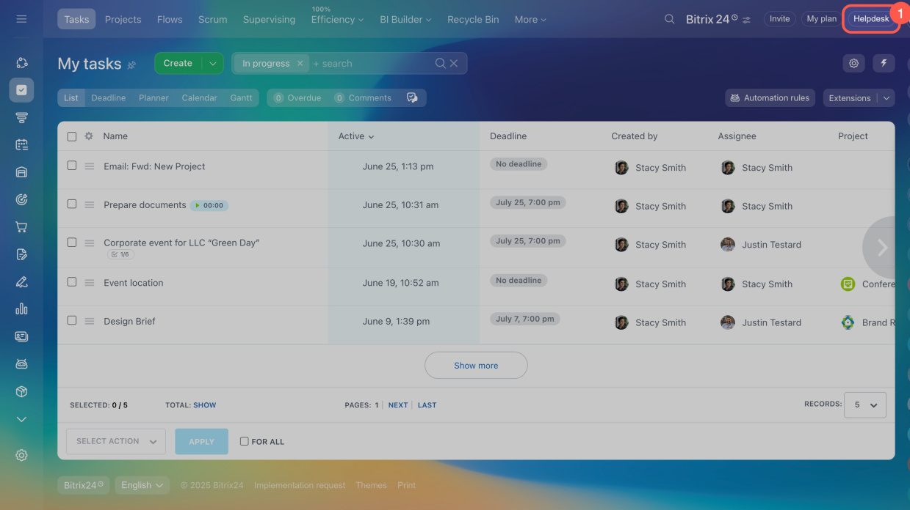
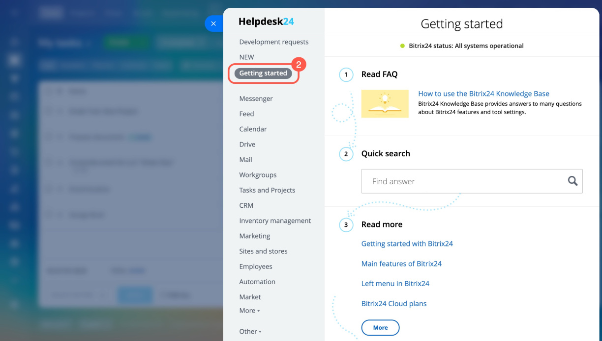
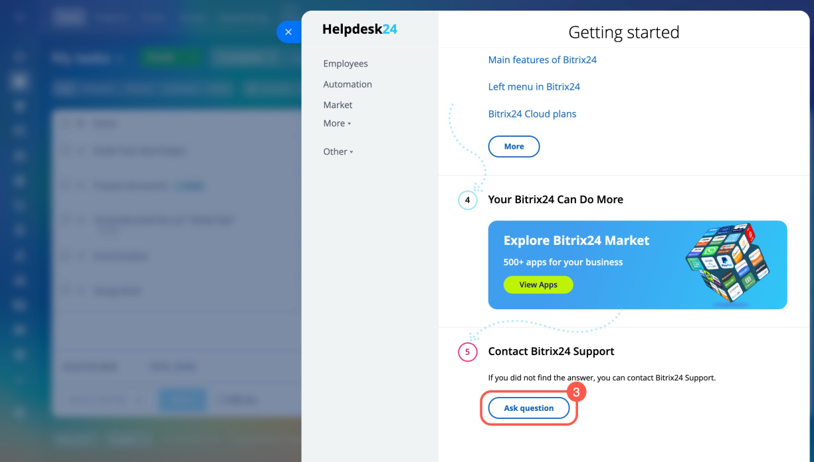

# How to Contact Support

For questions regarding the REST API of Bitrix24, you can reach out to technical support.



Technical support is available only on commercial plans. Support can be contacted by an administrator or a Bitrix24 Partner. On the free plan and in demo mode, support is only available through the chat-bot [Martha AI](https://helpdesk.bitrix24.com/open/24410660/).



## How Support Can Help

- Assist with documentation, for example, finding a method based on its description.
- Accept requests for new functionality.
- Explain how a method or event works.
- Accept reports about a non-functioning method or event.

## Where to Find the Support Chat

In the upper right corner, click _Help (1) > Getting Started (2) > Ask a Question (3)_. A chat with support will open.







In one chat, a support staff member addresses only one issue. If you have multiple questions, create [parallel dialogues](https://helpdesk.bitrix24.com/open/15510780/).

## What to Send to Support

### Question About Method Functionality

1. Describe the method you are having trouble with. You can attach a link to the documentation page.

2. Send the request code.

3. Response to the request: JSON response, error message.

4. Describe what you expect from the method.



   ```javascript
   BX24.callMethod(
       'crm.item.productrow.add', {
           fields: {
               ownerId: 13142,
               ownerType: 'D',
               productId: 9621,
               price: 80000.000000,
               quantity: 2,
               discountTypeId: 2,
               discountRate: 20,
               taxRate: 20,
               taxIncluded: 'Y',
               measureCode: 796,
               sort: 10,
           },
       },
       function(result) {
           if (result.error()) {
               console.error(result.error());
           } else {
               console.log(result.data());
           }
       }
   );
   ```





```json
{
    "result": {
        "productRow": {
            "id": 17647,
            "ownerId": 13142,
            "ownerType": "D",
            "productId": 9621,
            "price": 80000,
            "quantity": 2,
            "discountTypeId": 2,
            "discountRate": 20,
            "taxRate": 20,
            "taxIncluded": "Y",
            "measureCode": 796,
            "sort": 10,
            "type": 4,
            "productName": "iphone 14",
            "priceAccount": 80000,
            "priceExclusive": 66666.67,
            "priceNetto": 83333.34,
            "priceBrutto": 100000.01,
            "discountSum": 16666.67,
            "customized": "Y",
            "measureName": "pcs",
            "xmlId": ""
        }
    },
    "time": {
        "start": 1716887721.77879,
        "finish": 1716887723.259695,
        "duration": 1.4809050559997559,
        "processing": 1.2986550331115723,
        "date_start": "2024-05-28T12:15:21+02:00",
        "date_finish": "2024-05-28T12:15:23+02:00"
    }
}
```





```json
{\"error\":422,\"error_description\":\"Parameter resourceIds must be array\"}" 
```

    

### Question About Event Functionality

1. Describe the event you are having trouble with. You can attach a link to the documentation page.

2. Provide the URL of the handler that is subscribed to the event:
	- URL from the `handler` field of the [event.bind](//api-reference/events/event-bind.md) method,
	- URL from the `URL of your handler*` field of the [outgoing webhook](./local-integrations/local-webhooks.md).

3. Indicate the date and time when the event last failed to trigger.