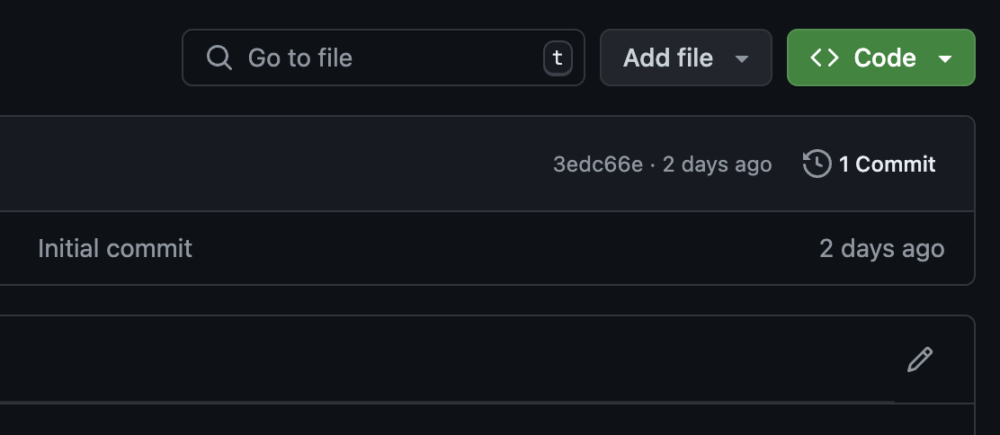

# How to Fix and Enhance Documentation

We appreciate everyone who contributes to improving and expanding the documentation. Your experience working with the REST API of Bitrix24 helps novice developers get acquainted with the API, while experienced developers find answers to their questions.

## How the Documentation is Organized

The documentation for the Bitrix24 REST API consists of a project made up of Markdown and YAML files, which are necessary for managing structure and navigation.

Markdown is convenient for technical documentation and is familiar to many developers. Even if you have never used it before, you can quickly get the hang of it by referring to the content of the current documentation.

The final documentation is generated from the md/yaml files into static HTML files and is automatically published.

We assume you are already familiar with the principles of working in version control systems.

The repository has a main branch for the automatic assembly of documentation. Only documentation editors have access to work with this branch.

Other contributors can create their own branches and make changes in them. They can then submit them for review using pull requests.

## How to Make Changes to an Existing Article

In the upper right corner of each documentation article, there is an edit button.

Clicking the link will open the article in the repository that you plan to modify.

1. In the repository's navigation menu, select the Code tab.
2. In the upper right corner of the file window, click the Edit this file button (pencil icon).
3. Make the necessary changes in the text editor directly in your browser.
4. GitHub will suggest automatically creating a fork of the repository. Choose this option to create a fork.
5. After making changes, scroll down to the Propose changes section.
    - Enter a title and description of the changes: what you changed and why.
    - Click the Propose changes button.
6. You will be redirected to the pull request creation page.
7. On the pull request creation page, click Create pull request.
8. Your change request will be sent to the documentation editors. We strive to review proposed requests promptly.

## How to Create a New Article

You can add your article to the documentation.

1. Go to the documentation repository.
2. Navigate to the section where you want to propose adding an article.
3. In the upper right corner of the file list, click the Add file button.
4. Select Create new file.
5. Enter the file name in the Name your file field. The article file should have an md extension.
6. In the text editor below, add the content of the new file.
7. GitHub will suggest automatically creating a fork of the repository. Choose this option to create a fork.
8. After making changes, scroll down to the Propose new file section.
    - Enter a title and description: what file you are adding and why.
    - Click Propose new file.
9. You will be redirected to the pull request creation page.
10. On the pull request creation page, click Create pull request.
11. Your change request will be sent to the documentation editors. We strive to review proposed requests promptly.