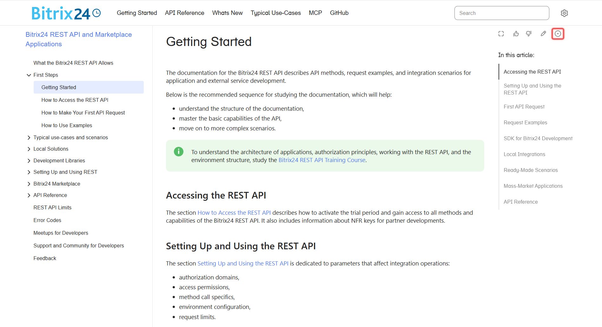
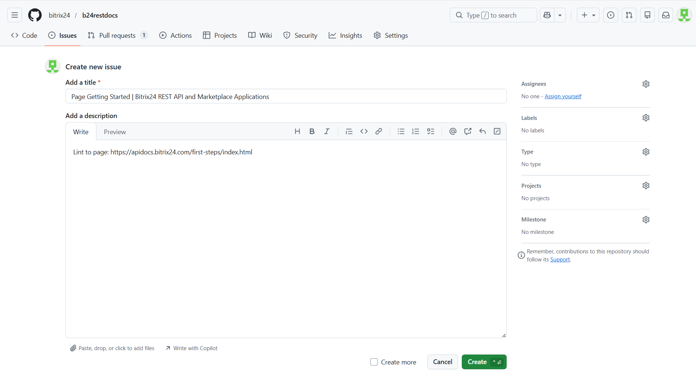
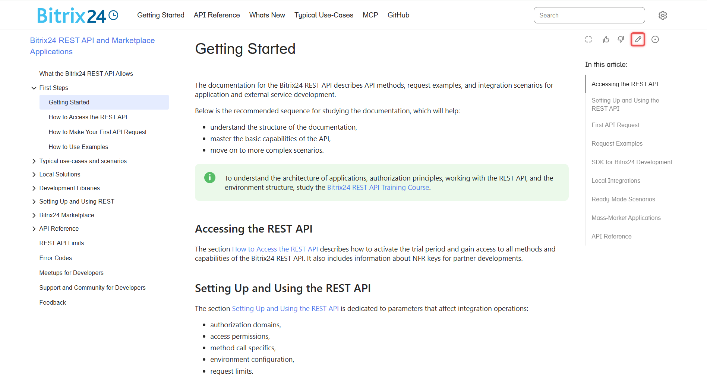
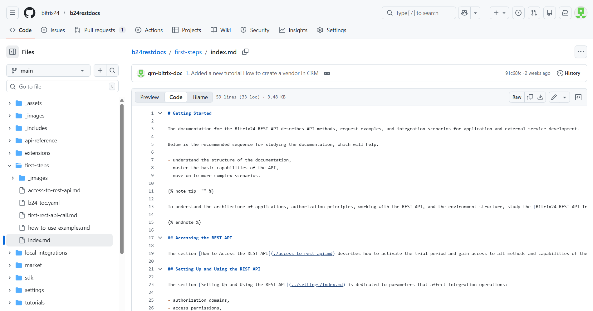

# Feedback

The REST API documentation for Bitrix24 is available in an open repository on [GitHub](https://github.com/bitrix24/b24restdocs). If you find an error, want to correct the material, or add something new, please let us know. We take all suggestions seriously and strive to respond quickly.

To help the project, you can:

- report an error through an Issue,
- make changes via a Pull Request,
- suggest a new article.

## How the Documentation is Structured

The documentation is stored on GitHub as files in Markdown and YAML formats. The final HTML pages are generated automatically.

The main branch of the repository is `main`. Only editors can make changes to it. All other contributors work through their branches and Pull Requests.

## How to Leave an Issue

An Issue is suitable if you notice an error in an article or want to ask a question.

### How to Leave an Issue from the Documentation Page

1. Open the desired article and click on the circle icon with a dot at the top of the page.

   

2. You will be redirected to the GitHub repository. The Issue form will open automatically.

   

3. Fill out the form:

   - The title of the article will appear in the Add a title field. You can leave it as is.
   - The link to the article will automatically populate in the Add a description field. Here, describe the problem or question in detail.

4. Click Create.

### How to Leave an Issue from the GitHub Repository

1. In the top menu, select the Issues tab and click New issue.
2. The Issue creation form will open.
3. Fill out the form:

   - In the Add a title field, briefly describe the problem.
   - In the Add a description field, describe the problem or question in detail.

4. Click Create.

## How to Submit a Pull Request

A Pull Request is suitable if you want to correct or improve an existing article.

### How to Submit a Pull Request from the Documentation Page

1. Open the desired article and click on the pencil icon at the top of the page.

   

2. You will be redirected to the GitHub repository. The file of the article you plan to change will open.

   

3. In the upper right corner, click on the pencil icon. GitHub will suggest creating a Fork—confirm this.
4. Make changes directly in the interface and click Commit changes.
5. GitHub will suggest creating a Pull Request—confirm this.
6. The Pull Request creation form will open.
7. Fill out the form:

   - In the Add a title field, briefly describe the changes.
   - In the Add a description field, describe in detail what you changed and why.

8. Click Create pull request.

### How to Submit a Pull Request from the GitHub Repository

1. In the upper right corner, click Fork to create a copy of the repository.
2. Find the necessary file and make changes.
3. Click Commit changes.
4. In the top menu of the repository, select the Pull request tab and click New pull request.
5. The Pull Request creation form will open.
6. Fill out the form:

   - In the Add a title field, briefly describe the changes.
   - In the Add a description field, describe in detail what you changed and why.

7. Click Create pull request.

## How to Suggest a New Article

1. Open the documentation repository on GitHub.
2. Navigate to the section where you want to add the file.
3. In the upper right corner, click *Add file > Create new file*.
4. Specify the file name with the `.md` extension.
5. Write the article text in Markdown format and click Commit changes.
6. In the section where you added the new file, find the `b24-toc.yaml` file.
7. Add a new item in it as follows:

   ```
   - name: How to Access the REST API 
     href: access-to-rest-api.md
   ```

   - `name: Menu item title` — the title of the article. For articles about methods and events, only provide a description in the menu item. For example, for the article "Create a New Deal crm.deal.add," the menu item should be "Create a New Deal."
   - `href: file-name.md` — the name of the file.

8. Click Commit changes.
9. GitHub will suggest creating a Pull Request—confirm this.
10. The Pull Request creation form will open.
11. Fill out the form:
    - In the Add a title field, specify which file you added.
    - In the Add a description field, describe the topic of the article and why you are suggesting it.
12. Click Create pull request.
