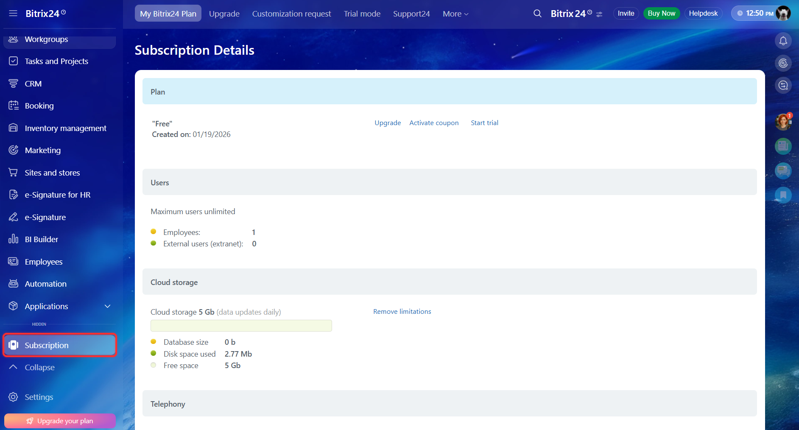

# How to Access the REST API

The REST API in Bitrix24 is available only on paid plans. The subscription cost [depends on the plan](https://www.bitrix24.com/prices/).

To access the REST API, check your current plan in the Subscription section of the main menu in Bitrix24. If the account is on a free plan, select and activate an appropriate plan.



- [Plans and Payments](https://helpdesk.bitrix24.com/section/47912/)



## How to Test the API Before Purchase

Before switching to a paid plan, you can test the capabilities of the REST API by activating the demo version.

To enable the trial mode:

1. Go to the My Planner widget in the top menu of Bitrix24.
2. In the trial section, click Activate.
3. In the pop-up window, click Activate Trial Mode.



- [Free trial](https://helpdesk.bitrix24.com/open/20237014/)



## Access for Technology Partners

If you are developing mass-market applications for placement in the Bitrix24 Marketplace, request a special NFR key. This key activates the partner plan with a subscription to the Marketplace for working with the REST API on the test account.

To obtain an NFR key:

1. Register as a technology partner. Fill out the form on the [Developer's area site](https://vendors.bitrix24.com/technology-partnership/) and click the Become a Partner button.
2. After gaining access to the Developer's area, submit a request for the NFR key through the internal support chat.



- [Overview of Mass-Market Applications](../market/index.md)
- [Technology Partnership](../market/technology-partnership.md)



## User Permissions When Working with the API

The REST API executes requests on behalf of the user who sends them. The API does not extend access permissions. Through the API, you can only do what the user can do in the interface. For example, if a user does not see a task in the task list, they will not be able to retrieve it through the REST API method.

To gain maximum access, use an administrator account.

### Limitations via Scope

Permissions for executing REST API methods are additionally regulated through `scope`. Bitrix24 scopes define which methods an application or webhook can access.



- [Available Bitrix24 Scopes](../api-reference/scopes/permissions.md)



## What’s Next

After activating the trial period or switching to a paid plan, you can start making your first request to the REST API.



For the REST API to work on-premise, the necessary network connections must be open. If external access is restricted, the API will be unavailable.





- [How to Make Your First API Request](./first-rest-api-call.md)
- [Required Network Access](../settings/cloud-and-on-premise/network-access.md)

