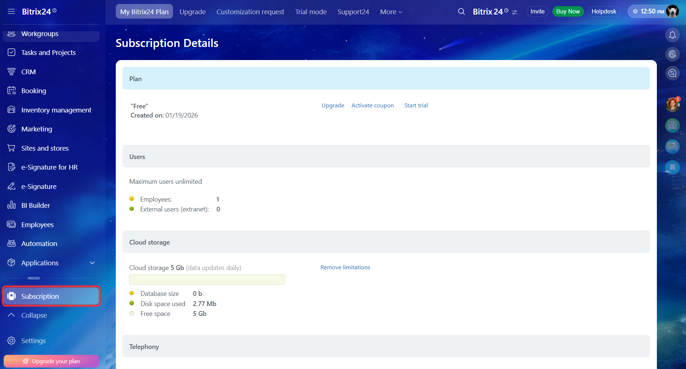

# How to Access the REST API



If you are developing integrations for Bitrix24 using AI tools (Codex, Claude Code, Cursor), connect to the [MCP server](../ai-tools/mcp.md) so that the assistant can utilize the official REST documentation.



You can access the Bitrix24 REST API in three ways:

- purchase a Market subscription for permanent work with the REST API
- enable Trial mode to test the REST API before purchasing
- request an NFR key if you are developing mass-market applications for the Bitrix24 Market

## Permanent Access

To work with the REST API without trial period limitations, purchase a Market subscription. It is available on paid Bitrix24 plans, and the cost [depends on the plan](https://www.bitrix24.com/prices/).

1. Check your current plan in the My Plan section of the Bitrix24 main menu. If Bitrix24 is on a free plan, select and activate a suitable plan.

   

2. Purchase a Market subscription. Go to *My Plan > Bitrix24 CoPilot + Market subscription* and click Buy subscription.



- [My Plan Widget Features](https://helpdesk.bitrix24.com/open/21293016/)



## Trial Access

Before purchasing a paid subscription, you can activate a trial version of the Market. During this period, the REST API will be available for testing and development.

To enable Trial mode:

1. Go to the My Plan widget in the Bitrix24 top menu.
2. In the Bitrix24 CoPilot + Market section, click Enable Demo.



In the Bitrix24 Self-Hosted version, you can only activate the Market trial period if you have an active subscription. If you are using a trial key for the Self-Hosted version, the Market demo mode will be unavailable.





- [Free 15-Day Trial](https://helpdesk.bitrix24.com/open/20237014/)



## Access for Technology Partners

If you are developing mass-market applications to be listed in the Bitrix24 Market, request a special NFR key. This key activates a partner plan with a Market subscription to allow the REST API to function in a test Bitrix24 environment.

To obtain an NFR key:

1. Register as a technology partner. Fill out the application form on the [Developer's area website](https://vendors.bitrix24.com/technology-partnership/) and click the Become a Partner button.
2. After gaining access to the Developer's area, submit an NFR key request via the internal Helpdesk chat.



- [Mass-Market Applications Overview](../market/index.md)
- [Technology Partnership](../market/technology-partnership.md)



## Factors Affecting Request Execution

After activating access, the request result depends on user permissions, `scope`, and Bitrix24 network settings.

### User Permissions

The REST API executes requests on behalf of the user who sends them. The API does not extend access permissions: through the API, you can only perform actions that the user can perform within the interface. For example, if a user cannot see a task in the task list, they will not be able to retrieve it via a REST API method.

To obtain maximum access, use an `administrator` account.

### Restrictions via Scopes

Permissions to execute REST API methods are additionally regulated via `scope`. Bitrix24 scopes determine which methods an application or webhook can access. If a user has access to the data, but the application or webhook does not have the necessary `scope`, the method will not execute.



- [Available Bitrix24 Scopes](../api-reference/scopes/permissions.md)



### Network Access for Self-Hosted Versions

In the self-hosted version of Bitrix24, the necessary network connections must be open. If external access is restricted, the REST API will be unavailable.



- [Required Network Access](../settings/cloud-and-on-premise/network-access.md)



## What's Next

Once the Bitrix24 Market subscription or trial mode is active, you can proceed to making your first request to the REST API.



- [How to Make Your First API Request](./first-rest-api-call.md)


