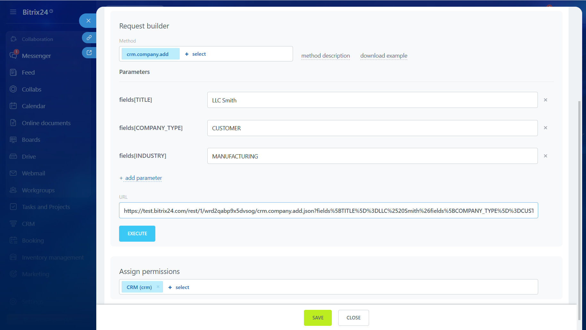
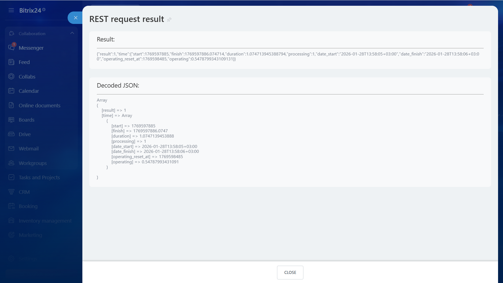

# How to Make Your First API Request

To make your first request to the REST API, use an inbound webhook. This is a ready-made tool for calling API methods with the permissions of the user who created the webhook.

## How to Create an Inbound Webhook

1. In the left menu of Bitrix24, open the *Applications > Developer resources* section.
2. Go to the *Common use cases > Other > Inbound webhook* tab. A slider will appear with the already generated webhook code.



Do not share the secret webhook code with anyone and do not embed it in public web pages or scripts.



## Request Builder

Below the webhook code is the Request Builder block. It allows you to select the necessary values for methods and parameters.

1. Choose a method from the list. If the desired method is not in the list:
   - Set the required scopes in the Assign permissions block and save the webhook.
   - Enter the method name in the URL.

   

2. Specify the method parameters if necessary.
3. Click the Execute button. The request will be sent to the Bitrix24 API, and you will see the response in JSON format.

   

## Webhook URL Structure

To perform a request from an external system, a URL is used, which is generated automatically. You can view it in the generator.

The URL consists of several parts:

- test.bitrix24.com — the address of your Bitrix24
- /rest — indication of working through the REST API
- /1 — identifier of the user who created the webhook
- /wrd2qabp9x5dvsog — unique webhook code
- /crm.company.add — the invoked REST API method
- .json — data format
- ?fields — parameters required for the specific method

## Assign permissions

In the Assign permissions block, specify which Bitrix24 modules the webhook can access. You can find out which scopes are needed to execute a specific method on the page describing that method.



- [Available Scopes in Bitrix24](../api-reference/scopes/permissions.md)



## Other Ways to Work with the API

Inbound webhooks are suitable for personal use. For developing local applications that will work for different users or mass-market solutions for the Bitrix24 Marketplace, authorization via OAuth 2.0 is required.

- To register local applications, go to the *Common use cases > Other > Local application* tab.
- To place solutions in the Marketplace, you need to become a participant in the partner program. To do this, fill out the application on the [developer's area website](https://vendors.bitrix24.com/technology-partnership/).



- [Local Applications](../local-integrations/local-apps.md)
- [Overview of Mass-Market Applications](../market/index.md)
- [OAuth 2.0 Authorization Protocol](../settings/oauth/index.md)

