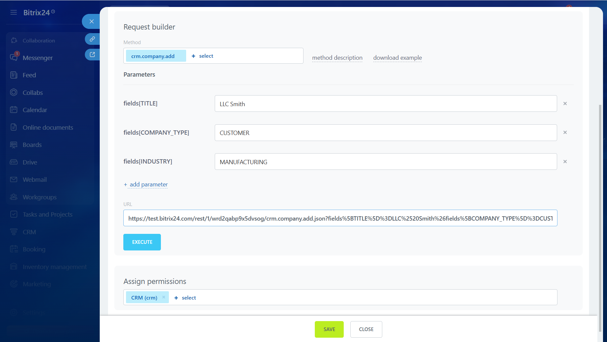
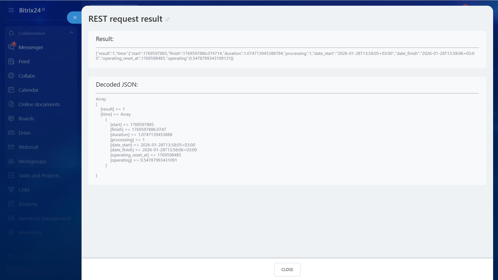
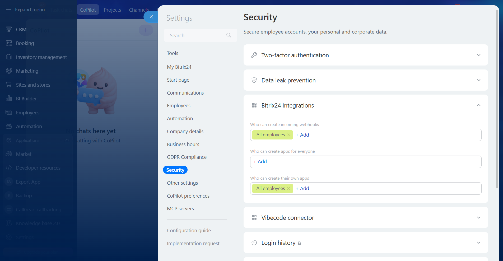

# How to Make Your First API Request



If you are developing integrations for Bitrix24 using AI tools (Codex, Claude Code, Cursor), connect to the [MCP server](../ai-tools/mcp.md) so that the assistant can utilize the official REST documentation.



To make your first request to the REST API, create an incoming webhook. This is a ready-to-use tool for calling API methods with the permissions of the user who created the webhook.

On this page, you will learn how to configure a webhook, perform a test request, and choose the appropriate authorization method for your integration.

## How to Create an Incoming Webhook

1. In the Bitrix24 left menu, open the *Applications > Developer resources* section.
2. Go to the *Scenarios > Other > Incoming webhook* tab. A slider will appear containing the pre-generated webhook code.

If the *Incoming webhook* item is missing, the permission to create webhooks is disabled. Ask the administrator to [grant access to webhook creation](#webhook-app-access).

## Request Generator

Below the webhook code is the *Request Generator* block. You can use it to select the required method and parameter values.

1. Select a method from the list. If the required method is not in the list:
   - Set the necessary scopes in the Permission settings block and save the webhook.
   - Manually enter the method name in the URL.

   

2. Specify the method parameters if necessary.
3. Click the Execute button. The request will be sent to the Bitrix24 API, and you will see the response in JSON format.

   

## Webhook URL Structure

To execute a request from an external system, a URL is used which is generated automatically. You can view it in the generator.

Example URL:

```http
https://test.bitrix24.com/rest/1/4l777m8lapmdaz1n/crm.company.add.json?fields[TITLE]=Company
```

The URL consists of several parts:

- `test.bitrix24.com` — your Bitrix24 address
- `/rest` — indication of REST API access
- `/1` — the identifier of the user who created the webhook
- `/4l777m8lapmdaz1n` — the unique webhook code
- `/crm.company.add` — the called Bitrix24 REST API method
- `.json` — the data format
- `?fields` — parameters required for the specific method



Never share the secret webhook code and do not embed it in public web page code or scripts.



## Webhook Permission Settings

The Permission settings block specifies which Bitrix24 modules the webhook can access. Requests are executed with the permissions of the user who created the webhook and only within the selected scopes. You can find out which scopes are required to execute a specific method on its description page.


   
- [Available Bitrix24 Scopes](../api-reference/scopes/permissions.md)



## How to Configure Access to Webhook Creation for Employees {#webhook-app-access}

In Bitrix24, access to webhook creation may be disabled by default.

An employee without administrator permissions cannot grant this access to themselves. An administrator can allow webhook creation for all employees or selected users.

1. Open *Settings > Bitrix24 settings*. The section is available only to employees with administrator permissions.
2. In the new window, go to *Security > Bitrix24 integrations*.
3. In the *Who can create incoming webhooks* field, click *Add* and select all employees or selected users



## Other Ways to Work with the API

Incoming webhooks are suitable for personal use and internal scenarios where requests are executed on behalf of a single user. For local applications that will run for different users, use OAuth 2.0. For commercial solutions that will be listed in the Bitrix24 Market, OAuth 2.0 and solution registration are also required.

- To register local applications, go to the *Scenarios > Other > Local application* tab. If the *Local application* item is missing, ask the administrator to configure access to application creation in the same way as access to webhook creation.
- To list solutions in the Market, you must become a partner program member. To do this, fill out the application form on the [developer portal website](https://vendors.bitrix24.com/technology-partnership/).



- [Local applications](../local-integrations/local-apps.md)
- [Commercial applications overview](../market/index.md)
- [OAuth 2.0 authorization protocol](../settings/oauth/index.md)


