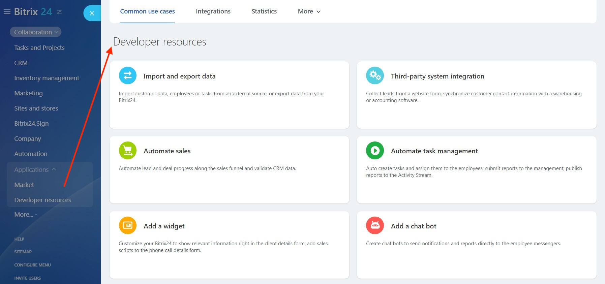
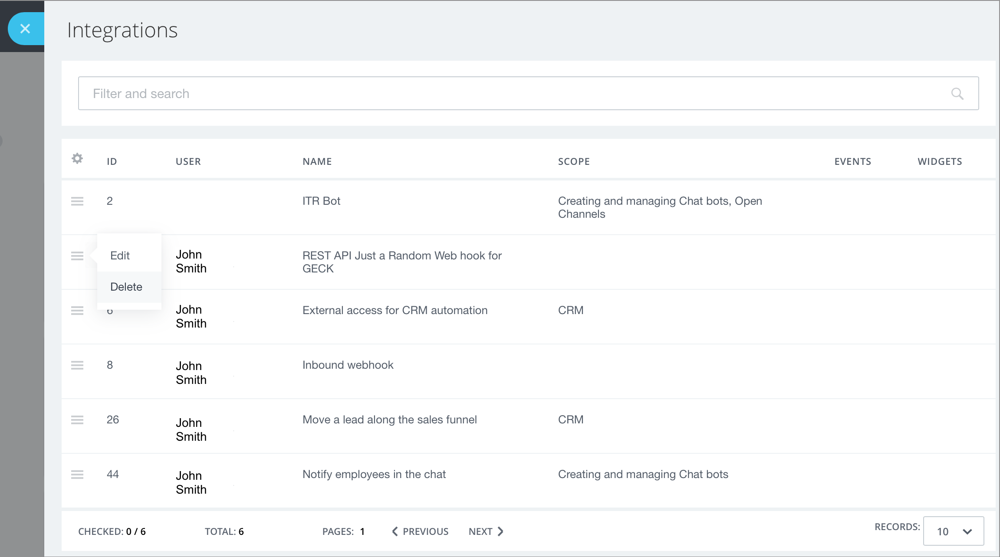
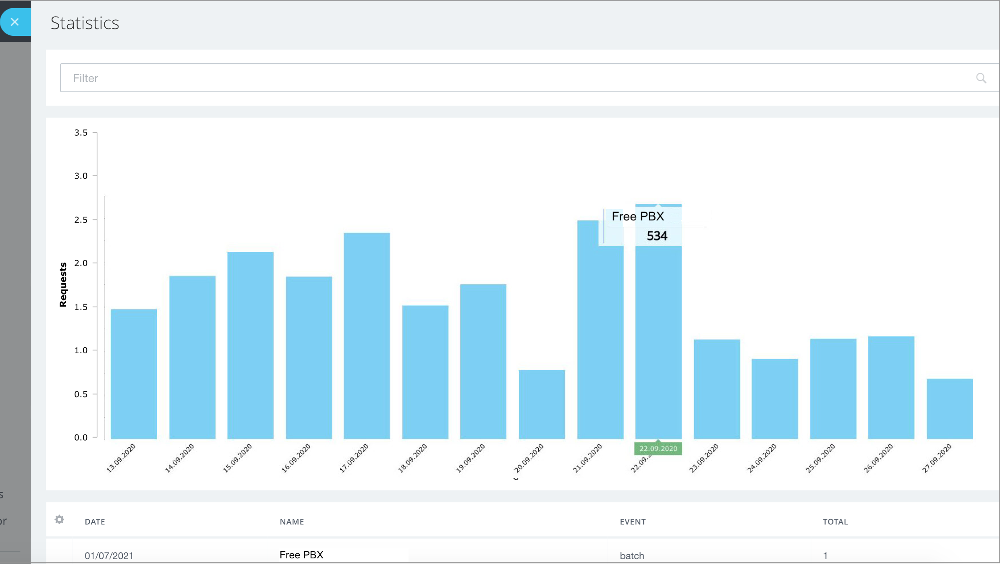

# Developer resources in Bitrix24



If you are developing integrations for Bitrix24 using AI tools (Codex, Claude Code, Cursor), connect to the [MCP server](../ai-tools/mcp.md) so that the assistant can utilize the official REST documentation.



The *Applications > Developer resources* page contains tools for creating local integrations: [webhooks](./local-webhooks.md), [local applications](./local-apps.md), сommon use cases, and REST load monitoring.

For quick REST API calls in one Bitrix24 account, choose an incoming webhook. To send Bitrix24 events to an external handler, create an outgoing webhook. If the integration needs its own interface or application event handling, create a local application.

Webhooks and applications can be created if Bitrix24 has [access to the REST API](../first-steps/access-to-rest-api.md). Permanent use requires a BitrixGPT + Market subscription; trial mode can be enabled for testing.

By default, only a Bitrix24 administrator can create applications for all users, while all users can create incoming webhooks and their own applications. An administrator can change these settings.

## Common use cases

On the *Common use cases* tab, you can select an integration example or create a webhook or local application.

### Import and export data

Import customer data, employees or tasks from an external source, or export data from your Bitrix24.

- Import counterparties
- Export counterparties
- Other—implement your own scenarios for adding widgets to Bitrix24

### Third-party system integration

Collect leads from a website form, synchronize customer contact information with a warehousing or accounting software.

- Synchronize counterparties
- Add leads

### Automate sales

Automate lead and deal progress along the sales funnel and validate CRM data.

- Move a lead through the pipeline
- Move a deal through the pipeline

### Automate task management

Auto create tasks and assign them to the employees; submit reports to the management; publish reports to the Activity Stream.

- Send a notification
- Publish a report in the feed

### Add a widget

Customize your Bitrix24 to show relevant information right in the client details form; add sales scripts to the phone call details form.

- Display your data in the CRM form
- Add your action to the CRM form
- Add a sales script to the call form
- Generate an invoice based on task labor costs

### Add a chat bot

Create chat bots to send notifications and reports directly to the employee messengers.

- Notify employees in chat
- Forward chat messages to the bot

### Other

Create inbound or outbound webhooks, or a local app.

- Local application
- Outbound webhook
- Inbound webhook

### How to Configure a Scenario

Select a scenario and open its settings. The available fields depend on the integration type.

For incoming webhook scenarios, a REST request builder is available. Use it to select a method, add parameters, execute the request, and download a code example.

In the *Assign permissions* section, select the Bitrix24 tools the integration will work with. Permission codes and `scope` selection are described in [{#T}](../api-reference/scopes/index.md).

After saving, the integration appears on the *Integrations* tab.

## Integrations

All created integrations are displayed in one list: incoming and outgoing webhooks, local applications, and their associated event handlers, widgets, and chatbots.

The Bitrix24 administrator sees all created webhooks and applications. Regular users see only the integrations they created.

The list displays the following integration information:

- ID
- User
- Name
- Permissions
- Events
- Widgets

You can customize the displayed fields by clicking the gear icon in the upper left corner of the list.

From this list, you can also edit the integration settings or delete it.

An integration can be deleted by the Bitrix24 administrator or the employee who created it. The associated webhook, event handlers, local application, widgets, and chatbot are deleted with it.



The secret codes of other users' webhooks are not available even to the administrator. If an administrator edits another user's webhook, the secret code is refreshed and the administrator becomes the webhook owner.



## Statistics

On the *Statistics* tab, the Bitrix24 administrator can view the number of REST requests for each webhook and application. Data can be filtered for a period of up to 14 days. For more information, see [Developer resources: Check REST load in Bitrix24](https://helpdesk.bitrix24.com/open/21001036/).

## Continue Exploring

- [{#T}](./local-webhooks.md)
- [{#T}](./local-apps.md)
- [{#T}](./use-cases.md)
- [{#T}](../api-reference/scopes/index.md)
