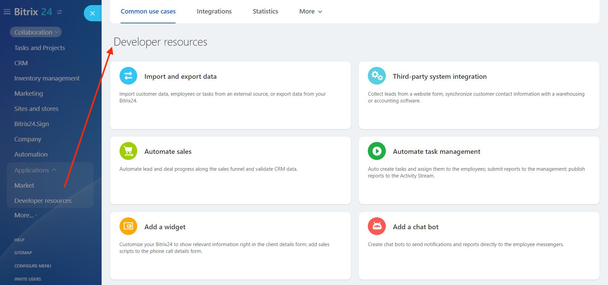

# Developer Resources in Bitrix24

In the **Developer resources** (*Applications > Developer resources*) section, you will find convenient tools to simplify the integration and enhancement of your *Bitrix24*:

The following tools are available:

- Common use cases
- Integrations
- Statistics

Let's take a closer look at each of these tools.

## Common use cases

This tab contains common use cases for integration using examples of code and pre-set parameters based on webhooks and local applications.

In the settings of each case (or a scenario), there is a REST request builder (1) that allows you to select the necessary parameter values for further use in external systems:

In the request generator, you can choose the REST API method, read the method description, download a ready-made code example (which already includes the necessary parameters for making requests), and add your own parameters. You can also execute the request and obtain results to verify the webhook's functionality.

The access permission settings (2) allow you to restrict request execution to specific Bitrix24 tools.

After saving, the created applications and webhooks will be displayed in the **Integrations** tab.

### List of Common use cases

Common use cases are separated into categories

- **Import and export data** (copy client data, employee lists, tasks from any external source, or transfer data accumulated in Bitrix24 to an external system):
    - Import contractors
    - Export contractors
    - Other (implement your own scenarios for adding widgets to Bitrix24)

- **Third-party system integratio** (automate lead collection from a website form, synchronize changes in client contact details with inventory or accounting systems):
    - Synchronize contractors
    - Add leads

- **Automate sales** (automatically move leads and deals through the Sales Funnel and verify data accuracy in CRM):
    - Move lead through the Sales Funnel
    - Move deal through the Sales Funnel

- **Automate management tasks** (automatically assign tasks to employees, inform management about emerging issues, and publish reports in the live feed):
    - Assign a task
    - Send a notification
    - Publish a report in the live feed
    - Monitor tasks

- **Add a widget** (customize the Bitrix24 interface: display your information directly in the client card, sales scripts in the call card):
    - Display your data in the CRM card
    - Add your action to the CRM card
    - Add sales script to the call card
    - Generate invoice based on task labor costs

- **Add a chat bot** (create chatbots that send notifications and reports to employees directly in the messenger):
    - Inform employees in chat
    - Forward messages from chat to the bot

- **Other** (create an incoming webhook, outgoing webhook, or local application):
    - Local application
    - Outgoing webhook
    - Incoming webhook

## Integrations

All created integrations (webhooks and applications) in the Bitrix24 account are displayed in a single list on the page:

This list shows the following information about the integrations:

- Creator
- Name
- Access permissions
- Events
- Widgets

You can customize the displayed fields by clicking the gear icon in the upper left corner of the list.

From this list, you can also edit the integration settings (or delete it).

> **Important!** The secret codes of **other people's** webhooks are not accessible even to the administrator. If an administrator edits someone else's webhook, the secret code will be reset, and the administrator will become the owner of that webhook.

### More About the Secret Code in the URL

The URL consists of:

- **doc-test-b24.bitrix24.com** — your Bitrix24 address
- **/rest** — indicating that the work is being done through REST with webhooks
- **/1** — the identifier of the user who created the webhook
- **/df22bpupqj6k9wok** — the secret code
- **/crm.contact.get** — the invoked REST API method. In this case, it is the method that returns a contact by identifier
- **.json** — an optional parameter ("transport"). When creating new webhooks, this can be omitted (by default, `.json` will be used). In the ready-made solutions constructor, `.json` is explicitly included
- **?ID=42** — parameters required for a specific method. In this case, it is the identifier. Parameters are specified after the question mark and separated by the `&` symbol

## Statistics

This section displays the total number of daily REST requests for your Bitrix24, along with detailed statistics for each webhook, external integration, or application:

