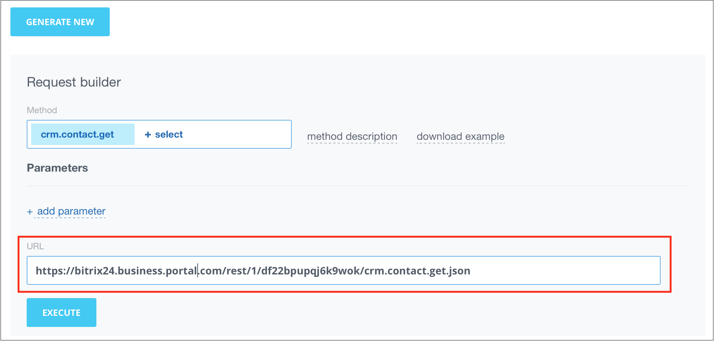
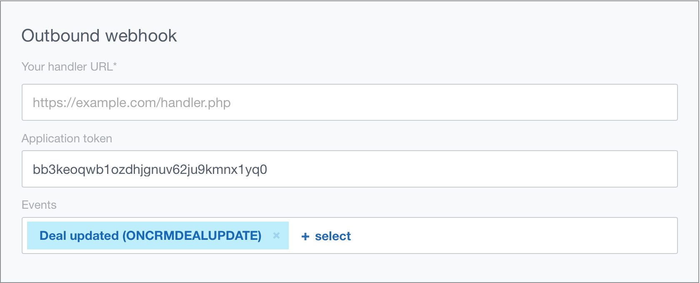

# Incoming and Outgoing Webhooks



Some data may be missing — we will complete it shortly.







- add "Typical use-cases and scenarios" about ready-made scenarios for webhooks.





A local webhook is a simplified way to access the methods and events of the Bitrix24 REST API, specifically designed for use within a single account.

Local webhooks are divided into incoming and outgoing.

## Incoming Webhook

Through the user interface of the Developer resources section, you can obtain and record an authorization key — an incoming webhook.

This key can then be used to call REST methods, and it does not have an expiration date (unlike OAuth 2.0 authorization tokens).

This makes webhooks an exceptionally simple and convenient mechanism for working with REST, but it is important to understand that this simplicity has its drawbacks:

- User participation is required to create a webhook (you cannot generate webhooks automatically).
- Since the webhook does not expire, any "leak" of the webhook URL can lead to unauthorized access to your Bitrix24 within the permissions of that specific webhook. Therefore, this mechanism is suitable for "internal" integrations but not for mass-market use cases.
- A number of REST methods are not available for use through webhooks, as their logic requires an "application context," and there is no application in Bitrix24 terms for webhooks (in particular, methods for embedding applications in the Bitrix24 interface, telephony events, some chatbot events, etc.).

Despite these limitations, for the vast majority of integration tasks within a specific project, webhooks are an ideal option for working with the REST API.



- [{#T}](../tutorials/crm/index.md)
- [{#T}](../tutorials/ai/add-joke-prompt.md)



You can create an incoming webhook from the **Developer resources** section (*Applications > Developer resources, "Ready-made scenarios" tab > Other > Incoming webhook*).

In the opened form:

- change the name of the webhook
- in the request generator, select the REST API method (you can read the method description and download a ready-made code example with the necessary parameters for making requests)
- test the webhook by clicking the **Execute** button
- specify access permissions, allowing requests only from certain Bitrix24 tools

The request generator will provide a sample URL that should be used when sending data from an external system to Bitrix24.



**The URL consists of:**

- **doc-test-b24.bitrix24.com** — the address of your Bitrix24
- **/rest** — indicating that the work is being done through REST with webhooks
- **/1** — the identifier of the user who created the webhook
- **/173glortu42lvpju** — the secret code

> **Attention!** This code is confidential information. It must be kept secret.

- **/crm.contact.get** — the called REST API method. In this case, it is the method that returns a contact by its identifier.
- **.json** — an optional parameter ("transport"). When creating new webhooks, it can be omitted (by default, `.json` will be used). In the ready-made solutions constructor, `.json` is explicitly included.
- **?ID=42** — parameters required for the specific method. In this case, it is the identifier. Parameters are specified after the question mark and separated by the `&` symbol.

## Outgoing Webhook

For some scenarios, it would be convenient for our automation to trigger automatically when a user changes some data in Bitrix24. For this, there is a tool in local integrations called "Outgoing webhook."



- [{#T}](../tutorials/crm/index.md)
- [{#T}](../tutorials/ai/add-joke-prompt.md)



> **Attention!** An active license is required for the outgoing webhook to work in the on-premise version of Bitrix24; it will not work on demo accounts.

You can create an outgoing webhook from the **Developer resources** section (*Applications > Developer resources, "Ready-made scenarios" tab > Other > Outgoing webhook*).

In the opened form:

1. Change the name of the webhook.
2. Specify **the URL of your handler** — the page on an external resource where the webhook will send requests.
3. Choose the event that will trigger the webhook.

    When creating an outgoing webhook, a token will be generated as a string of random characters. This code will allow you to verify within the handler that the handler was indeed called by your Bitrix24.

    

4. Place the following code on the handler page:

    Example handler code for the event [ONCRMDEALUPDATE](../api-reference/crm/deals/events/on-crm-deal-update.md)

    ```php
    <?php
    print_r($_REQUEST);
    writeToLog($_REQUEST, 'incoming');
    /**
    * Write data to log file.
    *
    * @param mixed $data
    * @param string $title
    *
    * @return bool
    */
    function writeToLog($data, $title = '') {
        $log = "\n------------------------\n";
        $log .= date("Y.m.d G:i:s") . "\n";
        $log .= (strlen($title) > 0 ? $title : 'DEBUG') . "\n";
        $log .= print_r($data, 1);
        $log .= "\n------------------------\n";
        file_put_contents(getcwd() . '/hook.log', $log, FILE_APPEND);
        return true;
    }
    ```

    To test, open any deal for editing and save the changes; the log will display a history similar to this:

    ```plaintext
    2017.01.17 12:58:29
    incoming
    Array
    (
        [event] => ONCRMDEALUPDATE
        [data] => Array
            (
                [FIELDS] => Array
                    (
                        [ID] => 662
                    )

            )

        [ts] => xxx
        [auth] => Array
            (
                [domain] => xxx.bitrix24.com
                [client_endpoint] => https://xxx.bitrix24.com/rest/
                [server_endpoint] => https://oauth.bitrix.info/rest/
                [member_id] => xxx
                [application_token] => xxx
            )

    )
    ```



To ensure the outgoing webhook works, make sure that the necessary [network access](../api-reference/cloud-and-on-premise/network-access.md) is open on your server.



## Continue Learning

- [{#T}](local-apps.md)