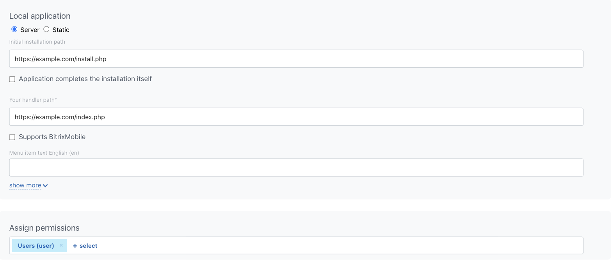
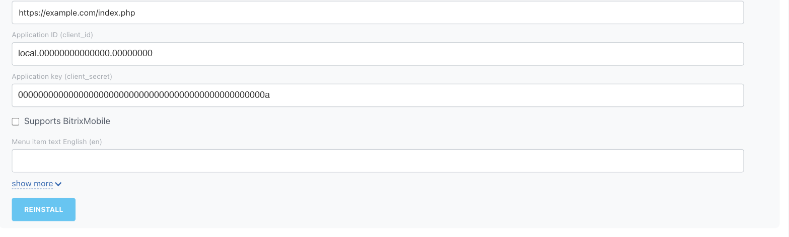

# Server-Side Local Application Without a User Interface



If you are developing integrations for Bitrix24 using AI tools (Codex, Claude Code, Cursor), connect to the [MCP server](../ai-tools/mcp.md) so that the assistant can utilize the official REST documentation.



A server-side local application without a user interface runs its code on your server and does not display a page of its own inside Bitrix24. There is no item for such an application in the left menu — it is launched not by a user but by your code: a scheduler, an external service, or an event handler.

The application works on behalf of the user who installed it. It receives the tokens once, at installation, retains them on its side, and renews them itself.

The application works only in the Bitrix24 where it was created. If the solution has to be installed on different Bitrix24 accounts, develop a [mass-market application](../market/index.md).

Other types of local applications and the criteria for choosing between them are described in the article [{#T}](./local-apps.md).

## How Authorization Works {#how-auth-works}

Bitrix24 does not open a page of such an application, so there is nowhere to pass the tokens to at every launch. The application implements the full OAuth 2.0 flow.

1. You save the local application form.
2. Bitrix24 sends a POST request to the address from the *Initial installation path* field and passes the [ONAPPINSTALL](../api-reference/common/events/on-app-install.md) event with the `auth` object.
3. The initial installation script retains the data from `auth` on your side.
4. The application substitutes `access_token` into REST API requests and calls methods.
5. The application exchanges `refresh_token` for a new pair of tokens and overwrites the retained values when `access_token` expires.

Main data of the `auth` object:

#|
|| **Parameter** | **What It Is** ||
|| **access_token** | The authorization token for calling methods ||
|| **expires_in** | The lifetime of `access_token` in seconds. One hour by default ||
|| **refresh_token** | The authorization renewal token. Valid for 180 days. The application uses it to obtain a new pair of tokens ||
|| **domain** | The address of the Bitrix24 where the application is installed ||
|| **client_endpoint** | The address that the method calls of this Bitrix24 start from ||
|| **server_endpoint** | The address of the authorization server that the application contacts for a new pair of tokens ||
|| **scope** | The scopes granted to the application. Beyond them a method returns an error ||
|| **application_token** | The application token. The application uses it to verify that the request came from Bitrix24 ||
|| **member_id** | The Bitrix24 identifier. The application uses it to tell one Bitrix24 from another ||
|| **status** | The status of the application. For a local one it is `L` ||
|#

The order described above works when the *Application completes the installation itself* checkbox is off.

Bitrix24 sends the installation request from its own server, the browser does not take part in this request. That is why an application without an interface does not call [BX24.installFinish](../sdk/bx24-js-sdk/system-functions/bx24-install-finish.md) — there is nowhere to call it from, and Bitrix24 considers the installation complete on its own.

The complete composition of the data is covered in the article [{#T}](../api-reference/common/events/on-app-install.md), the token renewal procedure — in the article [{#T}](../settings/oauth/auto-renewal.md), the installation scenario — in the article [{#T}](../settings/app-installation/local-apps/installation-callback.md).

## How to Receive Events {#events}

Bitrix24 itself attaches the handlers to the initial installation address. The [ONAPPINSTALL](../api-reference/common/events/on-app-install.md) event arrives there when the *Application completes the installation itself* checkbox is off, the [ONAPPUSERREADY](../api-reference/common/events/on-app-user-ready.md) event — regardless of the checkbox.

`ONAPPUSERREADY` arrives after Bitrix24 has created a [system user](../settings/system-user.md) for the application. The authorization of this technical account is passed in the `data` object, while `auth` of the same request carries the authorization of the user who installed the application. What exactly arrives in the event is described in the article [{#T}](../api-reference/common/events/on-app-user-ready.md).

The application subscribes to the remaining events itself, and they do not arrive at the address from the *Your handler path* field.

A subscription is created with the [event.bind](../api-reference/events/event-bind.md) method. The event handler address is passed in the `handler` parameter, and the list of available events is collected in the section [{#T}](../api-reference/events/index.md). A convenient place to subscribe is the initial installation script, right after the tokens have been retained.

Verify the source of every request to the event handler — the procedure is described in the section [How to Verify the Request Source](#check-source).

The application may have no public address at all: it runs behind a firewall or starts on a schedule. In that case choose [{#T}](../api-reference/events/offline-events.md) — Bitrix24 does not call the handler but accumulates the changes in a queue, and the application picks them up with the [event.offline.get](../api-reference/events/event-offline-get.md) method.

## When to Choose This Type of Application {#when-to-choose}

A server-side local application without a user interface is a good fit if you need to:

- synchronize Bitrix24 data with an external system on a schedule or upon a data change
- receive Bitrix24 [events](../api-reference/events/index.md) at your own handler and process them without user involvement
- display the interface on your own side — on your website or in your service — and access Bitrix24 from your server

Choose a different type of application if:

- you need a page of your own inside Bitrix24 — [{#T}](./serverside-local-app-with-ui.md) will do. Such an application receives the tokens every time it opens and works on behalf of the user who opened it
- you have no server of your own — [{#T}](./static-local-app.md) will do. Such an application runs in the browser and does not receive events
- an external system only needs to call methods and receive events, with no token storage and no OAuth 2.0 — [inbound and outbound webhooks](./local-webhooks.md) will do

## What You Need to Prepare {#requirements}

- **REST API access.** A local application works only if Bitrix24 has [access to the REST API](../first-steps/access-to-rest-api.md).
- **Permission to create applications.** An application can be created by a Bitrix24 administrator or by a user who has been granted such a permission. If the *Local application* item is missing from the interface, ask the administrator to [configure access to application creation](./local-apps.md#local-app-access).
- **Web server.** The example is written in PHP, so you need a server with PHP, the cURL module, and a valid SSL certificate. The address of the initial installation script must respond over HTTPS by the moment the form is saved. Server requirements are described in the article [{#T}](../sdk/crest-php-sdk/index.md).

## What the Example Contains {#example}

The ready-made example prints the details of the user on whose behalf the application works. These details are returned by the [profile](../api-reference/common/users/profile.md) method.

The archive is the [CRest SDK](https://github.com/bitrix-tools/crest/) distribution:

- `crest.php` — the library code
- `settings.php` — the application settings: the application ID and the secret key
- `install.php` — the initial installation script
- `checkserver.php` — the server configuration check
- `index.php` — the example page

[Download archive](https://helpdesk.bitrix24.com/examples/server-no-ui-crest.zip)

The `install.php` script parses the installation request. If the `ONAPPINSTALL` event with the `auth` object has arrived, the script retains the tokens in the `settings.json` file next to the library and outputs nothing in response.

The `index.php` page includes the library and calls the method:

```php
<?php

require_once __DIR__ . '/crest.php';

$result = CRest::call('profile');

echo '<pre>';
    print_r($result);
echo '</pre>';
```

Token renewal is handled by `CRest::call`: having received the `expired_token` error, the library renews the pair of tokens itself and repeats the call.

The example is built on CRest, but the application type itself is tied neither to this library nor to PHP. For PHP there is also [B24PhpSDK](../sdk/b24phpsdk/index.md). It wraps calls as PHP classes and methods but requires Composer and PHP 8.2 or newer. CRest is connected with files from the archive. The remaining libraries are listed in the [SDK overview](../sdk/index.md).

## How to Create an Application {#create-app}

1. Place the files from the archive on your server. Note the addresses of `install.php` and `index.php`: they are specified in the form.

2. Open `checkserver.php` in a browser at your server address. The script verifies that the cURL module is available and that CRest can retain its files. If the check fails, resolve the issues reported by the script before moving on to the form: CRest will not retain the tokens without cURL and without write permission.

3. Open the local application form: *Applications > Developer resources*, the *Common use cases* tab, then *Other > Local application*.

    

    

4. Select the *Server* option. The *Static* option expects an archive with a page — see the article [{#T}](./static-local-app.md).

5. Specify the address of `install.php` in the *Initial installation path* field. Bitrix24 passes the authorization data to this address.

6. Leave the *Application completes the installation itself* checkbox off. With the checkbox off, Bitrix24 completes the installation itself and sends the authorization data to the initial installation address. If you turn the checkbox on, the `ONAPPINSTALL` event handler is not registered — the tokens do not arrive, and an application without an interface has nothing to complete the installation with.

7. Specify the address of `index.php` in the *Your handler path* field. The field is required even though Bitrix24 does not open the application page.

8. Leave the *Menu item text* field and the name fields for other languages hidden below it empty. It is the empty name that makes the application available through the API only: no item appears in the Bitrix24 left menu.

9. Select the application scopes in the *Assign permissions* block. The form will not be saved without them. Any of them will do for the example: the `profile` method works with the basic set of permissions. In the screenshot `user` is selected. The codes are listed in the article [{#T}](../api-reference/scopes/permissions.md).

    

10. Save the form. The application appears in the *Applications > Developer resources > Integrations* list.

11. Copy the values of the *Application ID (client_id)* and *Application key (client_secret)* fields from the application card into the `C_REST_CLIENT_ID` and `C_REST_CLIENT_SECRET` constants of the `settings.php` file and upload the modified file to the server.

    

Bitrix24 contacts `install.php` right after the form is saved, so the tokens are retained even before you fill in `settings.php`. The application ID and the secret key are needed later: CRest renews the tokens with them.

The installation scenarios and the differences between them are described in the article [{#T}](../settings/app-installation/local-apps/index.md).

## How to Check the Result {#check-result}

Open `index.php` in a browser at your server address. The page prints the response of the `profile` method:

```text
Array
(
    [result] => Array
        (
            [ID] => 1
            [ADMIN] => 1
            [NAME] => Klaus
            [LAST_NAME] => Weber
            [PERSONAL_GENDER] => M
            [TIME_ZONE] => Europe/Berlin
        )

    [time] => Array
        (
            [start] => 1788867501.63142
            [finish] => 1788867501.67418
            [duration] => 0.042757034301758
            [processing] => 0.0012109279632568
            [date_start] => 2026-09-10T13:38:21+02:00
            [date_finish] => 2026-09-10T13:38:21+02:00
            [operating] => 0
        )

)
```

The user details are returned in the `result` key, while `time` is added to the response by the REST API itself. The composition of the data does not depend on who opened the `index.php` page: the application calls the method with the tokens it received at installation. The list of fields is described in the article [{#T}](../api-reference/common/users/profile.md).

## What to Do If Errors Occur {#errors}

- **`no_install_app`.** At least one of the `access_token`, `domain`, `refresh_token`, `application_token`, `client_endpoint` values is empty in the CRest settings. The `install.php` script did not run: most often the server was unavailable at the moment the form was saved, or it lacked write permission. Check the server with the `checkserver.php` script and click *Reinstall* in the application card — the button is available to a Bitrix24 administrator only.
- **`expired_token`.** The `access_token` has expired and could not be renewed. Check that `C_REST_CLIENT_ID` and `C_REST_CLIENT_SECRET` are filled in in `settings.php`: without them the request to the authorization server does not go through.
- **`insufficient_scope`.** The application has not been granted the scope of the method. Add the required scope in the application card.
- **The tokens stopped renewing after a few months.** The `refresh_token` is valid for 180 days. If the application has not contacted Bitrix24 for longer than that, the authorization has to be obtained anew. How to avoid this is described in the article [{#T}](../settings/oauth/auto-renewal.md).

## Permissions and Security {#security}

- **User permissions.** The tokens are issued to the user who installed the application, so a call is limited by their permissions in Bitrix24. The application works on their behalf permanently, not only at the moment of installation. If the application has received the `ONAPPUSERREADY` event, it also has the authorization of the system user — that one does not depend on the user who installed the application.
- **Application scopes.** The set of scopes is selected at creation and changed in the application card.
- **Secrets and tokens.** Retain the application ID, the secret key, and both tokens on your server. The secret key takes part in requests to the authorization server only. Do not place these values in client-side code, do not retain them in a repository, and do not pass them to third parties.
- **The settings file.** Close external network access to `settings.json`: by default it lies in a folder available at the application address, and it holds the tokens.
- **The library logs.** By default CRest writes logs into the `logs` folder next to the library, and the installation record ends up holding the whole request together with the tokens. Close the folder from external access or disable the logs with the `C_REST_BLOCK_LOG` constant in the `settings.php` file.

### How to Verify the Request Source {#check-source}

The application addresses are available from the external network — anyone, not only Bitrix24, can contact them. That is why the event handler has to compare two `application_token` values:

- The application retains the reference value at installation. In the CRest distribution, the `install.php` script writes the `application_token` from the `auth` object into its settings. For a local application this value stays the same until the secret key changes.
- Bitrix24 passes the current value in the `auth.application_token` parameter of every event.

Compare these values before processing the event and reject the request if they do not match. The token storage rules are described in the article [{#T}](../api-reference/events/safe-event-handlers.md).

For the initial installation address this comparison does not work: the reference value arrives in the very request that has to be verified. That is why the installation script must output nothing in response and must not overwrite the already retained settings on repeated requests.

## Continue Learning

- [{#T}](./local-apps.md)
- [{#T}](./serverside-local-app-with-ui.md)
- [{#T}](./static-local-app.md)
- [{#T}](../settings/app-installation/local-apps/installation-callback.md)
- [{#T}](../settings/oauth/auto-renewal.md)
- [{#T}](../api-reference/common/events/on-app-install.md)
- [{#T}](../api-reference/events/event-bind.md)
- [{#T}](../api-reference/events/safe-event-handlers.md)
