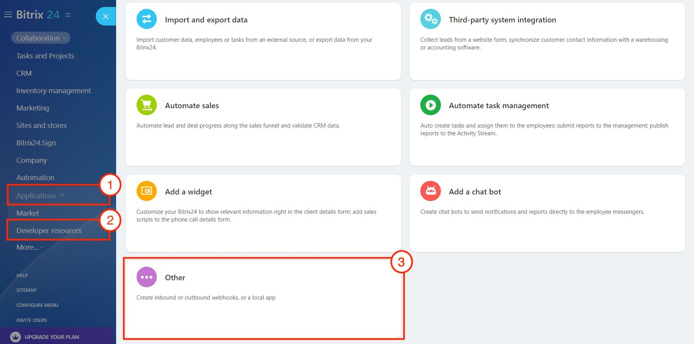
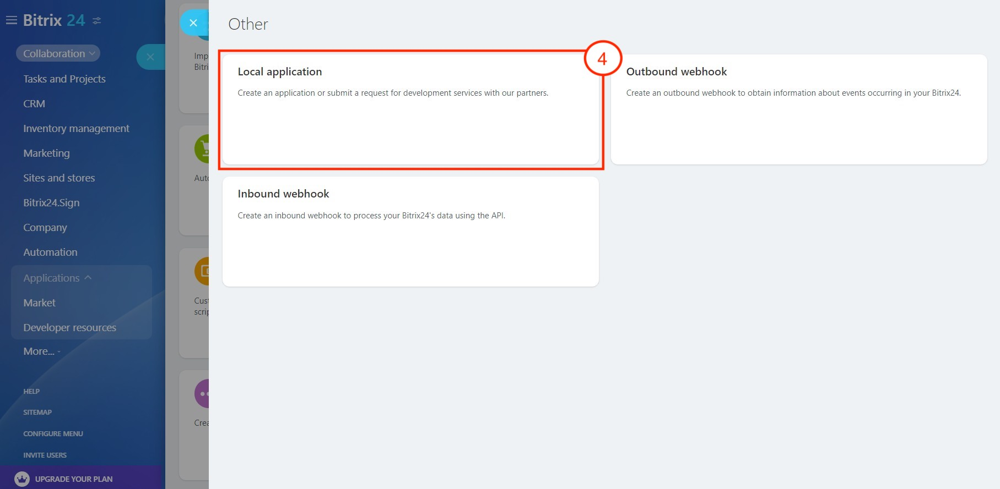
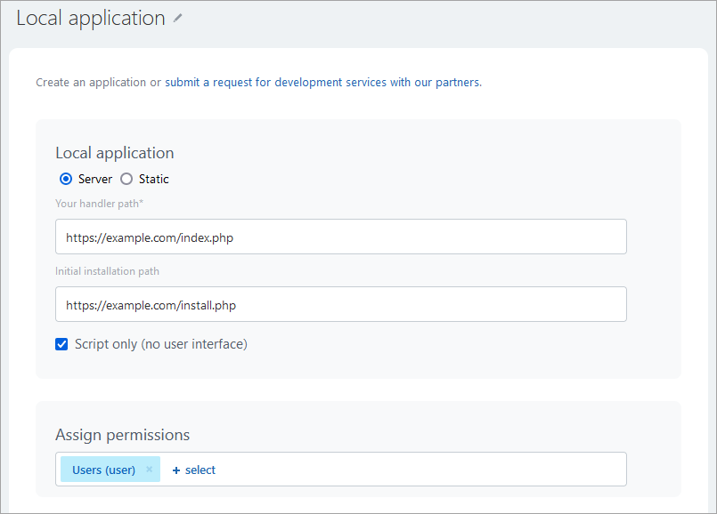
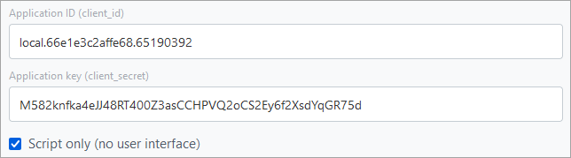
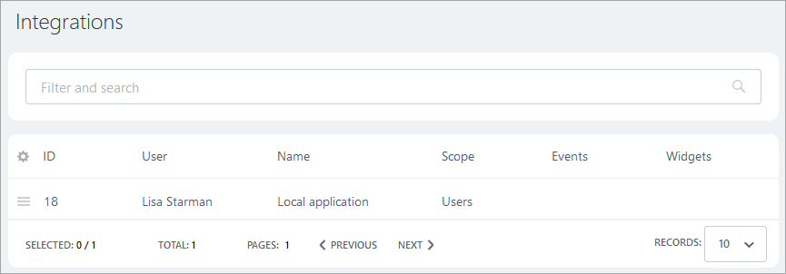

# Server-Side Local Application Without a User Interface



If you are developing integrations for Bitrix24 using AI tools (Codex, Claude Code, Cursor), connect to the [MCP server](../ai-tools/mcp.md) so that the assistant can utilize the official REST documentation.



## Installation

The example consists of the [CRest SDK](https://github.com/bitrix-tools/crest/) and a PHP example file, which you must place on your web server before adding the application to your Bitrix24. The application is capable of obtaining Bitrix24 user authorization and using it to access the Bitrix24 REST API from outside Bitrix24, retrieving the full name of the user who installed it.

> **Attention!** This example operates based on the *CRest SDK*. Before using the example, you must open the **checkserver.php** file via a browser to verify your server settings are correct. [More details](../sdk/crest-php-sdk/index.md).

[Download archive](https://helpdesk.bitrix24.com/examples/server-no-ui-crest.zip)

You can install a local application either from the **Developer resources** section (*Applications > Developer resources, "Ready-made scenarios" tab > Other > Local application*), or by following this path: Applications (1) — Developer resources (2) — Other (3) — Local application (4):

If the *Local application* item is missing, ask the administrator to [configure access to application creation](./local-apps.md#local-app-access).

In the form that opens, fill in the basic fields and specify the permissions required for the application (for our example, user management permissions are required), specifying your **Handler path** (this means that your application must already be physically accessible via an HTTPS URL before you add it to your Bitrix24).

You must enable the **Application uses API only** option — this specifically informs Bitrix24 that your application will not display a user interface inside Bitrix24. In this case, as you will see, the fields where the menu item name is usually specified to call the application from Bitrix24 will be hidden. Applications with the "Application uses API only" option enabled either provide a user interface at their own URL or do not provide a user interface at all.

Please also note that we filled in the **Path for initial installation** field by specifying **install.php** from the example archive. This URL is called only once when saving the local application form. This URL serves as the handler for the [`ONAPPINSTALL`](../api-reference/common/events/on-app-install.md) event, in which we retain the tokens of the user who installed the application.

After saving, you will remain in the addition form, but Bitrix24 will immediately show you the OAuth 2.0 authorization keys required within your application code:

Since an application without an interface operates outside Bitrix24, it must implement the full OAuth 2.0 authorization protocol. Open the **settings.php** file from the example and fill in the constants with the application code `C_REST_CLIENT_ID` and the secret key `C_REST_CLIENT_SECRET` obtained when saving the form.

Upload the modified example to your server.

In Bitrix24, you can go to the **Integrations** list (*Applications > Developer resources > Integrations*) to confirm that the new application appears in the list of local applications in your Bitrix24:

## Usage

> **Attention!** This example operates based on the *CRest SDK*. Before using the example, you must open the **checkserver.php** file in your browser to verify your server configurations. [More details](../sdk/crest-php-sdk/index.md).

Open the **index.php** file from the example in your browser at your URL.

The launched application will display the full name of the user who installed the application by retrieving it via the Bitrix24 REST API using the authorization credentials saved during application creation, while also automatically renewing tokens (if they are found to be invalid during the request).

## Continue Learning

- [{#T}](static-local-app.md)
- [{#T}](serverside-local-app-with-ui.md)
