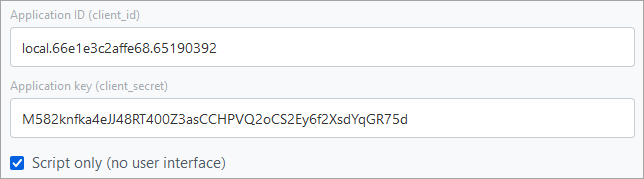

# Server-side Local Application Without User Interface

## Installation

The example consists of the [CRest SDK](https://github.com/bitrix-tools/crest/) and a PHP file with an example that you need to place on your web server before adding the application to your Bitrix24. The application is capable of obtaining user authorization from Bitrix24 and, using it while being outside of Bitrix24, accessing the REST API to retrieve the full name of the user who installed it.

> **Attention!** This example is based on the *CRest SDK*. Before using the example, you need to open the **checkserver.php** file in your browser and verify the correctness of your server settings. [Learn more](../how-to-use-examples.md).

[Download Archive](https://bitrixsoft.com/docs/marketplace-and-apps24/server-no-ui-crest.zip)

You can install the local application either from the **Developer resources** section (*Applications > Developer resources, tab "Ready-made scenarios" > Other > Local application*), or by following this path: Applications (1) — Developer resources (2) — Other (3) — Local application (4):

In the opened form, fill in the basic fields and specify the necessary permissions for the application (for our example, user management permissions are required), indicating the **Path to your handler** (this means that your application must already be physically accessible via URL over HTTPS before you start adding it to your Bitrix24).

You need to enable the option **Application uses only API** — this indicates to Bitrix24 that your application will not display a user interface within Bitrix24. In this case, as you will see, the fields where the menu item name for calling the application from Bitrix24 is usually specified will be hidden. Applications that have the "Application uses only API" option enabled either provide a user interface at some URL of their own or do not provide a user interface at all.

Also, note that we filled in the **Path for initial installation** field, specifying **install.php** from the example archive. This URL is called only once when saving the local application form. This URL serves as the handler for the event [`ONAPPINSTALL`](../api-reference/common/events/on-app-install.md), where we save the tokens of the user who installed the application.

After saving, you will remain in the addition form, but Bitrix24 will immediately show you the authorization keys for the OAuth 2.0 protocol, which you will need within the application code:

Since the application without an interface operates outside of Bitrix24, it must implement the full OAuth 2.0 authorization protocol. Open the **settings.php** file from the example and fill in the constants with the application code `C_REST_CLIENT_ID` and the secret key `C_REST_CLIENT_SECRET`, obtained when saving the form.

Upload the modified example to your server.

In Bitrix24, you can go to the **Integrations** list (*Applications > Developer resources > Integrations*) and check for the new application in the list of local applications in your Bitrix24:

## Usage

> **Attention!** This example is based on the *CRest SDK*. Before using the example, you need to open the **checkserver.php** file in your browser and verify the correctness of your server settings. [Learn more](../how-to-use-examples.md).

Open the **index.php** file from the example in your browser at your URL.

The launched application will display the full name of the user who installed the application, retrieving it via the REST API using the authorization data saved during the application's creation, while also automatically renewing tokens (if it turns out that they are invalid during the request).

## Continue Exploring

- [{#T}](static-local-app.md)
- [{#T}](serverside-local-app-with-ui.md)