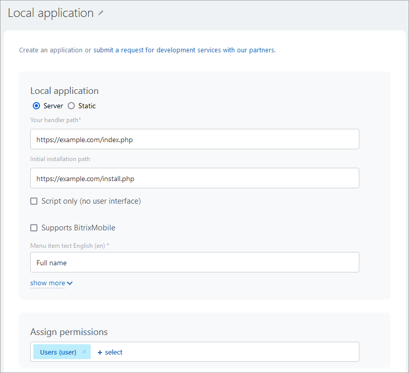
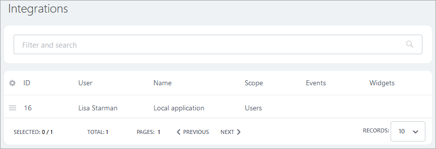

# Server-side Local Application with User Interface

The application utilizes a simplified version of OAuth 2.0 and is displayed as an additional page that shows the full name of the current user. The archive of the example consists of the [CRest SDK](https://github.com/bitrix-tools/crest/), a [modification of the CRest SDK](../sdk/crest-php-sdk/using-in-users-context.md) for the simplified use of OAuth 2.0, and a PHP file index.php containing the example code. You need to place the files from the example archive on your web server before installing it in Bitrix24.

> **Attention!** This example operates based on the *CRest SDK*. Before using the example, you must open the file **checkserver.php** in your browser and verify the correctness of your server settings. [Learn more](../first-steps/how-to-use-examples.md).

[Download the archive](https://helpdesk.bitrix24.com/examples/local-server-ui-index.zip)

You can install the on-premise application either from the **Developer resources** section (*Applications > Developer resources, tab "Ready-made scenarios" > Other > On-premise application*), or by following this path: Applications (1) — Developer resources (2) — Other (3) — On-premise application (4):

In the opened form, fill in the basic fields and specify the necessary access permissions for the application (for our example, user management permissions are required), indicating the **Path to your handler** (this means that your application must already be physically accessible via URL over HTTPS before you add it to your Bitrix24).

After saving, the new application will be displayed in the list of integrations (*Applications > Developer resources > Integrations*) in your Bitrix24.

Find the application **Full Name** in the left menu or in the **More** menu under Applications and launch it.

The launched application will output debug information about the authorization data of the current user, as well as the full name of the current user, retrieving it via the REST API using this authorization data.

Since this application operates within the Bitrix24 interface and uses the authorization of the current user who opened the application, it acts solely within the access permissions of that user.

## Continue Learning

- [{#T}](static-local-app.md)
- [{#T}](serverside-local-app-with-no-ui.md)