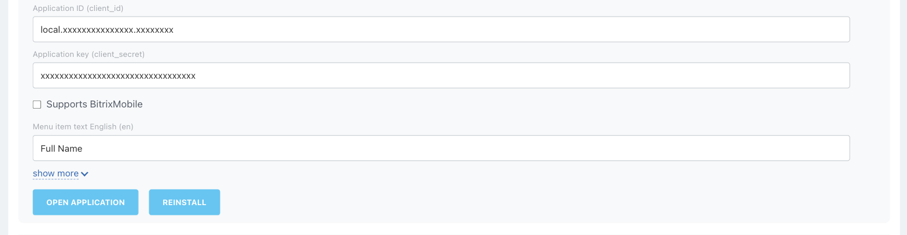

# Server-Side Local Application with User Interface



If you are developing integrations for Bitrix24 using AI tools (Codex, Claude Code, Cursor), connect to the [MCP server](../ai-tools/mcp.md) so that the assistant can utilize the official REST documentation.



A server-side local application with a user interface runs its code on your server and displays its page in a frame inside Bitrix24. Together with that page, the application receives the tokens of the user who opened it.

The application works only in the Bitrix24 where it was created. If the solution has to be installed on different Bitrix24 accounts, develop a [mass-market application](../market/index.md).

Other types of local applications and the criteria for choosing between them are described in the article [{#T}](./local-apps.md).

## How Authorization Works {#how-auth-works}

An application in a frame uses a simplified OAuth 2.0 flow: there is no need to request tokens separately, Bitrix24 passes them every time the application opens.

1. The user launches the application in the Bitrix24 interface.
2. Bitrix24 sends a POST request to the handler address and passes the authorization data. The handler is the application page that you specified in the *Your handler path* field.
3. The handler compares the incoming `APPLICATION_TOKEN` with the retained value.
4. The application substitutes `AUTH_ID` into REST API requests and calls methods on behalf of the user who opened the application.

The comparison in step three is a requirement for your code. The procedure is described in the section [How to Verify the Request Source](#check-source).

Main request parameters:

#|
|| **Parameter** | **Where It Arrives** | **What It Is** ||
|| **DOMAIN** | query string of the address | The address of the Bitrix24 where the application is open ||
|| **APP_SID** | query string of the address | The application session identifier. Bitrix24 generates a new one each time the application is rendered ||
|| **AUTH_ID** | request body | The authorization token for calling methods. Valid for one hour ||
|| **REFRESH_ID** | request body | The authorization renewal token. The application uses it to obtain a new pair of tokens ||
|| **APPLICATION_TOKEN** | request body | The application token. The handler uses it to verify that the request came from Bitrix24 ||
|| **APPLICATION_SCOPE** | request body | The permissions of the application for Bitrix24 sections — scopes (`scope`) ||
|| **member_id** | request body | The Bitrix24 identifier. The application uses it to tell one Bitrix24 from another ||
|#

The complete composition of the data is covered in the article [{#T}](../settings/oauth/simple-way.md), the token renewal procedure — in the article [{#T}](../settings/oauth/auto-renewal.md).

The tokens arrive only in the request with which Bitrix24 opens the page. Subsequent requests from the page, including AJAX ones, no longer carry them, so retain the tokens on your side — in the session, for example. You can renew the tokens on the page itself by calling [BX24.refreshAuth](../sdk/bx24-js-sdk/system-functions/bx24-refresh-auth.md) from the BX24 JS SDK, but it is still your code that has to pass them to the server.

Bitrix24 passes the same set of parameters to the initial installation address as well.



By default, the base CRest works on behalf of the user who installed the application. To make requests run on behalf of the user who opened it, the `CRest` class is overridden — ready-made code and a breakdown are in the article [{#T}](../sdk/crest-php-sdk/using-in-users-context.md). The base CRest writes renewed tokens into a shared `settings.json`. If several users work with the application, retain the tokens separately for each of them.



## When to Choose This Type of Application

A server-side local application with a user interface is a good fit if you need to:

- display your own page or a [widget](../api-reference/widgets/index.md) inside Bitrix24 and process the data on your server
- keep the application secret key and the tokens on the server rather than in code that is loaded into the browser
- receive Bitrix24 [events](../api-reference/events/index.md) at your event handler

Choose a different type of application if:

- you have no server of your own but need an interface — [{#T}](./static-local-app.md) will do. Such an application runs in the browser and does not receive events
- the application works in the background without an interface and on behalf of a single user — [{#T}](./serverside-local-app-with-no-ui.md) will do
- an external system only calls methods or receives events, and no interface inside Bitrix24 is needed — [inbound and outbound webhooks](./local-webhooks.md) will do

## What You Need to Prepare

- **REST API access.** A local application works only if Bitrix24 has [access to the REST API](../first-steps/access-to-rest-api.md).
- **Permission to create applications.** An application can be created by a Bitrix24 administrator or by an employee who has been granted such a permission. If the *Local application* item is missing from the interface, ask the administrator to [configure access to application creation](./local-apps.md#local-app-access).
- **Web server.** The example is written in PHP, so you need a server with PHP, the cURL module, and a valid SSL certificate. The application pages must be available over HTTPS before you add the application to Bitrix24: their addresses are specified in the creation form itself. Server requirements are described in the article [{#T}](../sdk/crest-php-sdk/index.md).
- **Permission to embed.** Bitrix24 opens the application page in a frame, so the server must not prohibit embedding with the `X-Frame-Options` and `Content-Security-Policy` headers. How to allow embedding for your Bitrix24 address is described in the article [{#T}](./site-does-not-allow-connection.md).

## What the Example Contains {#example}

The ready-made example is the "Full Name" application. It prints two blocks: the data of the request with which Bitrix24 opened the page, including the authorization data, and the details of the user who opened the application. These details are returned by the [user.current](../api-reference/user/user-current.md) method — the application calls it with the tokens that arrived together with the page.

The archive consists of three parts:

- [CRest SDK](https://github.com/bitrix-tools/crest/) — a PHP library for calling REST API methods. Its distribution includes `settings.php` with the application settings, `install.php` for the initial installation, and `checkserver.php` for checking the server
- [modified CRest SDK](../sdk/crest-php-sdk/using-in-users-context.md) — the `crestcurrent.php` file with a subclass that substitutes the tokens of the current user into requests
- `index.php` — the application page with the example code; in the archive this file already replaces the standard `index.php` from the CRest distribution

[Download archive](https://helpdesk.bitrix24.com/examples/local-server-ui-index.zip)

The subclass takes the tokens directly from the request with which Bitrix24 opened the page. That is why `user.current` returns the data of the current user. The `index.php` code:

```php
<?php

require_once __DIR__ . '/crestcurrent.php';

echo '<pre>';
    print_r($_REQUEST);
echo '</pre>';

$result = CRestCurrent::call('user.current');

echo '<pre>';
    print_r($result);
echo '</pre>';
```

The example is built on CRest, but the application type itself is tied neither to this library nor to PHP. For PHP there is also [B24PhpSDK](../sdk/b24phpsdk/index.md). It wraps calls as PHP classes and methods but requires Composer and PHP 8.2 or newer. CRest is connected with files from the archive. The remaining libraries are listed in the [SDK overview](../sdk/index.md).

## How to Create an Application {#create-app}

The example follows the scenario with an installation wizard: the application has a separate initial installation page on which CRest retains the settings. The scenario itself is described in the article [{#T}](../settings/app-installation/local-apps/installation-master.md).

Bitrix24 issues the application ID and the secret key only after the form is saved, and `install.php` will not retain the settings without them. Hence the order: first create the application, then fill in `settings.php` and reinstall the application.

1. Place the files from the archive on your server. Note the addresses of the `index.php` and `install.php` pages: they are specified in the form.

2. Open `checkserver.php` in a browser at your server address. The script verifies that the cURL module is available and that CRest can retain its files. If the check fails, resolve the issues reported by the script before moving on to the form: CRest will not retain the settings without cURL and without write permission.

3. Open the local application form: *Applications > Developer resources*, the *Common use cases* tab, then *Other > Local application*.

    

    

4. Select the *Server* option — it opens the fields for the addresses of the pages on your server. The *Static* option expects an archive with a page — see the article [{#T}](./static-local-app.md).

5. Specify the addresses of the pages on your server: in the *Initial installation path* field — the address of `install.php`, in the *Your handler path* field — the address of `index.php`. Bitrix24 contacts the first address when installing the application and opens the application in a frame at the second one.

6. Fill in *Menu item text* — it is how the application is found in the Bitrix24 interface. In the example it is "Full Name". Names in other languages are filled in if the application is used not only in English.

7. Select the application scopes in the *Assign permissions* block. Any of the user scopes will do for the example: *Users* — `user`, *Users (basic)* — `user_basic`, *Users (minimum)* — `user_brief`. The selected scope determines which fields `user.current` returns. The remaining scopes are listed in the article [{#T}](../api-reference/scopes/permissions.md).

    

8. Save the form. The application appears in the *Applications > Developer resources > Integrations* list.

    

9. Open the application. Bitrix24 displays the initial installation page — this is how you check that the `install.php` address is available. The settings are not retained at this step. This page is opened by a Bitrix24 administrator or by a user with the permission to install applications — everyone else sees an error message instead.

10. Open the application card. After saving, it contains the *Application ID (client_id)* and *Application key (client_secret)* fields. Copy these values into the `C_REST_CLIENT_ID` and `C_REST_CLIENT_SECRET` constants of the `settings.php` file and upload the modified file to the server.

    

11. Click *Reinstall* in the application card and open the application once again. The button is available to a Bitrix24 administrator only. Now `install.php` runs with the constants filled in and creates `settings.json`. Without this file, CRest cannot call a method.



The initial installation script must tell Bitrix24 that the installation is complete — it must call [BX24.installFinish](../sdk/bx24-js-sdk/system-functions/bx24-install-finish.md). Until that call happens, the application is considered not installed. This leads to three consequences:

- the installation page opens on every entry instead of the application
- events are not delivered to the application
- the application widgets are not displayed

There is no registration error at that: event handlers and widgets are registered successfully but never fire. You can check the state through the `INSTALLED` field in the response of the [app.info](../api-reference/common/system/app-info.md) method.

The call works only for a Bitrix24 administrator or a user with the permission to install applications. The function itself comes from the [BX24 JS SDK](../sdk/bx24-js-sdk/index.md), so the installation page must include this library. If you replace `install.php` with your own code, add the call as the last step of the installation scenario.



The installation scenarios of a local application and the differences between them are described in the article [{#T}](../settings/app-installation/local-apps/index.md).

## How to Check the Result

Find the "Full Name" application in the left menu or in the *More* menu within the *Applications* section and launch it. The application opens in a frame and prints two blocks.

The first block is all the data of the request with which Bitrix24 opened the page. `$_REQUEST` brings together the parameters from the query string and from the request body, so the block contains both the authorization data and the service data:

```text
Array
(
    [DOMAIN] => example.bitrix24.com
    [PROTOCOL] => 1
    [LANG] => en
    [APP_SID] => 0f5a2e9b6c1d4a8e7f30b21c5d9e4a6b
    [AUTH_ID] => a1b2c3d4e5f60718293a4b5c6d7e8f90
    [AUTH_EXPIRES] => 3600
    [REFRESH_ID] => 90f8e7d6c5b4a3928170f6e5d4c3b2a1
    [SERVER_ENDPOINT] => https://oauth.bitrix.info/rest/
    [APPLICATION_TOKEN] => 7d1e4c02fa93b586ce4710d2f8b3a9c5
    [APPLICATION_SCOPE] => user
    [member_id] => 4c8f2b91d7e3a56f0b1c9d8e7a6f5b43
    [status] => L
    [PLACEMENT] => DEFAULT
)
```

The main parameters are described in the section [How Authorization Works](#how-auth-works), the complete composition of the data — in the article [{#T}](../settings/oauth/simple-way.md).

The second block is the result of the `user.current` call:

```text
Array
(
    [result] => Array
        (
            [ID] => 1
            [ACTIVE] => 1
            [NAME] => Klaus
            [LAST_NAME] => Weber
            [EMAIL] => klaus@example.com
            [LAST_LOGIN] => 2026-09-08T12:51:07+02:00
            [DATE_REGISTER] => 2020-04-20T02:00:00+02:00
            [TIME_ZONE] => Europe/Berlin
            [IS_ONLINE] => Y
            [WORK_POSITION] => Manager
            [UF_DEPARTMENT] => Array
                (
                    [0] => 1
                )

        )

    [time] => Array
        (
            [start] => 1788867501
            [finish] => 1788867502.0294
            [duration] => 1.0293660163879
            [processing] => 0
            [date_start] => 2026-09-08T13:38:21+02:00
            [date_finish] => 2026-09-08T13:38:22+02:00
        )

)
```

The user data is returned in the `result` key, while `time` is added to the response by the REST API itself. The set of fields depends on the selected scope and on the custom fields of Bitrix24. Custom fields arrive in keys with the `UF_` prefix. The complete list of fields is described in the article [{#T}](../api-reference/user/user-current.md).

## What to Do If Errors Occur {#errors}

- **"Site Cannot Be Reached".** The application server prohibits embedding its page in a frame. Examine the response headers following the article [{#T}](./site-does-not-allow-connection.md).
- **`no_install_app`.** At least one of the `access_token`, `domain`, `refresh_token`, `application_token`, `client_endpoint` values is empty in the CRest settings. The first reason is that the page was opened directly at the server address, without a POST request from Bitrix24, so there was nothing to put into the settings. The second is that the application was not reinstalled after `settings.php` had been filled in, so the `settings.json` file was not created.
- **`insufficient_scope`.** The application has not been granted the scope of the method. Add the required scope in the application card.
- **`expired_token`.** More than an hour has passed since the page was opened, and `AUTH_ID` has expired. Obtain a new pair of tokens with `REFRESH_ID` — the procedure is described in the article [{#T}](../settings/oauth/auto-renewal.md).
- **The installation page opens every time instead of the application.** The initial installation script did not call `BX24.installFinish` — what happens in that case is covered in the section [How to Create an Application](#create-app).

## Permissions and Security

- **User permissions.** The tokens are issued for a specific user, so a call is limited by their permissions in Bitrix24: the same call returns a different result for different users. The difference from the behavior of the base CRest is covered in the section [How Authorization Works](#how-auth-works).
- **Application scopes.** The set of scopes is selected at creation and changed in the application card.
- **Secrets and tokens.** Retain the application ID, the secret key, `AUTH_ID`, and `REFRESH_ID` on your server. Do not place them in client-side code that is loaded into the browser, do not retain them in a repository, do not write them to logs, and do not pass them to third parties.

### How to Verify the Request Source {#check-source}

The handler address is available from the external network: anyone, not only Bitrix24, can open the application page. The verification works with two `APPLICATION_TOKEN` values:

- the reference value that the application has to retain at installation — in the `install.php` script or in the handler of the [ONAPPINSTALL](../api-reference/common/events/on-app-install.md) event. For a local application this value stays the same until the secret key changes
- the current value that Bitrix24 passes in the body of every request with which it opens the page

Compare these values before working with the tokens and reject the request if they do not match.

In the CRest distribution, `install.php` does not retain the reference value, and the library writes the `APP_SID` value into the `application_token` setting. A comparison with this setting will not work, because `APP_SID` is new every time. To make the verification work, set up your own storage:

1. Retain the `APPLICATION_TOKEN` from the request in `install.php` — in your own table or in a file next to the application, for example.
2. On the application page, compare the retained value with the `APPLICATION_TOKEN` from the incoming request and respond with code `403` if they do not match.

The `install.php` address is available from the external network as well. Keep the reference value in a place that is not reachable from outside and do not overwrite the retained value on every request to the installation page.

The application event handlers verify the source in the same way but take the value from the `auth.application_token` parameter and look up the retained reference value by `auth.member_id` — the Bitrix24 identifier. The token storage rules are described in the article [{#T}](../api-reference/events/safe-event-handlers.md).

## Continue Learning

- [{#T}](./local-apps.md)
- [{#T}](./static-local-app.md)
- [{#T}](./serverside-local-app-with-no-ui.md)
- [{#T}](../sdk/crest-php-sdk/using-in-users-context.md)
- [{#T}](../settings/oauth/simple-way.md)
