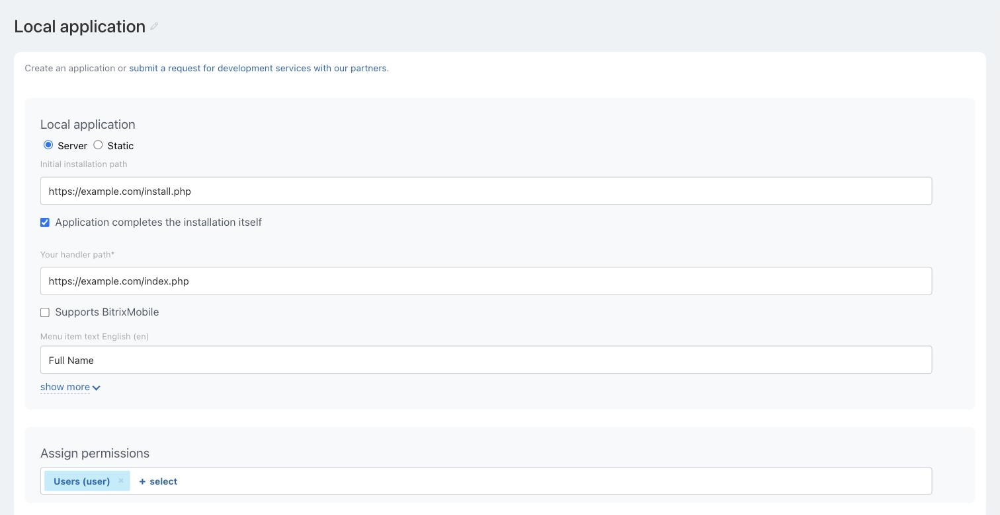
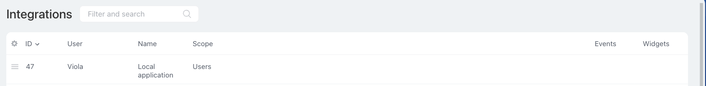

# Server-Side Local Application with User Interface



If you are developing integrations for Bitrix24 using AI tools (Codex, Claude Code, Cursor), connect to the [MCP server](../ai-tools/mcp.md) so that the assistant can utilize the official REST documentation.



The application uses a simplified OAuth 2.0 flow and is displayed as an additional page showing the full name of the current user. The example archive consists of the [Bitrix24 SDK CRest](https://github.com/bitrix-tools/crest/), a [modified Bitrix24 SDK CRest](../sdk/crest-php-sdk/using-in-users-context.md) for the simplified OAuth 2.0 flow, and a PHP file `index.php` containing the example code. You must place the files from the example archive on your web server before installing it in Bitrix24.

> **Attention!** This example operates based on the *Bitrix24 SDK CRest*. Before using the example, you must open the **checkserver.php** file in your browser to verify your server settings are correct. [More details](../sdk/crest-php-sdk/index.md).

[Download Archive](https://helpdesk.bitrix24.com/examples/local-server-ui-index.zip)

You can install a local application either from the **Developer resources** section (*Applications > Developer resources, Ready-made scenarios tab > Other > Local application*), or by following this path: Applications (1) — Developer resources (2) — Other (3) — Local application (4):

In the form that opens, fill in the basic fields and specify the permissions required for the application (for our example, user management permissions are required), and provide the **Handler path** (this means your application must already be physically accessible via an HTTPS URL before you add it to your Bitrix24).

After saving, the new application will be shown in the integrations list (*Applications > Developer resources > Integrations*) in your Bitrix24.

Find the **Full Name** application in the left menu or in the **More** menu within the Applications section and launch it.

The launched application will display debug information regarding the transmitted authorization data of the current user, as well as the full name of the current user, retrieved via the Bitrix24 REST API using that authorization data.

Since this application runs within the Bitrix24 interface and uses the authorization of the user who opened the application, it operates strictly within the scope of that user's permissions.

## Continue Learning

- [{#T}](static-local-app.md)
- [{#T}](serverside-local-app-with-no-ui.md)