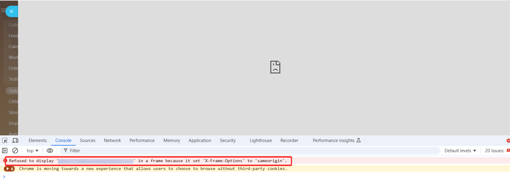
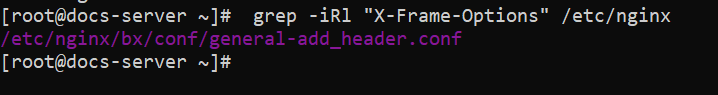
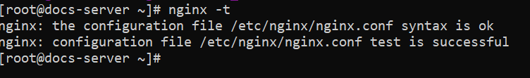
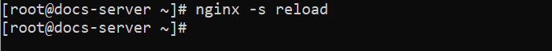
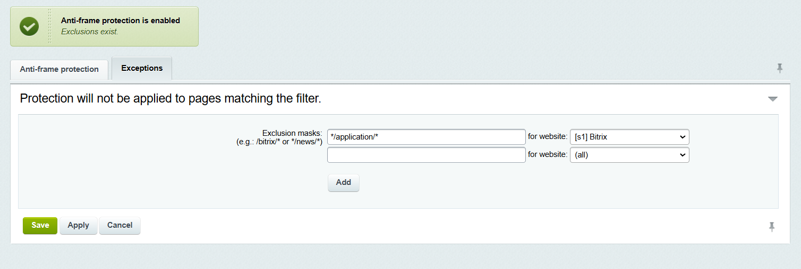

# How to Fix the "Site Does Not Allow Connection" Error When Opening the Application

In server applications, an error may occur when loading pages:



The site "application_site_address" does not allow connection.



## Cause of the Error

The error occurs when the application server prohibits loading pages in a frame. Details of the error can be found in the browser console.



Refused to display 'https://application_site_address/'; in a frame because it set 'X-Frame-Options' to 'sameorigin'.



This error means that the application server has a restriction on opening site pages in a frame from other sites. The restriction is controlled by the `X-Frame-Options` header. This header tells the browser whether pages from the site can be loaded through `<frame>/<iframe>`.

The default setting for most servers for the `X-Frame-Options` header is `sameorigin`. This value allows loading the site only if the frame and the application page are on the same domain.

The `X-Frame-Options` header for a single site can be specified on multiple servers: the main application server and intermediate proxy servers. If there are different `X-Frame-Options` headers, the error message will contain details of the conflicting headers:



Refused to display 'https://application_site_address/'; in a frame because it set multiple 'X-Frame-Options' headers with conflicting values ('ALLOW-FROM https://your-domain.bitrix24.com/, SAMEORIGIN'). Falling back to 'deny'.



## How to Fix the Error

To allow loading the site in a frame on a specific Bitrix domain, change the `X-Frame-Options` header settings. Make changes to the nginx configuration on the server with the application files and on intermediate proxy servers if they are used.

If you do not have access to the nginx configuration files or your settings differ, the server administrator or hosting administrator can provide guidance on header settings and grant access.



If you do not have access to the nginx configuration files or your settings differ, the server administrator or hosting administrator can provide guidance on header settings and grant access.



1. Find the configuration files that contain the `X-Frame-Options` header. Use the following command to search:

    `grep -iRl "X-Frame-Options" /etc/nginx`

    

2. In the found file, change the header. Replace the restriction `SAMEORIGIN` with permission for the Bitrix24 domain:

    `add_header X-Frame-Options "ALLOW-FROM https://your-domain.bitrix24.com/";`

3. If multiple files with the `X-Frame-Options` header are found, ensure that the settings in them do not conflict.

4. Check the nginx configuration with the command `nginx -t`.

    

    If the response is "test is successful," you can reload the configuration. If there are errors in the response, first make corrections in the files mentioned in the error text.

5. Restart nginx with the command `nginx -s reload`. Changes will not take effect without a restart.

    

## Configuring Frame Protection in On-Premise Bitrix24

If the application server is an on-premise Bitrix24 on a BitrixVM virtual machine, frame protection can be configured in two places:

* in the nginx server configuration
* on the site — "Frame Protection" (Settings > Proactive Protection > Frame Protection)

### Default Setting

The pre-installed setting for BitrixVM is the header `add_header X-Frame-Options SAMEORIGIN;` in the file /etc/nginx/bx/conf/general-add_header.conf.

When frame protection is enabled on the site, the same header `add_header X-Frame-Options SAMEORIGIN;` is added to the nginx configuration file /etc/nginx/bx/conf/general-add_header.conf.

### Configuration Conflict

With the default settings, BitrixVM may encounter a situation where the nginx configuration overrides the frame protection setting on the site:

* the header will be active even if frame protection is disabled on the site
* when frame protection is enabled, the header will be duplicated

One solution to the conflict is to use only one tool. It is recommended to use the "Frame Protection" tool on the site to avoid changing the server configuration files:

1. In BitrixVM, comment out the header in the file /etc/nginx/bx/conf/general-add_header.conf:

    `#add_header X-Frame-Options SAMEORIGIN;`

2. Enable frame protection on the "Frame Protection" page (Settings > Proactive Protection > Frame Protection) and set the necessary exceptions for the protection action.

    